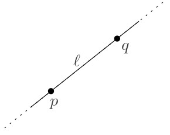
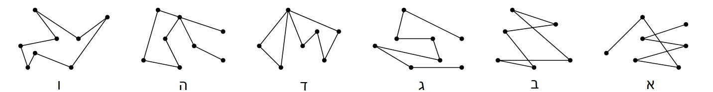
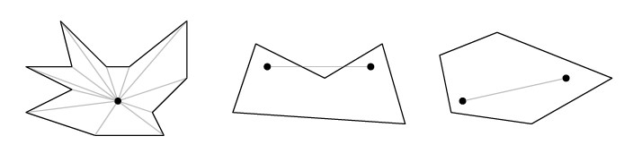

# מבוא {#intro}

## הקדמה {#preface}

### מהי גאומטריה חישובית? {#what-is-cg}

גאומטריה חישובית היא תחום מחקר במדעי המחשב העוסק בפיתוח של כלים, מודלים, מבני נתונים, ואלגוריתמים, המיועדים לפתרון בעיות חישוב גאומטריות. המחקר התיאורטי בגאומטריה חישובית מיושם בתחומים רבים ומגוונים. בסרטון הבא נספר איך נולד התחום, ונציג מספר דוגמאות לבעיות שבהן נעסוק במהלך הקורס.

#### צפו בסרטון הבא. {.unnumbered}

<iframe width="560" height="315" src="https://www.youtube.com/embed/ALiuyo_TN5Q" title="YouTube video player" frameborder="0" allow="accelerometer; autoplay; clipboard-write; encrypted-media; gyroscope; picture-in-picture; web-share" allowfullscreen>

</iframe>

#### מדדים להערכת טיב הפתרון. {.unnumbered}

פתרון לבעיה יכול להיות בצורה של אלגוריתם, המקבל קלט ומייצר פלט מתאים. במקרה זה טיב הפתרון נמדד ב**זמן הריצה** של האלגוריתם, וב**סיבוכיות הזיכרון** הנדרשת לפעולתו.

כאשר הפתרון הוא בצורה של מבנה נתונים, קיים מדד נוסף, שהוא זמן העיבוד המקדים. לכן, בניתוח של מבנה נתונים נתייחס לכל אחד מהמדדים הבאים:

-   **זמן עיבוד מקדים (Preprocessing Time)** - הזמן שלוקח לנו לעבד את הקלט ולבנות את מבנה הנתונים.

-   **סיבוכיות מקום/זיכרון (Storage Space)** - גודל הזיכרון או נפח האחסון לו נזדקק עבור מבנה הנתונים.

-   **זמן שאילתה (Query Time)** - זמן הריצה של אלגוריתם השאילתה.

#### קראו את ההקדמה לפרק 1 בספר הלימוד (עמודים 1--2). {.unnumbered}

#### תחומי יישום. {.unnumbered}

להרחבה על האפליקציות השונות והתפקיד שמשחקת בהן הגאומטריה החישובית, מומלץ לקרוא את סעיף 1.3 בספר.

### מאפיינים חשובים {#basic-prop}

כמו בכל תחום מדעי, למחקר בגאומטריה חישובית יש מספר מאפיינים שהתקבעו כתוצאה מתחומי העניין והמומחיות של החוקרים בתחום. כאן נתאר את העיקריים שבהם.

#### ריגורוזיות. {.unnumbered}

לפני שהתפתח המחקר בגאומטריה חישובית, היו המון היוריסטיקות ופתרונות אד הוק ליישומים גאומטרים. פתרונות כאלה נבדקו על ידי ביצוע ניסויים, ולכן היו בדרך כלל יעילים רק במצבים מסוימים, ולעיתים אף שגויים לחלוטין. לעומת זאת, תחום הגאומטריה החישובית התפתח כתחום מתמטי שבו הגישה לפתרון היא ריגורוזית: הבעיות מוגדרות היטב, וכל פתרון כולל הוכחת יעילות ונכונות מתמטית.

#### מימד נמוך. {.unnumbered}

היסטורית, הגאומטריה החישובית התפתחה כתחום מחקר העוסק בבעיות על מרחבים ממימד אוקלידי נמוך (לרוב מרחב דו-מימדי, ולעיתים גם תלת מימדי). לכן לאורך הקורס אנו נתמקד בעיקר במרחב אוקלידי הדו-מימדי, $\mathbb{R}^2$ , שמכונה גם **המישור האוקלידי** (או בקיצור, המישור). רוב האלגוריתמים שנראה יעבדו רק בשניים או שלושה מימדים. אלגוריתמים שמתאימים גם למימדים גבוהים יותר סובלים במקרים רבים מתופעה שנקראת **"קללת המימד הגבוה"** (curse of high dimensionality), כלומר, זמן הריצה שלהם כולל פקטורים שגדלים אקספוננצילית במימד. עם זאת, לעיתים נדון גם באפשרות להרחבה למימדים גבוהים יותר, או בהבדלים הקיימים במעבר למימד גבוה יותר.

#### קלט בדיד (דיסקרטי). {.unnumbered}

תחום הגאומטריה החישובית מתמקד בבעיות בהן האובייקטים הנתונים הם **בדידים** בטבעם, למשל קבוצות סופיות של נקודות, ישרים, או מעגלים. קיימות אפליקציות רבות בהן האובייקטים הם **רציפים**, כמו למשל מרחב תלת מימדי המתאר את טמפרטורת האוויר באיזור מסוים. מכיוון שהחישוב בעזרת מחשב הוא **בדיד** בטבעו, במקרים כאלו נדרש תהליך של **דיסקרטיזציה**, המאפשר לקבל קירוב לפתרון הרציף. בקורס הזה נדבר על בעיות עם קלט בדיד, ולא נדון בתהליך הדיסקרטיזציה.

#### המודל החישובי. {.unnumbered}

לפני שניגשים לניתוח יעילות של אלגוריתם, צריך להחליט באיזה מודל חישובי הוא פועל. המודל החישובי מגדיר את הקשר בין הקלט ופעולות האלגוריתם לבין ייצוגם ואופן חישובם במחשב. בתחום הגאומטריה החישובית מקובל להשתמש במודל מתמטי הנקרא **מודל RAM הממשי (real RAM)**. זהו מודל המבוסס על המודל המוכר של Random Access Machine, כלומר הגישה לתאי הזיכרון היא באמצעות מצביעים. אלגוריתמים לבעיות גאומטריות דורשים בדרך כלל חישובים על מספרים ממשיים, וכאשר מתרגמים אלגוריתמים אלו לתוכניות מחשב, המספרים המחושבים הם בעצם מקורבים, כתלות בדיוק המחשב. מודל זה מאפשר להזניח את בעיית שגיאות העיגול בייצוג המקורב של הממשיים: כל מספר ממשי ניתן לאחסון ביחידת זיכרון אחת, והמספרים הם מדויקים ולא מקורבים. כמו כן המודל מניח שהפעולות האריתמטיות (חיבור, חיסור, כפל, וחילוק), וכן פעולות השוואה, מתבצעות בזמן קבוע על מספרים ממשיים (אך לא כך עבור פעולת מודולו, ועיגול למספרים שלמים).

על אף כוחו הבלתי רגיל של מודל RAM הממשי, קיימות מספר שפות תכנות המיועדות למימוש אלגוריתמים גאומטריים ומאפשרות סימולציה שלו. הרעיון בסימולציה כזו הוא שרמת הדיוק בחישוב וייצוג המספרים משתנה בהתאם לצרכי האלגוריתם, כך שניתן יהיה לבצע השוואות מדויקות ולהימנע מטעויות עיגול. לדוגמה, [הספריהCGAL](https://www.cgal.org/) תומכת בחישובים גאומטריים מדוייקים באמצעות מנגנון מסוג זה.

------------------------------------------------------------------------

## כלים ומקורות נוספים {#more-tools}

בסעיף זה ירוכזו כלים שימושיים לקורס, ומקורות נוספים ללמידה והעשרה.

#### כלים מומלצים לשימוש בקורס. {.unnumbered}

-   [Ipe](https://ipe.otfried.org/)- כלי חינמי מצוין לציורים גאומטריים שפותח ע"י Otfried Cheong, חוקר בגאומטריה חישובית. מדריך מצוין לכלי זה ניתן למצוא [כאן](https://www.youtube.com/watch?v=moM4CATxTgw&ab_channel=V%C3%A1clavBla%C5%BEej).
-   [Geogebra](https://www.geogebra.org/geometry)- כלי ליצירת אובייקטים גאומטריים אינטראקטיביים.
-   [CGAL](https://www.cgal.org/) - ספריית C++ המכילה מגוון של אלגוריתמים ומבני נתונים גאומטריים.

#### הרצאות מוקלטות וחומרי לימוד נוספים {.unnumbered}

למעוניינים בכך, ניתן למצוא חומרי לימוד מצויינים מקורסים דומים הניתנים ברחבי העולם. הנה רשימה חלקית ביותר של הבולטים שבהם: - [CMSC 754 Computational Geometry](http://www.cs.umd.edu/class/spring2020/cmsc754/Lects/cmsc754-spring2020-lects.pdf), by David M. Mount. - [Geometry: Combinatorics and Algorithms](https://geometry.inf.ethz.ch/gca18.pdf), by Luis Barba Bernd Gärtner, Michael Hoffmann and Emo Welzl. - [Computational Geometry](https://www.youtube.com/@PhilippKindermann/playlists?view=50&sort=dd&shelf_id=2), video lectures by Philipp Kindermann.

------------------------------------------------------------------------

## מושגי יסוד {#notations}

### אובייקטים גאומטריים בסיסיים {#basic-objects}

בחלק זה מופיעה רשימה של הגדרות בסיסיות איתן נעבוד. גם אם אתם כבר מכירים את כולן או את רובן, מומלץ בכל זאת לקרוא את הפרק כדי לודא שאתם מבינים את הניסוח המתמטי שבו נשתמש בקורס. תוכלו לחזור לפרק זה בכל עת, אם תרצו להיזכר באחת מההגדרות.

#### המרחב האוקלידי (Euclidean Space). {.unnumbered}

**המרחב האוקלידי ה-**$d$ מימדי מסומן $\mathbb{R}^d=\{(x_1,\dots,x_d)\mid x_1,\dots,x_d\in\mathbb{R}\}$.

**נקודה** $p\in \mathbb{R}^d$ מתוארת ע"י הקואורדינטות שלה, כלומר $p=(x_1,\dots,x_d)$.

במישור ($\mathbb{R}^2$) בדרך כלל נסמן את שתי הקואורדינטות של נקודה $p$ ב-$(x,y)$ או $(p_x,p_y)$, ובמרחב התלת-מימדי ($\mathbb{R}^3$) נסמן את שלושת הקואורדינטות של נקודה $p$ ב-$(x,y,z)$ או $(p_x,p_y,p_z)$.

**הנורמה האוקלידית** של $p$ היא $\|p\|=\sqrt{\sum^d_{i=1}x_i^2}$.

**המרחק האוקלידי** בין שתי נקודות $p$ ו-$q$, הוא $\|p-q\|=\sqrt{(p_x-q_x)^2+(p_y-q_y)^2}$.

#### ישר (line). {.unnumbered}

 **ישר (line)** $\ell$ הוא תת-מרחב חד-מימדי, וניתן לתאר אותו ע"י זוג נקודות $p$ ו-$q$, בתור אוסף הנקודות שמקיימות את המשוואה $\ell=(1-\lambda)p+\lambda q$ עבור $\lambda\in\mathbb{R}$ כלשהו.

שימו לב שכל שתי נקודות שונות מגדירות ישר יחיד, אך כל ישר יכול להיות מוגדר ע"י כל זוג נקודות שונות שנמצאות עליו.

#### קרן (ray). {.unnumbered}

 **קרן (ray)** $\rho$ מוגדרת ע"י זוג נקודות $p$ ו-$q$, כאשר $p$ מגדירה את המקור ו-$q$ את הכיוון, וניתן לתאר אותה כאוסף הנקודות שמקיימות את המשוואה $\ell=(1-\lambda)p+\lambda q$ עבור $\lambda\ge 0$ כלשהו.

#### קטע (segment). {.unnumbered}

 **קטע (segment)** $s$ מוגדר ע"י זוג נקודות $p$ ו-$q$ שהם הקצוות שלו, וניתן לתאר אותו בתור אוסף הנקודות שנמצאות בין $p$ ו-$q$ על הישר המוגדר על ידן.

קטע נקרא **סגור** אם הוא מכיל את נקודות הקצה, ו**פתוח** אם אינו מכיל אותן.

במילים אחרות, קטע הוא אוסף הנקודות המקיימות את המשוואה $\ell=(1-\lambda)p+\lambda q$ כאשר $0\le\lambda\le 1$ לקטע סגור, ו- $0<\lambda<1$ לקטע פתוח.

#### על-מישור (hyperplane). {.unnumbered}

**על מישור (hyperplane)** $h$ הוא תת-מרחב אוקלידי ממימד $(d-1)$ בתוך מרחב אוקלידי ממימד $d$. למשל, במרחב הדו-מימדי אלו **ישרים**, ובמרחב התלת-מימדי אלו **מישורים**. על מישור חוצה את המרחב לשני חצאי מרחבים -- כל חצי מרחב כזה נקרא **חצי מישור (halfplane)**.

פורמלית, עבור סקלרים $a_1,a_2,\dots,a_d$ שלא כולם 0, על מישור הוא כל הנקודות המקיימות את המשוואה $a_1 x _1+a_2 x_2 +\dots+ a_d x_d = b$, וחצי מישור הוא כל הנקודות המקיימות את המשוואה $a_1 x _1+a_2 x_2 +\dots+ a_d x_d \ge b$.

#### .מעגל, דיסק, ספירה וכדור {.unnumbered}

 במישור, **מעגל (circle)** מוגדר ע"י **מרכז** (נקודה $o$) ו**רדיוס** (סקלר $r$), והוא המיקום הגאומטרי של כל הנקודות שהמרחק שלהן מ-$o$ הוא בדיוק $r$. כלומר, עבור $o=(a,b)$, אלו כל הנקודות המקיימות את המשוואה $(x-a)^2+(y-b)^2=r^2$.

**דיסק (disk)** הוא קבוצת הנקודות החסומה בתוך מעגל. הדיסק ה**סגור** מכיל גם את הנקודות שהמרחק שלהן מ-$o$ הוא בדיוק $r$, והדיסק ה**פתוח** אינו מכיל אותן. כלומר, הדיסק הסגור אלו כל הנקודות המקיימות את המשוואה $(x-a)^2+(y-b)^2\le r^2$, והדיסק הפתוח אלו כל הנקודות המקיימות את המשוואה $(x-a)^2+(y-b)^2<r^2$.

בהכללה למימדים גבוהים יותר, משתמשים במונחים **ספירה (sphere)** במקום מעגל, ו**כדור (ball)** במקום דיסק.

### עקומים ופוליגונים {#curves-polygons}

עד עכשיו הגדרנו אובייקטים גאומטריים עם גודל תיאור קבוע, כלומר, כאלו שניתן לתאר אותם בעזרת מספר קבוע של פרמטרים ונקודות במרחב. כעת נדון באובייקטים מורכבים יותר -- פוליגונים ועקומים.

תלמידי בית הספר היסודי לומדים מגוון של צורות גאומטריות מיוחדות: משולש, ריבוע, מלבן, מקבילית, טרפז, משושה, ועוד. כל אלו הם סוגים של **פוליגונים** (מצולעים), אך מהו פוליגון באופן כללי?

**הסתכלו בדוגמאות המופיעות באיור הבא.** האם כולם פוליגונים? אם לא, כיצד נוכל להגדיר מהו פוליגון?

אין תשובה אחת נכונה לשאלה מהו פוליגון, ולמעשה קיימים מספר סוגים שונים של פוליגונים. הסוג הבסיסי ביותר נקרא **פוליגון פשוט**. כדי להגדיר מהו פוליגון, תחילה נדון במושג ה**עקום**.

::: rmdimportant

[**הגדרה**: עקום]{.underline}\
עקום $C$ באורך $n$ במישור הוא סדרה של $n$ נקודות $p_1, p_2,..., p_n$ הנקראות קודקודים, וסדרת הקטעים $\overline{p_1, p_2}, \overline{p_2, p_3} ,\dots, \overline{p_{n-1},p_n}$ הנקראים צלעות.

עקום הוא **סגור** אם $p_1 = p_n$, ו**פשוט** אם צלעותיו אינן נחתכות זו עם זו (מלבד בקודקודים המשותפים לשתי צלעות עוקבות).
:::

::: rmdwarning
 אילו מהעקומים באיור סגורים? אילו פשוטים?

(פתרון)

ניתן לראות שרק עקומים ב',ד',ו' הם סגורים, שכן הם מתחילים ונגמרים באותה נקודה.

רק עקומים ג',ו' הם פשוטים, מכיוון שכל העקומים האחרים חותכים את עצמם לפחות פעם אחת: אם זה בצלעות (ב), קודקודים שאינם עוקבים (ד), או קודקוד וצלע (ה).

:::

::: rmdimportant

[**הגדרה**: פוליגון פשוט]{.underline}\
 פוליגון פשוט $P$ הוא האיזור החסום בתוך עקום סגור ופשוט $C$.

העקום $C$ נקרא השפה של $P$ (ומסומן גם $\partial P$), ואילו קבוצת הנקודות בפוליגון $P$ שאינן על $C$ נקראת הפנים של $P$ (ומסומנת $P^\circ$). באיור, פנים הפוליגון מוצלל באפור.
:::

שימו לב כי מהדוגמאות באיור שהצגנו בהתחלה, רק איור א' הוא פוליגון פשוט.

::: rmdnote

**מעניין לדעת: משפט העקום של ז'ורדן\
** באופן כללי, עקום ז'ורדן הוא מסילה סגורה ופשוטה במישור. משפט העקום של ז'ורדן (שנוסח לראשונה על ידי המתמטיקאי קאמי ז'ורדן ב-1887) קובע כי כל עקום ז'ורדן מחלק את המישור לשני תחומים קשירים: התחום ה"פנימי" החסום במסילה, והמשלים שלו -- התחום ה"חיצוני" שאינו חסום. המשפט נראה מובן מאליו, ואכן הוכחת המשפט עבור עקומי ז'ורדן מצולעים (כלומר, עקומים) היא אלמנטרית. לעומת זאת, ההוכחה עבור עקום ז'ורדן כללי אינה פשוטה כלל!
:::

::: rmdwarning
 הציעו אלגוריתם המקבל נקודה $q$ ופוליגון פשוט $P$ עם $n$ קודקודים במישור, ומחליט האם $q$ נמצאת בפנים $P^\circ$ של $P$, על שפתו $\partial P$, או מחוץ ל-$P$. ניתן להניח כי $P$ נתון כאוסף קודקודיו $(v_1,v_2,\dots,v_n)$ המסודרים לפי כיוון השעון. מה תהיה סיבוכיות זמן הריצה הטובה ביותר שניתן להשיג?

**רמז**: ציירו קרן כלשהי היוצאת מ-$q$. מה ניתן לומר על מספר החיתוכים שלה עם $\partial P$?

(פתרון)

נתבונן בקרן $\rho$ כלשהי היוצאת מ-$q$, ונדמיין שאנחנו מתחילים ללכת על $\rho$ החל מ-$q$ ועד לאינסוף.

אם $q$ נמצאת מחוץ ל-$P$, אז בכל פעם שניכנס ל-$P$ נצטרך גם לצאת ממנו, ככה שמספר החיתוכים עם $\partial P$ הוא בהכרח זוגי.

לעומת זאת, אם $q$ נמצאת בפנים של $P$, אז קודם נפגוש את $\partial P$ כשנצא מ-$P$, ואז אולי נפגוש את $\partial P$ מספר זוגי של הפעמים כמו במקרה הקודם. לכן במקרה הזה, סך כל מספר החיתוכים עם $\partial P$ הוא בהכרח אי-זוגי.

המסקנה היא שכדי לדעת איפה $q$ נמצאת ביחס ל-$P$, מספיק לבדוק את מספר הצלעות איתן הקרן $\rho$ נחתכת (קרן יכולה לחתוך כל צלע פעם אחת בלבד). בדיקה זו לוקחת זמן לינארי.

:::

ההבחנה בין הפנים לחוץ של פוליגון היא עקרונית להגדרה של פוליגון, ולכן הדרישה ששפת הפוליגון תהווה עקום פשוט היא הכרחית. התבוננו שוב באוסף הדוגמאות שראינו קודם:

באיור ב' קיימים מספר איזורים שלא ניתן להחליט האם הם שייכם לפנים הפוליגון, או נמצאים מחוצה לו. גם באיור ו' לא ברור לאן שייכים האיזורים הפנימיים. עם זאת, קיימות מספר הגדרות כלליות יותר לפוליגונים שמתאימות לשאר הדוגמאות שבאיור. נדון כאן רק בזו המתאימה לאיור ד'.

::: rmdimportant

[**הגדרה**: פוליגון עם חורים]{.underline}\
פוליגון עם חורים הוא איזור הניתן לתיאור בתור ההפרש $P=F\setminus\cup_{H\in\mathcal H}H^\circ$ כאשר $F$ הוא פוליגון פשוט ו-$\mathcal{H}$ הוא אוסף סופי של פוליגונים פשוטים וזרים (אינם נחתכים זה עם זה) הנקראים חורים של $P$, כך שאיחודם מוכל בפנים של $F$, כלומר $\cup_{H\in\mathcal H}H^\circ\subset F$.
:::

שימו לב שפוליגון עם חורים הוא הכללה של פוליגון פשוט. כלומר, כל פוליגון פשוט הוא גם פוליגון עם חורים, שכן קבוצת החורים יכולה להיות ריקה.

::: rmdtip

[**דוגמה**:\
]{.underline}הפוליגון באיור הבא מורכב מפוליגון פשוט המכיל שלושה חורים המוצללים באפור. שימו לב שהחורים אינם נחתכים זה עם זה או עם שפת הפוליגון.

:::

### פוליגונים מיוחדים {#special-polygons}

באופן כללי, פוליגון יכול להיות צורה מורכבת מאוד, אך קיימים גם סוגים של פוליגונים בעלי מבנה מסוים או תכונות נוספות שהם "מיוחדים" או "פשוטים" יותר. אחת הסיבות לכך שאנו מעוניינים להגדיר פוליגונים מיוחדים כאלה נעוצה בעובדה שפעמים רבות הגדרות אלו מאפשרות אלגוריתמים יעילים ופשוטים יותר, המשמשים כאבני בניין למקרים המורכבים. נראה מספר דוגמאות לכך במהלך הקורס.

כעת נדון בכמה מהדוגמאות הבסיסיות ביותר לפוליגונים "מיוחדים".

::: rmdimportant

[**הגדרה**: פוליגון קמור]{.underline}\
פוליגון פשוט $P$ הוא **קמור** אם [לכל]{.underline} שתי נקודות $p,q\in P$ מתקיים שהקטע $\overline{pq}$ מוכל ב-$P$.
:::

::: rmdimportant

[**הגדרה**: פוליגון כוכבי]{.underline}\
פוליגון פשוט $P$ הוא **כוכבי** אם [קיימת]{.underline} נקודה $p\in P$ כך ש[לכל]{.underline} נקודה $q\in P$ מתקיים שהקטע $\overline{pq}$ מוכל ב-$P$. הנקודה $p$ נקראת המרכז של הפוליגון $P$.
:::

::: rmdtip

[**דוגמה**]{.underline}:\
באיור הבא, הפוליגון הימני הוא **קמור**.\
הפוליגון האמצעי אינו קמור מכיוון שקיימות שתי נקודות שהקטע המוגדר עליהן אינו מוכל בפוליגון.\
הפוליגון משמאל הוא **כוכבי**, מכיוון שהנקודה המסומנת מקיימת את תנאי ההגדרה.

:::

::: rmdwarning
 נכון או לא נכון?\
א. באיור למעלה, הפוליגון האמצעי הוא כוכבי.\
ב. כל פוליגון קמור הוא כוכבי.\
ג. כל פוליגון פשוט בעל 5 צלעות הוא כוכבי.

(פתרון)

א. נכון.\
ב. נכון. למעשה, כל נקודה יכולה להיות "מרכז" הכוכב.\
ג. לא נכון.

:::

סיבה נוספת להתעניין בפוליגונים מיוחדים היא שבמציאות (שממנה אנו בדרך כלל שואבים השראה לבעיות שאותן אנו מגדירים), לפוליגונים יש מבנה מסויים שהוא מוגבל. למשל, אם פוליגון מתאר רצפה של מבנה מסויים, סביר להניח שהזוית בין שני קירות היא זוית ישרה. לכן, נוכל להגדיר פוליגון המתאים למקרה זה (נדון בבעיה כזו בהמשך הקורס).

::: rmdimportant

[**הגדרה**: פוליגון אורתוגונלי]{.underline}\
פוליגון אורתוגונלי הוא פוליגון פשוט שכל צלעותיו מקבילות לצירים.

:::

::: rmdwarning
 נסו לצייר פוליגון אורתוגונלי שהוא כוכבי אך אינו קמור.\
מה ניתן לומר על סדרת הזוויות בין צלעות עוקבות של פוליגון כזה?\
א. מכילה לכל היותר 2 זוויות ישרות עוקבות?\
ב. זווית ישרה ואז זווית של 270 מעלות לסירוגין?\
ג. אינה מכילה שתי זוויות עוקבות של 270 מעלות?\
ד. אינה מכילה שתי זוויות ישרות עוקבות?\
ה. מכילה לכל היותר 4 זוויות ישרות עוקבות?

(פתרון)

רק סעיפים ג ו-ה נכונים.

:::

------------------------------------------------------------------------

## הקמור של קבוצת נקודות במישור {#convex-hull}

### הגדרת הקמור {#convex-hull-def}

הדוגמה הראשונה לבעיה גאומטרית שנלמד בקורס היא בעיית חישוב הקמור. הקמור של קבוצת נקודות הוא מושג בסיסי וחשוב ביותר, מכיוון שיש לו אינספור שימושים בתחומים שונים ומגוונים. בסרטון הבא נגדיר מהו הקמור של קבוצת נקודות, ונציג דוגמה אחת לשימוש בו - דווקא בבעיה שבמבט ראשון אין לה קשר לגאומטריה, ובהמשך נראה איך בכל זאת הגאומטריה תעזור לנו בפתרון הבעיה.

#### צפו בסרטון הבא. {.unnumbered}

<iframe width="560" height="315" src="https://www.youtube.com/embed/qCTU2jxXfs0" title="YouTube video player" frameborder="0" allow="accelerometer; autoplay; clipboard-write; encrypted-media; gyroscope; picture-in-picture; web-share" allowfullscreen>

</iframe>

::: rmdimportant

**הגדרה**: קבוצה קמורה

קבוצת נקודות $S$ היא קבוצה קמורה אם לכל זוג נקודות $p,q\in S$ מתקיים שהקטע $pq$ מוכל בקבוצה $S$.
:::

::: rmdimportant

**הגדרה**: הקמור

עבור קבוצת נקודות $S$, הקמור (Convex Hull) של S מסומן $CH(S)$.

לקמור של קבוצת נקודות יש מספר הגדרות שקולות:

1.  הקמור של קבוצת נקודות $S$ הוא הקבוצה הקמורה הקטנה ביותר שמכילה את $S$. (כלומר, לא קיימת קבוצה קמורה שמכילה את $S$ ומוכלת ממש בקמור של $S$).

2.  הקמור של קבוצת נקודות $S$ הוא הפוליגון הקמור היחיד שקודקודיו הם נקודות מ-$S$ ושמכיל את $S$.

3.  הקמור של קבוצת נקודות $S$ הוא החיתוך של כל חצאי המרחבים הסגורים שמכילים את $S$.
:::

### אלגוריתם נאיבי {#naive-alg}

בחלק הראשון של סעיף 1.1 בספר הלימוד מופיעות הגדרות הקמור שראינו קודם, וכן מתואר האלגוריתם **SlowConvexHull**, שהוא אלגוריתם נאיבי. סיבוכיות זמן הריצה שלו היא $O(n^3)$, והיא רחוקה מלהיות אופטימלית, אך הוא אינטואיטיבי ונכונותו נובעת ישירות מהאבחנות שעשינו קודם על התכונות הגאומטריות של הקמור.

באלגוריתם זה עולה הנושא של **מצבים מנוונים** **(degeneracies)**, אלו הם למעשה מקרי קצה של הקלט שיש לקחת בחשבון. בנוסף, באלגוריתם עולה גם בעיה של **עמידות החישוב** **(robustness)**, כלומר במצבים מסוימים של טעויות עיגול בחישובים עם נקודה צפה (floating point), יתכן שהאלגוריתם אפילו לא יחזיר פוליגון. בחלק הרביעי של יחידה זו תוכלו לקרוא עוד על עמידות החישוב ומצבים מנוונים.

#### קראו את חלקו הראשון של סעיף 1.1 בספר הלימוד (עמודים 2--5) {.unnumbered}

### אלגוריתם אינקרמנטלי {#incremental-alg}

בסרטון הבא נתאר את האלגוריתם **ConvexHull** המופיע בחלקו השני של סעיף 1.1 בספר הלימוד. האלגוריתם הזה נקרא גם **האלגוריתם האינקרמנטלי**, או **סריקת גרהם (Graham Scan)**. הוא מתוחכם יותר, וסיבוכיות זמן הריצה שלו היא - זמן כמעט לינארי. זהו שיפור משמעותי מאוד לעומת האלגוריתם הנאיבי שראינו בחלק הקודם.

#### צפו בסרטון הבא: {.unnumbered}

<iframe width="560" height="315" src="https://www.youtube.com/embed/RgGhwKWO2F4" title="YouTube video player" frameborder="0" allow="accelerometer; autoplay; clipboard-write; encrypted-media; gyroscope; picture-in-picture; web-share" allowfullscreen>

</iframe>

#### קראו את חלקו השני של סעיף 1.1 בספר הלימוד (עמודים 6--8). {.unnumbered}

### אלגוריתם רגיש לפלט {#output-sens}

האם ניתן לשפר את זמן הריצה של האלגוריתם האינקרמנטלי שראינו קודם? בסרטון הבא נתאר אלגוריתם נוסף לחישוב הקמור, שנקרא **אלגוריתם עטיפת המתנה (Gift Wrapping)** או **Jarvis's March**. זמן הריצה שלו הוא, כאשר הוא מספר קודקודי הקמור. סוג כזה של אלגוריתם נקרא **output sensitive**, כלומר אלגוריתם שזמן הריצה שלו תלוי בגודל הפלט.

#### צפו בסרטון הבא. {.unnumbered}

<iframe width="560" height="315" src="https://www.youtube.com/embed/6eZmX1bAC_w" title="YouTube video player" frameborder="0" allow="accelerometer; autoplay; clipboard-write; encrypted-media; gyroscope; picture-in-picture; web-share" allowfullscreen>

</iframe>

------------------------------------------------------------------------

## מצבים מנוונים ועמידות החישוב {#deg-robust}

על מנת לפשט את התיאור של אלגוריתמים גאומטריים, במקרים רבים משתמשים בהנחה שנקראת **מצב כללי** **(general position)**. המשמעות היא שהקלט אינו מכיל מצבים **"מנוונים" (degenerate)**, למשל, שתי נקודות עם אותה קואורדינטת $x$, שלוש נקודות על ישר אחד, או ארבע נקודות על מעגל. המטרה היא להימנע מסרבול האלגוריתם כאשר יש צורך בטיפול ב**מקרי קצה**. לדוגמה, באלגוריתם האינקרמטלי לחישוב הקמור (סריקת גרהם), יש למיין את הנקודות לפי קואורדינטת ה-$x$ שלהן. אך מה עושים אם יש שתי נקודות בעלות אותה קואורדינטת $x$? נצטרך להחליט מי מהן תופיע ראשונה במיון. אמנם כאן נוכל להוסיף תיאור פשוט יחסית, אך יותר קל להניח שהקלט נמצא במצב כללי, כלומר נניח שאין שתי נקודות בעלות אותה קואורדינטת x. הנחות מסוג זה הן מקובלות באלגוריתמים גאומטריים, ומשתנות בהתאם לצרכי האלגוריתם.

מצבים מנוונים קשורים בנושא **עמידות החישוב** **(robustness)**, מכיוון שלעיתים הטיפול בהם כרוך בבדיקה הגוררת חישוב שתוצאתו היא אפס. לדוגמה, במימוש אלגוריתם האינקרמנטלי, אנו נדרשים לבדוק האם שלושת הנקודות האחרונות יוצרות פניה ימינה. כלומר, בהינתן שלוש נקודות, $p_1, p_2, p_3$, נרצה לבדוק האם הזוית שהן יוצרות, כלומר הזוית $\alpha = \angle p_1 p_2 p_3$, קטנה מ- $180^\circ$. ניתן לעשות זאת על ידי חישוב של הישר העובר דרך $p_1 p_2$ ובדיקה האם $p_3$ נמצאת מעליו או מתחתיו, או על ידי מכפלה וקטורית כפי שנראה בפרק הבא. אם שלושת הנקודות נמצאות על ישר אחד, נקבל שיוויון, כלומר $\alpha= 180^\circ$. כאשר מבצעים חישוב של מספרים ממשיים במחשב, התוצאה תלויה ברמת הדיוק של המחשב, אשר אינה אינסופית, ולכן בדרך כלל לא נקבל מצב של שיוויון מדויק. לכן, אם שלושת הנקודות נמצאות כמעט על אותו ישר, אי דיוק מזערי בחישוב עלול להביא לתוצאה שגויה, מה שמעלה את השאלה של נכונות האלגוריתם במצבים כגון זה, וזוהי בעצם השאלה של עמידות החישוב.

#### קראו את סעיף 1.2 בספר (עמודים 8--10). {.unnumbered}
