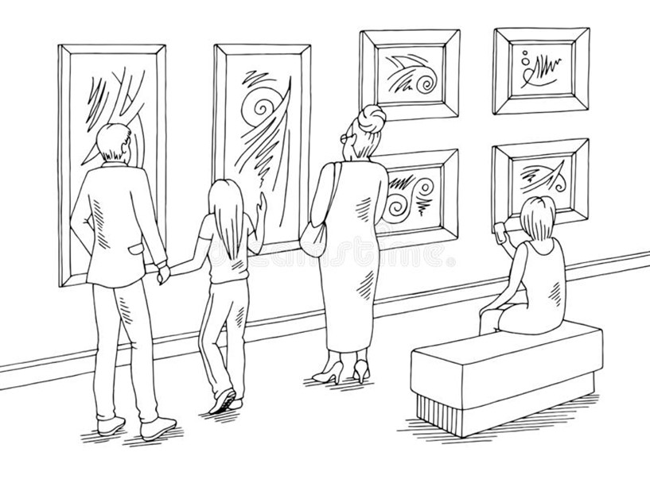

# שילושי פוליגונים ובעיית הגלריה לאמנות

## הקדמה

### בעיית הגלריה לאמנות

 גלריות ומוזיאונים משקיעים מאמצים רבים בשמירה על אוצרותיהם, למשל, הצבת שומרים או מצלמות שיוכלו לראות כל פינה בגלריה. במהלך היום, שומרים המסתובבים בגלריה יכולים למנוע גניבה, אולם בלילה מלאכה זו בדרך-כלל נעשית על ידי מצלמות או חיישנים. יכולות להיות מספר סיבות לדרוש מספר קטן ככל האפשר של מצלמות כאלה; למשל משיקולי עלות, וגם מכיוון שקל יותר לפקח על מספר קטן של מצלמות במקביל. מצד שני, נרצה שהמצלמות יכסו כל פינה בגלריה, ומספר קטן מדי של מצלמות עלול לא להספיק.

אם כן, כמה מצלמות נצטרך להציב על מנת לשמור על כל הגלריה? והיכן נצטרך להציב אותן? בעייה זו היתה ההשראה לאחת הבעיות המפורסמות והמרתקות ביותר בתחום הגיאומטריה החישובית: **בעיית הגלריה לאמנות**.

#### קראו את ההקדמה לפרק 3 בספר הלימוד (עמוד 45). {.unnumbered}

### מודל גאומטרי לבעיה

בעית הגלריה לאמנות נוסחה ב-1973 על-ידי המתמטיקאי ויקטור קלי.

מנקודת מבט גיאומטרית, נוכל לתאר גלריה בעלת $n$ קירות בעזרת פוליגון פשוט $P$ בעל $n$ צלעות (וכמובן גם $n$ קודקודים), ואת מיקומי המצלמות בתור נקודות בתוך $P$. נניח שמצלמה יכולה לצלם כל נקודה בגלריה שאינה מוסתרת ממנה על-ידי אחד הקירות. במילים אחרות, מצלמה (נקודה) $g$ שומרת על נקודה $p\in P$ אם הקטע $\overline{pq}$ מוכל בתוך $P$ (הפנים והשפה של $P$).

באיור למטה מתואר פוליגון עם מצלמה יחידה בתוכו, והאיזור המוצלל הוא כל הנקודות שמצלמה זו שומרת עליהן, או "רואה" אותן.

מהו המספר המינימלי של מצלמות שנצטרך על מנת לשמור על כל $P$? כאן, ברור שהתשובה תלויה במבנה של הפוליגון $P$.

::: rmdwarning
 עבור אילו פוליגונים מספיקה מצלמה יחידה? שימו לב שעבור פוליגון כוכבי מספיקה מצלמה יחידה (לפי הגדרה). גם לכל פוליגון קמור מספיקה מצלמה יחידה. מדוע?

:::

### מהו המקרה הגרוע ביותר?

מציאת המספר המינימלי של מצלמות הנדרשות לשמירה על פוליגון נתון $P$ היא בעיית אופטימיזציה אלגוריתמית, כלומר, הפתרון לה הוא אלגוריתם המחזיר קבוצת נקודות $G$ מגודל מינימלי, כך שלכל $p\in P$ קיימת $g \in G$ כך שהקטע $\overline{pg}$ מוכל בתוך $P$ (כלומר $g$ שומרת על $p$). בעיה זו היא NP-קשה, בפרט, לא ידוע האם קיים אלגוריתם כזה עם זמן ריצה פולינומי (ויותר מכך, ההשערה הרווחת היא שלא קיים כזה).

נוכל גם לשאול את השאלה הקומבינטורית הבאה: מהו מספר המצלמות המינימלי הנדרש במקרה הגרוע ביותר? במילים אחרות, היינו רוצים למצוא פונקציה $g(n)$, כך ש:
1.  $g(n)$ מצלמות מספיקות לכל פוליגון בעל $n$ קודקודים, וגם
2.  קיים פוליגון בעל $n$ קודקודים שעבורו נדרשות $g(n)$ מצלמות.

התבוננו במשפחת הפוליגונים הבאה, שלהם צורה דמויית מסרק.

שימו לב שכדי לשמור על פוליגון מסרק עם שתי "שיניים" נדרשות שתי מצלמות: המשולשים שהם שיני המסרק אינם נחתכים, ולכן אין נקודה אחת ש"רואה" את שני הקודקודים העליונים שלהם. עבור מסרק עם 3 שיניים נדרשות 3 מצלמות, וכן הלאה. מהו מספר המצלמות שנצטרך עבור מסרק עם $k$ שיניים? כמה קודקודים יש למסרק כזה?

ניתן להציג את משפחת פוליגוני המסרק באופן כללי כך: לכל $n \ge 3$, פוליגון מסרק בעל $n$ קודקודים מורכב מבסיס שהוא צלע אופקית, ומעליו $\lfloor n / 3 \rfloor$ שיניים שכל אחת מהן מורכבת משתי צלעות כל אחת, ומחוברות ביניהן על-ידי צלעות אופקיות, כמו באיור הבא:

קל לראות שניתן לבנות את המסרק כך שלא ניתן להציב מצלמה ששומרת על שני קודקודים שנמצאים בקצוות של שיניים שונות. לכן, מספר המצלמות הנדרשות עבור מסרק בעל $n$ קודקודים הוא $\lfloor n/3 \rfloor$.

אם כך, ראינו שלכל n קיים פוליגון בעל n קודקודים עבורו מספר המצלמות הנדרש הוא $\lfloor n/3 \rfloor$. במילים אחרות, $g(n)\ge \lfloor n/3 \rfloor$. אך האם זהו המקרה הגרוע ביותר? האם $\lfloor n/3 \rfloor$ מצלמות תמיד מספיקות כדי לשמור על פוליגון בגודל $n$? את זה נגלה בחלק הבא.

