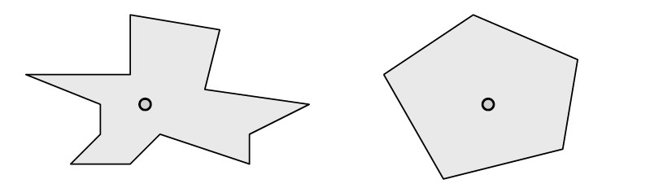
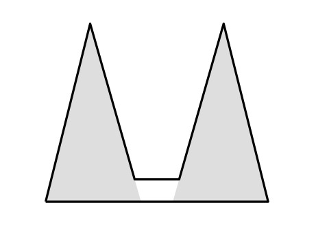
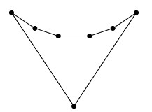
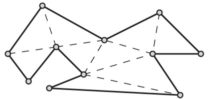
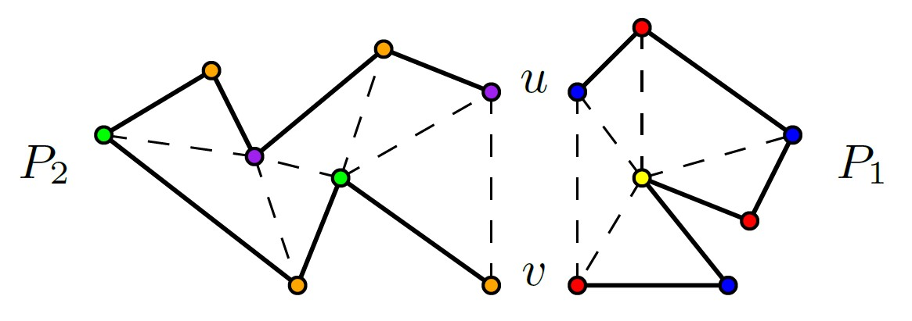
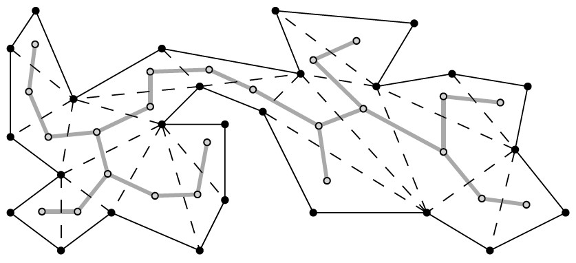
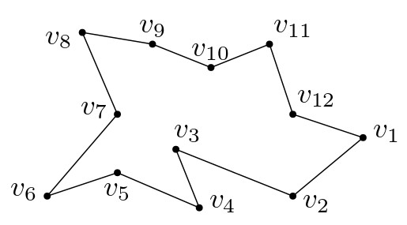

# שילושי פוליגונים ובעיית הגלריה לאמנות {#pol-tringle}

## הקדמה {#preface-3}

### מה ביחידה? {#contents-3}

#### שילושי פוליגונים ובעיית הגלריה לאמנות {.unnumbered}

יחידה זו מקבילה לפרק השלישי בספר הלימוד. 

בסיום יחידה זו, תכירו את המושגים ותרכשו את הטכניקות והכלים הבאים:

- בעיית הגלריה לאמנות.
- שילוש של פוליגון.
- פוליגון מונוטוני.
- חלוקה של פוליגון לפוליגונים מונוטוניים בעזרת אלגוריתם סורק.
- שילוש של פוליגון מונוטני.

למידה מהנה!

### בעיית הגלריה לאמנות {#agp}

 גלריות ומוזיאונים משקיעים מאמצים רבים בשמירה על אוצרותיהם, למשל באמצעות הצבת שומרים או מצלמות שיוכלו לראות כל פינה בגלריה. במהלך היום, שומרים המסתובבים בגלריה יכולים למנוע גניבה, אולם בלילה מלאכה זו בדרך כלל נעשית על ידי מצלמות או חיישנים. יכולות להיות כמה סיבות לדרוש מספר קטן ככל האפשר של מצלמות כאלה; למשל משיקולי עלות, וגם מכיוון שקל יותר לפקח על מעט מצלמות בו-זמנית. עם זאת, נרצה שהמצלמות יכסו כל פינה בגלריה, ומספר קטן מדי של מצלמות עלול לא להספיק.

אם כן, כמה מצלמות נצטרך להציב כדי לשמור על כל הגלריה? והיכן נצטרך להציב אותן? בעיה זו הייתה ההשראה לאחת הבעיות המפורסמות והמרתקות ביותר בתחום הגיאומטריה החישובית: **בעיית הגלריה לאמנות**.

#### קראו את ההקדמה לפרק 3 בספר הלימוד (עמוד 45). {.unnumbered}

### מודל גיאומטרי לבעיה {#geom-model}

בעיית הגלריה לאמנות נוסחה ב-1973 בידי המתמטיקאי ויקטור קלי.

מנקודת מבט גיאומטרית, נוכל לתאר גלריה בעלת $n$ קירות בעזרת פוליגון פשוט $P$ בעל $n$ צלעות (וכמובן גם $n$ קודקודים), ואת מיקומי המצלמות בתור נקודות בתוך $P$. נניח שמצלמה יכולה לצלם כל נקודה בגלריה שאינה מוסתרת ממנה על ידי אחד הקירות. במילים אחרות, מצלמה (נקודה) $g$ שומרת על נקודה $p\in P$ אם הקטע $\overline{pq}$ מוכל בתוך $P$ (הפנים והשפה של $P$).

באיור למטה מתואר פוליגון עם מצלמה יחידה בתוכו, והאיזור המוצלל הוא כל הנקודות שמצלמה זו שומרת עליהן, או "רואה" אותן.

{width="60%"}

מהו המספר המינימלי של מצלמות שנצטרך כדי לשמור על כל $P$? כאן, ברור שהתשובה תלויה במבנה של הפוליגון $P$.

#### נסו בעצמכם: מהו האיזור הנראה?
ביישומון הבא תוכלו לצייר פוליגון, ואז להציב בתוכו נקודות ולראות את האיזור הנראה מהן. 
ניתן לפתוח את היישומון בדף נפרד ב[קישור הזה](https://omrit.filtser.com/apps/vis-pol-applet.html).

<embed type="text/html" src="https://omrit.filtser.com/apps/vis-pol-applet.html" width="100%" height="650">

#### שאלה למחשבה:
עבור אילו פוליגונים מספיקה מצלמה יחידה? שימו לב שעבור פוליגון כוכבי מספיקה מצלמה יחידה (לפי הגדרה). גם לכל פוליגון קמור מספיקה מצלמה יחידה. מדוע?

{width="70%"}

#### ענו על השאלות הבאות: {.unnumbered}

**שאלה 1:** 
כמה מצלמות ידרשו על מנת לשמור על הפוליגון הבא?

{width="30%"}

(פתרון)

שימו לב שאין מצלמה יחידה שיכולה לשמור על שני הקודקודים העליונים ביותר. לכן, נדרשות לפחות שתי מצלמות, וגם מספיקות שתיים כי ניתן להציב אותן בחלק התחתון של המשולשים האפורים, כך שהן יראו גם את החלק הלבן.

הפוליגון באיור הוא מקרה פשוט של פוליגון שנקרא פוליגון מסרק. נפגוש אותו שוב בעמוד הבא.

 

**שאלה 2:**
קודקוד של פוליגון \(P\) נקרא קעור אם הזווית בתוך \(P\) בין הצלעות הסמוכות לו גדולה מ-\(180^\circ\). האם לכל פוליגון בו יש לפחות שני קודקודים קעורים המופיעים ברצף על השפה שלו, נדרשת יותר ממצלמה אחת?

(פתרון)

לא נכון. לפוליגון שבאיור יש ארבעה קודקודים קעורים המופיעים ברצף על השפה שלו, אך מספיקה מצלמה אחת על מנת לשמור על הפוליגון.

{width="30%"}

פוליגון זה נקרא גם **פוליגון "השועל"**, ובאופן כללי ניתן להגדיר אותו כך שיהיו בו \(n-3\) קודקודים קעורים המופיעים ברצף.
 

  
 **שאלה 3:**
קודקוד של פוליגון \(P\) נקרא קעור אם הזווית בתוך \(P\) בין הצלעות הסמוכות לו קטנה מ-\(180^\circ\). האם מספיק להציב מצלמות על כל הקודקודים הקמורים של הפוליגון כדי לראות את כולו?

(פתרון)

לא נכון. הנה דוגמה לפוליגון בעל שלושה קודקודים קמורים בלבד. אם נציב מצלמות על הקודקודים הקמורים, עדיין יהיה איזור בפנים הפוליגון שאינו נראה.

{width="30%"}

פוליגון זה נקרא **הפוליגון של גודפריד**, על שם Godfried Toussaint שהיה מאבות הגאומטריה החישובית. פוליגון זה על גרסאותיו השונות התפרסם משום שהוא משמש כדוגמה נגדית מיידית למגוון טענות שבמבט ראשון נראות נכונות.
 

### מהו המקרה הגרוע ביותר? {#worst-case}

מציאת המספר המינימלי של מצלמות הנדרשות לשמירה על פוליגון נתון $P$ היא בעיית אופטימיזציה אלגוריתמית, כלומר הפתרון לה הוא אלגוריתם המחזיר קבוצת נקודות $G$ מגודל מינימלי, כך שלכל $p\in P$ קיימת $g \in G$ כך שהקטע $\overline{pg}$ מוכל בתוך $P$ (כלומר $g$ שומרת על $p$). בעיה זו היא NP-קשה, ובפרט לא ידוע אם קיים אלגוריתם כזה עם זמן ריצה פולינומי (ויותר מכך, ההשערה הרווחת היא שלא קיים כזה).

נוכל גם לשאול את השאלה הקומבינטורית הבאה: מהו מספר המצלמות המינימלי הנדרש במקרה הגרוע ביותר? במילים אחרות, היינו רוצים למצוא פונקציה $g(n)$, כך ש-:

1.  $g(n)$ מצלמות מספיקות לכל פוליגון בעל $n$ קודקודים; וגם
2.  קיים פוליגון בעל $n$ קודקודים שעבורו נדרשות $g(n)$ מצלמות.

התבוננו במשפחת הפוליגונים הבאה, שלהם צורה דמוית מסרק.

{width="80%"}

שימו לב שכדי לשמור על פוליגון מסרק בעל שתי "שיניים" נדרשות שתי מצלמות: המשולשים שהם שיני המסרק אינם נחתכים, ולכן אין נקודה אחת ש"רואה" את שני הקודקודים העליונים שלהם. עבור מסרק בעל שלוש שיניים נדרשות שלוש מצלמות, וכן הלאה. מהו מספר המצלמות שנצטרך עבור מסרק בעל $k$ שיניים? כמה קודקודים יש למסרק כזה?

ניתן להציג את משפחת פוליגוני המסרק באופן כללי כך: לכל $n \ge 3$, פוליגון מסרק בעל $n$ קודקודים מורכב מבסיס שהוא צלע אופקית, ומעליו $\lfloor \frac{n}{3} \rfloor$ שיניים שכל אחת מהן מורכבת משתי צלעות, והשיניים מחוברות ביניהן על ידי צלעות אופקיות, כמו באיור הבא:

{width="50%"}

קל לראות שניתן לבנות את המסרק כך שלא ניתן להציב מצלמה ששומרת על שני קודקודים שנמצאים בקצוות של שיניים שונות. לכן, מספר המצלמות הנדרש עבור מסרק בעל $n$ קודקודים הוא $\lfloor \frac{n}{3} \rfloor$.

אם כך, ראינו שלכל n קיים פוליגון בעל n קודקודים שעבורו מספר המצלמות הנדרש הוא$\lfloor \frac{n}{3} \rfloor$.  במילים אחרות, $g(n)\ge \lfloor \frac{n}{3} \rfloor$. אך האם זהו המקרה הגרוע ביותר? האם $\lfloor \frac{n}{3} \rfloor$ מצלמות תמיד מספיקות כדי לשמור על פוליגון בגודל $n$? את זה נגלה בחלק הבא.

## שמירה ושילושים {#guarding}

### חלוקה בעזרת אלכסונים {#diagonals}

 בניגוד לשמו, פוליגון פשוט עשוי להיות צורה מסובכת מאוד, ראו לדוגמה את האיור משמאל. הייצוג של פוליגון כסדרה של נקודות הוא אמנם פשוט, אך לעיתים קרובות נרצה לעבוד דווקא עם ייצוג מורכב יותר, שיעזור לנו להבין טוב יותר את המבנה של הפוליגון. לדוגמה, כיצד נוכל לחשב את השטח של פוליגון פשוט? דרך אחת לעשות זאת היא לחלק את הפוליגון לצורות בסיסיות יותר, כמו משולשים או מרובעים, שעבורן אנו יודעים לחשב את השטח בקלות. חלוקה כזאת ניתן לקבל למשל על ידי הוספת אלכסונים לפוליגון.

#### הגדרה: אלכסון של פוליגון {.unnumbered}
::: rmdimportant
אלכסון של פוליגון \(P\) הוא קטע פתוח המחבר שני קודקודים של \(P\) ומוכל בפנימו.
:::

#### דוגמה: {.unnumbered}
התבוננו בפוליגונים שבאיור הבא, כולם בעלי חמישה קודקודים, ואלכסוניהם מסומנים בקו מקווקו. לפוליגון מימין יש שלושה אלכסונים. לעומת זאת, לפוליגון האמצעי יש רק שני אלכסונים. באופן כללי, בפוליגון בעל חמישה קודקודים קיימים לכל היותר חמישה אלכסונים. ניתן לראות זאת בפוליגון משמאל.

{width="90%"}

#### ענו על השאלה הבאה: {.unnumbered}
מהו מספר האלכסונים המקסימלי האפשרי בפוליגון בעל n קודקודים?

(פתרון)

שימו לב למקרה של פוליגון קמור: מכל קודקוד ניתן למתוח $n-3$ אלכסונים (לכל קודקוד שהוא לא הוא עצמו או אחד משכניו). מכיוון שבאופן זה כל אלכסון נספר פעמיים (פעם אחת לכל אחד מקודקודיו), נחלק ב-2. לכן התשובה היא $\frac{n(n-3)}{2}$.

### שילוש של פוליגונים {#triangulation}

שילוש של פוליגונים הוא כלי מרכזי וחשוב בגיאומטריה של המישור, ויש לו שימוש רבים, בעיקר בתחום הגרפיקה הממוחשבת.

#### הגדרה: שילוש (טריאנגולציה) {.unnumbered}
::: rmdimportant
לחלוקה של פוליגון למשולשים על ידי מספר מקסימלי של אלכסונים שאינם חותכים זה את זה אנו קוראים "שילוש" (טריאנגולציה).
:::

#### דוגמה:
בדרך כלל קיים יותר משילוש אחד לפוליגון. למשל, את הפוליגון באיור הבא ניתן לשלש בכמה דרכים שונות. נסו למצוא שילוש השונה מהשניים המוצעים כאן.

{width="60%"}

#### ענו על השאלה הבאה: {.unnumbered}
נסו למצוא שילוש נוסף לפוליגון באיור למעלה, השונה מהשניים המוצעים.

כמה אלכסונים הוספתם? כמה משולשים יש בשילוש שמצאתם?

(פתרון)

בהמשך, נראה שכל שילוש של פוליגון פשוט בעל $n$ קודקודים מכיל בדיוק $n-2$ משולשים ו-$2n−3$ צלעות.

#### מדוע נדרוש מספר מקסימלי של אלכסונים? {.unnumbered}

כדי להבטיח שלא יהיו קודקודים של הפוליגון שאינם קודקודים של אחד המשולשים. מצב כזה יכול לקרות כאשר שלושה קודקודים עוקבים מופיעים על ישר אחד. ראו למשל את שלושת הקודקודים משמאל למטה באיור הקודם.

#### האם תמיד קיים שילוש? {.unnumbered}
ראינו דוגמה לפוליגון עם יותר משילוש אחד, אך האם תמיד קיים שילוש? התשובה היא כן! כדי להוכיח זאת, נראה קודם שתמיד נוכל למצוא אלכסון בפוליגון בעל לפחות ארבעה קודקודים.

#### לכל פוליגון פשוט בעל ארבעה קודקודים לפחות קיים אלכסון {.unnumbered}

**הוכחה**: יהי $P$ פוליגון בעל $n\ge 4$ קודקודים, ויהי $v$ הקודקוד השמאלי ביותר של $P$ (במקרה שיש יותר מאחד כזה, נבחר בנמוך ביותר). נסמן ב-$u,w$ את שני הקודקודים השכנים ל-$v$ על שפת הפוליגון. מכיוון של-$P$ יש לפחות ארבעה קודקודים, לא ייתכן שהקטע $\overline{uw}$ הוא צלע של $P$. אם הקטע הפתוח $\overline{u w}$ מוכל בפנים של $P$, אזי מצאנו אלכסון של $P$. אחרת, קיים לפחות קודקוד אחד של $P$ בפנימו של המשולש המוגדר על ידי הקודקודים $u,v,w$, או על הקטע $\overline{u w}$ (נשים לב כי מבחירת $v$, הקודקודים $u, v, w$ לא יכולים להיות כולם על ישר אחד). יהי $v'$ הקודקוד השמאלי ביותר בתוך המשולש הזה. הקטע $\overline{v v'}$ לא חותך אף צלע של $P$, אחרת אחד מהקודקודים של צלע כזו היה בפנים המשולש ושמאלי יותר מ-$v'$. לכן הקטע הפתוח $\overline{v v'}$ הוא אלכסון של $P$.

{width="80%"}

#### לכל פוליגון קיים שילוש {.unnumbered}
::: rmdimportant
**משפט (3.1 בספר הלימוד)**: לכל פוליגון קיים שילוש, וכל שילוש של פוליגון פשוט בעל $n$ קודקודים מכיל בדיוק $n−2$ משולשים ו-$2n−3$ צלעות.
:::

**הוכחה**: יהי $P$ פוליגון בעל $n$ קודקודים. נוכיח את המשפט באינדוקציה על $n$. עבור $n=3$, $P$ הוא משולש והמשפט מתקיים. יהי $n>3$, ונניח שהמשפט מתקיים לכל $m<n$. לפי המשפט שהוכחנו קודם, קיים ב-$P$ אלכסון. כל אלכסון כזה מחלק את $P$ לשני פוליגונים $P_1,P_2$. מספר הקודקודים של כל אחד מהפוליגונים האלו קטן ממש מ-$n$, ולכן לפי הנחת האינדוקציה קיים שילוש של $P_ 1$ ו-$P_ 2$, והאיחוד שלהם הוא שילוש של $P$.\
כדי לחסום את מספר המשולשים, נתבונן בשילוש כלשהו של $P$, ונבחר אלכסון $\overline{uv}$ כלשהו בשילוש (כאשר $u, v$ הם קודקודים של $P$). אלכסון זה מחלק את $P$ לשני פוליגונים $P_ 1, P_ 2$, בעלי $m_ 1, m_ 2$ קודקודים, בהתאמה. כל קודקוד של $P$, פרט לקודקודים $u, v$, מופיע בדיוק באחד מ-$P_ 1, P_ 2$, והקודקודים $u, v$ מופיעים בשניהם. לכן מתקיים $m_1+m_2= n+2$. לפי הנחת האינדוקציה, מספר המשולשים בשילוש של $P_1$ הוא $m_1-2$, ומספר המשולשים בשילוש של $P_2$ הוא $m_2- 2$. לכן השילוש של מכיל בסך הכול $m_1-2+ m_2-2 = n- 2$ משולשים.\
באופן דומה, כל אלכסון בשילוש של $P$' פרט ל-$\overline{u v}$, מופיע בדיוק באחד מהשילושים של $P_1, P_2$, והאלכסון $\overline{u v }$ מופיע כצלע בשניהם. לכן לפי הנחת האינדוקציה, מספר הצלעות בשילוש של $P$ הוא $(2m_1 - 3)+ (2m_2- 3 )- 1 = 2 (m_1+m_2)-7=2(n+2)-7=2n-3$.

#### ענו על השאלות הבאות: {.unnumbered}
**שאלה 1:**
מהו סכום הזוויות בפוליגון פשוט בעל $n$ קודקודים?

(פתרון)

ראינו שכל שילוש של פוליגון בעל $n$ קודקודים מחלק אותו ל-$(n-2)$ משולשים, וסכום הזוויות בכל אחד מהם הוא $180^\circ$. לכן, סכום הזויות הפנימיות בפוליגון הוא $180^\circ (n-2)$.

 

**שאלה 2:**
נכון או לא נכון? כל פוליגון פשוט בעל 5 צלעות הוא כוכבי (או במילים אחרות, מצלמה אחת מספיקה כדי לשמור עליו).

(פתרון)

יהי $P$ פוליגון פשוט בעל n קודקודים. סכום הזוויות הפנימיות של $P$ הוא  $540^\circ$, ולכן יש לו לכל היותר שני קודקודים קעורים (reflex vertices), כלומר קודקודים עם זווית פנימית גדולה מ-$180^\circ$. 
אם $P$ קמור, או שיש לו קודקוד קעור יחיד, אז ראינו ביחידה 1 שהוא כוכבי. 
אחרת, ל-$P$ יש שני קודקודים קעורים a ו-b. אם הם נמצאים על צלע משותפת, אז ל-$P$ יש שילוש יחיד שבו שני אלכסונים מחברים את a ו-b לקודקוד הקמור c שאינו שכן של אף אחד מהם, ונקבל שהנקודה c רואה את כל הפוליגון. 
אם ל-a ו-b אין צלע משותפת, אז הקטע $\overline{ab}$ בהכרח מוכל ב-$P$ (חישבו, מדוע?), והוא מחלק את $P$ למשולש ולמרובע. למרובע יכולה להיות רק זוית פנימית אחת שגדולה מ-$180^\circ$, והיא יכולה להיות רק באחד מהקודקודים a או b. נניח שהזוית הפנימית ב-a גדולה מהזוית הפנימית ב-b, אז המרובע הוא פוליגון כוכבי שהמרכז שלו ב-a. מכיוון ש-a הוא קודקוד משותף למשלוש ולמרובע, נקבל ש-a רואה את כל הפוליגון.

<!-- #### מציאת שילוש. {.unnumbered} -->

<!-- אז אמנם ראינו ששילוש קיים תמיד, אך כדי להשתמש בו נרצה גם להראות אלגוריתם שיודע למצוא שילוש ביעילות. -->

<!-- ::: rmdwarning -->

<!--  שאלה למחשבה: השתמשו בהוכחות המשפטים המופיעות למעלה, כדי להראות אלגוריתם המוצא שילוש של פוליגון פשוט בעל $n$ קודקודים בזמן $O(n^2)$. -->

<!-- ::: -->

<!-- בהמשך נראה אלגוריתם יעיל יותר למציאת שילוש, עם זמן ריצה של $O(n \log n)$, ו-$O(n)$ זיכרון. -->

### משפט הגלריה לאמנות {#agp-thm}

ראינו קודם שכדי לשמור על פוליגון מסרק בעל $n$ קודקודים, נזדקק ל-$\lfloor \frac{n}{3} \rfloor$ מצלמות. במילים אחרות, זה אומר ש-$g(n)\ge \lfloor \frac{n}{3} \rfloor$. האם זהו המקרה הגרוע ביותר? כלומר, האם $\lfloor \frac{n}{3} \rfloor$ מצלמות יספיקו לכל פוליגון בגודל $n$ שנבחר? או שקיימיים פוליגונים "גרועים" יותר?

התשובה היא שתמיד ניתן להסתפק ב-$\lfloor \frac{n}{3} \rfloor$ מצלמות! כלומר, נוכל להראות שמתקיים $g(n)\le \lfloor \frac{n}{3} \rfloor$, ובכך להוכיח את המשפט המפורסם:

#### משפט הגלריה לאמנות: {.unnumbered}

::: rmdimportant
**משפט (3.2 בספר הלימוד): משפט הגלריה לאמנות**
$g(n)=\lfloor n/3\rfloor$
, כלומר לפוליגון בעל $n$ קודקודים, $\lfloor n/3\rfloor$ מצלמות תמיד מספיקות ולפעמים נדרשות כדי לראות כל נקודה בפוליגון.
:::

#### מעניין לדעת: {.unnumbered}
הראשון שניסח והוכיח את משפט הגלריה לאמנות היה ואצלב כבטל (Václav Chvátal), אך את ההוכחה שנראה כאן גילה סטיב פיסק (Steve Fisk). ההוכחה של פיסק הייתה קצרה ופשוטה יותר, ונחשבה אלגנטית כל כך עד שנכללה בספר "Proofs from the BOOK" - המכיל אוסף של הוכחות בהשראת אמרתו של פול ארדש (Paul Erdős): "A place where God keeps aesthetically perfect proofs".

 

לפני שנראה את ההוכחה לכך ש-$\lfloor \frac{n}{3} \rfloor$ מצלמות מספיקות תמיד, ננסה להבין כיצד ניתן להוכיח חסמים פשוטים יותר. כיצד ניתן להראות שמספר מסוים של מצלמות מספיק לכל פוליגון $P$ בעל $n$ קודקודים?

#### דוגמה: {.unnumbered}
נתבונן בשילוש של $P$. קל להראות שמספיקות $n$ מצלמות המוצבות על קודקודי $P$. מדוע?

{width="60%"}

קודקודי המשולשים הם קודקודים של $P$, ומשולש הוא פוליגון קמור, ולכן קבוצה זו של מצלמות שומרת על כל $P$. למעשה, מכיוון שבכל שילוש יש $n-2$ משולשים, נוכל להסתפק ב-$n-2$ מצלמות.

#### ענו על השאלה הבאה: {.unnumbered}
נניח שלפוליגון פשוט $P$ יש לפחות קודקוד קעור אחד. האם מספיק להציב מצלמות על כל הקודקודים הקעורים של $P$, כדי לראות את כל $P$?

(פתרון)

נכון, ההוכחה באינדוקציה על מספר הקודקודים הקעורים r.

**טענה**: r מצלמות תמיד מספיקות כדי לשמור על פוליגון P בעל r≥1 קודקודים קעורים.

**הוכחה**: 
זכרו שכדי לשמור על פוליגון קמור מספיקה מצלמה יחידה, וניתן למקם אותה בכל מקום בפוליגון. נניח שב-P יש קודקוד קעור אחד v. נצייר את הקרן שמתחילה ב-v וחוצה את הזוית הפנימית שלו, עד לנקודה הראשונה בה היא נחתכת עם הפוליגון. הקטע שקיבלנו מחלק את הפוליגון לשני פוליגונים קמורים, מכיוון שהזווית הפנימית של v בכל אחד מהפוליגונים חייבת להיות קטנה מ-180°, לא היו עוד קודקודים קעורים, והקרן גם לא יכולה ליצור קודקוד קעור חדש. לכן אם נציב מצלמה בקודקוד v, היא תשמור על כל P.

אם ב-P יש r>1 קודקודים קעורים, אז נבחר קודקוד קעור כלשהו v, ונחלק את הפוליגון בעזרת חוצה הזווית מ-v כמו קודם. נקבל שני פוליגונים, P1 ו-P2, בעלי r1 ו-r2 קודקודים קעורים בהתאמה. מכיוון שחוצה הזווית גרם לכך ש-v כבר לא קעור, והוא גם לא יצר קודקודים קעורים חדשים, נקבל r1+r2≤r−1. אם P1 ( או P2) קמור, אז מצלמה שנציב על v תראה את כולו. אחרת, מהנחת האינדוקציה, מספיקות עבורו r1 (או r2) מצלמות. מכאן שעבור P מספיקות r מצלמות.

שימו לב שמספר הקודקודים הקעורים בפוליגון יכול להיות גדול מאוד לעומת המספר המינימלי של מצלמות הנדרשות כדי לשמור עליו. למשל בפוליגון השועל יש n−3 קודקודים קעורים, אך מספיקה עבורו מצלמה אחת.

{width="30%"}

 

כעת נראה הוכחה למשפט הגלריה לאמנות. אולי בשלב זה כבר ניחשתם כי הוכחה זו מבוססת גם היא על שילוש של הפוליגון. נוסף על השילוש, ההוכחה תתבסס גם על צביעה של הגרף המוגדר על ידי צלעות המשולשים וקודקודי הפוליגון. נזכיר כי **גרף הוא** $k$**-צביע** (ניתן לצביעה ב-$k$ צבעים) אם ניתן להתאים לכל אחד מקודקודיו צבע (מספר) בין 1 ל-$k$, כך שכל שני קודקודים המחוברים בצלע משותפת צבועים בצבעים שונים.

#### כל שילוש ניתן לצביעה בשלושה צבעים {.unnumbered}

::: rmdimportant
**טענה**:
לכל שילוש של פוליגון פשוט, ניתן לצבוע את קודקודי הפוליגון בשלושה צבעים כך שכל שני קודקודים המחוברים בצלע או אלכסון מהשילוש, יהיו צבועים בצבעים שונים.
:::

**הוכחה**: נוכיח את המשפט באינדוקציה על מספר הקודקודים $n$. עבור $n=3$ הפוליגון הוא משולש, והוא ניתן לצביעה בשלושה צבעים. יהי $n> 3$, ונניח שהמשפט מתקיים לכל $m<n$. יהי $P$ פוליגון בעל $n$ קודקודים, נתבונן בשילוש כלשהו של $P$, ונבחר אלכסון $\overline{u v}$ כלשהו בשילוש (כאשר $u,v$ הם קודקודים של $P$). אלכסון זה מחלק את $P$ לשני פוליגונים $P_1,P_2$. לפי הנחת האינדוקציה, נוכל לצבוע את $P_1$ בשלושה צבעים: אדום, כחול וצהוב, ואת $P_2$ בצבעים: כתום, סגול וירוק. כעת נרצה "להדביק" את שני הפוליגונים כך שנקבל צביעה של $P$. מכיוון שבחירת הצבעים היא שרירותית, נוכל להניח בלי הגבלת הכלליות שבצביעה של $P_1$ הקודקודים $u,v$ נצבעו באדום וכחול בהתאמה, ובצביעה של $P_2$ הם נצבעו בכתום וסגול בהתאמה. לכן נחליף את הצבע של כל קודקוד כתום לאדום, סגול לכחול, וירוק לצהוב. קיבלנו צביעה של $P$ בשלושה צבעים.

{width="80%"}

#### חסם עליון {.unnumbered}

::: rmdimportant
**טענה**: $g(n)\le \lfloor \frac{n}{3} \rfloor$, כלומר ניתן לשמור על כל פוליגון פשוט $P$ בעל $n$ קודקודים בעזרת $\lfloor \frac{n}{3} \rfloor$ מצלמות.
:::

**הוכחה**: נבחר שילוש כלשהו $T$ של $P$ ונצבע אותו בשלושה צבעים: אדום, כחול, וצהוב. מעקרון שובך היונים, קיים לפחות צבע אחד שבו צבועים לכל היותר $\lfloor \frac{n}{3} \rfloor$ קודקודים (אחרת, נקבל שסכום הקודקודים גדול מ-$n$). נניח שצבע זה הוא האדום, ונמקם מצלמה בכל קודקוד הצבוע באדום. נשים לב שבכל משולש ב-T יש בדיוק קודקוד אחד הצבוע באדום: אחרת, נקבל צלע במשולש ששני קודקודיה צבועים באותו הצבע. מכיוון שכל משולש הוא קמור, המצלמה הממוקמת על הקודקוד האדום שומרת על כולו, ולכן המצלמות שהצבנו שומרות על כל P.

#### מעניין לדעת: גלריות אורתוגונליות {.unnumbered}

עבור פוליגון פשוט אורתוגונלי, ניתן להראות כי מספיקים $\lfloor \frac{n}{4} \rfloor$ שומרים. קווי ההוכחה דומים: תחילה "מרבעים" את הפוליגון, כלומר מחלקים את הפוליגון למרובעים קמורים בעזרת אלכסונים. לאחר מכן, מוסיפים לכל מרובע את שני האלכסונים שלו (שימו לב שהאלכסונים חוצים זה את זה), ולבסוף מראים שקיימת צביעה של הגרף שהתקבל בארבעה צבעים. מכאן, לפי עקרון שובך היונים, קיים צבע אחד שהשתמשנו בו לכל היותר $\lfloor \frac{n}{4} \rfloor$ פעמים, ומכיוון שלכל אחד מהמרובעים יש בדיוק קודקוד אחד הצבוע בצבע זה, קיבלנו קבוצה של מצלמות ששומרות על הפוליגון כולו.

### הגרף הדואלי לשילוש {#dual-graph}

תכונה מעניינת (ושימושית!) נוספת של שילושים מתקבלת כשמתבוננים בגרף הדואלי לשילוש. למעשה, הייצוג של שילוש באמצעות גרף מאפשר לנו לתרגם את הבעיה הגיאומטרית לבעיה קומבינטורית.

נסמן ב-$T$ את אוסף המשולשים בשילוש כלשהו של פוליגון $P$. הגרף הדואלי $G_T$ לשילוש $T$ הוא הגרף שקבוצת הקודקודים שלו מכילה קודקוד אחד לכל משולש ב-$T$, וקבוצת הצלעות שלו מכילה צלע בין שני קודקודים $u,v$ של הגרף אם המשולשים המתאימים לקודקודים אלו חולקים אלכסון משותף.

#### דוגמה: {.unnumbered}
באיור למטה ניתן לראות שילוש $T$ ואת הגרף $G_T$ המתאים לו.

כל קודקוד של $G_T$ מתאים למשולש מ-$T$, וכל צלע של $G_T$ מתאימה לאלכסון בשילוש (כל צלע חוצה אלכסון אחד). שימו לב שהגרף $G_T$ הוא עץ. האם זה מקרי?

{width="80%"}

#### אבחנה: הגרף הדואלי לשילוש הוא עץ {.unnumbered}

נראה שלכל שילוש $T$, הגרף הדואלי $G_T$ הוא עץ.

**הוכחה**: ראשית, נשים לב שהגרף $G_T$ הוא קשיר מכיוון שפנים הפוליגון קשיר. שנית, כל אלכסון מחלק את $P$ לשני פוליגונים, לכן מחיקה של צלע מהגרף $G_T$ מחלקת את הגרף לשני רכיבי קשירות. במילים אחרות, הגרף $G_T$ הוא קשיר ואינו מכיל מעגלים, כלומר הוא עץ.

#### שימו לב: טענה זו אינה נכונה עבור פוליגון עם חורים! {.unnumbered}
הגרף הדואלי לשילוש של [פוליגון עם חורים]{.underline} עשוי להכיל מעגלים, כמו באיור למטה.

חשבו, מדוע זה קורה? אילו אלכסונים אינם מחלקים את הפוליגון לשני חלקים?

{width="70%"}

#### אלגוריתם למציאת מיקומי המצלמות {.unnumbered}

משפט הגלריה לאמנות אומר שתמיד מספיקות $\lfloor \frac{n}{3} \rfloor$ מצלמות כדי לשמור על כל פוליגון נתון, אך כיצד נוכל לדעת היכן למקם אותן? נוכל בקלות להפוך את הוכחת הקיום שראינו בעמוד הקודם, לאלגוריתם בזמן לינארי המוצא את מיקומי המצלמות -- בעזרת הגרף הדואלי לשילוש. בהינתן הגרף הדואלי, נוכל למצוא צביעה של קודקודי הגרף בשלושה צבעים בזמן לינארי על ידי סריקת DFS פשוטה. נסו לחשוב ולהראות בעצמכם כיצד ניתן לעשות זאת (הפתרון מופיע בסעיף 3.1 בספר הלימוד).

בחלק הבא נראה כיצד ניתן למצוא שילוש של פוליגון בזמן $O(n \log n)$, ולכן נוכל להסיק מכך את המשפט הבא.

::: rmdimportant
**משפט (3.3 בספר הלימוד)**: לכל פוליגון פשוט בעל $n$ קודקודים ניתן למצוא בזמן $O(n\log n)$ קבוצה של $\lfloor \frac{n}{3} \rfloor$ מצלמות ששומרות עליו.
:::

### לחזרה: קריאה בספר הלימוד

בסעיפים הקודמים של חלק זה ראינו הוכחות מלאות לקיום של שילוש ומשפט הגלריה לאמנות. לשם השלמות של החומר באתר, ולמי שמעוניין בחזרה ובהרחבה, ניתן לקרוא כאן את הסעיף המתאים בספר הלימוד.

#### קראו את סעיף 3.1 בספר הלימוד (עמודים 46--49). {.unnumbered}

## אלגוריתם לשילוש של פוליגון

### איך נחשב שילוש?

בחלק הקודם ראינו ששילוש קיים תמיד, אך כדי להשתמש בו, נרצה גם להראות אלגוריתם שיודע למצוא שילוש ביעילות.

שימו לב שההוכחות לקיום אלכסון ושילוש שראינו בחלק הקודם הן **קונסטרוקטיביות**, כלומר הן מציגות דרך למציאה של אלכסון ושילוש של פוליגון פשוט בעל $n$ קודקודים בזמן $O(n^2)$.

#### תרגיל: {.unnumbered}
השתמשו בהוכחות המשפטים לקיום אלכסון ושילוש כדי להראות אלגוריתם המוצא שילוש של פוליגון פשוט בעל $n$ קודקודים בזמן $O(n^2)$. (התשובה מופיעה בפסקה הראשונה של פרק 3.2 בספר הלימוד).

#### האם ניתן למצוא אלגוריתם שילוש יעיל יותר? {.unnumbered}

בהחלט ניתן למצוא שילוש ביעילות עבור משפחות מסוימות של פוליגונים מיוחדים. למשל, אם הפוליגון שלנו קמור, נוכל לבחור קודקוד באופן שרירותי, ולהוסיף את כל האלכסונים המחברים אותו לכל הקודקודים שהם לא שכנים שלו. זמן הריצה יהיה לינארי, כלומר $O(n)$.

לפיכך, גישה אפשרית למציאת שילוש במקרה הכללי תהיה כזו: נחלק את הפוליגון שלנו לחלקים שניתן לשלש ביעילות, ולאחר מכן נשלש כל חלק בנפרד.

בסעיפים הבאים נראה אלגוריתם למציאת שילוש שמשתמש בגישה הזו, על ידי חלוקה של הפוליגון לחלקים מונוטוניים. זמן הריצה של האלגוריתם הוא $O(n \log n)$, והוא משתמש ב-$O(n)$ זיכרון.

#### הגדרה: פוליגון מונוטוני {.unnumbered}
::: rmdimportant
 פוליגון פשוט $P$ נקרא **מונוטוני ביחס לישר** $\ell$ אם לכל ישר $\ell'$ שמאונך ל-$\ell$, החיתוך של  $\ell'$עם הפוליגון הוא קשיר. במילים אחרות, $\ell'\cap P$ יכול להיות קטע, נקודה או הקבוצה הריקה.

פוליגון שהוא מונוטוני ביחס לציר ה-$y$ נקרא $y$-מונוטוני, ופוליגון שהוא מונוטוני ביחס לציר ה-$x$ נקרא $x$-מונוטוני.
:::

באיור מופיע פוליגון $y$-מונוטוני: החיתוך שלו עם כל ישר המקביל לציר ה-$x$ (מאונך לציר ה-$y$) הוא קשיר.

#### ענו על השאלה הבאה: {.unnumbered}
לפניכם חמישה פוליגונים. עבור כל אחד מהם, החליטו האם הוא $y$-מונוטוני או $x$-מונוטוני (יתכן ששתי האפשוריות נכונות).

{width="100%"}

(פתרון)

(א) הוא גם $y$-מונוטוני וגם $x$-מונוטוני (ד) הוא רק $x$-מונוטוני (ה) הוא רק $y$-מונוטוני

### חלוקה לפוליגונים מונוטוניים

בסרטון הבא נדבר על אלגוריתם MakeMonotone, המוצא חלוקה של פוליגון $P$ בעל $n$ קודקודים לפוליגונים $y$-מונוטוניים. האלגוריתם משתמש בשיטת הישר הסורק שלמדנו בחלק השני של יחידה 2, ולכן מומלץ להיזכר בשיטה ולוודא קודם שהבנתם את הפרטים שלה.

#### צפו בסרטון הבא: {.unnumbered}

<iframe width="560" height="315" src="https://www.youtube.com/embed/ZVHC6R5R9fI" title="YouTube video player" frameborder="0" allow="accelerometer; autoplay; clipboard-write; encrypted-media; gyroscope; picture-in-picture; web-share" allowfullscreen>

</iframe>

 
#### ענו על השאלות הבאות: {.unnumbered}
 
 **שאלה 1**:
 לכל אחד מהקודקודים של הפוליגון שבאיור, קבעו מאיזה סוג הוא (start, end, merge, split או regular).
 

{width="50%"}

(פתרון)

TODO

 

**שאלה 2**: 
 התבוננו באיור הבא המתאר חלק מפוליגון פשוט.

{width="50%"}

כתבו בטבלה הבאה את האינדקס של הקודקוד שהוא ה-helper של $e_1$ כאשר הישר הסורק נמצא על כל אחד מהקודקודים בעמודה הימנית (ולאחר הטיפול בקודקוד).

| הקודקוד | ($e_1$)helper |
|---------|---------------|
| $v_1$   |               |
| $v_4$   |               |
| $v_7$   |               |
| $v_9$   |               |

(פתרון)

TODO

 
 
#### מימוש האלגוריתם הסורק {.unnumbered}

הנה התשובה לשאלה האחרונה שנשאלה בסרטון: הייצוג של $P$ ותת-הפוליגונים המונוטוניים בחלוקה שלו יהיה בעזרת מבנה DCEL, כפי שלמדנו בחלק השלישי של יחידה 2.

כיצד נממש את האלגוריתם הסורק ביעילות? על אופן המימוש ופרטי האלגוריתם MakeMonotone תקראו בסעיף 3.2 בספר הלימוד. זמן הריצה של האלגוריתם הוא $O(n \log n)$, והוא משתמש ב-$O(n)$ זיכרון.

#### קראו את סעיף 3.2 בספר הלימוד (עמודים 49--55). {.unnumbered}

### שילוש של פוליגון מונוטוני

לאחר שראינו כיצד ניתן לחלק פוליגון פשוט בעל $n$ קודקודים לפוליגונים $y$-מונוטוניים בזמן $O(n \log n)$, נותר לנו להראות שכל פוליגון מונוטוני ניתן לשילוש בזמן לינארי.

#### צפו בסרטון הבא. {.unnumbered}

<iframe width="560" height="315" src="https://www.youtube.com/embed/GB0OGV3Heu0" title="YouTube video player" frameborder="0" allow="accelerometer; autoplay; clipboard-write; encrypted-media; gyroscope; picture-in-picture; web-share" allowfullscreen>

</iframe>

 \
בסעיף 3.3 בספר הלימוד תקראו בפירוט רב יותר על האלגוריתם TriangulateMonotonePolygons שתואר בסרטון. זמן הריצה של האלגוריתם הזה הוא אכן $O(n)$, ומכאן שקיבלנו אלגוריתם שילוש בזמן $O(n\log n)$ -- שיפור משמעותי לעומת האלגוריתם בזמן ריבועי ($O(n^2)$) המבוסס על ההוכחה לקיום שילוש. למעשה, נוכל להסיק שכל מפה מישורית בעלת $n$ קודקודים ניתנת לשילוש בזמן $O(n\log n)$!

#### קראו את סעיף 3.3 בספר הלימוד (עמודים 55--58). {.unnumbered}
