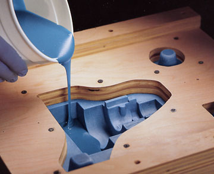
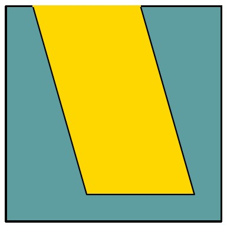
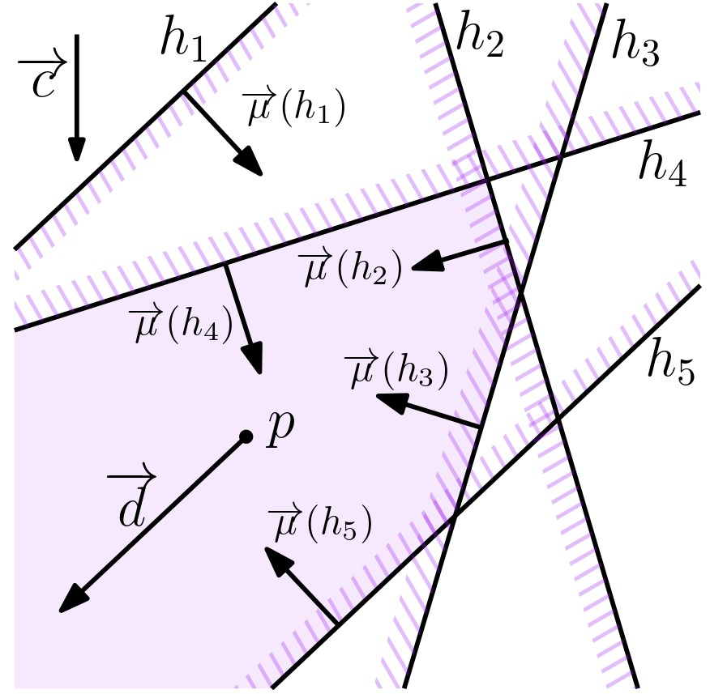
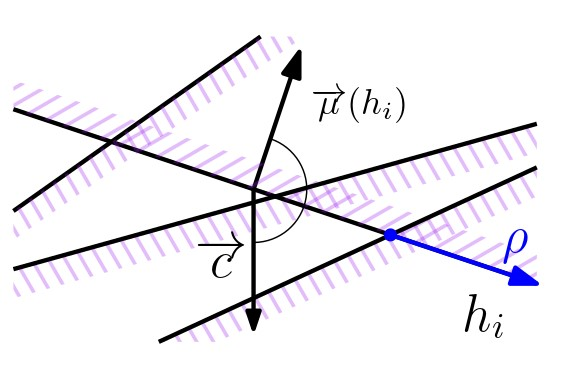

# תכנון לינארי וחיתוך של חצאי מישורים {#linear-prog}

## הקדמה {#preface-4}

### מה ביחידה? {#contents-4}

#### תכנון לינארי וחיתוך של חצאי מישורים {.unnumbered}
יחידה זו מקבילה לפרק הרביעי בספר הלימוד. 

בסיום יחידה זו, תכירו את המושגים ותרכשו את הטכניקות והכלים הבאים:

- מציאת החיתוך של חצאי מישורים.
- בעיית תכנון לינארי במישור.
- אלגוריתם אינקרמנטלי-רנדומי, וניתוחו בשיטת אנליזה לאחור.

למידה מהנה!

### בעיית הייצור באמצעות תבניות {#molding-prob}

 חפצים רבים שמשמשים אותנו ביום-יום מיוצרים בתהליך אוטומטי שבו יוצקים נוזל לתבנית רב-פעמית, ולאחר שהוא מתמצק שולפים אותו החוצה מבלי לפגוע בתבנית. מובן שלא כל צורה תלת-ממדית ניתנת לייצור באופן הזה, למשל צורה כדורית. נניח שנתון לנו **פוליהדרון** (גוף תלת-ממדי המורכב מפאות שהן פוליגונים, צלעות שהן קווים ישרים, וקודקודים שהם נקודות), איך נדע אם ניתן לייצר אותו על ידי יציקה לתבנית רב-פעמית?

#### קראו את ההקדמה לפרק 4 בספר הלימוד (עמודים 63--64). {.unnumbered}

### מודל גיאומטרי לבעיה {#geom-model}

 בהינתן פוליהדרון $P$ בעל $n$ פאות שהן פוליגונים, נרצה לתכנן תבנית שתאפשר לנו לייצר את $P$. כדי שנוכל לחלץ את $P$ מהתבנית במשיכה בכיוון אחד, נדרוש שבדיוק אחת מהפאות של $P$ תהיה מוכלת בפאה העליונה של התבנית. התבנית חייבת להתאים לצורה של $P$, אבל את הפאה העליונה נוכל לבחור מתוך $n$ הפאות של $P$, ולכן יש לכל היותר $n$ תבניות אפשריות. מובן שלא כל תבנית תאפשר לנו לחלץ את $P$.

#### ענו על השאלה הבאה: {.unnumbered}
מאילו מהתבניות הבאות ניתן לחלץ את הפוליהדרון שיצוק בהן, במשיכה בכיוון אחד?

(לשם הפשטות, האיורים מציגים חתך עומק של התבנית והפוליהדרון בדו-ממד. הניחו שכל חתכי העומק של הפוליהדרון זהים לזה שבאיור.)

{width="20%"} {width="20%"} {width="20%"} {width="20%"} {width="20%"}

(פתרון)

שלוש התבניות השמאליות.

אובייקט שניתן לייצור על ידי יציקה לתבנית רב-פעמית נקרא castable. כדי לבדוק אם $P$ הוא castable, נבדוק את כל האפשרויות לתבנית עבורו. בהינתן אחת מהאפשרויות האלה (כלומר בהינתן הפאה של $P$ שתהיה מוכלת בפאה העליונה של התבנית), נרצה לקבוע אם קיים כיוון (וקטור) $\overrightarrow{d}$ כך שניתן לשלוף את $P$ מהתבנית על ידי משיכה בכיוון $\overrightarrow{d}$.

 שימו לב שלכל פאה $f$ של $P$ שהיא לא הפאה העליונה, יש פאה מתאימה $\hat{f}$ בתבנית. באופן אינטואיטיבי, כדי שנוכל לחלץ את $P$ מהתבנית, כל פאה $f$ של $P$ צריכה לנוע בכיוון שהוא "נגדי" או לכל היותר "מאונך" ל-$\hat{f}$. באופן פורמלי, נוכל להסתכל על הנורמל (כלפי חוץ מהפוליגון) של פאה $f$, ונסמן אותו $\overrightarrow{\mu}( f )$. הנורמל של $f$ הוא וקטור המאונך למישור המכיל את $f$. נוכל להראות שהפאה המתאימה $\hat{f}$ של התבנית, מאפשרת תנועה רק בכיוון $\overrightarrow{d}$ שבו הזווית (הקטנה) שנוצרת בין $\overrightarrow{d}$ ל-$\overrightarrow{\mu}( f )$ היא לפחות $90 ^\circ$.

טענה זו מובילה להגדרת הבעיה באופן הבא: יש למצוא כיוון $\overrightarrow{d}$, כך שהזווית שלו עם הנורמלים של כל אחת מהפאות של $P$ היא לפחות $90 ^\circ$. כל פאה של P היא בעצם אילוץ על הכיוון $\overrightarrow{d}$. כל אילוץ כזה ניתן לתאר על ידי משוואה לינארית: הזווית בין $\overrightarrow{d}$ ל-$\overrightarrow{\mu}( f )$ גדולה או שווה ל-$90 ^\circ$ אם ורק אם $\overrightarrow{d} \cdot \overrightarrow{\mu}( f ) \le 0$. נוכל לייצג את $\overrightarrow{d}$ על ידי נקודה במישור $z = 1$, כלומר $\overrightarrow{d}$ יהיה הווקטור $(x,y,1)$ שמתחיל בראשית הצירים ומסתיים בנקודה $(x, y, 1 )$. לכן עבור $\overrightarrow{\mu}( f ) =( \mu_x, \mu_y, \mu_z )$ נקבל אילוץ שהוא בעצם משוואה של חצי מישור: $\mu_x \cdot x + \mu_y \cdot y + \mu_z \le 0$.

לפיכך קיים כיוון $\overrightarrow{d}$ המאפשר לשלוף את $P$ מהתבנית, אם ורק אם קיימת נקודה $( x, y )$ המקיימת את כל האילוצים, כלומר נקודה שנמצאת בחיתוך של אוסף חצאי המישורים המתאימים להם. בעצם המרנו את הבעיה המקורית לבעיה גיאומטרית במישור: בהינתן אוסף של n חצאי מישורים, יש למצוא נקודה בחיתוך שלהם, אם החיתוך לא ריק. בהמשך נראה כיצד ניתן לפתור את הבעיה הזו בזמן $O ( n )$ בתוחלת, ולכן נוכל לפתור את בעיית הייצור באמצעות תבניות בזמן $O ( n^2 )$ בתוחלת.

#### קראו את סעיף 4.1 בספר הלימוד (עמודים 64--66). {.unnumbered}

## חיתוך של חצאי מישורים {#line-int}

### אלגוריתם בשיטת הפרד ומשול {#div-con-alg}

בחלק הקודם ראינו כיצד ניתן להמיר את הבעיה של ייצור באמצעות תבניות לבעיה של מציאת נקודה כלשהי המספקת אוסף של אילוצים לינאריים בשני משתנים, או לחלופין לבעיה גיאומטרית של מציאת נקודה כלשהי בחיתוך של אוסף חצאי מישורים. החיתוך של אוסף חצאי מישורים הוא תחום קמור, אך הוא אינו חייב להיות חסום. הנה דוגמה לתחום קמור שאינו חסום (מימין), ותחום קמור חסום (משמאל).

{width="70%"}

#### ענו על השאלה הבאה: {.unnumbered}
השתמשו ב-[Desmos](https://www.desmos.com/calculator) כדי לענות על השאלות.

נתונים שלושה חצאי מישורים:

\(h_1: y\le 2x+3\)

\(h_2: y\le -3x+8\)

\(h_3: y\le \frac{1}{4}x-3\)

א. האם החיתוך שלהם חסום?

ב. האם החיתוך שלהם עם חצי המישור \(h_4: y\ge -\frac{1}{4}x-6\) חסום?

(פתרון)

א. לא. ב. כן.

 

לפני שנדבר על הבעיה של מציאת נקודה כלשהי בחיתוך, נראה קודם כיצד ניתן למצוא את קבוצת כל הנקודות בחיתוך. בחלקו הראשון של סעיף 4.2 בספר הלימוד תקראו על אלגוריתם IntersectHalfPlanes, המקבל כקלט אוסף $H$ של חצאי מישורים, ומחשב את התחום הקמור שהוא החיתוך שלהם. זהו אלגוריתם הפועל בשיטת הפרד ומשול: הוא מחלק את הקבוצה $H$ באופן שרירותי לשתי קבוצות, מחשב את החיתוך של כל אחת מהן באופן רקורסיבי, ולאחר מכן מחשב את החיתוך של שני התחומים הקמורים שהתקבלו בעזרת פרוצדורה נוספת בשם IntesectConvexRegions.

את אלגוריתם IntersectConvexRegions לחישוב החיתוך בין תחומים קמורים נתאר בהמשך חלק זה.

#### קראו את חלקו הראשון של סעיף 4.2 בספר הלימוד (עמודים 66--68). {.unnumbered}
(קראו עד לניתוח זמן הריצה של האלגוריתם IntersectHalfPlanes.)

### חיתוך של פוליגונים קמורים {#convex-int}

בחלק השלישי של יחידה 2 (המדבר על פעולות בוליאניות), ראינו שבעזרת האלגוריתם MapOverlay ניתן לחשב את החיתוך של שני פוליגונים (לא בהכרח קמורים) בזמן $O((n+k)\log n)$, כאשר $k$ הוא מספר נקודות חיתוך.

#### ענו על השאלה הבאה: {.unnumbered}

מהו המספר המקסימלי האפשרי של נקודות חיתוך בין צלעות של שני פוליגונים קמורים שלכל אחד מהם $n$ קודקודים? נסו לצייר שני פוליגונים קמורים עם מספר מקסימלי של נקודות חיתוך.

(פתרון)

המספר המקסימלי האפשרי של נקודות חיתוך בין שני פוליגונים קמורים $C_1$ ו-$C_2$ בעלי $n$ נקודות כל אחד, הוא $2 n$. הסיבה היא שכל צלע $e$ של $C_1$ יכולה לחתוך לכל היותר שתי צלעות של $C_2$: אילו $e$ הייתה חותכת יותר משתי צלעות של $C_2$, אז $C_2$ לא היה יכול להיות קמור.

{width="40%"}

הנה דוגמה למשפחה של זוגות פוליגונים קמורים $C_1$ ו-$C_2$ כך שכל צלע של $C_1$ חותכת בדיוק שתי צלעות של $C_2$: אלו זוגות של פוליגונים משוכללים בעלי $n$ צלעות המסובבים בזווית שונה סביב המרכז.

{width="70%"}

 

אם נשתמש באלגוריתם MapOverlay עבור מציאת החיתוך בין פוליגונים קמורים, זמן הריצה יהיה $O ( n \log n )$, כי כמו שראינו בשאלה למעלה, $k \le 2 n$. לכן, לפי שיטת האב (Master Theorem), זמן הריצה הכולל עבור אלגוריתם IntersectHalfPlanes יהיה $O ( n \log^2 n )$. האם בכל זאת ניתן לחשב את החיתוך באופן יעיל יותר עבור תחומים קמורים? התשובה היא כן! (זכרו שתמיד נשאף לזמן ריצה לינארי, או כמעט לינארי.)

אלגוריתם MapOverlay משתמש בשיטת הישר הסורק, ולזמן הריצה שלו תורמים שני גורמים. הגורם הראשון הוא $( n + k )$ -- מספר המאורעות. הגורם השני הוא $\log n$ -- הזמן לטיפול במאורע, כלומר עדכון הסטטוס (שיכול להכיל $O ( n )$ קטעים), והוספת מאורע לתור המאורעות בכל פעם שמוצאים נקודת חיתוך. אך האם זהו המצב גם עבור פוליגונים קמורים?

למעשה, עבור פוליגונים קמורים יהיו לכל היותר ארבע צלעות שחותכות את הישר הסורק בכל רגע נתון. נוכל לראות זאת אם נחלק כל פוליגון לשרשרת ימנית ולשרשרת שמאלית (מהקודקוד הגבוה ביותר לקודקוד הנמוך ביותר). כל שרשרת כזאת היא $y$-מונוטונית, ולכן חותכת את הישר הסורק (האופקי) פעם אחת בלבד.

{width="70%"}

עובדה זו מובילה לכך שהטיפול בכל מאורע יתבצע בזמן קבוע, וכבר לא יהיה לנו צורך במאורעות שהם נקודות חיתוך. באופן זה נקבל אלגוריתם למציאת חיתוך של פוליגונים קמורים עם זמן ריצה של $O ( n )$ בלבד, ובכך נשפר את זמן הריצה עבור חיתוך חצאי מישורים ל-$O ( n \log n )$.

#### קראו את חלקו השני של סעיף 4.2 בספר הלימוד (עמודים 68--71). {.unnumbered}

## תכנון לינארי במישור {#planar-LP}

### מהו תכנון לינארי? {#what-is-LP}

תכנון לינארי הוא בעיית אופטימיזציה של ביטוי לינארי, תחת אוסף של אילוצים לינאריים. זוהי בעיה מרכזית בתחום של חקר ביצועים, שבו בעיות אופטימיזציה רבות ניתנות לתיאור באמצעות תוכנית לינארית. הבעיה צברה פופולריות רבה משום שהיא שימושית בתחומים רבים נוספים, ולכן במשך השנים נעשו מאמצים רבים למציאת פתרונות יעילים ומהירים עבורה. בסרטון הבא נראה דוגמה לתוכנית כזאת, נזכיר חלק מהכלים הקיימים כיום לפתרון בעיות תכנון לינארי, ונדבר על הקשר בין תכנון לינארי במישור לבעיית החיתוך של חצאי מישורים.

#### צפו בסרטון הבא: {.unnumbered}

<iframe width="560" height="315" src="https://www.youtube.com/embed/15aPOnEcRmQ" title="YouTube video player" frameborder="0" allow="accelerometer; autoplay; clipboard-write; encrypted-media; gyroscope; picture-in-picture; web-share" allowfullscreen>

</iframe>

#### ענו על השאלה הבאה: {.unnumbered}
פתרו את התוכנית הלינארית הבאה. ניתן להשתמש ב-[Desmos](https://www.desmos.com/calculator).

\(-x_1+x_2\) :Maximize 

:Subject to

\(0.2x_1+0.3x_2\leq1\)

\(0.1x_1+0.4x_2\leq2\)

\(0.4x_1+0.2x_2\leq3\)

\(0.3x_1+0.1x_2\leq4\)

(פתרון)

ניתן למצוא את הפתרון בעזרת Desmos [כאן](https://www.desmos.com/calculator/xxzwf2lzey).

#### קראו את חלקו הראשון של סעיף 4.3 בספר הלימוד (עמודים 71--72). {.unnumbered}

### אלגוריתם אינקרמנטלי {#inc-alg}

בחלקו השני של סעיף 4.3 בספר הלימוד מתואר אלגוריתם אינקרמנטלי בשם 2DBoundedLP, לפתרון של תוכנית לינארית בשני ממדים. האלגוריתם פועל תחת ההנחה שהתוכנית הלינארית חסומה. לכן בשלב הזה נניח כי ניתן למצוא ולהוסיף לתוכנית הלינארית שני חצאי מישורים $m_1, m_2$, שיגרמו לכך שהתוכנית תהיה חסומה בכיוון $\overrightarrow{c}$, אך הם לא ישנו את הפתרון האופטימלי במקרה שבו התוכנית חסומה. בהמשך נראה כיצד להימנע מהנחה זו ולקבוע מראש אם התוכנית חסומה או לא.

האלגוריתם האינקרמנטלי מתחיל מפתרון עבור $C_0 = m_1 \cap m_2$, ואז מוסיף את יתר חצאי המישורים $h_1, \dots, h_n$ לפי הסדר. בשלב ה-$i$-י, האלגוריתם ימצא קודקוד v_i שהוא הנקודה שממקסמת את פונקציית המטרה בחיתוך $C_i = m_1 \cap m_2 \cap h_1 \cap h_2 \cap \dots \cap h_i$. הרעיון הוא שבכל שלב מצמצמים את התחום הפיזיבילי, ויש שתי אפשרויות עבור $v_i$:

1. אם $v_{i-1}\in h_i$ (כמו באיור הימני למטה), אז $h_i$ לא שינה את הפתרון האופטימלי ולכן $v_i = v_{i-1}$. 
2. אחרת, $h_i$ גרם לכך ש-$C_i$ כבר לא כולל את $v_{i-1}$ (כמו באיור השמאלי למטה). בספר הלימוד תראו הוכחה לכך שבמקרה זה, אם $C_i$ לא ריק, אז $v_i$ בהכרח נמצא על הישר $\ell_i$ המגדיר את חצי המישור $h_i$.

{width="40%"}  &nbsp;&nbsp; &nbsp;  {width="40%"}

למרבה האכזבה, זמן הריצה המתקבל מאלגוריתם זה הוא $O(n^2)$, מכיוון שבמקרה השני נצטרך לחשב את החיתוך של $\ell_i$ עם חצאי המישורים $m_1, m_2, h_1, \dots, h_{i-1}$. לכן במקרה הגרוע, זמן הריצה עבור השלב ה-$i$ יהיה $O(i)$.

#### שאלה למחשבה: כמה פעמים יתעדכן הפתרון? 
נסו לחשוב על המקרה הגרוע ביותר: כמה פעמים לכל היותר יכול לקרות המקרה השני, שבו נצטרך לעדכן את $v_i$ בזמן $O(i)$?

(התשובה נמצאת בפסקה האחרונה של סעיף 4.3 בספר הלימוד.)

 

בהמשך נראה כיצד בחירה רנדומית של הסדר שבו האלגוריתם מוסיף את חצאי המישורים מובילה לתוחלת זמן ריצה לינארית.

#### קראו את חלקו השני של סעיף 4.3 בספר הלימוד (עמודים 73--76). {.unnumbered}

### אלגוריתם רנדומי {#rand-alg}

כמו שהובטח בחלקים הקודמים, תכנון לינארי במישור אכן ניתן לפתרון בזמן $O( n )$ בתוחלת, בעזרת האלגוריתם 2DRandomizedBoundedLP שנציג בחלק זה. זהו כמובן אלגוריתם רנדומי, והוא זהה כמעט לחלוטין לאלגוריתם האינקרמטלי שהוצג בסעיף הקודם: ההבדל היחיד הוא בשורה השנייה של האלגוריתם, שבה מחשבים פרמוטציה אקראית של חצאי המישורים בעזרת פרוצדורה בשם RandomPermutation.

בסרטון הבא נראה כיצד שינוי זה, שלכאורה נראה שאינו משפיע על האלגוריתם, מוביל לתופעה מעניינת ביותר: תוחלת זמן ריצה תהיה לינארית. כלומר כאשר מגרילים את הסדר שבו האלגוריתם האינקרמנטלי בוחן את חצאי המישורים, מקבלים שבממוצע על פני כל הפרמוטציות האפשריות, זמן הריצה הוא $O( n )$.

#### צפו בסרטון הבא: {.unnumbered}

<iframe width="560" height="315" src="https://www.youtube.com/embed/2nATfthKz-I" title="YouTube video player" frameborder="0" allow="accelerometer; autoplay; clipboard-write; encrypted-media; gyroscope; picture-in-picture; web-share" allowfullscreen>

</iframe>

#### קראו את סעיף 4.4 בספר הלימוד (עמודים 76--79). {.unnumbered}

### תוכנית לינארית שאינה חסומה {#unbounded-LP}

בסעיפים הקודמים נמנענו מהטיפול במקרה שבו התוכנית הלינארית אינה חסומה, על ידי הוספת שני אילוצים מלאכותיים, $m_1,m_2$. בחלק זה נראה כיצד ניתן לבדוק אם תוכנית לינארית היא חסומה; ואם היא לא חסומה, נראה כיצד למצוא שני אילוצים $h_1,h_2$ שישמשו אותנו לאתחול האלגוריתם במקום $m_1,m_2$.

אם התוכנית הלינארית אינה חסומה, אז קיימת קרן $\rho$ המוכלת כולה באיזור הפיזיבילי $C$. קרן זו מוגדרת על ידי נקודה $p$ וכיוון $\overrightarrow{d}$. נשים לב שפונקציית המטרה מקבלת ערכים הולכים וגדלים לאורך הקרן $\rho$ אם ורק אם הזווית (הקטנה) בין הווקטור $\overrightarrow{d}$ לווקטור המטרה $\overrightarrow{c}$ קטנה מ-$90 ^\circ$.  נוסף על כך, לכל חצי מישור $h$, הזווית בין $\overrightarrow{d}$ לנורמל $\overrightarrow{\mu}( h )$ של $h$ (בכיוון הצד הפיזיבילי) היא לכל היותר $90^\circ$. ניתן לראות דוגמה לכך בציור למטה. כמו כן, אוסף האילוצים שעבורם $\overrightarrow{\mu}( h )$ מאונך ל-$\overrightarrow{d}$ ($h_1, h_5$ באיור), חייב להיות פיזיבילי.

{width="40%"}

שימו לב שהבעיה של מציאת הקרן $\rho$ דומה לבעיית הייצור באמצעות תבניות שראינו בחלק הראשון של יחידה זו. מכיוון שכאן הבעיה מוגדרת בשני ממדים, נוכל לפתור אותה על ידי תכנון לינארי בממד אחד, בזמן $O( n )$. בסעיף 4.5 בספר הלימוד תוכלו לקרוא תיאור מפורט של פתרון זה.

#### קראו את סעיף 4.5 בספר הלימוד (עמודים 79--82). {.unnumbered}

#### פתרון אלטרנטיבי {.unnumbered}

 דרך אחרת למציאת הקרן $\rho$, היא להתבונן בחצי המישור $h_i$ שעבורו הזווית בין $\overrightarrow{c}$ ל-$\overrightarrow{\mu}( h_i )$ היא הגדולה ביותר.

 
 

 החיתוך בין הישר $\ell_i$ לבין חצי מישור אחר $h_j$ הוא קרן $\rho$ על $\ell_i$. אם לכל $j \neq i$ הזווית בין הקרן $\rho$ שמוגדרת על ידי $\ell_1 \cap h_j$ לבין $\overrightarrow{c}$ קטנה או שווה ל-$90^\circ$, אז הקרן שראשיתה בנקודה הקיצונית ביותר בכיוון $\overrightarrow{c}$ היא העדות לכך ש-$C$ אינו חסום ביחס ל-$\overrightarrow{c}$.

 אחרת, אם עבור $h_j$ כלשהו הזווית בין $\rho$ ל-$\overrightarrow{c}$ גדולה מ-$90^\circ$, אז חצאי המישורים $h_i$ ו-$h_j$ הם ההוכחה לכך ש-$C$ חסום ביחס ל-$\overrightarrow{c}$. הסיבה לכך היא שהזווית בין $\overrightarrow{c}$ ל-$\overrightarrow{\mu}( h_j )$ קטנה יותר מהזווית בין $\overrightarrow{c}$ ל-$\overrightarrow{\mu}( h_i )$, ולכן הזווית בין $h_j$ ל-$\overrightarrow{c}$ גדולה מ-$90^\circ$.

