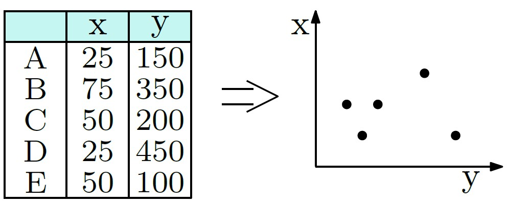
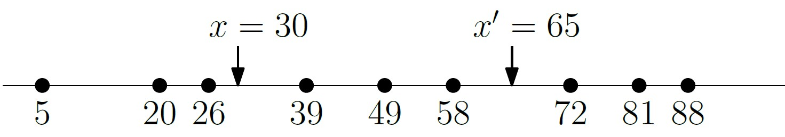
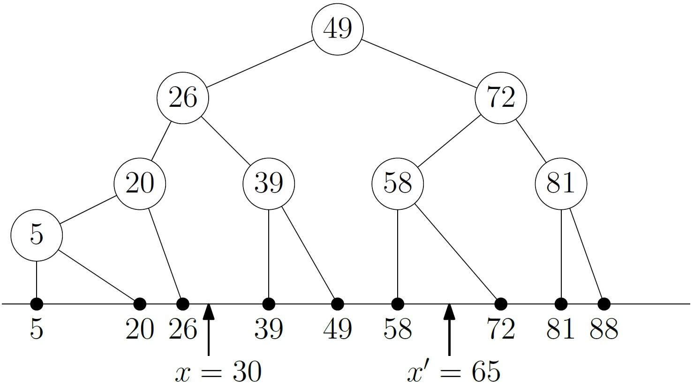
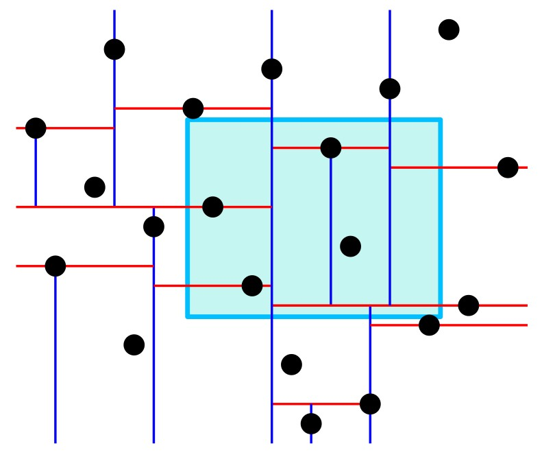
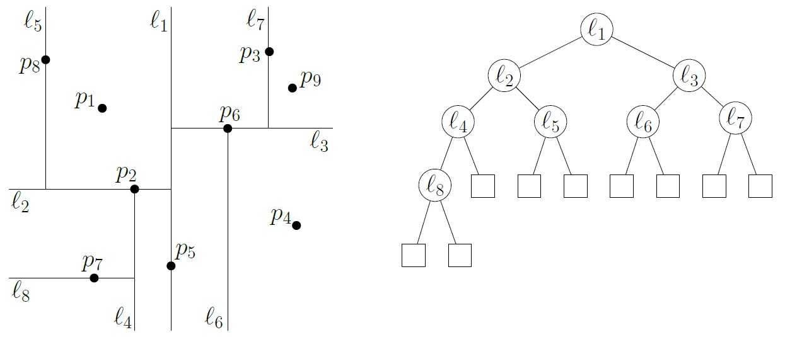
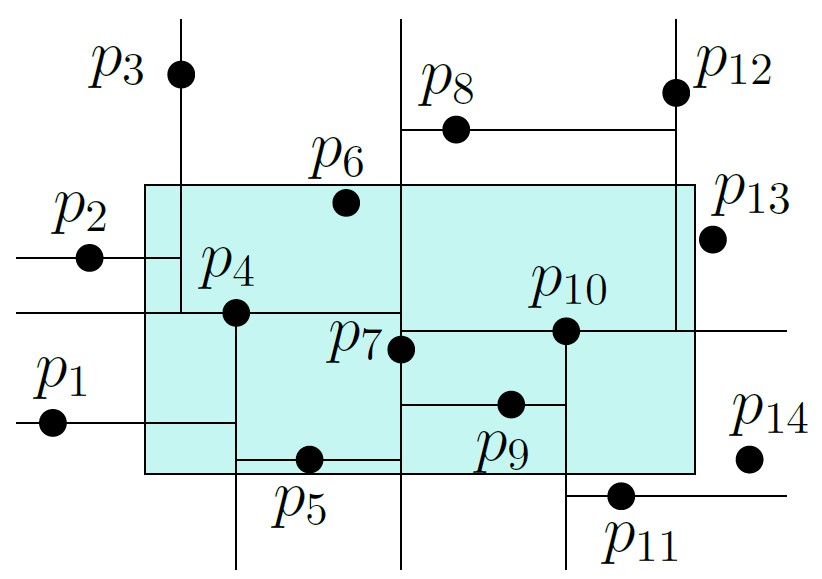
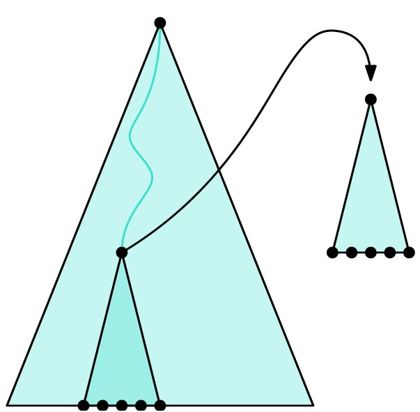

# חיפוש בתחומים אורתוגונלים {#orthogonal-range-seach}

## הקדמה {#preface}

### חיפוש במסדי נתונים {#data-bases}

 מסדי נתונים המאחסנים רשומות בצורה של טבלה הם כלי מרכזי לארגון מידע בישומים רבים. כפי שראינו בהקדמה לקורס, למרות שבמבט ראשון לא נראה שיש קשר בין מסדי נתונים כאלו לגאומטריה, הקשר הזה אכן קיים עבור סוגים מסויימים של שאילתות.

הייצוג הגאומטרי של מסד הנתונים יהיה באמצעות אוסף של נקודות במרחב ה-$d$ מימדי: כל רשומה תיוצג באמצעות נקודה במרחב, כאשר כל שדה של הרשומה מתאים לקואורדינטה. עבור שאילתה המבקשת את אוסף הרשומות הנמצאות בתחום מסויים של ערכים (בשדה אחד או יותר), הייצוג הגאומטרי יהיה תחום אורתוגונלי $R$, כלומר, תיבה $d$-מימדית מקבילה לצירים. במישור זהו מלבן שצלעותיו מקבילות לצירים, ובשלושה מימדים זוהי תיבה שפאותיה מקבילות לצירים.

בפרק זה נציג שני מבני נתונים לאחסון אוסף $P$ של נקודות במרחב ה-$d$ מימדי, כך שנוכל לענות ביעילות על שאילתות מהסוג הבא: בהינתן תחום אורתוגונלי $R$, אילו מהנקודות של $P$ נמצאות בתוך $R$?

#### קראו את ההקדמה לפרק 5 בספר הלימוד (עמודים 95־96). {.unnumbered}

### חיפוש בתחומים על הישר {#on-the-line}

בעיות רבות בגאומטריה חישובית נעשות פשוטות הרבה יותר כאשר הן נתונות במימד אחד, ובמחקר התאורטי מופיעים לעיתים קרובות פתרונות במימד אחד לבעיות מורכבות, כצעד מקדים לפתרונות במימדים גבוהים יותר. לכן, לפני שניגש לפתרון הבעיה של חיפוש בתחומים בשני מימדים או יותר, ננסה קודם להבין כיצד ניתן לפתור אותה עבור אוסף $P$ של נקודות ממימד אחד, כלומר, אוסף של נקודות שכולן על ישר אחד. שימו לב שהשאילתה על הישר היא פשוט טווח של ערכים, $R=[x,x']$.

{width="70%"}

אפשרות אחת לפתרון היא למיין את נקודות $P$ ולשמור אותן במערך. בהינתן טווח $[x,x']$, נמצא בעזרת חיפוש בינארי את הנקודות הראשונה במערך שגדולה או שווה ל-$x$, ואז נעבור על תאי המערך לפי הסדר החל מנקודה זו, ונדווח על נקודות כל עוד הן קטנות או שוות ל-$x'$. זמן השאילתה יהיה $O(\log n + k)$ כאשר $k$ הוא מספר הנקודות בפלט. זמן העיבוד המקדים הוא $O( n \log n)$ וסיבוכיות המקום היא $O(n)$. לפתרון המשתמש במערך יש שני חסרונות: הוא לא דינאמי (כלומר, לא ניתן לבצע הוספה או מחיקה של נקודות), ולא ניתן להכליל אותו למימדים גבוהים. לכן, פרק 5.1 של ספר הלימוד מתאר פתרון המשתמש בעץ חיפוש בינארי, שבו הנקודות מופיעות בעלים. כל קודקוד פנימי מכיל את הערך המקסימלי של עלה המופיע בתת העץ השמאלי שלו. בהינתן עץ חיפוש $T$ וטווח $[x,x']$, אלגוריתם השאילתה 1DRangeQuery מוצא את הקודקוד בו המסלולים מהשורש ל-$x$ ו-$x'$ מתפצלים, ואז מחזיר את כל הנקודות בעלים שנמצאים **מימין** להמשך המסלול ל-$x$, ואת הנקודות בעלים שנמצאים **משמאל** להמשך המסלול ל-$x'$. אלו בדיוק הערכים בעץ הנמצאים בין $x'$ ל-$x$.

{width="70%"}

בהמשך של יחידה זו, נראה שתי דרכים שונות להכללת פתרון זה עבור מימדים גבוהים.

#### קראו את סעיף 5.1 בספר הלימוד (עמודים 96--99). {.unnumbered}

------------------------------------------------------------------------

## חיפוש בתחומים במישור {#in-the-plane}

### עצי-kd {#kd-trees}

מבנה הנתונים הראשון שנראה עבור חיפוש בתחומים בשני מימדים, נקרא עץ-kd. העץ הזה הוא הכללה של עץ החיפוש שראינו עבור נקודות במימד אחד, שבו משנים בכל רמה של העץ את הקואורדינטה שלפיה בוחרים את החציון.

#### צפו בסרטון הבא: {.unnumbered}

<iframe width="560" height="315" src="https://www.youtube.com/embed/17b7i-OTVO8" title="YouTube video player" frameborder="0" allow="accelerometer; autoplay; clipboard-write; encrypted-media; gyroscope; picture-in-picture; web-share" allowfullscreen>

</iframe>

ניתן לבנות עץ-kd עבור אוסף של $n$ נקודות בזמן $O(n\log n)$. סיבוכיות המקום שלו היא $O(n)$, וזמן השאילתה הוא $O(\sqrt{n}+ k)$, כאשר$k$ הוא גודל הפלט, כלומר מספר הנקודות הנמצאות בתחום הנתון. בסעיף 5.2 מתואר האלגוריתם BuildKdTree שבונה את העץ, ואלגוריתם השאילתה SearchKdTree. קראו בעיון את ניתוח זמן הבניה, סיבוכיות המקום, וזמן השאילתה של עץ ה-kd.

#### קראו את סעיף 5.2 בספר (עמודים 99--105). {.unnumbered}

::: rmdwarning
 זמן הריצה של האלגוריתם הראשון שמתואר בסרטון ומשתמש בשיטת הישר הסורק, הואהתבוננו בקבוצת הנקודות הבאה, והשלימו את עץ ה-kd.

{width="80%"}

(פתרון)

(TODO)

:::

::: rmdwarning
 התבוננו בחלוקה שנוצרה עבור עץ ה-kd והתחום המלבני שבאיור, וענו על השאלות הבאות:

{width="60%"}

1.  אילו מהנקודות יבדקו (אך לא בהכרח ידווחו) בשורה 2 של אלגוריתם SearchKdTree?
2.  אלו מהנקודות ידווחו על ידי הפרוצדורה ReportSubtree?

(פתרון)

(TODO)

:::

#### תחומים שאינם מלבניים. {.unnumbered}

שימו לב שניתן להכליל את אלגוריתם השאילתה גם עבור תחומים שאינם מלבניים. על מנת שהאלגוריתם יהיה יעיל עבור תחום $R$ שאינו מלבני, התחום חייב להיות מתואר בצורה שתאפשר את שתי הפעולות הבאות בזמן קבוע:

1.  לבדוק האם $R$ מכיל נקודה נתונה.
2.  לבדוק האם $R$ מכיל או נחתך עם תחום מלבני המתאים לצומת כלשהו.

אם $R$ הוא מצולע קמור בעל $c$ צלעות, כיצד נוכל לבצע את הפעולות האלו? ומה יהיה זמן הריצה? מה אם $R$ הוא עיגול הנתון על ידי המרכז והרדיוס שלו?

### עצי תחומים (Range Trees) {#range-trees}

 בחלק זה נראה מבנה נתונים אחר לחיפוש בתחומים במישור הנקרא עץ תחומים, range tree. גם הוא הכללה של עץ החיפוש שראינו עבור נקודות על הישר, אך באופן שונה: כאן כל קודקוד פנימי בעץ הממיין את הנקודות לפי קואורדינטת ה-$x$, יכיל מצביע לעץ נוסף הממיין את העלים בתת העץ שלו לפי קואורדינטת ה-$y$.

#### צפו בסרטון הבא: {.unnumbered}

<iframe width="560" height="315" src="https://www.youtube.com/embed/Aiy7igqoQCQ?si=EmDfmC6mkx1-Vcnb" title="YouTube video player" frameborder="0" allow="accelerometer; autoplay; clipboard-write; encrypted-media; gyroscope; picture-in-picture; web-share" allowfullscreen></iframe>

מבחינת זמן השאילתה, במקרה הגרוע עץ תחומים יעיל הרבה יותר מעץ-kd - זמן השאילתה שלו הוא $O( \log^2 n + k)$ בלבד, לעומת $O( \sqrt{n}+k)$ בעצי-kd. השיפור הזה מאלץ אותנו לשלם מעט בסיבוכיות המקום -- $O( n \log n)$ לעומת $O( n)$. בסעיף 5.3 של ספר הלימוד מתואר האלגוריתם Build2DRangeTree שבונה את העץ, ואלגוריתם השאילתה 2DRangeQuery. קראו בעיון את ניתוח זמן הבניה, סיבוכיות המקום, וזמן השאילתה של עץ תחומים.

#### קראו את סעיף 5.3 בספר (עמודים 105--109). {.unnumbered}

#### שיפור זמן השאילתה. {.unnumbered}

ניתן לשפר את זמן השאילתה של עץ התחומים בפקטור של $\log n$, בעזרת שיטה הנקראת Fractional Cascading . זוהי שיטה מתקדמת שאינה חלק מחומר הקורס, והיא מתוארת בפרק 5.6 של הספר.

------------------------------------------------------------------------

## הרחבות {#extensions}

### מימדים גבוהים {#higher-dim}

בשתי הפסקאות האחרונות של סעיף 5.2 בספר הלימוד מתוארת בקצרה הבנייה של עצי-kd במימד $d>2$. עבור $d$ קבוע, זמן הבניה נשאר $O( n \log n)$ וסיבוכיות הזיכרון נשארת $O( n)$. זמן השאילתה לעומת זאת הוא $O( n^{1-\frac{1}{d}}+k)$, והוא מתקרב ל-$O( n)$ ככל ש-$d$ גדל. בפרק 5.4 מתוארת הרחבה של עצי תחומים למימד $d>2$. כאן זמן העיבוד המקדים וסיבוכיות המקום הם $O( n \log^{d-1} n)$, וזמן השאילתה הוא $O( \log^d n +k)$.

#### קראו את סעיף 5.4 בספר (עמודים 109--110). {.unnumbered}

### אוסף נקודות כללי {#general-pos}

בפרקים 5.1־5.3 של ספר הלימוד אנו מניחים שאין באוסף הנתון שתי נקודות בעלות אותה קואורדינטת $x$ או אותה קואורדינטת $y$. זוהי הנחה שאינה מתיישבת עם המציאות, מכיוון ששדות בטבלה עשויים לייצג ערכים בעלי מספר קטן של אפשרויות, כמו גיל או תאריך, ולכן סביר שיהיו המון נקודות בעלות ערכים זהים באותה קואורדינטה. למרבה המזל, הכללת מבני הנתונים שראינו עבור קלט כללי היא לא משימה קשה, וניתן לעשות זאת על ידי בחירה של סדר לקסיגורפי מסוים על הנקודות. תוכלו לקרוא על כך בפרק 5.5 של ספר הלימוד.

#### קראו את סעיף 5.5 בספר (עמודים 110--111). {.unnumbered}
