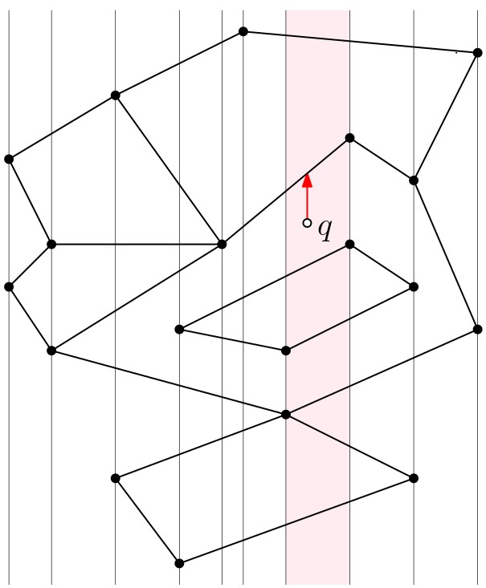
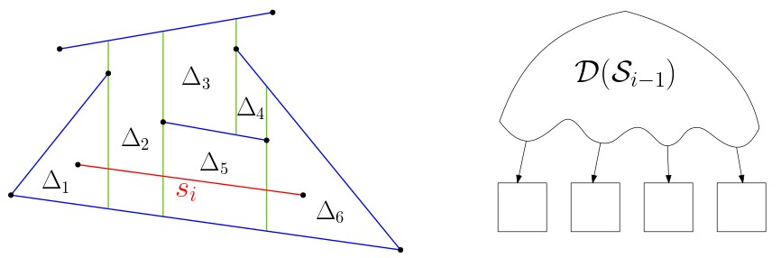
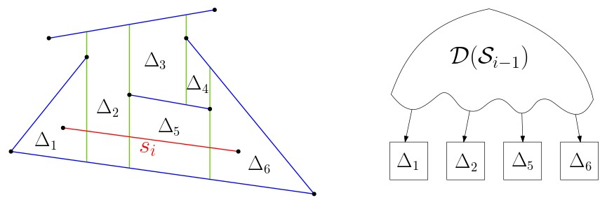
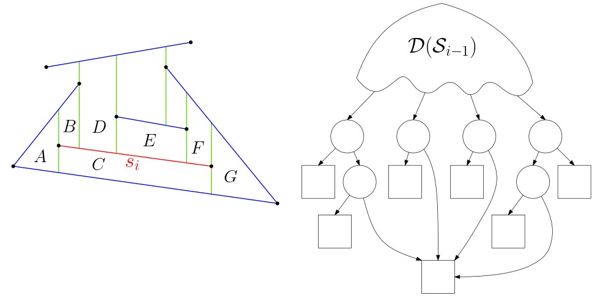
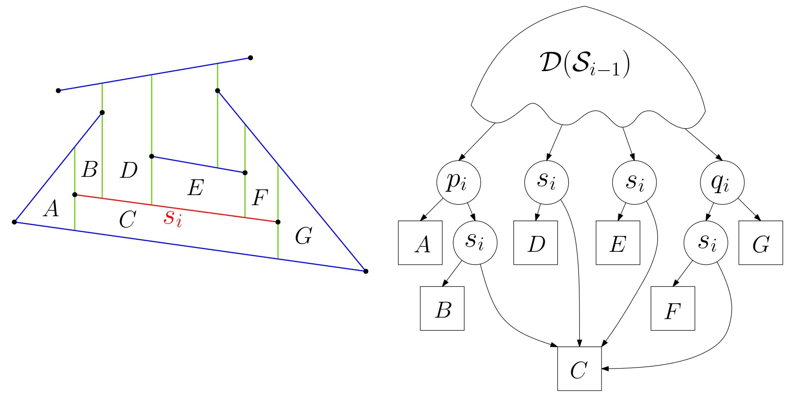

# מיקום נקודה ומפה טרפזית {#point-location}

## הקדמה {#preface-6}

### מה ביחידה? {#contents-6}
יחידה זו מקבילה לפרק השישי בספר הלימוד. 

המושגים והרעיונות העיקריים שילמדו ביחידה:

- בעיית מיקום נקודה במפה מישורית.
- מפה טרפזית.
- בניית מבנה נתונים לשאילתות מיקום נקודה בעזרת אלגוריתם אינקרמנטלי-רנדומי.

למידה מהנה!

### מיקום נקודה במפה {#point-on-map}

 מפה המתארת חלוקה למדינות, כמו מפת ארצות הברית המופיעה כאן משמאל, היא בעצם גרף מישורי המתואר באמצעות צלעות, פאות, וקודקודים. כל מדינה או איזור במפה מתאים לפאה של הגרף. ביחידה הזו נעסוק בבעיה הבסיסית הבאה: בהינתן הקואורדינטות של נקודה כלשהי על המפה, לאיזו מדינה היא שייכת?

#### קראו את ההקדמה לפרק 6 בספר הלימוד (עמודים 121־122). {.unnumbered}

------------------------------------------------------------------------

## מפה טרפזית {#trapezoidal-map}

### פתרון נאיבי: חלוקה לרצועות {#naive-sol}

תהי $\mathcal{S}$ מפה מישורית, כפי שהגדרנו ביחידה 2 של הקורס: $\mathcal{S}$ היא שיכון של גרף מישורי במישור, כך שכל הצלעות שלו הן קטעים ישרים. נרצה לבנות מבנה נתונים שיענה על שאילתות מהסוג הבא: בהינתן נקודה $q$ במישור, מצא את הפאה בה $q$ נמצאת.

 שימו לב שכדי למצוא את הפאה בה $q$ נמצאת, מספיק לבדוק (למשל) איזו צלע של $\mathcal{S}$ הנקודה $q$ "רואה" מעליה. לכן, בחלק הראשון של סעיף 6.1 בספר הלימוד מתואר פתרון נאיבי ופשוט לבעיה, על ידי חלוקה של המפה לרצועות (slabs): נעביר ישר אנכי דרך כל אחד מהקודקודים של $\mathcal{S}$. האיזור שנמצא בין שני ישרים עוקבים כאלו הוא רצועה אנכית. בהינתן שמספר הקודקודים במפה $\mathcal{S}$ הוא n, ניתן למצוא את הרצועה שבה נמצאת נקודה נתונה $q$ בזמן $O (\log n )$ על ידי חיפוש בינארי. כל רצועה "נחתכת" על ידי לכל היותר $n$ צלעות של $\mathcal{S}$. הצלעות כמובן אינן נחתכות זו עם זו, ואין קודקודים של $\mathcal{S}$ בתוך הרצועה. לכן, נוכל לשמור את רשימת הצלעות האלו בסדר ממויין, ואז למצוא את הצלע שהנקודה $q$ "רואה" מעליה על ידי חיפוש בינארי, כלומר שוב $O (\log n )$.

בדרך זו, זמן השאילתה שנקבל הוא $O (\log n )$, אך מהו גודל המבנה וזמן העיבוד המקדים? באיור למטה ניתן לראות דוגמה למקרה בו גודל המבנה יהיה $\Theta ( n^2 )$ (מדוע?).

{width="60%"}

#### קראו את חלקו הראשון של סעיף 6.1 בספר הלימוד (עמודים 122--124). {.unnumbered}

### פירוק לטרפזים

שימו לב שהחלוקה לרצועות שראינו בעמוד הקודם יוצרת מפה מישורית $\mathcal{S'}$ שבה כל פאה היא טרפז או משולש (או פאה אינסופית דמויית טרפז/משולש). המפה $\mathcal{S'}$ היא עידון (refinement) של המפה המקורית $\mathcal{S}$, כלומר, כל פאה של $\mathcal{S'}$ מוכלת לחלוטין בפאה של $\mathcal{S}$, ולכן אם מצאנו שנקודת השאילתה נמצאת בפאה מסויימת של $\mathcal{S'}$, נוכל לדעת לאיזו פאה של $\mathcal{S}$ היא שייכת. העידון בעזרת חלוקה לרצועות מוביל למבנה נתונים בגודל ריבועי (במקרה הגרוע), ולכן אינו מעשי. בחלק זה נראה עידון אחר שסיבוכיות הזיכרון שלו לא תהיה גדולה בהרבה מזו של $\mathcal{S}$, ועדיין יאפשר לנו לענות על שאילתות מיקום נקודה בקלות יחסית.

#### צפו בסרטון הבא: {.unnumbered}

<iframe width="560" height="315" src="https://www.youtube.com/embed/1ISWNiNI05c?si=DrbWnrZYTK0YMDu8" title="YouTube video player" frameborder="0" allow="accelerometer; autoplay; clipboard-write; encrypted-media; gyroscope; picture-in-picture; web-share" allowfullscreen>

</iframe>

::: rmdwarning
 מי ה-$leftp$ של כל אחד מהטרפזים המסומנים באיור?

{width="80%"}

(פתרון)

(TODO)

{width="80%"}

:::

#### הנחת מצב כללי. {.unnumbered}

בשיטת הפירוק לטרפזים אנחנו מניחים שבאוסף הקטעים הנתון אין שתי נקודות קצה בעלות אותה קואורדינטת $x$. הנחה זו אינה ריאלית, אך כפי שכבר ראינו בעבר, קיימות מספר שיטות המאפשרות לנו לטפל במצב לא כללי - למשל על ידי סיבוב המישור, או קביעת סדר לקסיקוגרפי. הדיון בפתרונות אלו עבור המבנה של מפת טרפזים מופיע בפרק 6.3 בספר הלימוד.

::: rmdwarning
 במצב לא כללי, כמה טרפזים שכנים יש (לכל היותר) לטרפז במפה הטרפזית?

(פתרון)

$\Theta(n)$

:::

#### לחזרה: קראו את חלקו השני של סעיף 6.1 בספר (עמודים 124--128). {.unnumbered}

------------------------------------------------------------------------

## שאילתות מיקום נקודה {#point-location-queries}

### מבנה הנתונים {#the-data-structure}

יהי $\mathcal{S}$ אוסף של $n$ קטעים במצב כללי שאינם נחתכים.

ניתן לבנות את המפה הטרפזית $\mathcal{T}(\mathcal{S})$ בקלות יחסית על ידי שימוש בשיטת הישר הסורק (חישבו, כיצד?). הבעיה היא, שבשיטה זו לא נוכל לבנות מבנה נתונים התומך בשאילתות מיקום נקודה, שהוא המטרה המרכזית שלנו ביחידה זו. איך יראה מבנה נתונים כזה?

בחלק זה נתאר את מבנה החיפוש $\mathcal{D}$ שיאפשר לנו לבצע שאילתות מיקום נקודה במפה הטרפזית $\mathcal{D}$. בהמשך, נראה אלגוריתם אינקרמטלי-רנדומי שבונה את המפה הטרפזית $\mathcal{T}(\mathcal{S})$ ומבנה הנתונים $\mathcal{D}$ גם יחד.

מבנה הנתונים $\mathcal{D}$ יהיה גרף מכוון חסר מעגלים (DAG), עם שלושה סוגים של צמתים:

-   צומת (פנימי) x - מתאים לנקודת קצה של קטע מ-$\mathcal{S}$ (מסומן בעיגול לבן).
-   צומת (פנימי) y - מתאים לקטע מ-$\mathcal{S}$ (מסומן בעיגול אפור).
-   עלה - מתאים לטרפז במפה $\mathcal{T}(\mathcal{S})$ (מסומן בריבוע).

בנוסף, לגרף יש שורש יחיד, ובדיוק עלה אחד לכל טרפז במפה $\mathcal{D}$. באיור למשל, לעלה של טרפז C יש מצביעים משני קודקודים פנימיים.

הרעיון בבנייה זו דומה לעצי-kd שראינו ביחידה 5: לכל צומת פנימי, ההסתעפות ימינה או שמאלה תלויה בתשובה לשאלה המתאימה לסוג הצומת.

{width="100%"}

בהינתן נקודת שאילתה q, נתחיל את החיפוש מהשורש עד שנגיע לעלה:

-   אם הגענו לצומת-$x$ המתאים לנקודת קצה $p$, נשאל: "האם $q$ מימין או משמאל לישר האנכי שעובר דרךp?". אם התשובה היא "מימין" - נמשיך ימינה, אחרת שמאלה.
-   אם הגענו לצומת-$y$ המתאים לקטע $s$, נשאל: "האם $q$ מעל או מתחת לקטע $s$?". אם התשובה היא "מתחת" - נמשיך ימינה, אחרת שמאלה. שימו לב שכדי שהשאלה הזו תהיה הגיונית, נצטרך להבטיח שבשלב זה הישר האנכי שעובר דרך $q$ חותך את $s$.

כשנגיע לעלה, נבדוק האם הטרפז המתאים לו מכיל אתq.

::: rmdwarning
 בדקו את עצמכם! ענו על השאלות הבאות. נתון מבנה החיפוש הבא.

{width="70%"}

ידוע שנקודת שאילתה נמצאת:

-   מימין לישר האנכי העובר בנקודה $p_1$.
-   משמאל לישר האנכי העובר בנקודה $q_1$.
-   מתחת לקטע $s_1$.

באילו מהטרפזים יתכן שהנקודה נמצאת?

אם בנוסף ידוע שהנקודה נמצאת:

-   משמאל לישר האנכי העובר בנקודה $q_2$.
-   מעל לקטע $s_2$.

באילו מהטרפזים יתכן שהנקודה נמצאת?

(פתרון)

TODO

:::

### אלגוריתם אינקרמנטלי רנדומי {#rand-inc-alg}

בחלק זה נתאר אלגוריתם אינקרמנטלי לבניית מבנה החיפוש $\mathcal{D}$ והמפה הטרפזית $\mathcal{T}(\mathcal{S})$ גם יחד. האלגוריתם מוסיף את הקטעים מהאוסף $\mathcal{S}$ אחד אחרי השני בסדר רנדומי, ובכל פעם מעדכן את מבנה החיפוש והמפה בהתאם לקטע החדש שנוסף.

הסיבה לכך שנבחר סדר רנדומי על הקטעים היא שבאופן זה נוכל לצפות לזמני ריצה וסיבוכיות מקום יעילים, בדומה לאלגוריתם האינקרמנטלי-רנדומי לתכנון לינארי במישור שראינו ביחידה 4 של הקורס. נדון בכך בעמוד הבא של חלק זה.

#### צפו בסרטון הבא: {.unnumbered}

<iframe width="560" height="315" src="https://www.youtube.com/embed/3_6Uu1jYBcA?si=dgWhrulyuSIfHmhd" title="YouTube video player" frameborder="0" allow="accelerometer; autoplay; clipboard-write; encrypted-media; gyroscope; picture-in-picture; web-share" allowfullscreen>

</iframe>

#### קראו את חלקו הראשון של סעיף 6.2 בספר (עמודים 128--133). {.unnumbered}

::: rmdwarning
 התבוננו באיור הבא:

{width="100%"}

מי הם הטרפזים שהאלגוריתם ימצא ויעדכן כאשר נוסיף את s_i?

(פתרון)

{width="100%"}

:::

::: rmdwarning
 התבוננו באיור הבא, והשלימו את מבנה החיפוש.

{width="100%"}

(פתרון)

{width="100%"}

:::

### ניתוח האלגוריתם {#alg-analysis}

הסדר בו האלגוריתם TrapezoidalMap מוסיף את הקטעים משפיע מאוד על גודל מבנה החיפוש $\mathcal{D}$ ועל זמן השאילתה. למעשה, יתכן סידור שבו האלגוריתם ירוץ בזמן ריבועי, סיבוכיות הזיכרון של $\mathcal{D}$ תהיה ריבועית, וזמן השאילתה יהיה לינארי. לכן, בדומה לאלגוריתם האינקרמנטלי-רנדומי לתכנון לינארי במישור שראינו ביחידה 4 של הקורס, גם כאן האלגוריתם מגריל את סדר הוספת הקטעים מראש, ונוכל להראות שבתוחלת יתקבל מבנה חיפוש עם סיבוכיות זיכרון לינארית, ותוחלת זמן השאילתה תהיה $O (\log n )$.

::: rmdwarning
 מהו המקרה הגרוע ביותר? נסו לתאר דוגמה לאוסף של $n$ קטעים וסידור שלהם, כך שהאלגוריתם האינקרמנטלי (הלא רנדומי) ירוץ בזמן $O ( n^2 )$.
:::

#### רעיון ההוכחה (זמן השאילתה). {.unnumbered}

תהי $q$ נקודת שאילתה. נרצה להעריך את תוחלת אורך המסלול שנעבור במבנה $\mathcal{D}$ כאשר נחפש את הטרפז שמכיל את $q$ (מספר הצמתים מהשורש לטרפז). לשם כך, ננסה להבין כיצד משתנה המסלול במהלך ריצת אלגוריתם הבנייה של $\mathcal{D}$.

למשל, ניתן להראות שבכל פעם שקטע חדש נוסף למבנה, אורך המסלול יגדל בלכל היותר 3 צמתים. לפיכך ניתן לומר שאורך המסלול הוא לכל היותר . זהו חסם עבור המקרה הגרוע, אך אנו מעוניינים במקרה הממוצע (על פני כל $n!$ הסידורים האפשריים), ולכן ננסה לחשב את ממוצע מספר הצמתים שנוספו למסלול בכל איטרציה של האלגוריתם.

נסמן ב-$X_i$ (עבור $1 \le i \le n$) את מספר הצמתים על המסלול שנוספו באיטרציה ה-$i$ (כלומר, לאחר הוספת הקטע $s_i$). כלומר, $X_i$ הוא משתנה מקרי התלוי בסדר הוספת הקטעים, ולכן תוחלת אורך המסלול אל הטרפז המכיל את $q$ היא $E[ \sum_{i=1}^{n} X_i ]$ ומלינאריות התוחלת $\sum_{i=1}^{n} E[X_i]$.

מכיוון שבכל איטרציה נוספים לכל היותר 3 צמתים למסלול, מתקיים $X_i \le 3$. לכן, אם נסמן ב-$P_i$ את ההסתברות לכך שקיים צומת במסלול שנוצר באיטרציה ה-$i$, נקבל $E[ X_i ] \le 3 P_i$.

האבחנה המרכזית בהוכחה היא שבאינטרציה ה-$i$ נוסף קודקוד למסלול שלנו רק אם הטרפז שמכיל את $q$ בדיוק לפני הוספת $s_i$ שונה מהטרפז המכיל את $q$ מיד לאחר הוספת $s_i$. לכן, בדומה להוכחה שראינו ביחידה 4, נוכל לנתח את ההסתברות לכך שהטרפז המכיל את $q$ משתנה בין האיטרציה ה-$i - 1$ לאיטרציה ה-$i$ בשיטת הניתוח לאחור (backward analysis). כלומר, נסתכל על המפה שהתקבלה מיד לאחר הוספת $s_i$, ונשאל מה ההסתברות לכך שהטרפז $\Delta$ המכיל את $q$ במפה זו יעלם אם נוציא את $s_i$. שימו לב שהטרפז $\Delta$ יעלם אם ורק אם אחד מהשדות המגדירים אותו ($top(\Delta)$ , $bottom(\Delta)$ , $leftp(\Delta)$ , $rightp(\Delta)$) יעלם. ההסתברות לכך ש-$s_i$ הוא הקטע שמגדיר את $top(\Delta)$ למשל, היא 1 over i, ובאופן דומה ניתן לחשב זאת עבור $bottom(\Delta)$, $leftp(\Delta)$ , $rightp(\Delta)$. לכן, נקבל $P_i \le \frac{4}{i}$, ונוכל לחשב שתוחלת אורך המסלול היא $O (\log n )$.

#### קראו את חלקו השני של סעיף 6.2 בספר (עמודים 133--137). {.unnumbered}
