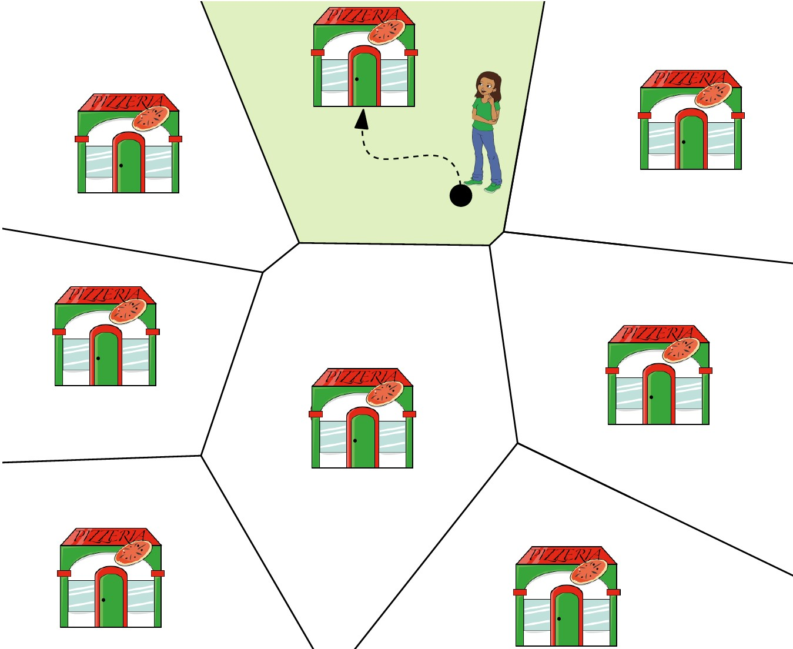

# דיאגרמת וורונוי {#voronoi}

## הקדמה {#preface-7}

### מה ביחידה? {#contents-7}
יחידה זו מקבילה לפרק השביעי בספר הלימוד. 

המושגים והרעיונות העיקריים שילמדו ביחידה:

- בעיית השכן הקרוב ביותר.
- דיאגרמת וורונוי ותכונותיה.
- חישוב דיאגרמת וורונוי בעזרת אלגוריתם סורק.
- הכללות והרחבות של דיאגרמת וורונוי.

למידה מהנה!

### בעיית השכן הקרוב ביותר (או: בעיית מיקום הסניפים) {#nns}

נתון אוסף של מיקומי סניפים (נקודות במישור), ונניח שהלקוחות בוחרים להגיע לסניף הקרוב ביותר אליהם (לפי מרחק אוקלידי). לאיזה סניף יגיע כל לקוח? מהו הסניף הרווחי ביותר? היכן כדאי לנו למקם סניף נוסף כך שיהיה רווחי? דיאגרמת וורונוי (Voronoi diagram) היא מבנה גאומטרי בסיסי וחשוב ביותר, בעזרתו נוכל לענות על שאלות אלו, ועוד. זוהי בעצם חלוקה של המישור לתאים, תא אחד לכל סניף (נקודה במישור), כך שכל תא מכיל בדיוק את אוסף הנקודות במישור הקרובות לסניף שלו יותר מאשר לכל אחד מהסניפים האחרים.

#### קראו את ההקדמה לפרק 7 בספר הלימוד (עמודים 147־148). {.unnumbered}

------------------------------------------------------------------------

## הגדרה ותכונות בסיסיות {#basic-prop}

### מהי דיאגרמת וורונוי? {#Voronoi-vid}
בסרטון הבא נגדיר את דיאגרמת וורונוי באופן פורמלי, ונתאר מספר תכונות שלה. בסעיפים הבאים של חלק זה תוכלו למצוא את כל ההגדרות, האבחנות, והמשפטים המופיעים בסרטון, כך שתוכלו לחזור אליהם בעת הצורך.

#### צפו בסרטון הבא. {.unnumbered}

<iframe width="560" height="315" src="https://www.youtube.com/embed/Ofp5zWt8nTc?si=F0XW4UQFPIZZn5Os" title="YouTube video player" frameborder="0" allow="accelerometer; autoplay; clipboard-write; encrypted-media; gyroscope; picture-in-picture; web-share" allowfullscreen></iframe>

::: rmdnote

**מעניין לדעת**: לדיאגרמת וורונוי יש שימושים רבים ומגוונים, ופרט לתחום החברתי-כלכלי (שהוזכר בהקדמה) ניתן למצוא אותה בתחומים כמו גרפיקה ממוחשבת, רובוטיקה, פיזיקה, וביולוגיה, וכן במגוון צורות בטבע, כפי שניתן לראות למשל בתמונות הבאות (מתוך המאמר <a href="https://www.sciencedirect.com/science/article/abs/pii/S0167732221012770">הזה</a>).

{width="80%"}

:::

### הגדרות {#def}
תהי $P=(p_1,\dots,p_n)$ קבוצה של $n$ נקודות במישור.

::: rmdimportant

[**הגדרה**: דיאגרמת וורונוי]{.underline}\
דיאגרמת וורונוי של הקבוצה $P$ היא חלוקה של המישור ל-$n$ תאים, אחד לכל נקודה של $P$, כך שנקודה $q$ שייכת לתא שמתאים לנקודה $p_i$ אם ורק אם $\|p_i-q\|<\|p_j-q\|$ לכל $p_j\in P$, $j\neq i$.
:::

{width="70%"}

נסמן ב-$\text{Vor(P)}$ את דיאגרמת וורונוי של הקבוצה $P$, ועבור נקודה $p_i\in P$ נסמן ב-$\mathcal{V}(p_i)$ את התא בדיאגרמה המתאים ל-$p_i$.

נניח שנתונות לנו שתי נקודות בלבד, $p_1,p_2$. כיצד תראה הדיאגרמה במקרה זה?

::: rmdimportant

[**הגדרה**: bisector]{.underline}\
עבור שתי נקודות $p_1$ ו-$p_2$, האנך האמצעי לקטע $\overline{p_1p_2}$ נקרא ה-bisector של $p_1$ ו-$p_2$. 
:::

שימו לב שכל נקודה שנמצאת על ה-bisector היא במרחק שווה מ-$p_1$ ו-$p_2$ (חישבו, מדוע?).

ה-bisector של $p_1$ ו-$p_2$ מחלק את המישור לשני חצאי מישור. נסמן ב-$h(p_1,p_2)$ את חצי המישור הפתוח שמכיל את $p_1$. כל נקודה הנמצאת ב-$h(p_1,p_2)$, קרובה יותר ל-$p_1$ מאשר ל-$p_2$.

### תכונות הדיאגרמה {#prop}

#### כיצד נראה תא וורונוי? {.unnumbered}

האבחנות שראינו למעלה מובילות אותנו לאבחנה הבאה לגבי המבנה של תא בדיאגרמת וורונוי:

::: rmdimportant

[**אבחנה**:]{.underline} תא וורונוי $\mathcal{V}(p_i)$ מתקבל על ידי חיתוך של $n-1$ חצאי מישורים, ולכן הוא פוליגון קמור (יתכן שאינו חסום) בעל לכל היותר $n-1$ קודקודים ו-$n-1$ צלעות.

{width="30%"}

:::

#### כיצד נראית הדיאגרמה כולה? {.unnumbered}

מכיוון שכל תא בדיאגרמה הוא חיתוך של חצאי מישורים, דיאגרמת וורונוי תהיה חלוקה של המישור שהצלעות שלה הן ישרים, חצאי ישרים, או קטעים. צלעות שהן ישרים (כלומר כאלו שאינן חסומות משני הצדדים) יתקבלו רק במקרה בו כל הנקודות נמצאות על ישר אחד. בספר תראו את ההוכחה המלאה למשפט הבא: 

::: rmdimportant 

[**משפט**:]{.underline} אם כל נקודות $P$ נמצאות על ישר אחד אז $\text{Vor(P)}$ מורכבת מ-$n-1$ ישרים מקבילים. אחרת, $\text{Vor(P)}$ קשירה, והצלעות שלה הן קטעים או חצאי ישרים (קרניים). 

{width="100%"}

:::

#### סיבוכיות הדיאגרמה. {.unnumbered}

שימו לב שהסיבוכיות של תא בודד בדיאגרמה עשויה להיות $\Theta(n)$, כמו למשל באיור הבא.

{width="30%"}

מה הסיבוכיות של כל הדיאגרמה? על ידי שימוש ב[נוסחת אוילר](#euiler), והעובדה שהדרגה המינימלית של קודקוד בדיאגרמה היא 3, ניתן להוכיח שהסיבוכיות של $\text{Vor}(P)$ היא $O(n)$ (ההוכחה המלאה מופיעה בספר הלימוד).

::: rmdimportant 

[**משפט**:]{.underline} הסיבוכיות של $\text{Vor(P)}$ היא $O(n)$. 
:::

#### תכונת המעגל הריק. {.unnumbered}

תכונת המעגל הריק מאפשרת לנו להבין טוב יותר מיהם האנכים האמצעיים שנקודת החיתוך ביניהם היא קודקוד של הדיאגרמה. עבור נקודה $q$, נגדיר את $C_P(q)$ להיות המעגל הגדול ביותר שמרכזו ב-$q$ והוא ריק (בפנימו) מנקודות $P$. המשפט הבא הוא אפיון חשוב של דיאגרמת וורונוי, שיאפשר לנו בהמשך לבנות אותה ביעילות. ההוכחה המלאה מופיעה כמובן בספר הלימוד.

::: rmdimportant

[**משפט**:]{.underline}

1.  נקודה $q$ היא **קודקוד** של $\text{Vor(P)}$ אם ורק אם $C_P(q)$ מכיל לפחות שלוש נקודות של $P$ על שפתו.
2.  ה-bisector של $p_i$ ו-$p_j$ מגדיר **צלע** של $\text{Vor(P)}$ אם ורק אם קיימת נקודה $q$ על ה-bisector כך ש-$C_P(q)$ מכיל את $p_i$ ו-$p_j$ על שפתו, ואינו מכיל אף נקודה אחרת של $P$ על שפתו.
:::

::: rmdtip

[דוגמה:\
]{.underline}
באיור הבא, הנקודות הירוקות $q_1$ ו-$q_3$ הן קודקודים של הדיאגרמה $\text{Vor(P)}$: המעגל $C_P(q_1)$ מכיל 4 נקודות של $P$ על שפתו, והמעגל $C_p(q_3)$ מכיל 3 נקודות של $P$ על שפתו. 
הנקודה האדומה $q_2$ נמצאת על ה-bisector של $p_i$ ו-$p_j$, והמעגל $C_P(q_2)$ מכיל את $p_i$ ו-$p_j$ על שפתו, ואינו מכיל אף נקודה אחרת של $P$ על שפתו. לכן ה-bisector של $p_i$ ו-$p_j$ מגדיר צלע של $\text{Vor(P)}$.

{width="100%"}

:::

::: rmdwarning
 לפני שתעברו לחלק הבא, נסו לחשוב בעצמכם על אלגוריתם פשוט לבניית דיאגרמת וורונוי.

(רמז)

ניתן להשתמש באבחנה לגבי המבנה של תא וורונוי. התשובה מופיעה בתחילת הסעיף הבא.

:::

#### קראו את סעיף 7.1 בספר הלימוד (עמודים 148־151). {.unnumbered}

------------------------------------------------------------------------

## חישוב הדיאגרמה {#computing-VD}

### סריקת קו החוף {#beach-line}

האבחנה שראינו בחלק הקודם לגבי המבנה של תא וורונוי מובילה לאלגוריתם פשוט למדי לחישוב הדיאגרמה. נוכל לחשב לכל אתר $p_i$ את החיתוך של חצאי המישורים $h(p_i,p_j)$ לכל $j\neq i$ בעזרת האלגוריתם שראינו בפרק 4, וכך נקבל את התא המתאים ל-$p_i$. כך החישוב של כל תא יהיה בזמן $O(n\log n)$, וסך כל זמן הריצה יהיה $O(n^2 \log n)$. האם ניתן להשיג זמן טוב יותר? אחרי הכל, הסיבוכיות של דיאגרמת וורונוי היא לינארית....
בסרטון הבא נתאר רעיון לחישוב דיאגרמת וורונוי בעזרת אלגוריתם סורק.

#### צפו בסרטון הבא. {.unnumbered}

<iframe width="560" height="315" src="https://www.youtube.com/embed/T4QqrteIy7s?si=CclpxQG3dWJzMQ55" title="YouTube video player" frameborder="0" allow="accelerometer; autoplay; clipboard-write; encrypted-media; gyroscope; picture-in-picture; web-share" allowfullscreen></iframe>

#### הדגמה. {.unnumbered}
ביישומון הבא מאת [Philipp Kindermann](https://www.youtube.com/@PhilippKindermann), תוכלו לראות בעצמכם כיצד נראה קו החוף ביחס לדיאגרמה.
הזיזו את קו החוף מעלה ומטה, ושימו לב מתי נוספות קשתות חדשות, וכיצד נקודות החיבור בין הקשתות של קו החוף "משרטטות" את צלעות הדיאגרמה כאשר הישר הסורק מתקדם מטה.

<iframe src="https://www.desmos.com/calculator/dcdpn6w8ua?embed" width="100%" height="500" style="border: 1px solid #ccc" frameborder=0></iframe>

### האלגוריתם הסורק של Fortune {#Fortune-alg}
בסעיף 7.2 של ספר הלימוד מתואר בפירוט האלגוריתם הסורק של Fortune לבניית דיאגרמת וורונוי. זהו אלגוריתם בסיסי וחשוב ביותר בתחום הגאומטריה חישובית. זמן הריצה שלו הוא $O(n\log(n)$ בלבד, והוא אופטימלי. בקורס זה נדלג על הפרטים והמימוש של האלגוריתם, ונסתפק בתיאור הרעיון הכללי שראינו בסעיף הקודם, ובציטוט המשפט הבא:

::: rmdimportant 

[**משפט**:]{.underline} ניתן לחשב את דיאגרמת וורונוי של קבוצת נקודות בגודל $n$ בזמן $O(n\log(n)$. 
:::

#### הדגמה.  {.unnumbered}
הסרטון הבא (מאת Kevin Schaal) מציג אנימציה נהדרת הממחישה את אופן פעולת האלגוריתם:

<iframe width="560" height="315" src="https://www.youtube.com/embed/k2P9yWSMaXE" title="YouTube video player" frameborder="0" allow="accelerometer; autoplay; clipboard-write; encrypted-media; gyroscope; picture-in-picture; web-share" allowfullscreen></iframe>

#### למעוניינים בפרטי האלגוריתם, הוכחות מלאות, ואופן המימוש: קראו את סעיף 7.2 בספר הלימוד (עמודים 151־159). {.unnumbered}

------------------------------------------------------------------------

## הכללות והרחבות {#extensions}
### מֵעֵבֶר למישור האוקלידי {#beyond-Euclid}
בחלקים הקודמים הגדרנו את דיאגרמת וורונוי עבור אוסף של נקודות במישור תחת מטריקת $L_2$, כלומר, המרחק האוקלידי. זהו בעצם מקרה פשוט של רעיון הרבה יותר כללי ומופשט; באופן כללי, דיאגרמת וורונוי מתארת חלוקה של המרחב לתאים, לפי המרחק לאובייקטים מאוסף נתון. ראו למשל את <a href="https://en.wikipedia.org/wiki/Voronoi_diagram#Formal_definition">ההגדרה הפורמלית של דיאגמת וורונוי המופיעה בויקיפדיה</a> (עבור מרחבים מטריים).

הכללה אחת שניתן לעשות נוגעת ל**מרחב** שבו נמצאים האתרים. הדוגמה הפשוטה ביותר להכללה כזו היא עבור נקודות במימדים גבוהים מ-2. עבור נקודות ממימד $d$, הסיבוכיות של הדיאגרמה יכולה להגיע ל-$\Theta(n^{\lceil d/2\rceil})$, וניתן לחשב אותה בזמן $O(n\log n+n^{\lceil d/2\rceil})$.

הכללה אחרת נוגעת לפונקצית ה**מרחק**: במקום מרחק אוקלידי, נוכל להשתמש בפונקצית מרחק אחרת בין הנקודות. למשל, מרחק $L_1$ (שנקרא גם "מרחק מנהטן") בין שתי נקודות $p$ ו-$q$ מוגדר להיות 
$$\|p-q\|_1:=|p_x-q_x|+|p_y-q_y\|.$$
במקרה הזה כל צלעות הדיאגרמה יהיו אופקיות, אנכיות, או בעלות זוית של 45 מעלות בלבד.

הכללה נוספת של הדיאגרמה נוגעת לאתרים עצמם: במקום אוסף של נקודות, נוכל להגדיר את קבוצת האתרים להיות **אוסף של אובייקטים**, כלומר, אוסף של תתי קבוצות של נקודות מהמרחב. דוגמה אחת שמופיעה בספר לשימוש בהכללה הזו, היא כאשר האובייקטים האלו הם קטעים. המרחק בין נקודה $q$ לקטע $s$ מוגדר להיות המרחק (האוקלידי) בין $q$ לנקודה על $s$ שקרובה אליה ביותר. תוכלו לקרוא על כך בסעיף 7.3 של ספר הלימוד.

### הרחבות נוספות {#other-defs}
דיאגרמת וורונוי מוגדרת לפי המרחק לאתר הקרוב ביותר. ניתן להכליל את ההגדרה הזו במספר דרכים שונות, וגם כאן נזכיר בקצרה שתיים מהן.

#### דיאגרמת וורונוי ממושקלת  {.unnumbered}
כאן, בנוסף לאוסף האתרים $P=(p_1,\dots,p_n)$, נתון לנו גם אוסף של משקלים $W=(w_1,\dots,w_n)$, כך שמשקל המתאים ל-$p_i$ הוא $w_i$. השינוי בהגדרה של הדיאגרמה הוא בפונקציה המרחק: נקודה $q$ שייכת לתא שמתאים לנקודה $p_i$ אם ורק אם
 $\|p_i-q\|+w_i<\|p_j-q\|+w_j$ לכל $p_j\in P$, $j\neq i$.
שימו לב שאם כל המשקלים הם 0, אז מדובר בבעיה המקורית.

ניתן לחשוב על מספר סיטואציות מהעולם האמיתי בהן יש צורך בהוספת משקלים, למשל כאשר כל אתר מסמל מרכז קניות שלם, וכל מרכז קניות הוא אטרקטיבי במידה שונה. 

#### דיאגרמת וורונוי מסדר- k.  {.unnumbered}
עבור קבוצת אתרים $P=(p_1,\dots,p_n)$ ומספר $1\le k\le n-1$, דיאגרמת וורוני מסדר $k$ היא חלוקה של המישור לתאים, כך שכל תא מזוהה עם תת קבוצה בגודל $k$ של אתרים מ-$P$, ונקודה שייכת לתא המזוהה עם קבוצה 
$\{p_{i_1},\dots,p_{i_k}\}$ 
אם ורק אם אלו הם
 $k$ האתרים הקרובים אליה ביותר מבין כל האתרים ב-$P$.
למשל, עבור $k=2$ כל תא מזוהה עם זוג נקודות, ונקודת $q$ שייכת לתא של $p_i,p_j$ אם לא קיים אתר אחר ב-$P$ שקרוב אליה יותר מ-$p_i$ או $p_j$.

מקרה מעניין במיוחד הוא עבור $k=n-1$: במקרה זה כל תא מזוהה עם $n-1$ נקודות, ובאופן שקול, כל תא מזוהה עם נקודה אחת (היחידה שאינה בקבוצה), ונקודה $q$ שייכת לתא של $p_i$ אם $p_i$ היא הנקודה הרחוקה ביותר ממנה מבין נקודות $P$. בהתאם, המקרה הזה נקרא Farthest-Point Voronoi Diagram, או בקיצור דיאגרמת FPV. באיור למטה, ניתן לראות דוגמה לדיאגרמת FPV של קבוצת נקודות. האם תצליחו לזהות איזה תא מתאים לאיזו נקודה?

{width="35%"}

להעשרה, תוכלו לקרוא עוד על דיאגרמת FPV בסעיף 7.4 בספר הלימוד.

------------------------------------------------------------------------

## בונוס: משחק וורונוי {#voronoi-game}
### משחק וורונוי על ריבוע
(חלק זה הינו להעשרה בלבד, ואינו נכלל בחומר הקורס)
  

במשחק וורונוי יש שני שחקנים, הכחול והאדום, והלוח הוא ריבוע במישור. השחקנים משחקים בתורות במשך $k$ סבבים, כאשר האדום משחק ראשון והכחול שני. כל שחקן בתורו בוחר נקודה על הלוח, ואז בונים את דיאגרמת וורונוי של כל הנקודות שנבחרו, ומחשבים את סכום השטחים של תאי וורונוי האדומים ושל תאי וורונוי הכחולים. המנצח הוא זה שבסוף המשחק הצליח להשיג שטח גדול יותר.

שאלה מעניינת למחקר היא: למי מהם יש אסטרטגיה מנצחת, ומהי? שאלה נוספת: בהינתן מצב של הלוח, באיזו נקודה כדאי לבחור על מנת למקסם את הרווח? ואיך ניתן לחשב זאת בזמן יעיל? ניתן לחשוב גם מה קורה כשלוח המשחק הוא לאו דווקא ריבוע; למשל, מה קורה כאשר לוח המשחק הוא פוליגון? או גרף?

ניתן לשחק במשחק וורונוי <a href="https://cfbrasz.github.io/VoronoiColoring.html">בסימולציה מאת Frederik Brasz</a>.
