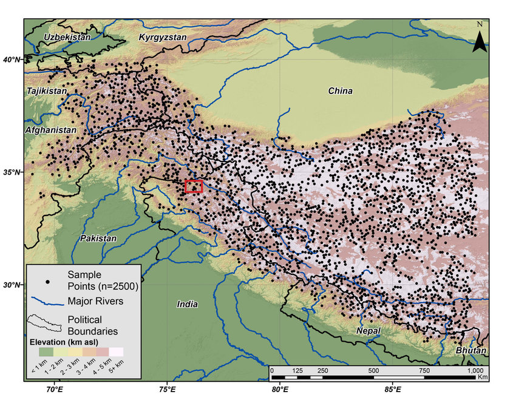
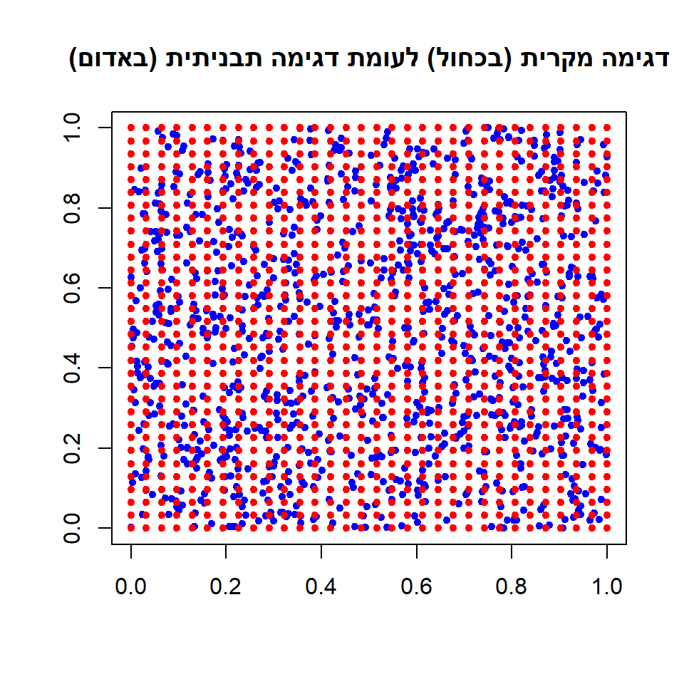
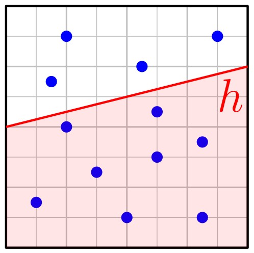
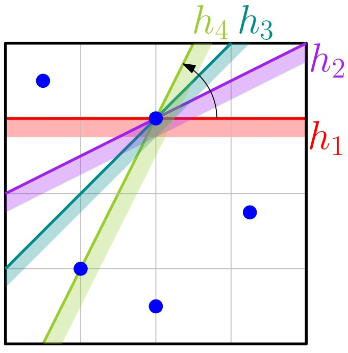
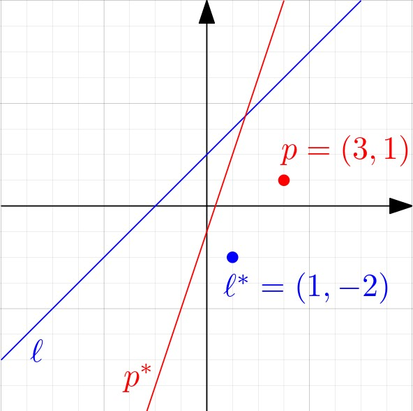
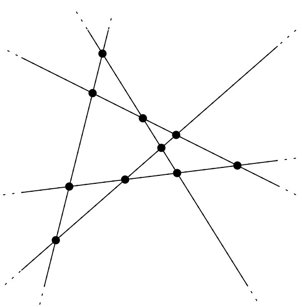
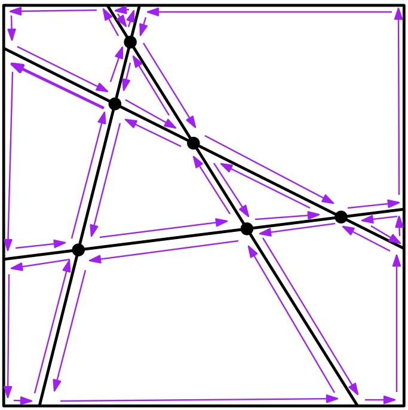
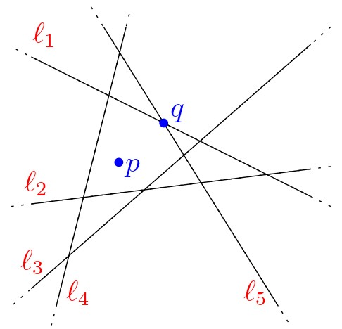
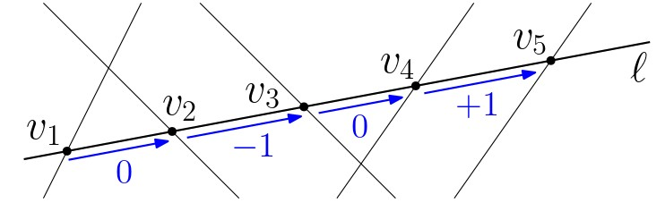
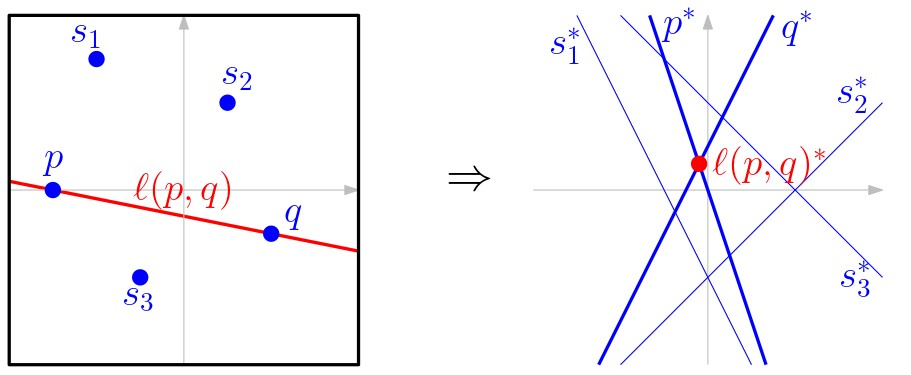

# מערכים ודואליות {#duality-arrangements}

## הקדמה {#preface}

### דגימה גאומטרית טובה {#geometric-sampling}

ההתמודדות עם נתוני עתק (Big Data) מהווה אתגר עצום בתחום טכנולוגית המידע, ואחת הדרכים להתמודד עם היקף מאסיבי של נתונים היא על ידי דגימה (sampling). למשל, בהינתן אוסף גדול מאוד של נקודות, ניתן לדגום מתוכן אוסף קטן יותר שיהווה ייצוג קומפקטי של האוסף המקורי, ועליו ניתן לבצע חישובים ביעילות. גם כאשר רוצים למדל אובייקט רציף במחשב, משתמשים בדרך כלל באוסף סופי של נקודות או פיקסלים; למשל, כדי לייצג את פני השטח במפה טופוגרפית, לוקחים מדידות של גובה בנקודות אקראיות (התמונה הבאה למשל, לקוחה [מהמאמר הזה](https://www.researchgate.net/figure/Figure-Topographic-map-of-High-Mountain-Asia-HMA-based-on-SRTM-VV-data-with_fig7_323301551)).

{width="70%"}

הבחירה בדגימה מקרית של נקודות לעומת דגימה תבניתית יכולה לנבוע מכמה סיבות:

-   לפעמים דגימה תבניתית לא נראית טוב לעין האנושית.
-   האובייקט שאותו ממדלים עלול "להתאים" לתבנית באופן כזה שאוסף הנקודות לא ישקף את המציאות.
-   דגימה מקרית מאפשרת הוכחה של חסמים הסתברותיים (חסמים על התוחלת).

מצד שני, לא כל דגימה מקרית תהיה "טובה", כלומר, היינו רוצים שפיזור הנקודות שנדגמו יהיה פחות או יותר אחיד, על מנת שישקף את המצב המקורי. נסביר זאת על ידי דוגמה.

 נניח שדגמנו קבוצה $S$ של $n$ נקודות מריבוע היחידה $U=[0,1]\times [0,1]$. היינו רוצים שלקבוצה $S$ תהיה התכונה הבאה: לכל חצי מישור $h$, **אחוז** הנקודות מ-$S$ שנמצאות ב-$h$ יהיה פחות או יותר כמו גודל החיתוך של $h$ עם $U$.

באופן יותר פורמלי, נגדיר את **המדד הרציף** של $h$ להיות השטח של $h \cap U$. נסמן אותו ב-$\mu(h)$. בנוסף, נגדיר את **המדד הדיסקרטי** של $h$ להיות $\mu_S(h)=|S\cap h|/|S|$. הדגימה $S$ תהיה טובה אם לכל בחירה של חצי מישור $h$ יתקיים $\mu(h)\approx\mu_S(h)$.\
במתימטיקה, מושג זה נקרא [Discrepancy](https://en.m.wikipedia.org/wiki/Discrepancy_theory). מדד ה-discrepancy של חצי המישור $h$ מוגדר להיות: $$\Delta_S(h)=|\mu(h)-\mu_S(h)|.$$

::: rmdtip
 [דוגמה:\
]{.underline} באיור למטה, הקבוצה $S$ מכילה 5 נקודות. חצי המישור $h$ מכיל רק 2 נקודות מתוך $S$, ולכן המדד הדיסקרטי של $h$ הוא $\mu_S(h)=|S\cap h|/|S|=2/5$. שטח החיתוך של חצי המישור $h$ עם ריבוע היחידה $U$ הוא בדיוק $1/2$, ולכן מדד ה-discrepancy של $h$ הוא $$\Delta_S(h)=|\mu(h)-\mu_S(h)|=|1/2-2/5|=1/10.$$

{width="30%"}

:::

נסמן ב-$\mathcal{H}$ את אוסף כל חצאי המישורים. מדד ה-discrepancy של הקבוצה $S$ ביחס לחצאי מישור מוגדר להיות: $$\Delta_\mathcal{H}(S)=\sup_{h\in\mathcal{H}}\Delta_S(h).$$ במילים אחרות, זהו חצי המישור ה"**גרוע ביותר**", כלומר, זה שעבורו מדד ה-discrepancy הוא **מקסימלי**. אינטואיטיבית, ככל שמדד ה-discrepancy מתקרב ל-0, כך הדגימה $S$ טובה יותר, כלומר מפוזרת באופן אחיד יותר על פני $U$.

::: rmdwarning
 התבוננו באיור הבא שבו קבוצה $S$ של נקודות (כחולות) בתוך ריבוע היחידה $U$, וחצי מישור $h$.

{width="30%"}

1.  מהו המדד הדיסקרטי של $h$?
2.  כיצד ניתן לחשב את המדד הרציף של חצי מישור נתון? חשבו את המדד הרציף של חצי המישור $h$ המופיע באיור.
3.  מהו $\Delta_S(h)$?
4.  האם יש חצי מישור שהוא "גרוע יותר" מ-$h$? כלומר, מדד ה-discrepancy שלו גדול יותר?

(פתרון)

הקבוצה $S$ מכילה 12 נקודות. חצי המישור $h$ מכיל 8 מהן, ולכן המדד הדיסקרטי הוא $8/12=2/3$.

שטח החיתוך של $h$ עם $U$ הוא $1/2+1/8=5/8$ (ניתן לראות שהוא מכיל את שתי השורות התחתונות של הגריד, כלומר החצי התחתון של ריבוע היחידה, ועוד חצי מהשורה השלישית מלמטה).

באופן כללי, ניתן לחשב את השטח על ידי מציאת נקודות החיתוך של הישר המגדיר את חצי המישור $h$ עם ריבוע היחידה, ואז לחשב את השטח כסכום של שטח מלבן ושטח משולש.

קיבלנו $\Delta_S(h)=2/3-5/8=1/24$.

שימו לב שקיימים מספר חצאי מישורים שלא מכילים אף נקודה כחולה, ושטח החיתוך שלהם עם הריבוע גדול מ-$1/24$. לכן חצאי מישורים אלו "גרועים יותר" מ-$h$.

:::

### חישוב ה-discrepancy של קבוצת נקודות {#discrepancy}

עכשיו נוכל לשאול: כיצד ניתן לחשב את $\Delta_\mathcal{H}(S)$? בעצם אנחנו מחפשים חצי מישור $\hat{h}$ שעבורו $\Delta_\mathcal{H}(S)=\Delta_S(\hat{h})$ , כלומר לכל $h\in\mathcal{H}$ מתקיים $\Delta_S(\hat{h})\ge \Delta_S(h)$.

 אבחנה מיידית ראשונה היא שהישר שמגדיר את $\hat{h}$ חייב לעבור דרך לפחות נקודה אחת מ-$S$: אם זה לא המצב, אז נוכל להזיז מעט את הישר המגדיר את $\hat{h}$ לעבר הנקודה הקרובה ביותר אליו מאחד הצדדים, מבלי לשנות את המידה הדיסקרטית שלו. המידה הרציפה תגדל או תקטן, ובאחד הצדדים נקבל מדד discrepancy גדול יותר.

כדי לחשב את $\Delta_\mathcal{H}(S)$, היינו רוצים למצוא מספר סופי של מועמדים להיות $\hat{h}$. בסעיף 8.1 של ספר הלימוד מוכיחים את הטענה הבאה:

::: rmdimportant
 [**טענה**:]{.underline}

חצי מישור $h$ עבורו $\Delta_S(h)$ מקסימלי, הוא אחד משני הסוגים הבאים:

1.  ל-$h$ יש בדיוק נקודה אחת מ-$S$ על שפתו,
2.  ל-$h$ יש לפחות 2 נקודות על שפתו.

בנוסף, מספר המועמדים מהסוג הראשון הוא $O(n)$, וניתן למצוא אותם בזמן $O(n)$.
:::

בהינתן מועמד $h$, נוכל לחשב את המידה הרציפה שלו בזמן קבוע, ואת המידה הדיסקרטית שלו בזמן $O(n)$. מכיוון שמספר המועמדים מהסוג הראשון הוא $O(n)$ וגם ניתן למצוא אותם בזמן $O(n)$, סך כל הזמן שיקח לנו לחשב את $\Delta_S(h)$ עבור כל המועמדים מהסוג הזה הוא $O(n^2)$.

מה לגבי המועמדים מהסוג השני? מכיוון שיש $O(n^2)$ כאלה, נצטרך לבצע את חישוב המידה הדיסקרטית שלהם באופן אחר. בהמשך היחידה, נלמד טכניקה חשובה ומרתקת שתאפשר לנו לעשות זאת בזמן $O(n^2)$ בסך הכל! לטכניקה הזו קוראים דואליות של נקודה וישר.

הערה: ביחידה זו נדלג על ההקדמה לפרק 8 בספר הלימוד, וכן על סעיף 8.1. כמו כן, לא נוכיח את הטענה לעיל, ורק נראה כיצד ניתן להשתמש בה על מנת לחשב את ה-discrepancy.

::: rmdwarning
 באיור למטה מופיעים ארבעה חצאי מישור, $h_1,h_2,h_3,h_4$, כולם עוברים דרך אותה נקודה מ-$S$. שימו לב ש-$h_i$ מתקבל מ-$h_{i-1}$ על ידי סיבוב של הישר המגדיר אותו נגד כיוון השעון. כל חצאי המישורים מכילים בדיוק את אותה קבוצת נקודות מ-$S$. למי מהם $\Delta_S$ מקסימלי? למי מינימלי?

{width="40%"}

(פתרון)

שטח החיתוך של $h_1$ או $h_2$ עם $U$ הוא הגדול ביותר, והוא שווה ל-$3/4$. השטח קטן יותר ויותר לאחר שעוברים את $h_2$ ומסובבים לכיוון $h_4$. שטח החיתוך של $h_4$ של $U$ הוא הקטן ביותר. כולם מכילים $4/5$ מנקודות $S$, ולכן ככל ששטח החיתוך קטן נקבל הפרש גדול יותר בין המדד הדיסקרטי לרציף. לכן, המדד המקסימלי יתקבל עבור $h_1$ ו-$h_2$, והמינימלי עבור $h_4$.

:::

------------------------------------------------------------------------

## דואליות של נקודה וישר {#point-line-duality}

### הגדרת הטרנספורמציה הדואלית {#definition}

ביחידה 3 דיברנו על [הגרף הדואלי לשילוש](#dual-graph), וראינו שבעזרתו ניתן לחשב בקלות צביעה חוקית של קודקודי המשולשים בשלושה צבעים (שימו לב שניתן להגדיר באופן דומה גרף דואלי לגרף מישורי שפאותיו הן לא בהכרח משולשים). באופן כללי, **דואליות** היא כלי חשוב בניתוח ופתרון של בעיות גאומטריות: היא מאפשרת לנו להסתכל על בעיה נתונה מפרספקיבה שונה, על ידי תיאור של בעיה דואלית שקולה. לפעמים הבעיה הדואלית נראית הרבה יותר פשוטה לפתרון, ואז ניתן להפוך את הפתרון לבעיה הדואלית לפתרון לבעיה המקורית.

בפרק זה נדבר על הדואליות של נקודות וישרים במישור. נקודה $p$ במישור מתוארת על ידי שתי הקואורדינטות שלה, למשל, $p=(p_x,p_y)$. גם ישר (לא אנכי) $y=mx+b$ מתואר על ידי שני פרמטרים: השיפוע שלו, $m$, והגורם הקבוע, $b$. לכן ניתן למפות נקודה לישר ולהיפך, באופן חד-חד-ערכי. ניתן לחשוב על טרנספורמציות שונות, אך בקורס הזה נעסוק בטרנפורמציה הפשוטה הבאה:

-   הישר הדואלי לנקודה $p=(p_x,p_y)$ יסומן ב-$p^*$ והוא: $p^*:~ y=p_x x-p_y$
-   הנקודה הדואלית לישר $\ell:~ y=mx+b$ תסומן $\ell^*$ והיא: $\ell^*=(m,-b)$

::: rmdtip
 [דוגמה:]{.underline}

-   הישר הדואלי לנקודה $p=(3,1)$ הוא $p^*:~ y=3x-1$.
-   הנקודה הדואלית לישר $\ell:~ y=x+2$ היא $\ell^*=(1,-2)$.

{width="50%"}

:::

הטרנספורמציה הדואלית שהגדרנו ממפה אובייקטים מ**המישור הראשי** (primal plane) ל**מישור הדואלי** (dual plane), ויש לה מספר תכונות מעניינות, שאותן נראה מיד. אך לפני כן, נסו לבחון בעצמכם את תכונות הטרנספורמציה הדואלית בעזרת היישומון הבא.

<iframe src="https://www.desmos.com/calculator/zhezzindqi?embed" width="100%" height="500" style="border: 1px solid #ccc" frameborder="0">

</iframe>

::: rmdwarning
 התבוננו באיור הבא, והתאימו בין נקודה לישר הדואלי שלה.

{width="60%"}

(פתרון)

זיכרו שקוארדינטת ה-$x$ ממופה לשיפוע הישר, וקוארדינטת ה-$y$ לחיתוך עם ציר ה-$y$.

הנקודה $p_1$ נמצאת על ציר ה-$y$, כלומר קוארדינטת ה-$x$ שלה היא אפס, ולכן הישר הדואלי המתאים לה יהיה עם שיפוע 0, כלומר זהו $\ell_3$.

הנקודה $p_2$ נמצאת על ציר ה-$x$, כלומר קוארדינטת ה-$y$ שלה היא אפס, ולכן הישר הדואלי המתאים לה יחתך עם ציר ה-$y$ בראשית הצירים, ולכן זהו $\ell_1$.

עבור הנקודה $p_3$ נשאר לנו הישר $\ell_2$, אבל אפשר לזהות זאת גם ללא אלימינציה: לנקודה $p_3$ קואורדינטת $x$ חיובית וקואורדינטת $y$ שלילית, ואכן השיפוע של $\ell_2$ חיובי, והוא נחתך עם ציר ה-$y$ מעל הראשית.

:::

### תכונות הטרנספורמציה הדואלית {#properties}

כדי שנוכל להשתמש בטרנספורמציה הדואלית שהגדרנו, ננסה להבין קודם מה היחס בין המישור הדואלי למישור הראשי, כלומר, אילו תכונות נשמרות ובאיזה אופן. בסרטון הבא נבחן יחד את הטרנספורמציה הדואלית והתכונות שלה.

#### צפו בסרטון הבא. {.unnumbered}

TODO

ראינו שהטרנספורמציה הדואלית מקיימת את התכונות הבאות:

::: rmdimportant
 [**אבחנה**:]{.underline}

תהי $p$ נקודה ו-$\ell$ ישר לא אנכי, שניהם במישור. הטרנספורמציה הדואלית $o\rightarrow o^*$ מקיימת את התכונות הבאות:

1.  משמרת יחס שכנות (incidence preserving): $p\in \ell$ אם ורק אם $\ell^*\in p*$.
2.  משמרת סדר (order preserving): $p$ מעל $\ell$ אם ורק אם $\ell^*$ מעל $p^*$.

{width="80%"}

:::

כמו כן, ראינו שבמישור הדואלי, קטע $s=\overline{pq}$ הוא איחוד הישרים הדואלים לנקודות על $s$. כלומר, $s^*$ הוא אוסף אינסופי של ישרים, שלכולם נקודת חיתוך אחת. ניתן לראות זאת ביישומון הבא: הזיזו את הנקודה השחורה שעל הקטע $\overline{pq}$, ותוכלו לראות כיצד הישר הדואלי (הצבוע בשחור) משתנה ביחס לישרים הדואלים ל-$p$ ו-$q$.

<iframe src="https://www.desmos.com/calculator/bhy5azkiwk?embed" width="100%" height="500" style="border: 1px solid #ccc" frameborder="0">

</iframe>

בסעיף 8.2 בספר הלימוד מתוארת דרך אחרת לחשוב על הטרנספורמציה הדואלית - בעזרת הפרבולה $\mathcal{U}:~ y=x^2/2$. עבור נקודה $p$ שנמצאת על הפרבולה, הישר הדואלי $p^*$ הוא בדיוק הישר המשיק לפרבולה בנקודה $p$. עבור נקודה $q$ שלא נמצאת על הפרבולה, ויש לה אותה קוארדינטת $x$ כמו ל-$p$, השיפוע של $q^*$ הוא בדיוק השיפוע של $p^*$, אך $q^*$ מוזז לפי ההפרש בקוארדינטת ה-$y$. תוכלו לראות את הקשר הזה בעזרת היישומון הבא.

<iframe src="https://www.desmos.com/calculator/ntcunrsyha?embed" width="100%" height="500" style="border: 1px solid #ccc" frameborder="0">

</iframe>

החלק האחרון של סעיף 8.2 מתאר כיצד ניתן להשתמש בדואליות כדי לחשב את ה-discrepancy של קבוצת נקודות. אנו נחזור לכך בהמשך, לאחר שנדבר על מערכים של ישרים במישור.

#### קראו את סעיף 8.2 בספר הלימוד (עמודים 177־179). {.unnumbered}

::: rmdwarning
 איך נראית הטרנספורמציה הדואלית של:

1.  חצי מישור $h$?

2.  אוסף של $k\ge 3$ נקודות, שכולן על אותו ישר לא אנכי?

(פתרון)

1.  נסמן ב-$\ell$ את הישר המגדיר את החצי המישור $h$, ונניח (בלי הגבלת הכלליות) שחצי המישור $h$ נמצא מעל $\ell$. במישור הראשי, כל נקודה $p$ ב-$h$ נמצאת מעל $\ell$, ולכן במישור הדואלי, הנקודה $\ell^*$ נמצאת מעל הישר $p^*$. כלומר, הטרנספורמציה הדואלית של חצי מישור היא אוסף הישרים שעוברים מתחת לנקודה.

2.  נניח שהנקודות $p_1,\dots,p_k$ נמצאות כולן על ישר $\ell$ במישור הראשי. זה אומר שבמישור הדואלי, הנקודה $\ell^*$ נמצאת על הישרים $p_1,\dots,p_k$. כלומר, הטרנספורמציה הדואלית של אוסף נקודות שנמצאות על ישר אחד היא אוסף של ישרים הנחתכים כולם באותה נקודה.

:::

------------------------------------------------------------------------

## מערכים של ישרים במישור {#line-arrangements}

### הגדרה, מבנה, וגודל {#complexity}

 קבוצה $L$ של $n$ ישרים במישור יוצרת חלוקה של המישור לאוסף של תאים (פאות), צלעות, וקודקודים. חלוקה כזאת של המישור נקראת **מערך של ישרים** (line arrangement), ומסומנת $\mathcal{A}(L)$. בסרטון הבא נדבר על המבנה והגודל של מערכי ישרים במישור.

#### צפו בסרטון הבא. {.unnumbered}

TODO

ראינו שלמערך $\mathcal{A}(L)$ של ישרים במישור יש שלושה סוגי רכיבים:

-   קודקודים - כאשר כל קודקוד הוא נקודת חיתוך בין ישרים מ-$L$.
-   צלעות - כאשר כל צלע היא קטע (פתוח) או קרן (עם צד אחד פתוח וצד שני לא חסום) על אחד הישרים.
-   פאות - כאשר כל פאה היא רכיב קשיר מקסימלי של נקודות שלא נמצאות על אחד הישרים.

הפאות הן כמובן קמורות, שכן הן נוצרות מחיתוך של חצאי מישורים.

בנוסף, הגדרנו שהמערך $\mathcal{A}(L)$ הוא **פשוט** אם אין ב-$L$ 3 ישרים שעוברים דרך אותה נקודה, ואין ישרים מקבילים.

::: rmdimportant
 [**משפט**:]{.underline}

תהי $L$ קבוצה של $n$ ישרים במישור, ויהי $\mathcal{A}(L)$ המערך של $L$. מתקיים:

1.  מספר הקודקודים ב-$\mathcal{A}(L)$ הוא לכל היותר $n(n-1)/2$.
2.  מספר הצלעות ב-$\mathcal{A}(L)$ הוא לכל היותר $n^2$.
3.  מספר הפאות ב-$\mathcal{A}(L)$ הוא לכל היותר $n^2/2+n/2+1$.

בנוסף, מתקיים שוויון בכל השלושה אם ורק אם $\mathcal{A}(L)$ הוא מערך פשוט.
:::

#### קראו את חלקו הראשון של סעיף 8.3 בספר הלימוד (עמודים 179־180). {.unnumbered}

(קראו עד ההוכחה של משפט 8.4, כולל)

### ייצוג ובניית המערך {#construcion}

בעמוד הקודם ראינו שהמערך $\mathcal{A}(L)$ של אוסף $L$ של ישרים הוא חלוקה של המישור, ואסימפטוטית הוא לכל היותר מגודל ריבועי (במספר הישרים).

#### כיצד נייצג מערך של ישרים? {.unnumbered}

 נוכל להשתמש במבנה DCEL שראינו ביחידה 2, שיאפשר לנו לעבור מפאה לפאה, לגשת לרשימת כל הצלעות שמגדירות פאה נתונה, ועוד. שימו לב שהמערך $\mathcal{A}(L)$ מכיל גם צלעות אינסופיות, ולכן כדי להשתמש במבנה DCEL נצטרך להשתמש בטריק שכבר ראינו בעבר: נמצא מלבן $R$ מספיק גדול שמכיל את כל הקודקודים של $\mathcal{A}(L)$ בפנימו.

#### בניית ה-DCEL. {.unnumbered}

כדי לבנות את ה-DCEL עבור $\mathcal{A}(L)$ המוכל במלבן $R$, נוכל פשוט להשתמש באלגוריתם הסורק שראינו ביחידה 2. האלגוריתם ימצא את כל נקודות החיתוך בין קטעים, שהם הקודקודים של המערך, בזמן $O(n^2\log n)$, ובעזרתו נוכל (על ידי מספר שינויים פשוטים) גם לחשב את מבנה ה-DCEL.

::: rmdwarning
 חישבו בעצמכם מהם השינויים הנדרשים באלגוריתם הסורק על מנת לחשב את מבנה ה-DCEL של מערך ישרים.
:::

#### אלגוריתם יעיל יותר. {.unnumbered}

בחלקו השני של סעיף 8.3 בספר הלימוד (עמודים 181־185) מתואר אלגוריתם אינקרמנטלי לבניית מערך של ישרים. זמן הריצה שלו הוא $O(n^2)$ בלבד, אך הוא מסובך יותר ולא נלמד אותו בקורס הזה.

### רמה (level) של נקודה במערך {#vertex-level}

לפני שנוכל לחזור לפתרון בעיית חישוב ה-discrepancy, נגדיר מונח נוסף שיעזור לנו במשימה הזאת (ועוד רבות אחרות).

::: rmdimportant
 [**הגדרה**: רמה של נקודה במערך של ישרים]{.underline}\
הרמה (level) של נקודה $r$ במערך של ישרים היא מספר הישרים שעוברים מעל $r$ (מעל ממש, כלומר לא עוברים דרך $r$).
:::

::: rmdtip
 [דוגמה:]{.underline}

הרמה של הנקודה $p$ היא 3, מכיוון שעוברים מעליה שלושה ישרים: $\ell_1,\ell_4,\ell_5$.

מהי הרמה של הנקודה $q$? שימו לב ש-$q$ היא קודקוד של מערך הישרים, ורק הישר $\ell_4$ עובר מעליה. לכן הרמה של $q$ היא 1.

{width="50%"}

:::

#### כיצד נוכל לחשב את הרמה של קודקוד במערך ישרים? {.unnumbered}

בהינתן מבנה DCEL של המערך $\mathcal{A}(L)$, נוכל לחשב את הרמות של כל הקודקודים במערך בזמן $O(n^2)$ בסך הכל, בעזרת האלגוריתם הבא.\

{width="75%"}

עבור ישר $\ell\in L$ כלשהו, נמצא את הקודקוד השמאלי ביותר שנמצא עליו, $v_1$, ונחשב את הרמה שלו, $level(v_1)$, בזמן $O(n)$ על ידי בדיקת כל הישרים האחרים. לאחר מכן, נוכל להתקדם לאורך הישר $\ell$ בעזרת מבנה ה-DCEL מהקודקוד הנוכחי, $v_i$ אל הקודקוד שמימינו, $v_{i+1}$, ולחשב את הרמה של $v_{i+1}$ בהינתן $level(v_i)$ בזמן קבוע:

1.  נאתחל $level(v_{i+1})\leftarrow level(v_i)$
2.  אם הישר דרך $v_i$ עובר מעל $v_{i+1}$, נוסיף 1 ל-$level(v_{i+1})$.
3.  אם הישר דרך $v_{i+1}$ עובר מעל $v_i$, נחסיר 1 מ-$level(v_{i+1})$.

(שימו לב ש-2 ו-3 יכולים להתקיים יחד, ואז הרמה של $v_{i+1}$ לא תשתנה).

::: rmdwarning
 מהי הרמה של כל אחד מהקודקודים על הישר $\ell$ במערך הישרים שבאיור?

{width="85%"}

(פתרון)

{width="85%"}

:::

::: rmdnote
 **מעניין לדעת**: הרמה ה-$k$-ית של מערך $\mathcal{A}(L)$ של $n$ ישרים במישור היא אוסף הקודקודים של $\mathcal{A}(L)$ שהרמה שלהם היא $k$. כמה קודקודים יש ברמה ה-$n/2$? זוהי בעיה פתוחה. למעשה, ידוע חסם תחתון של $\Omega(n\log n)$ וחסם עליון של $O(n^{3/4})$.
:::

#### הכוח של דואליות.

נחזור לבעית חישוב ה-discrepancy של קבוצת נקודות. בהינתן קבוצה $S$ של $n$ נקודות, המטרה שלנו בסוף החלק הראשון של יחידה זו היתה לחשב לכל זוג נקודות $p,q\in S$ את המדד הדיסקרטי של חצי המישור שחסום על ידי הישר $\ell(p,q)$ העובר דרך $p$ ו-$q$. במישור הדואלי, הנקודה $\ell(p,q)^*$ (הדואלית לישר $\ell(p,q)$) היא נקודת החיתוך בין $p^*$ (הישר הדואלי ל-$p$), ל-$q^*$ (הישר הדואלי ל-$q$). לכן, נקודה $s$ נמצאת מתחת לישר $\ell(p,q)$ במישור הראשי, אם ורק אם הישר $s^*$ עובר מתחת לנקודה $\ell(p,q)^*$ במישור הדואלי.

{width="80%"}

שימו לב שבמישור הדואלי, $S$ היא קבוצה $S^*$ של ישרים, שמהווה מערך של ישרים. מכאן, שמספר הנקודות מ-$S$ שנמצאות בחצי המישור הפתוח שמוגדר על ידי $\ell(p,q)$ ונמצא מתחתיו, שווה למספר הישרים במישור הדואלי שעוברים מעל הנקודה $\ell(p,q)^*$. זוהי בדיוק הרמה של הקודקוד $\ell(p,q)^*$ במערך הישרים $\mathcal{A}(S^*)$.

#### קראו את סעיף 8.4 בספר הלימוד (עמודים 185־186)

------------------------------------------------------------------------

## תרגילים נוספים {#exercises}

::: rmdwarning
 תארו אלגוריתם שבהינתן אוסף $L$ של $n$ ישרים במישור, מוצא בזמן $O(n\log n)$ מלבן $R$ שמכיל את כל הקודקודים של $\mathcal{A}(L)$ בפנימו.

(פתרון)

TODO

:::

::: rmdwarning
 נתון אוסף $C$ של $n$ מעגלים במישור. שימו לב שגם אוסף זה מהווה חלוקה של המישור לתאים. הצלעות במערך המעגלים יהיו קשתות של מעגלים מ-$C$. שימו לב שהפאות במערך המעגלים אינן בהכרח קמורות. מהי הסיבוכיות של מערך מעגלים?

(פתרון)

TODO

:::

::: rmdwarning
 כפי שראיתם, בבעיות רבות בגאומטריה חישובית אנחנו מניחים (לשם פשטות) שהקלט אינו מכיל 3 נקודות הנמצאות על ישר אחד. כיצד ניתן לוודא זאת? בדיקה זו נקראת בדיקת קו-ליניארית, ואלגוריתם נאיבי יבדוק כל 3 נקודות, מה שיקח זמן של $O(n^3)$. חישבו כיצד ניתן להשתמש ברעיון הדואליות על מנת לבדוק זאת בזמן $O(n^2)$ בלבד.

(פתרון)

TODO

:::
