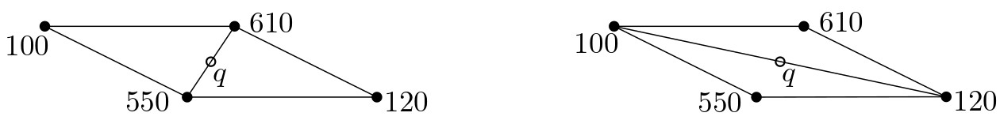
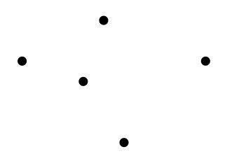
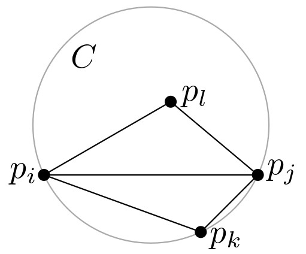
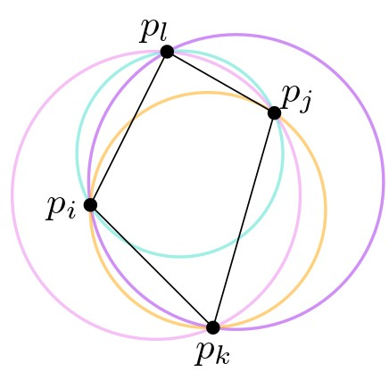
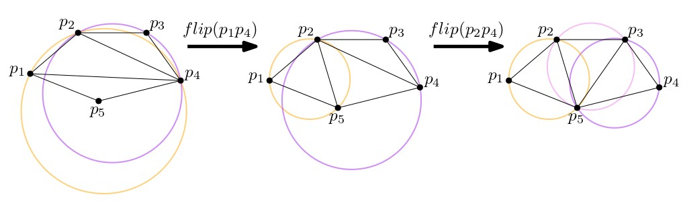

# שילושי דלוני {#Delaunay-triangulation}

## הקדמה {#preface-9}

### מה ביחידה? {#contents-9}
יחידה זו מקבילה לפרק התשיעי בספר הלימוד. 

המושגים והרעיונות העיקריים שילמדו ביחידה:

- מפה מישורית מקסימלית.
- שילוש של קבוצת נקודות במישור.
- שילוש חוקי ושילוש אופטימלי בזויות.
- גרף דלוני ושילוש דלוני.
- אלגוריתמים לחישוב השילוש (אלגוריתם היפוך צלעות, אלגוריתם סורק, אלגוריתם אינקרמנטלי-רנדומי).

למידה מהנה!

### אינטרפולציה של גבהים {#terrains}

ייצוג תלת מימדי של פני שטח (terrain) נעשה בדרך כלל על ידי לקיחה דגימות של גובה בנקודות מסויימות, ואז קביעת גובה הנקודות שלא נמדדו על ידי אינטרפולציה כלשהי של נקודות הדגימה. הדרך המקובלת לעשות זאת היא בעזרת שילוש של קבוצת הנקודות, כלומר, חלוקה של המישור שכל הפאות החסומות שלה הן משולשים שקודקודיהם הם נקודות הדגימה. הגובה של נקודה $q$ שלא נמדדה יתקבל באופן הבא: נמצא את המשולש $\triangle abc$ שהנקודה $q$ נמצאת בתוכו. הנקודות $a,b,c$ עם מדידות הגובה שלהן הן נקודות תלת מימדיות, ולכן מגדירות מישור בתלת מימד. נטיל את $q$ על המישור הזה, וקוארדינטת ה-$z$ שהתקבלה תהיה הגובה של $q$.

לא כל השילושים יראו לנו "טובים" או "טבעיים" באותה המידה. התבוננו למשל בשני השילושים באיור למטה. אלו שני שילושים שונים של אותה קבוצת נקודות, יחד עם הגבהים המתאימים להן. בכל אחד מהם, הנקודה המסומנת $q$ תהיה בגובה שונה. איזה מהשילושים סביר שיתאר את המציאות באופן מהימן יותר?

{width="80%"}

::: rmdwarning
 מה (בערך) יהיה הגובה של הנקודה $q$ בכל אחד מהשילושים באיור למעלה?

(פתרון)

בשילוש מימין, הגובה של $q$ יהיה בין 100 ל-120. בשילוש משמאל, הגובה יהיה בין 550 ל-610.

השילוש משמאל נראה יותר טבעי מהימני, מכיוון שבאופן אינטואיטיבי סביר יותר שהגובה של הנקודה $q$ יהיה דומה לגובה של הנקודות שנמצאות בסביבה הקרובה שלה.

:::

ביחידה זו ננסה להבין כיצד להגדיר שילוש שמשקף את התפיסה האינטואיביטיבית שלנו לגבי מהו שילוש "טוב", וכן כיצד ניתן לחשב שילוש כזה.

#### קראו את ההקדמה לפרק 9 בספר הלימוד (עמודים 191־193). {.unnumbered}

------------------------------------------------------------------------

## שילוש של קבוצת נקודות במישור {#point-set-triangulation}

### מפה מישורית מקסימלית

ביחידה 3 של הקורס דיברנו על שילוש של פוליגונים - חלוקה של פוליגון למשלושים על ידי מספר מקסימלי של אלכסונים שאינם נחתכים. ביחידה זו, נעסוק בשילושים של קבוצות של נקודות במישור. על מנת להגדיר באופן פורמלי מהו שילוש של קבוצת נקודות, נסביר קודם מהי מפה מישורית **מקסימלית** (שימו לב שיחידה 2 של הקורס עוסקת במפות מישוריות שאינן בהכרח מקסימליות).

::: rmdimportant
 [**הגדרה**: מפה מישורית מקסימלית]{.underline}\
מפה מישורית מקסימלית היא מפה מישורית שלא ניתן להוסיף לה צלעות - כלומר כל צלע שנוסיף בין שני קודקודים תחתוך צלע אחרת.
:::

::: rmdwarning
 מי מהמפות המישוריות הבאות היא מקסימלית?

{width="100%"}

(פתרון)

שלושת המפות התחתונות בלבד.

:::

#### תכונות של מפה מישורית מקסימלית. {.unnumbered}

כאשר פתרתם את התרגיל הקודם, בוודאי הבחנתם בשתי התכונות הבאות:

-   **הפאות (החסומות) הן משולשים**: אם יש פאה חסומה שהיא לא משולש, אז ניתן לשלש אותה על ידי הוספת אלכסונים - כפי שראינו ביחידה 3 של הקורס (שילוש של פוליגונים).

-   **כל צלעות הקמור של קבוצת הקודקודים שייכות למפה** (והן הצלעות של הפאה הלא חסומה): לא תתכן צלע שיוצאת החוצה מהקמור, ולכן הצלעות של פוליגון הקמור לא יחתכו שום צלע אחרת, וניתן יהיה להוסיף אותן למפה.

### שילוש של נקודות במישור {#triang-def}

התכונה הראשונה שראינו מובילה אותנו להגדרת שילוש של קבוצת נקודות $P$ במישור באופן הבא.

::: rmdimportant
 [**הגדרה**: שילוש של קבוצת נקודות במישור]{.underline}\
בהינתן קבוצה $P$ של $n$ נקודות במישור, שילוש של $P$ הוא מפה מישורית מקסימלית שהקודקודים שלה הם נקודות $P$.
:::

שימו לב, יתכן שקיים יותר משילוש אחד לקבוצה נתונה של נקודות!

::: rmdwarning
 כמה שילושים שונים תוכלו למצוא עבור קבוצת הנקודות הבאה? כמה משולשים יש בכל אחד מהשילושים?

{width="20%"}

(פתרון)

זיכרו שצלעות הקמור חייבות להיות בשילוש. יש 3 שילושים אפשריים, בכל אחד מהם 4 משולשים. מיד נראה שזה לא מקרי - כל השילושים האפשריים של קבוצת נקודות נתונה הם בדיוק באותו הגודל!

{width="80%"}

:::

#### גודל השילוש. {.unnumbered}

באופן מעניין למדי, כל השילושים האפשריים של קבוצה $P$ של $n$ נקודות הם בדיוק באותו הגודל, כלומר יש להם מספר זהה של משולשים וצלעות. גודל השילוש תלוי במספר הנקודות שמופיעות על השפה של $CH(P)$ (שפת הקמור של $P$).

::: rmdimportant
 [**משפט**:]{.underline} תהי $P$ קבוצה של $n$ נקודות במישור, שלא כולן על ישר אחד. נסמן ב-$k$ את מספר הנקודות על השפה של $CH(P)$. אז בכל שילוש של $P$ יש $2n-2-k$ משולשים ו-$3n-3-k$ צלעות.
:::

ההוכחה למשפט מופיעה בסעיף 9.1 בספר הלימוד, והיא משתמשת בנוסחת אוילר, שכבר ראינו מספר פעמים בעבר.

::: rmdwarning
 לפני שתקראו את ההוכחה המופיעה בספר, נסו להוכיח בעצמכם את המשפט לגבי גודל השילוש.
:::

#### קראו את חלקו הראשון של סעיף 9.1 בספר הלימוד (עמודים 193־194). {.unnumbered}

קראו עד לסוף ההוכחה של משפט 9.1.

### שילוש חוקי ושילוש אופטימלי בזויות {#opt_triang}

בהקדמה ליחידה זו, ראינו ששילושים שלא מכילים משולשים "צרים" (כלומר כאלו שיש להם זויות חדות מאוד), הם בסבירות גבוהה משקפים טוב יותר את המצב במציאות. לכן, נעדיף שילושים בהם הזוויות הן כמה שיותר גדולות. בסרטון הבא נראה כיצד ניתן להגדיר שילוש אופטימלי כזה באופן מדויק.

#### צפו בסרטון הבא. {.unnumbered}

<iframe width="560" height="315" src="https://www.youtube.com/embed/OZvbdwovqxU?si=WnAhmzRwX2l4W_Co" title="YouTube video player" frameborder="0" allow="accelerometer; autoplay; clipboard-write; encrypted-media; gyroscope; picture-in-picture; web-share" allowfullscreen></iframe>

#### קראו את חלקו השני של סעיף 9.1 בספר הלימוד (עמודים 194־195). {.unnumbered}
שימו לב שבחלק האחרון של הסעיף מוצג אלגוריתם נאיבי לחישוב של שילוש אופטימלי בזויות, אך אלגוריתם זה אינו יעיל במיוחד. בהמשך נראה אלגוריתמים יעילים יותר לחישוב של שילוש כזה.

### לחזרה: הגדרות ותרגילים {#reminder}
למטה מופיעות ההגדרות, האבחנות, והטענות המרכזיות עליהן דנו בחלק זה, וזאת על מנת שיהיה לכם נוח לחזור אליהן בעתיד. בנוסף מופיעות כאן הערות ודוגמאות נוספות, וכן תרגילים לחזרה, כך שמומלץ לעבור על כל אלו לפני שממשיכים לסעיף הבא.

#### וקטור הזויות. {.unnumbered}

בהינתן שילוש $\mathcal{T}$ בעל $m$ משולשים, נסמן את $3m$ זויות המשולשים שלו $\alpha_1,\alpha_2,\dots,\alpha_{3m}$ כך ש-$\alpha_i\le\alpha_j$ לכל $i<j$. הוקטור $A(\mathcal{T}):=(\alpha_1,\alpha_2,\dots,\alpha_{3m})$ נקרא **וקטור הזויות** של $\mathcal{T}$.

::: rmdwarning
 מהו וקטור הזויות של השילוש $\mathcal{T}$ הבא?

{width="40%"}

(פתרון)

$A(\mathcal{T})=(20^\circ,30^\circ,40^\circ,45^\circ,110^\circ,115^\circ)$

:::

#### שילוש אופטימלי בזויות. {.unnumbered}

עבור שני שילושים שונים $\mathcal{T}$ ו-$\mathcal{T}'$ של אותה קבוצת נקודות, נגדיר שוקטור הזויות $A(\mathcal{T}):=(\alpha_1,\alpha_2,\dots,\alpha_{3m})$ גדול מוקטור הזויות $A(\mathcal{T}'):=(\alpha'_1,\alpha'_2,\dots,\alpha'_{3m})$ אם הוא גדול ממנו ב**סדר לקסיקוגרפי**. כלומר, $A(\mathcal{T})>A(\mathcal{T}')$ אם קיים $1\le i\le 3m$ כך ש:

-   $\alpha_j=\alpha'_j$ לכל $j<i$, וגם
-   $\alpha_i>\alpha'_i$.

שילוש $\mathcal{T}$ הוא **שילוש אופטימלי בזויות** אם לכל שילוש אחר $\mathcal{T}'$ של אותה קבוצת נקודות מתקיים $A(\mathcal{T})\ge A(\mathcal{T}')$.

::: rmdwarning
 איזה מהוקטורים הבאים גדול יותר בסדר לקסיקוגרפי?

$A_1=(20^\circ,30^\circ,30^\circ,50^\circ, 120^\circ, 130^\circ)$

או

$A_2=(20^\circ,30^\circ,35^\circ,40^\circ, 90^\circ, 110^\circ)$

(שימו לב שוקטורים אלו לא בהכרח מייצגים שילוש כלשהו.)

(פתרון)

$A_2$

:::

#### משפט תאלס (מורחב). {.unnumbered}

יהי $C$ מעגל, ו-$\ell$ ישר שחותך את המעגל בנקודות $a,b$. יהיו $p,q,s,r$ נקודות שכולן מאותו צד של $\ell$, כך ש-$p,q$ נמצאות על שפת המעגל, $r$ בתוכו ו-$s$ מחוץ למעגל. אז מתקיים: $$\measuredangle asb < \measuredangle apb = \measuredangle aqb < \measuredangle arb.$$ 

בישומון הבא, תוכלו להזיז את הנקודה הירוקה לתוך המעגל כדי לראות כיצד הזוית משתנה, ואת הנקודה הסגולה על שפת המעגל כדי לראות כיצד הזוית אינה משתנה. בנוסף, ניתן להזיז את הישר (הכחול) כדי להגדיל או להקטין את הקשת. 

<iframe src="https://www.desmos.com/calculator/lz9baqbqiw?embed" width="80%" height="300" style="border: 1px solid #ccc" frameborder=0></iframe>

::: rmdnote
 קיימים מספר משפטים בגאומטריה של המישור שנקראים בשם "משפט תאלס". אם למדתם גאומטריה בבית הספר התיכון בישראל, כנראה שאתם מכירים גרסה אחרת של המשפט. בוויקיפדיה גרסה זו נקראת [המשפט השני](https://he.wikipedia.org/wiki/%D7%9E%D7%A9%D7%A4%D7%98_%D7%AA%D7%90%D7%9C%D7%A1#%D7%94%D7%9E%D7%A9%D7%A4%D7%98_%D7%94%D7%A9%D7%A0%D7%99).
:::

#### פעולת היפוך צלע. {.unnumbered}

יהי $\mathcal{T}$ שילוש, ו-$e=\overline{p_ip_j}$ צלע בשילוש שמשותפת לשני משולשים $\triangle p_ip_jp_k$ ו- $\triangle p_ip_jp_l$. אם המרובע $p_ip_kp_jp_l$ הוא קמור אז ניתן לקבל מ-$\mathcal{T}$ שילוש אחר, $\mathcal{T}'$ על ידי החלפת הצלע $e$ בצלע $\overline{p_kp_l}$. פעולה זו נקראת היפוך של $e$, או $flip(e)$.

{width="80%"}

#### צלעות לא-חוקיות. {.unnumbered}

 
צלע $\overline{p_ip_j}$ בשילוש $\mathcal{T}$ שמשותפת לשני משולשים $\triangle p_ip_jp_k$ ו- $\triangle p_ip_jp_l$ היא **לא חוקית** אם ורק אם המעגל $C$ שעובר דרך $p_i,p_j,p_k$ מכיל את $p_l$ בפנימו.

**תמיד ניתן לבצע היפוך של צלע לא חוקית**: אם $\overline{p_ip_j}$ לא חוקית, אז המרובע $p_ip_kp_jp_l$ חייב להיות קמור.

::: rmdimportant
 [**טענה**:]{.underline} 
אם המרובע $p_ip_kp_jp_l$ הוא קמור, ואין מעגל שעובר דרך ארבעת הפינות שלו, אז בדיוק אחד משני האלכסונים של המרובע הוא חוקי. אם קיים מעגל שעובר דרך ארבעת הפינות שלו, אז שני האלכסונים חוקיים.
:::

::: rmdwarning
 איזה מהאלכסונים של המרובע $p_ip_kp_jp_l$ הוא לא חוקי?

{width="40%"}

(פתרון)

האלכסון $p_lp_k$ אינו חוקי מכיוון שהמעגל הסגול שעובר בנקודות $p_l,p_i,p_k$ מכיל את $p_j$.

:::

#### שילוש חוקי. {.unnumbered}

**שילוש חוקי** הוא שילוש שאינו מכיל צלעות לא חוקיות.

::: rmdwarning
 התבוננו בשילוש הבא. 

1. האם הצלע $p_2p_4$ חוקית?
2. האם הצלע $p_1p_4$ חוקית?
3. האם יתקבל שילוש חוקי לאחר שנבצע $flip(p_1p_4)$?

{width="40%"}

(פתרון)

1. כן.
2. לא.
3. לא, מכיון שאז הצלע $p_2p_4$ תהפוך ללא-חוקית.

:::

::: rmdwarning
 נכון או לא נכון?

1.  כל שילוש אופטימלי בזויות הוא חוקי.
2.  כל שילוש חוקי הוא אופטימלי בזויות.

(פתרון)

1.  נכון. תמיד ניתן "לשפר" שילוש לא חוקי על ידי פעולת היפוך צלע. שילוש אופטימלי לא ניתן לשיפור, ולכן הוא חוקי.
2.  במצב לא כללי, כלומר כאשר יש 4 נקודות על מעגל אחד, יתכן שילוש חוקי שאינו אופטימלי בזויות. שימו לב שבשילוש חוקי רק הזוית המינימלית היא חשובה, ולעומת זאת בשילוש אופטימלי בזויות מתחשבים בכל וקטור הזויות. בדוגמה הבאה מימין מופיע שילוש חוקי שאינו אופטימלי בזויות, ומשמאל שילוש אופטימלי. שימו לב שוקטור הזויות של שני השילושים כמעט זהה, פרט לכך שבשילוש מימין יש שתי זויות שנשכנות על האלכסון $p_kp_l$, ובשילוש משמאל יש שתי זויות שנשענות על האלכסון $p_ipj$ שהוא ארוך יותר, ולכן זויות אלו גדולות יותר.

{width="80%"}

בהמשך נראה שאם הנקודות במצב כללי (כלומר אין 4 נקודות על מעגל אחד), אז כל שילוש חוקי הוא אופטימלי בזויות.

:::

------------------------------------------------------------------------

## שילוש דלוני

### גרף דלוני ושילוש דלוני
לפני שנמשיך לדבר על שילושים, נציג את גרף דלוני, שהוא הגרף הדואלי לדיאגרמת וורונוי של קבוצת נקודות. מהן התכונות של הגרף? וכיצד הוא קשור לשילוש? על כך בסרטון הבא.

#### צפו בסרטון הבא. {.unnumbered}

<iframe width="560" height="315" src="https://www.youtube.com/embed/TBkHTe1iUYg?si=Ro6an4spaBk6PODC" title="YouTube video player" frameborder="0" allow="accelerometer; autoplay; clipboard-write; encrypted-media; gyroscope; picture-in-picture; web-share" allowfullscreen></iframe>

בסרטון הגדרנו את גרף דלוני $\mathcal{DG}(P)$ של קבוצת נקודות $P$ במישור, בעזרת דיאגרמת וורונוי של $P$: זהו שיכון של הגרף הדואלי ל-$Vor(P)$, שהקודקודים שלו הם נקודות $P$, והצלעות הן הקטעים הישרים המחברים בין אתרים שלפאות שלהם בדיגארמה יש צלע משותפת. הוכחנו שגרף דלוני הוא מישורי, ודיברנו על התכונות המאפיינות אותו.

::: rmdwarning

האם כל צלע של גרף דלוני חותכת את הצלע המשותפת לפאות של שני האתרים המתאימים לה בדיאגרמת וורונוי?
אם כן, הסבירו. אם לא, ציירו דוגמה לכך.

(פתרון)

לא, דוגמה:

{width="30%"}

:::

::: rmdwarning

כמה אתרים של דיאגרמת וורונוי יכולים להחתך עם אותה צלע של גרף דלוני במקרה הגרוע ביותר?

(פתרון)

במקרה הגרוע, צלע אחת של גרף דלוני יכולה להחתך עם כל האתרים. דוגמה:

{width="50%"}

:::

#### תכונות של גרף דלוני. {.unnumbered}
המשפט הבא מקביל לתכונות שראינו עבור דיאגרמת וורונוי:

::: rmdimportant
 
[**משפט (9.6)**:]{.underline} 
תהי $P$ קבוצה של נקודות במישור.

1. שלוש נקודות $p_i,p_j,p_k\in P$ הן קודקודים של אותה פאה חסומה ב-$\mathcal{DG}(P)$ אם ורק אם המעגל דרך $p_i,p_j,p_k$ לא מכיל נקודות של $P$ בפנימו.
2. זוג נקודות $p_i,p_j\in P$ יוצרות צלע של $\mathcal{DG}(P)$ אם ורק אם קיים דיסק סגור $C$ שמכיל את $p_i,p_j$ על שפתו, ואינו מכיל עוד אף נקודה אחרת של $P$. 
:::

::: rmdwarning

נתונה קבוצה $P=\{p_1,p_2,p_3,p_4\}$ כך שכל ארבעת הנקודות נמצאות על מעגל אחד. כיצד יראה גרף דלוני של $P$?

(פתרון)

לפי התכונה הראשונה כל הנקודות של $P$ שייכות לאותה פאה חסומה, ונקבל גרף (ירוק באיור) עם פאה חסומה אחת שהיא מרובע שקודקודיו הם $\{p_1,p_2,p_3,p_4\}$.

{width="35%"}

ניתן גם לראות זאת לפי דיאגרמת וורונוי: מרכז המעגל הוא קודקוד בדיאגרמת וורונוי, והוא משותף לכל הפאות, אך אין צלע משותפת לקודוקדים "נגדיים", כלומר כאלו המתאימים לאלכסונים של המרובע.

:::

::: rmdwarning

האם פאה של גרף דלוני חייבת להיות קמורה? אם לא, ציירו דוגמה. אם כן, הסבירו.

(פתרון)

כן, לפי התכונה הראשונה, כל הקודקודים של פאה בגרף דלוני נמצאים על מעגל אחד, ומחוברים בצלעות לפי הסדר שלהם על המעגל. לכן כל הפאות בגרף דלוני הן קמורות.

:::

#### שילוש דלוני. {.unnumbered}
ראינו שגרף דלוני של קבוצת נקודות $P$ אינו בהכרח שילוש: אם קיימות 4 נקודות ב-$P$ על מעגל אחד, נקבל פאה שאינה משולש. מצד שני, אם לא קיימות  4 נקודות ב-$P$ על מעגל אחד, אז כל הקודקודים של דיאגרמת וורונוי יהיו מדרגה 3, ולכן גרף דלוני יהיה שילוש. לכן, ביחידה זו נאמר שקבוצת נקודות $P$ היא ב**מצב כללי** אם אין בה 4 נקודות על מעגל אחד.

בכל זאת, לא נניח שהנקודות הן במצב כללי, ונגדיר את **שילוש דלוני** של קבוצת נקודות $P$ להיות [כל שילוש]{.underline} המתקבל על ידי הוספת צלעות ל-$\mathcal{DG}(P)$. 

#### תכונת המעגל הריק. {.unnumbered}
התכונות של גרף דלוני שראינו קודם מובילות לאפיון הבא של שילוש דלוני:

::: rmdimportant
 [**משפט (9.7)**:]{.underline} 
שילוש $\mathcal{T}$ של קבוצת נקודות $P$ במישור הוא שילוש דלוני אם ורק אם המעגל החוסם של כל משולש ב-$\mathcal{T}$ אינו מכיל נקודות של $P$ בפנימו.
:::

### וקטור הזויות של שילוש דלוני
בסעיף 9.2 של ספר הלימוד מוכיחים את המשפט הבא:

::: rmdimportant
 [**משפט (9.8)**:]{.underline} 
שילוש $\mathcal{T}$ של קבוצת נקודות $P$ במישור הוא חוקי, אם ורק אם $\mathcal{T}$ הוא שילוש דלוני של $P$.
:::

כיוון אחד של ההוכחה נובע מיידית מההגדרה ומהתכונות של שילוש דלוני: כל שילוש דלוני הוא חוקי, מכיוון שהמעגל החוסם של כל משולש ב-$\mathcal{T}$ אינו מכיל נקודות של $P$ בפנימו.
הוכחת הכיוון השני היא מורכבת יותר, ומופיעה בספר הלימוד.

#### מתי שילוש דלוני הוא אופטימלי בזויות?{.unnumbered}
כל שילוש אופטימלי הוא חוקי, ולכן הוא בהכרח שילוש דלוני! מתי שילוש דלוני הוא אופטימלי בזויות?

- אם הנקודות **במצב כללי**, אז שילוש דלוני הוא יחיד! לכן יש רק שילוש חוקי אחד, והוא **השילוש האופטימלי היחיד**.

- אם הנקודות **לא במצב כללי**, אז שילוש דלוני לא בהכרח אופטימלי בזויות. עם זאת, אפשר להראות (בעזרת משפט תלס המורחב) שלכל שילוש דלוני יש בדיוק אותה **זוית מינימלית** (ההוכחה בסעיף 9.2 בספר הלימוד). לכן, לכל השילושים החוקיים יש אותה זוית מינימלית, ובפרט זוהי גם הזוית המינימלית בשילוש אופטימלי. לכן, הזוית המינימלית בשילוש דלוני היא המקסימלית האפשרית על פני כל השילושים של $P$.

הדיאגרמה הבאה מנסה לעשות סדר בהגדרות השונות לסוגי שילושים שראינו עד עכשיו. הקבוצה $T_1$ מכילה את כל השילושים, $T_2$ מכילה את כל השילושים בהם הזוית המינימלית היא מקסימלית, $T_3$ מכילה את כל השילושים החוקיים (שהם למעשה כל שילושי דלוני), $T_4$ מכילה שילושים אופטימליים בזויות.

{width="100%"}

#### קראו את סעיף 9.2 בספר הלימוד (עמודים 196־199). {.unnumbered}

## חישוב השילוש {#triangulation-algorithms}

### אלגוריתם נאיבי {#naive-tring-alg}
מכיוון ששילוש דלוני הוא שימושי ביותר ביישומים רבים ומגוונים, קיימים מספר אלגוריתמים שונים לחישובו. 
האלגוריתם הפשוט ביותר הוא זה שפגשתם בחלק האחרון של סעיף 9.1 בספר הלימוד. הוא מתחיל משילוש $\mathcal{T}$ כלשהו, ואז, כל עוד קיימת צלע לא חוקית, הוא מבצע פעולת היפוך. מכיוון שבכל פעולת היפוך וקטור הזויות של השילוש גדל (בסדר הלקסיקוגרפי), התהליך הזה הוא סופי, ובסופו יתקבל שילוש אופטימלי בזויות.

::: rmdwarning
 הפעילו את האלגוריתם הנאיבי על השילוש הבא, וציירו את השילוש האופטימלי שהתקבל. כמה פעולות היפוך צלע ביצע האלגוריתם?

{width="35%"}

(פתרון)

{width="100%"}

:::

מיד נפגוש שני אלגוריתמים נוספים, לשניהם זמן ריצה של $O(n\log n)$ (לראשון במקרה הגרוע, לשני בתוחלת), אך הם שונים זה מזה בפשטות המימוש או ביעילות שלהם בפועל במצבים מסויימים (ראו למשל את [המאמר הזה](https://www.sciencedirect.com/science/article/pii/S0925772196000259), המשווה בין הביצועים של האלגוריתמים השונים על אוספים של נקודות שנדגמו מהתפלגויות שונות).

### אלגוריתם סורק (שימוש בדיאגרמת וורונוי){#triang-sweep-alg}

 
מכיוון שגרף דלוני הוא הדואלי לדיאגרמת וורוני, ניתן לחשב את שילוש דלוני של קבוצת נקודות $P$ במישור בעזרת דיאגמת וורונוי של $P$:

1.  נחשב את $Vor(P)$ בעזרת האלגוריתם הסורק שראינו ביחידה 7 (הדיאגרמה מופיעה בכחול באיור משמאל).
2.  נבנה את הגרף הדואלי לדיאגרמה, כלומר גרף דלוני (מופיע בירוק האיור).
3.  לבסוף, אם יש פאה בגרף שהיא לא משולש, נשלש אותה. נוכל לעשות זאת למשל בעזרת האלגוריתם לשילוש של פוליגון ביחידה 3 של הקורס. (באיור משמאל יש פאה אחת בגרף דלוני שהיא לא משולשת, ולכן נוסיף את הצלע האפורה).

זמן הריצה הכולל יהיה $O(n\log n)$ (במקרה הגרוע).

### אלגוריתם אינקרמנטלי רנדומי {#triang-inc-rand-alg}

דרך אחרת לחישוב שילוש דלוני היא בעזרת האלגורתם האינקרמנטלי-רנדומי **DelaunayTriangulation** המתואר בסעיף 9.3 של ספר הלימוד.

 הרעיון המרכזי באלגוריתם הוא לבנות משולש כלשהו גדול מספיק שמכיל את כל הנקודות של הקבוצה $P$ בפנימו, ואז להוסיף את נקודות $P$ בזו אחר זו בסדר אקראי, ובכל פעם לעדכן את השילוש.

נסמן את נקודות $P$ לפי הסדר האקראי ב-$p_1,p_2,\dots,p_n$, ואת קודקודי המשולש ההתחלתי ב-$p_{-1},p_{-2},p_{-3}$. נניח שחישבנו את שילוש דלוני של $p_{-1},p_{-2},p_{-3},p_1,p_2,\dots,p_{r-1}$, ואנחנו רוצים להוסיף עכשיו את $p_r$. יש שני מקרים:

1.  אם הנקודה $p_r$ נמצאת בפנים של משולש $\triangle p_ip_jp_k$: נוסיף צלעות מ-$p_r$ לכל אחד מקודקודי המשולש.
2.  אם הנקודה $p_r$ נמצאת על צלע $\overline{p_ip_j}$ שמשותפת לשני משולשים, $\triangle p_ip_jp_k$ ו-$\triangle p_ip_jp_l$: נוסיף צלעות מ-$p_r$ לקודקודים $p_k$ ו-$p_l$.

{width="80%"}

בשני המקרים קיבלנו שילוש, אך זהו לא בהכרח שילוש דלוני. כדי לתקן את השילוש במקרה הצורך, האלגוריתם קורא לפרוצדורה נוספת בשם **LegalizeEdge**, שמקבלת שילוש, את הקודקוד $p_r$, וצלע במשולש שיתכן ויש צורך לבצע פעולת היפוך עבורה. במקרה הראשון למשל, האלגוריתם יקרא לפרוצדורה הזאת עבור כל אחת מצלעות המשולש $\triangle p_ip_jp_k$. אם הצלע אינה חוקית, הפרוצדורה תבצע היפוך שלה, ואז תמשיך לבדוק באופן רקורסיבי את צלעות המשולשים החדשים שנוצרו.

::: rmdwarning
 התבוננו באיור הבא, המתאר את השלב באלגוריתם בו הנקודה $p_r$ נוספה לשילוש, יחד עם צלעות לקודקודים $p_1$, $p_4$, ו-$p_5$, ולפני הפעלת הפרוצדורה LegalizeEdge. כיצד יראה השילוש לאחר הפעלת LegalizeEdge לכל אחת מצלעות המשולש $\triangle p_1p_4p_5$?

{width="90%"}

(פתרון)

פעולות ההיפוך שיתבצעו הן:

(1) היפוך של $p_1p_5$.

(2) היפוך של $p_1p_6$.

(3) היפוך של $p_1p_4$.

(4) היפוך של $p_2p_4$.

בסוף התהליך, יהיו צלעות מ-$p_r$ לכל אחד מהקודקודים האחרים.

{width="80%"}

:::

במהלק הקריאה בסעיף 9.3, נסו לענות על השאלות הבאות (כל התשובות מופיעות בספר):

1.  מדוע התהליך הרקורסיבי בשיטה LegalizeEdge הוא סופי?
2.  מדוע הצלעות שמוסיפים מ-$p_r$ לקודקודי המשולש שהוא נמצא בו הן בהכרח צלעות של שילוש דלוני?
3.  כיצד האלגוריתם מוצא את המשולש שמכיל את $p_r$?

#### קראו את סעיף 9.3 בספר הלימוד (עמודים 199־204). {.unnumbered}

קראו עד לסוף הפסקה הראשונה בעמוד 204.

### ניתוח האלגוריתם האינקרמנטלי רנדומי {#inc-rand-analisys}

ניתוח זמן הריצה של האלגוריתם משתמש בטכניקה שכבר ראינו ביחידות 4 ו-6: **אנליזה לאחור**. ביחידה זו לא נתעמק בפרטי ההוכחה ונסתפק בציטוט המשפט הבא:

::: rmdimportant
 [**משפט**:]{.underline} האלגוריתם האינקרמנטלי רנדומי מחשב שילוש דלוני של קבוצה $P$ של $n$ נקודות במישור בזמן $O(n \log n)$ בתוחלת, ועם תוחלת זיכרון $O(n)$.
:::

למעוניינים בהעשרה והרחבה, ניתן לקרוא את סעיף 9.4 בספר הלימוד, המתאר בפירוט את ניתוח זמן הריצה וסיבוכיות המקום של אלגוריתם DelaunayTriangulation.

## תרגילים נוספים

### ה-MST

### Gabriel Graph

### RNG

### חסם תחתון
