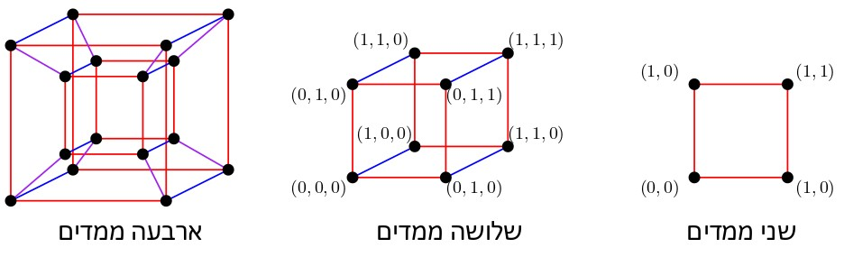
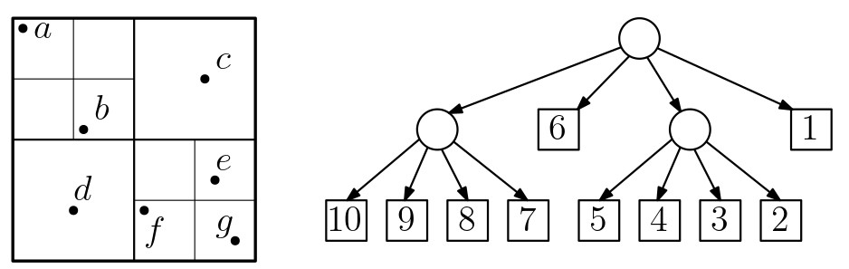
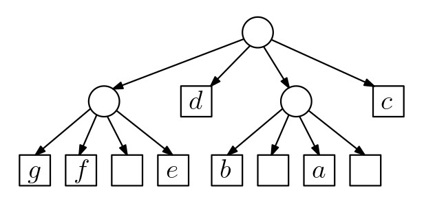
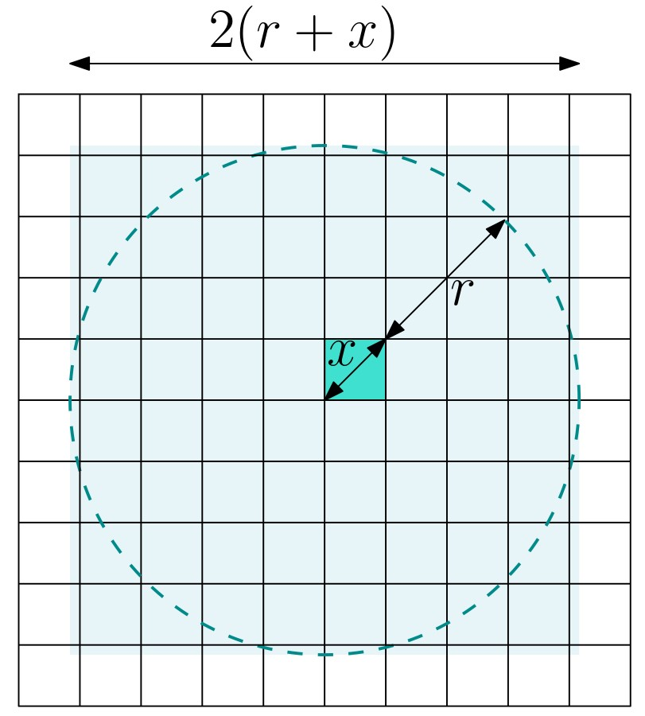
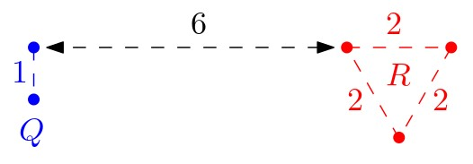

# WSPD ואלגוריתמי קירוב גיאומטריים {#wspd-approx}

## חלק 1: הקדמה {#preface-11}

### מה ביחידה? {#contents-11}

#### WSPD ואלגוריתמי קירוב גיאומטריים {.unnumbered}
ביחידה זו נלמד חלקים מהפרק השלישי בספר Geometric Approximation Algorithms מאת פרופ' שריאל הר-פלד. פרק זה יספק לנו הצצה לתחום חשוב ומרתק: אלגוריתמי קירוב גיאומטריים.

בסיום יחידה זו, תכירו את המושגים ותרכשו את הטכניקות והכלים הבאים:

- אלגוריתמי קירוב גיאומטריים
- ה-spread של קבוצת נקודות
- עצי רביעים (quadtrees)
- פירוק לזוגות מופרדים היטב (WSPD – well-separated pair decomposition)
- פורשים גיאומטריים

למידה מהנה!

### אלגוריתמי קירוב גיאומטריים {#geometric-approx}

כל האלגוריתמים שראינו עד כה בקורס שימשו לחישוב פתרון אופטימלי מדויק לבעיה נתונה. למשל, ביחידה הקודמת כאשר רצינו לחשב את המסלול הקצר ביותר לרובוט מנקודת התחלה \(p_{start}\) לנקודת סיום \(p_{goal}\) בסביבה עם מכשולים, הפתרון שהחזיר האלגוריתם היה אופטימלי: כל מסלול אחר מ-\(p_{start}\) ל-\(p_{goal}\) ללא התנגשויות במכשולים הוא באורך גדול או שווה למסלול שהחזיר האלגוריתם. זמן הריצה של האלגוריתם שראינו הוא קרוב לריבועי, \(O(n^2\log n)\), והוא עלול להיות לא מעשי ליישומים מסוימים שבהם \(n\) גדול מאוד.
לפעמים נהיה מוכנים להתפשר על הדיוק של הפתרון בתמורה לשיפור בזמני הריצה או בסיבוכיות הזיכרון. למשל, נתפשר על כך שהמסלול שיחזיר האלגוריתם לא יהיה הקצר ביותר, אלא לכל היותר באורך פי שניים מאורך המסלול הקצר ביותר, בתמורה לכך שזמן הריצה יהיה קרוב ללינארי. אלגוריתם מסוג זה נקרא **אלגוריתם קירוב**.

שימו לב שאלגוריתמי הקירוב שנדבר עליהם ביחידה זו הם לא אלגוריתמי קירוב לבעיות NP-קשות, אלא דווקא לבעיות שאפשר לפתור בזמן פולינומי. בעיות רבות בגיאומטריה חישובית ניתנות לפתרון בזמן פולינומי כאשר הממד \(d\) הוא קבוע (ובזמן כמעט לינארי כאשר \(d=2\) או \(d=3\)), אך זמן הריצה של הפתרונות הללו תלוי אקספוננציאלית ב-\(d\), מה שהופך אותם לבלתי מעשיים בממדים גבוהים. תופעה מפורסמת זו נקראת **קללת הממד** ([curse of dimensionality](https://en.wikipedia.org/wiki/Curse_of_dimensionality)).

דוגמה אחת לכך היא בעיית Euclidean MST (עץ פורש מינימלי אוקלידי). עבור אוסף של **נקודות במישור**, ניתן למצוא עץ פורש מינימלי של הגרף המלא עליהן (כאשר משקלי הצלעות הם המרחקים בין הנקודות) בזמן \(O(n\log n)\). לעומת זאת, בממד 3 ומעלה זמן הריצה גדל במידה ניכרת, והוא הולך ומתקרב ל-\(O(n^2)\) ככל שהממד גדל. בהמשך היחידה נראה שניתן לחשב קירוב ל-EMST בזמן \(O(n\log n)\) לכל ממד קבוע.

 

מובן שקיימים גם אלגוריתמי קירוב גיאומטריים לבעיות שהן NP-קשות. דוגמה מפורסמת לכך היא בעיית הסוכן הנוסע (TSP - Traveling Salesman Problem): בהינתן אוסף של נקודות במישור, יש למצוא את המסלול הקצר ביותר שעובר בכולן. זו בעיה NP-קשה, אך קיימים עבורה אלגוריתמים יעילים מאוד בעלי פקטור קירוב קבוע, כמו שתוכיחו בתרגיל הבא.

#### תרגיל: אלגוריתם קירוב-2 לבעיית הסוכן הנוסע במישור  {.unnumbered}
נתונה קבוצה \(P\) של \(n\) נקודות במישור. נתון אלגוריתם שמחשב את ה-EMST של \(P\) בזמן \(O(n\log n)\). הראו שניתן לחשב בזמן \(O(n\log n)\) מסלול שעובר בכל נקודות \(P\), ושאורכו לכל היותר פי שניים מאורך המסלול הקצר ביותר העובר בכל נקודות \(P\).

#### מעניין לדעת: סכמת קירוב פולינומית {.unnumbered}
למעשה, עבור בעיית TSP האוקלידית קיימת **סכמת קירוב פולינומית** (PTAS - Polynomial Time Approximation Scheme): זהו אלגוריתם המקבל נוסף על הקלט של הבעיה פרמטר \(\varepsilon>0\), ומחזיר פתרון שהוא לכל היותר פי \(1+\varepsilon\) מהפתרון האופטימלי, בזמן ריצה פולינומי **בגודל הקלט**. זמן הריצה יהיה תלוי כמובן ב-\(\varepsilon\), והוא יכול להיות תלוי אקספוננציאלית ב-\(1/\varepsilon\). עבור \(\varepsilon\) קבוע, נקבל זמן ריצה פולינומי.

### ה-spread של קבוצת נקודות  {#spread}

הסיבוכיות של האלגוריתמים ושל מבני הנתונים שראינו בקורס תלויה בגודל הקומבינטורי של הפלט והקלט, כלומר במספר הנקודות או האובייקטים, ולא ב**תכונות גיאומטריות** של הקלט, כמו מרחקים בין נקודות, אורכי צלעות, זוויות או שיפועים של ישרים. מה הסיבה לכך?

#### צפו בסרטון הבא: {.unnumbered}

<iframe width="560" height="315" src="https://www.youtube.com/embed/lX9cyWpP6s0?si=vG2o1v24sPlOFg_l" title="YouTube video player" frameborder="0" allow="accelerometer; autoplay; clipboard-write; encrypted-media; gyroscope; picture-in-picture; web-share" referrerpolicy="strict-origin-when-cross-origin" allowfullscreen></iframe>

#### הגדרה: ה-spread של קבוצת נקודות {.unnumbered}
עבור קבוצה \(P\) של \(n\) נקודות ב-\(\mathbb{R}^d\), ה-spread של \(P\) הוא
\[\Phi(P)=\frac{\max_{p,q\in P}\|p-q\|}{\min_{p,q\in P, p\neq q}\|p-q\|}.\]

#### תרגיל: מספר הרמות בחלוקה לפי מרחק {.unnumbered}
הראו שמספר הרמות בחלוקה של קבוצת נקודות \(P\) לפי מרחק שהוזכרה בסרטון הוא
\(O(\log(\Phi(P))\).

## חלק 2: עצי רביעים (quadtrees) {#quadtrees}

### עצי רביעים (quadtrees) {#quadtrees}
עץ רביעים (quadtree) הוא חלוקה היררכית של המרחב לתאים. זהו מבנה נתונים פשוט יחסית, ועם זאת הוא אחד המבנים השימושיים ביותר בגיאומטריה חישובית (בחלק הבא של היחידה נראה כיצד ניתן להשתמש בו כדי לבנות מבנה אחר, WSPD, שישמש אותנו במגוון אלגוריתמי קירוב). לעץ רביעים יש אופי מעט שונה מאלו שראינו עד כה, מכיוון שהחלוקה ההיררכית מתבצעת ביחס למרחקים בין הנקודות, ולא ביחס למספר הנקודות.

#### היפרקובייה (קובייה \(d\)-ממדית)  {.unnumbered}
ביחידה זו לא נגביל את עצמנו למישור האוקלידי, ונתייחס למרחבים מממד \(d\) כלשהו, כאשר **\(d\) הוא קבוע** שאינו תלוי בגודל הקלט (המשמעות היא ש-\(2^d\) למשל, הוא מספר קבוע). 

המבנה ההיררכי שנראה מייד מחלק את המרחב לתאים שכל אחד מהם הוא **היפרקובייה** – זוהי הכללה של מושג הקובייה לממד כללי: הקודקודים של היפרקוביית היחידה מממד \(d\) הם \(2^d\) הנקודות מממד \(d\) שכל הקואורדינטות שלהן הן 0 או 1. להיפרקובייה יש צלע המחברת זוג קודקודים כאלו, אם ורק אם הם שונים זה מזה בקואורדינטה אחת בלבד. היפרקובייה כללית מתקבלת באמצעות הזזה, סיבוב, או שינוי קנה מידה (scaling) של היפרקוביית היחידה.

 

#### בניית עץ רביעים {.unnumbered}
נתונה קבוצה \(P\) של \(n\) נקודות במרחב אוקלידי \(d\)-ממדי, ונניח שהן חסומות על ידי היפרקוביית היחידה (אם לא זה המצב, ניתן להזיז ולשנות את קנה המידה). 

עץ רביעים הוא חלוקה היררכית של היפרקוביית היחידה לתאים, שכל אחד מהם הוא היפרקובייה קטנה יותר. את התאים נשמור בעץ מושרש \(\mathcal{T}\), כך שכל צומת \(v\) מתאים לתא \(\square_v\) בחלוקה. השורש של \(\mathcal{T}\) מתאים להיפרקוביית היחידה, ובניית שאר העץ מתבצעת באופן רקורסיבי:

- נסתכל על צומת \(u\) של העץ המתאים לתא \(\square_u\) שעדיין לא נסרק.
- אם \(\square_u\) מכיל לכל היותר נקודה אחת של \(P\) (ייתכן שהוא ריק), אז הצומת \(u\) יהיה עלה של העץ \(\mathcal{T}\).
- אחרת, נחלק את \(\square_u\) ל-\(2^d\) היפרקוביות קטנות יותר, כל אחת בעלת אורך צלע שהוא בדיוק חצי מאורך הצלע של \(\square_u\). לכל אחד מהתאים האלו ניצור צומת חדש שיהיה בן של הצומת \(u\) בעץ \(\mathcal{T}\).

עבור \(d=2\), ההיפרקובייה היא ריבוע, ובכל שלב ברקורסיה נחלק ריבוע לארבעה רביעים: NE, NW, SW, SE (כמו באיור למטה). מכאן שמו של המבנה – עץ רביעים, או באנגלית quadtree.

#### ענו על השאלה הבאה: {.unnumbered}
השלימו את עץ הרביעים שבאיור.

{width="80%"}

(פתרון)

{width="80%"}

### עץ רביעים דחוס (compressed quadtree) {#compressed-quadtree}
המבנה שתיארנו בעמוד הקודם נוטה להיות יעיל מאוד באופן מעשי, אך צריך לשים לב לשני עניינים חשובים שעלולים לגרום לכך שזמן הריצה יהיה גדול מאוד במקרים מסוימים.

הראשון הוא שמספר הצמתים בעץ יכול להיות גדול הרבה יותר מ-\(O(n)\). לדוגמה, אם בתא כלשהו כל הנקודות קרובות מאוד זו לזו יחסית לגודל התא, כמו באיור משמאל, אז העץ יכיל מסלול ארוך מאוד שמוביל לנקודות האלו, שבו לכל צומת יהיה רק בן אחד (מתוך \(2^d\)) שהוא צומת פנימי בעץ.

#### תרגיל: מספר הצמתים במקרה הגרוע {.unnumbered}
מה יהיה מספר הצמתים בעץ הרביעים שמתואר למעלה, במקרה הגרוע ביותר? כתבו חסם אסימפטוטי כתלות ב-spread.

#### דחיסת מסלולים {.unnumbered}
ניתן להקטין את מספר הצמתים בעץ עד כדי \(O(n)\) בעזרת תהליך של דחיסת מסלולים. הרעיון הוא לכווץ כל מסלול "טריוויאלי" כזה לצומת יחיד. העץ שמתקבל אחרי דחיסה של כל המסלולים הטריוויאליים נקרא **עץ רביעים דחוס (compressed quadtree)**, ומכיוון שלכל צומת פנימי בו יש לפחות שני בנים שתת-העץ המושרש בהם מכיל תא עם נקודה מ-\(P\), מספר הצמתים הפנימיים הוא לכל היותר \(n-1\), ולכן מספר הצמתים הכולל בעץ הוא \(O(n)\).

#### זמן בניית העץ {.unnumbered}
העניין השני שצריך לשים לב אליו הוא זמן הריצה של אלגוריתם הבנייה של העץ. אמנם ניתן לבנות את העץ בזמן \(O(n\cdot h)\) כאשר \(h\) הוא הגובה של העץ, אך מכיוון שגובה העץ יכול להיות \(O(n)\), נקבל זמן ריצה של \(O(n^2)\). למעשה, ניתן להראות שאפשר לבנות עץ רביעים בזמן \(O(n\log n)\)! לא נלמד את אלגוריתם הבנייה הזה בקורס, אך בהמשך היחידה נשתמש במשפט הבא :

::: rmdimportant
**משפט**: בהינתן קבוצה \(P\) של \(n\) נקודות מממד קבוע \(d\), ניתן לבנות עבור \(P\) עץ רביעים דחוס (compressed quadtree) בעל \(O(n)\) צמתים בזמן \(O(n\log n)\).
:::

#### תרגיל: בניית עץ רביעים בזמן \(O(n\cdot h)\) {.unnumbered}
כיצד ניתן לבנות עץ רביעים עבור קבוצה \(P\) של \(n\) נקודות, בזמן \(O(n\cdot h)\), כאשר \(h\) הוא גובה העץ?

#### שאלה למחשבה: שימוש בעץ רביעים לבעיית חיפוש בתחומים {.unnumbered}
נתונה קבוצה \(P\) של \(n\) נקודות במישור, ועץ רביעים \(T\) דחוס עבורה. בהינתן מלבן \(R\), הראו כיצד ניתן למצוא את אוסף כל הנקודות מ-\(P\) שמוכלות במלבן \(R\) באמצעות חיפוש ב-\(T\). מה יהיה זמן הריצה לחיפוש במקרה הגרוע?

#### לקריאה נוספת {.unnumbered}
ביחידה זו לא ניכנס לעומק הבנייה והניתוח של עצי רביעים, ונסתפק בהיכרות עם המבנה ותכונותיו, שמופיעים בעמוד זה. למעוניינים בהעמקה, ניתן לקרוא עוד על עצי רביעים בפרק השני בספר Geometric Approximation Algorithms מאת פרופ' שריאל הר-פלד, וכן בספר הלימוד המרכזי של הקורס, בסעיף 14.2 (עמודים 309–315).

### תכונת האריזה (packing property) {#packing}
לעץ רביעים (לא דחוס) יש שתי תכונות חשובות:
1. לכל צומת בעץ מתאים תא (היפרקובייה) בעל אורך צלע שקטן בדיוק פי שניים מאורך הצלע של התא המתאים לאבא של הצומת.
2. כל התאים הנמצאים באותה רמה של העץ הם היפרקוביות שהן בדיוק באותו הגודל, וכולן זרות בפנימן.

שתי התכונות האלו מובילות לתכונת האריזה, שנזדקק לה בחלק הבא של היחידה:

::: rmdimportant
**למה (The packing lemma)**: יהי \(\square\) תא בעץ רביעים מממד קבוע \(d\) שהקוטר שלו הוא \(x\). לכל \(r\ge x\), מספר התאים בעץ הרביעים שהם באותה רמה של \(\square\) בעץ ונמצאים במרחק לכל היותר \(r\) ממנו הוא \(O((r/x)^d)\).
:::

משפט זה מופיע (בשינויים קלים) בלמה 3.5 בפרק השלישי בספר Geometric Approximation Algorithms. אין הוכחה של הלמה בספר, ולכן היא מובאת כאן.

#### הוכחת ה-packing lemma {.unnumbered}

נשים לב שאוסף הנקודות שנמצאות במרחק \(r\) מהתא \(\square\) מוכלות בכדור ברדיוס \(r+x)\), ולכן כל תא בקוטר x שמכיל נקודה במרחק לכל היותר \(r\) מ-\(\square\) חייב להיות מוכל בהיפרקובייה \(H\)בעלת אורך צלע \(2(r+x)+2x\). נפח ההיפרקובייה \(H\) הוא \((2r+4x)^d\), ונפח כל אחד מהתאים ברמה של \(\square\) הוא \(x^d\), כי לכולם אורך צלע זהה – \(x\). מכיוון שהתאים ברמה של \(\square\) זרים זה לזה (וגם ל-\(\square\)), נקבל שמספר התאים שמוכלים ב-\(H\) הוא לכל היותר \((4+ \frac{2r}{x})^d\). מכיוון שהממד \(d\) קבוע, נקבל שיש \(O((r/x)^d)\) תאים כאלו.

## חלק 3: פירוק לזוגות מופרדים היטב (WSPD) {#WSPD}

### סימולציית N הגופים {#N-body}

סימולציית N הגופים ([N-body simulation](https://en.wikipedia.org/wiki/N-body_simulation)) משמשת לפתרון של בעיה נפוצה וחשובה במגוון תחומים בפיזיקה. משתמשים בסימולציה מהסוג הזה כאשר מעוניינים למדל מערכת פיזיקלית דינמית המערבת מספר רב של גופים המשפיעים זה על זה (למשל גרמי שמיים וכוחות הכבידה שלהם). ניתן לבצע חישובים מדויקים של התנועה המתקבלת מהאינטראקציה ההדדית בין שני גופים, אך כבר עבור מערכת של שלושה גופים החישובים נעשים מורכבים מדי, ולכן משתמשים בסימולציה מקורבת של המערכת.

 
סימולציה של N גופים, קרדיט: https://github.com/n3a9/nbody-simulation

 

כדי לחשב את התנועה של גוף יחיד בסימולציה של \(n\) גופים, יש לחשב את הכוחות שמפעילים עליו \(n-1\) הגופים האחרים. כלומר עבור גוף אחד נדרשים לנו \(\Omega(n)\) חישובים, ולכן נדרשים לנו \(\Omega(n^2)\) חישובים בסך הכול. האם יש דרך מהירה יותר לחישוב?
נניח שמה שאנחנו צריכים לחשב עבור הסימולציה הוא המרחק בין כל שני גופים. יש \(n \choose 2\) זוגות של גופים, ולכן לא ניתן לחשב את כל המרחקים באופן מדויק בזמן תת-ריבועי. לכן המטרה שלנו תהיה למצוא ייצוג קומפקטי של כל הקבוצה, שישמר את המבנה של המרחקים בין הגופים באופן מקורב.
 

נשים לב לאבחנה הבאה: אם יש לנו קבוצה \(S\) של גופים הקרובים זה לזה 
יחסית לנקודה אחת \(t\) שרחוקה מכולן, אז המרחק מ-\(t\) לכל אחת מהנקודות ב-\(S\) יהיה דומה. מכאן שמספיק לקחת נציג \(s\) מהקבוצה \(S\), והמרחק בינו לבין \(t\) יהיה קירוב טוב למרחק בין \(t\) לכל אחת מהנקודות ב-\(S\). בעצם, ככל שהנקודה \(t\) רחוקה מהקבוצה \(S\), כך ההבדל בין המרחקים השונים קטֵן, והקירוב משתפר.

המבנה שנתאר בעמוד הבא מבוסס בדיוק על הרעיון הזה, ובהמשך נראה כיצד ניתן להשתמש בו עבור אלגוריתמי קירוב גיאומטריים.

### פירוק לזוגות מופרדים היטב – הגדרות {#WSPD-defs}

בסרטון הבא נגדיר מהו פירוק לזוגות מופרדים היטב (well-separated pair decomposition).

#### צפו בסרטון הבא: {.unnumbered}

<iframe width="560" height="315" src="https://www.youtube.com/embed/zhHTJap2XGw?si=fpgU7nMuSGlIBfx_" title="YouTube video player" frameborder="0" allow="accelerometer; autoplay; clipboard-write; encrypted-media; gyroscope; picture-in-picture; web-share" referrerpolicy="strict-origin-when-cross-origin" allowfullscreen></iframe>

#### הגדרה: פירוק לזוגות {.unnumbered}
עבור שתי קבוצות, \(A\) ו-\(B\), נסמן
\[A\otimes B=\{\{x,y\}\mid x\in A, y\in B, x\neq y\}\]
כלומר \(A\otimes B\) היא קבוצת כל זוגות הנקודות, אחת מ-\(A\) והשנייה מ-\(B\).

בהינתן קבוצת נקודות \(P\), פירוק של \(P\) לזוגות הוא אוסף של זוגות
\(\{\{A_1,B_1\},\dots,\{A_s,B_s\}\}\)
כך שמתקיים:

1.  לכל \(1\le i\le s\), \(A_i,B_i\subset P\).
2.  לכל \(1\le i\le s\), \(A_i\cap B_i=\emptyset\).
3.  \(\bigcup_{i=1}^s A_i\otimes B_i=P\otimes P\), כלומר לכל זוג נקודות שונות \(p,q\in P\) קיים לפחות זוג אחד \(\{A_i,B_i\}\) כך ש-\(p\in A_i\) ו-\(q\in B_i\), או \(q\in A_i\) ו-\(p\in B_i\).

#### ענו על השאלה הבאה:  {.unnumbered}
נתונה הקבוצה \(P=\{a,b,c\}\) ותתי הקבוצות:

\(A_1=\{a,b\}\)
\(A_2=\{a\}\)
\(B_1=\{b,c\}\)
\(B_2=\{c\}\)

מי מהבאים הוא פירוק לזוגות של \(P\), ומדוע?

1. \(\{\{A_1,B_1\}\}\)?
2. \(\{\{A_1,B_2\}\}\)?
3. \(\{\{A_2,B_1\}, \{A_1,B_2\}\}\)?

(פתרון)

#### הגדרה: הקוטר של קבוצת נקודות {.unnumbered}

הקוטר של קבוצת נקודות \(P\) מסומן \(\text{diam}(P)\) והוא שווה למרחק בין שתי הנקודות הרחוקות ביותר ב-\(P\), כלומר 
\(\text{diam}(P)=\max_{p,q\in P}\|p-q\|\).

#### תרגיל: חישוב הקוטר {.unnumbered}

הראו כיצד ניתן לחשב את הקוטר של קבוצה של \(n\) נקודות במישור, בזמן \(O(n\log n)\).

(פתרון)

#### הגדרה: זוג מופרד היטב (separated pair-\(1/\varepsilon\))  {.unnumbered}

עבור \(1>\varepsilon>0\), זוג קבוצות \(Q\) ו-\(R\) הוא \(1/\varepsilon\)-מופרד היטב אם הקוטר של כל אחת מהקבוצות הוא לכל היותר
\(\varepsilon\cdot \textbf{d}(Q,R)\)\, כאשר \(\textbf{d}(Q,R)\) הוא המרחק הקטן ביותר בין נקודה מ-\(Q\) לנקודה מ-\(R\), כלומר
\(\textbf{d}(Q,R)=\min_{q\in Q,s\in R}\|q-s\|\).

#### ענו על השאלה הבאה:  {.unnumbered}

מהו ה-\(\varepsilon\) הקטן ביותר עבורו זוג הקבוצות באיור הוא \(1/\varepsilon\)-מופרד היטב?

{width="75%"}

(פתרון)

1/3

#### תרגיל: הגדרה אלטרנטיבית  {.unnumbered}

בסרטון הוצגה ההגדרה האלטרנטיבית הבאה לזוג מופרד היטב:

עבור \(0<\varepsilon<1\), זוג קבוצות \(A\) ו-\(B\) הוא \(1/\varepsilon\)-מופרד היטב אם קיים כדור ברדיוס $r$ שמכיל את כל הנקודות של $A$, וכדור ברדיוס $r$ שמכיל את כל הנקודות של $B$, כך שהמרחק בין הכדורים הוא לפחות $2r/\varepsilon$.

האם הגדרה זו שקולה להגדרה הקודמת? האם אחת מהן גוררת את האחרת? הוכיחו או תנו דוגמה נגדית.

(פתרון)

#### הגדרה: פירוק לזוגות מופרדים היטב (WSPD-\(1/\varepsilon\)) {.unnumbered}

עבור קבוצת נקודות \(P\) ופרמטר \(\varepsilon>0\), פירוק לזוגות מופרדים היטב של \(P\) ביחס \(1/\varepsilon\) הוא פירוק של \(P\) לזוגות
\(\{\{A_1,B_1\},\{A_2,B_2\},\dots,\{A_s,B_s\}\}\)
 כך שלכל \(1\le i\le s\) הזוג \(\{A_i,B_i\}\) הוא \(1/\varepsilon\)-מופרד היטב.

#### קראו את סעיף 3.1 בספר הלימוד (עמודים 29–31). {.unnumbered}

### אלגוריתם לבניית WSPD {#WSPD-alg}

כעת נראה כיצד ניתן לבנות WSPD בעזרת quadtree.

#### צפו בסרטון הבא: {.unnumbered}

<iframe width="560" height="315" src="https://www.youtube.com/embed/IXq_u-nv0HE?si=oD-nKMjb0AdMZDmF" title="YouTube video player" frameborder="0" allow="accelerometer; autoplay; clipboard-write; encrypted-media; gyroscope; picture-in-picture; web-share" referrerpolicy="strict-origin-when-cross-origin" allowfullscreen></iframe>

::: rmdimportant
**משפט**: עבור \(1\ge \varepsilon>0\) ניתן לבנות WSPD-\(1/\varepsilon\) בגודל \(O(n\varepsilon^{-d})\), בזמן \(O(n\log n+n\varepsilon^{-d})\).
:::

#### קראו את סעיף 3.1.1 בספר הלימוד (עמודים 31–33). {.unnumbered}

## חלק 4: שימושים של WSPD {#WSPD-apps}

### פורשים גיאומטריים {#spanners}

נניח שנתונה קבוצה \(P\) של \(n\) ערים, ואנחנו רוצים לבנות רשת של מסילות רכבת שיקשרו ביניהן. מצד אחד, נרצה שהמרחק בין שני אתרים \(p,q\in P\) על גבי הרשת יהיה קרוב ככל האפשר למרחק האוקלידי ביניהם, \(\|p-q\|\). מצד אחר, בניית מסילות והפעלה של כל קו רכבת עולות לא מעט כסף, ולכן נרצה שמספר המסילות ברשת (או סכום האורכים שלהן) יהיה קטן ככל האפשר.

#### שאלה למחשבה: מקרי קיצון {.unnumbered}
- איזו רשת מסילות נבנה אם אין לנו אילוצי תקציב בכלל, וחשוב לנו שנוכל להגיע מעיר אחת לאחרת במהירות המקסימלית האפשרית? 
- איזו רשת מסילות נבנה אם אילוץ המרחקים לא חשוב לנו, ואנחנו רוצים לחסוך כמה שיותר כסף?

#### הגדרה: \(t\)-פורש גיאומטרי {.unnumbered}

גרף \(t\)-פורש של קבוצת נקודות \(P\) ב-\(\mathbb{R}^d\) הוא גרף ממושקל \(G\) שקבוצת הקודקודים שלו היא \(P\), ולכל שתי נקודות \(p,q\in P\) מתקיים
\[\|p-q\|\le d_G(p,q)\le t\cdot\|p-q\|,\]
כאשר \(d_G(p,q)\) הוא המרחק בין \(p\) ל-\(q\) בגרף (כלומר אורך המסלול הקצר ביותר ביניהן בגרף \(G\)).

היחס \(d_G(p,q)/\|p-q\|\) נקרא ה-**stretch** של \(p\) ו-\(q\), וה-stretch של \(G\) הוא ה-stretch המקסימלי על פני כל זוגות הנקודות מ-\(P\).

#### ענו על השאלה הבאה:  {.unnumbered}
בכל אחד מהאיורים שלמטה ניתן לראות קבוצה של נקודות שחורות, ופורש שלהן שצלעותיו כחולות. בשני האיורים, כל הצלעות של הפורש הן באורך \(r\). מהו ה-stretch בכל אחד מהמקרים?

(פתרון)

באיור מימין, ה-stretch של הגרף הפורש הוא 2, ובאיור משמאל הוא \(\sqrt{2}\).

#### מ-WSPD לפורש גיאומטרי בגודל לינארי {.unnumbered}
בדרך כלל, עבור קבוצה של \(n\) נקודות נרצה למצוא \(t\)-פורש בעל \(O(n)\) צלעות בלבד, מכיוון שאז נוכל לבצע עליו חישובים ביעילות. מובן שנרצה גם \(t\) קטן ככל האפשר, כדי שהקירוב למרחקים יהיה כמה שיותר טוב.
עובדה ידועה (שלא נוכיח כאן) היא שגרף דלוני הוא \(O(1)\)-פורש (ראו הערה למטה), אך מספר הצלעות שלו הוא \(O(n)\) רק עבור נקודות במישור. בממדים גבוהים יותר, מספר הצלעות יכול להיות ריבועי.

כפי שתקראו מייד בספר, בעזרת WSPD ניתן לחשב \(1+\varepsilon\)-פורש בגודל \(O(n\varepsilon^{-d})\)/ עבור קבוצה של \(n\) נקודות ב-\(\mathbb{R}^d\), לכל \(d\) קבוע.

::: rmdimportant
**משפט (3.12 בספר הלימוד)**: בהינתן קבוצה \(P\) של \(n\) נקודות ב-\(\mathbb{R}^d\), ופרמטר \(1\ge \varepsilon >0\), ניתן לחשב \((1+\varepsilon)\)-פורש בגודל
\(O(n/\varepsilon)\) של \(P\) עם 
\(O(n\varepsilon^{-d})\) צלעות, בזמן 
\(O(n\log n+n\varepsilon^{-d})\).
:::

#### קראו את סעיף 3.2.1 בספר הלימוד (עמודים 33–35). {.unnumbered}

#### מעניין לדעת: ה-stretch של גרף דלוני {.unnumbered}
בשנת 1992 הראו זוג החוקרים ([Keil and Gutwin](https://link.springer.com/article/10.1007/BF02187821)) שגרף דלוני הוא \(t\)-פורש עבור
\(t=4\pi\sqrt{3}/9\approx 2.41\).
זהו רק חסם עליון על \(t\), כלומר ייתכן שגרף דלוני הוא \(t\)-פורש עבור \(t\) קטן יותר מ-2.41. במשך שנים רווחה ההשערה שגרף דלוני הוא \(\pi/2\)-פורש, עד שבשנת 2008 היא הוכחה כשגויה, והחסם התחתון עומד כרגע על קצת יותר מ-\(\pi/2\). אחת השאלות הפתוחות החשובות ביותר בתחום היא סגירת הפער בין החסם העליון לתחתון.

### אלגוריתמי קירוב גיאומטריים {#approx-algs}
שני הסעיפים הבאים בספר מתארים שני שימושים של WSPD באלגוריתמי קירוב גיאומטריים. 

#### קירוב לעץ פורש מינימלי אוקלידי (EMST) {.unnumbered}

עץ פורש מינימלי אוקלידי (EMST - Euclidean Mimimum Spanning Tree) של קבוצת נקודות \(P\) הוא העץ הפורש המינימלי (MST) של הגרף האוקלידי המלא על נקודות \(P\) (הגרף הממושקל שקודקודיו הם נקודות \(P\) ומשקל כל צלע הוא המרחק האוקלידי בין הנקודות). ראינו ביחידה 9 שה-EMST הוא תת-גרף של גרף דלוני של \(P\), והסקנו שניתן לחשב את ה-EMST של קבוצת נקודות במישור בזמן \(O(n\log n)\).
שוב, מכיוון שבממדים גבוהים מספר הצלעות בגרף דלוני יכול להיות ריבועי, לא נוכל לקבל באותו האופן פתרון טוב יותר מאשר הפתרון למקרה הכללי, כלומר זמן של \(O(n^2)\).

עם זאת, נוכל להראות שלכל \(\varepsilon >0\) ניתן לחשב עץ פורש של \(P\) עם משקל של לכל היותר \(1+\varepsilon\) כפול משקל ה-EMST של \(P\). הרעיון הוא לחשב \(1+\varepsilon\)-פורש \(G\) של \(P\) עם \(O(n\varepsilon^{-d})\)/ צלעות, כמו שראינו קודם, ואז לחשב את ה-MST של \(G\) בזמן כמעט לינארי בעזרת אחד מהאלגוריתמים הידועים לחישוב MST. לאחר מכן יש להוכיח את הטענה הזו:
משקל ה-MST של גרף t-פורש של קבוצת נקודות P, הוא לכל היותר פי t ממשקל ה-EMST של P.

#### קראו את סעיף 3.2.2 בספר הלימוד (עמוד 35). {.unnumbered}

#### חישוב הקוטר של קבוצת נקודות {.unnumbered}
בחלק הקודם הגדרנו את הקוטר של קבוצת נקודות, וראינו שניתן לחשב את הקוטר של קבוצה של \(n\) נקודות במישור בזמן \(O(n\log n)\). גם כאן לא ניתן להכליל את האלגוריתם לממדים גבוהים, מכיוון שסיבוכיות הקמור תלויה אקספוננציאלית בממד.

בעזרת WSPD ניתן לחשב קירוב קבוע לקוטר, בזמן \(O(n\log n)\).

::: rmdimportant
**משפט (למה 3.14 בספר הלימוד)**: בהינתן קבוצה \(P\) של \(n\) נקודות ב-\(\mathbb{R}^d\), ניתן למצוא בזמן \(O(n\log n+n\varepsilon^{-d})\) זוג נקודות \(p,q\in P\) כך שמתקיים
\(\|p-q\|\ge (1-\varepsilon)\text{diam}(P)\).
:::

#### קראו את סעיף 3.2.3 בספר הלימוד (עמודים 35–36). {.unnumbered}

### הזוג הקרוב ביותר {#closest-pair}
בהינתן קבוצה \(P\) של \(n\) נקודות ב-\(\mathbb{R}^d\), נרצה למצוא את זוג הנקודות מ-\(P\) שהמרחק ביניהן הוא הקטן ביותר.

אלגוריתם טריוויאלי יחשב את המרחקים בין כל זוגות הנקודות בזמן \(O(n^2)\). עבור נקודות במישור, ניתן לפתור את הבעיה בזמן \(O(n\log n)\) באמצעות חישוב דיאגרמת וורונוי, כמו שראינו ביחידה 7. אבל הסיבוכיות של דיאגרמת וורונוי תלויה אקספוננציאלית בממד \(d\): בממדים גבוהים הסיבוכיות של הדיאגרמה היא \(O(n^{\lceil d/2\rceil})\), ולכן כבר בשלושה ממדים נקבל זמן ריבועי. קיים אלגוריתם רנדומי שמוצא את הזוג הקרוב ביותר, בתוחלת זמן \(O(n)\), אך בעזרת WSPD ניתן למצוא את הזוג הקרוב ביותר (במדויק!) בזמן \(O(n\log n)\), לכל \(d\) קבוע.

::: rmdimportant
**משפט (3.16 בספר הלימוד)**: בהינתן קבוצה \(P\) של \(n\) נקודות ב-\(\mathbb{R}^d\), ניתן למצוא את זוג הנקודות הקרובות ביותר, בזמן \(O(n\log n)\).
:::

#### קראו את סעיף 3.2.4 בספר הלימוד (עמוד 36). {.unnumbered}

#### בונוס: בעיית כל השכנים הקרובים ביותר {.unnumbered}
בהינתן קבוצה \(P\) של \(n\) נקודות ב-\(\mathbb{R}^d\), נרצה למצוא לכל נקודה \(p\in P\) את השכן הקרוב אליה ביותר, כלומר את הנקודה הקרובה אליה ביותר מהקבוצה \(P\setminus \{p\}\).

גם כאן ניתן לפתור את הבעיה בשני ממדים בקלות יחסית, בעזרת דיאגרמת וורונוי. אך מה לגבי ממדים גבוהים? באופן די מדהים, גם כאן ניתן להשתמש ב-WSPD כדי לפתור את הבעיה בזמן \(O(n\log n)\) לכל \(d\) קבוע. למעוניינים, ניתן לקרוא את פרטי ההוכחה בסעיף 3.2.5 בספר הלימוד (עמודים 36–39), אך היא אינה חלק מחומר הקורס.
