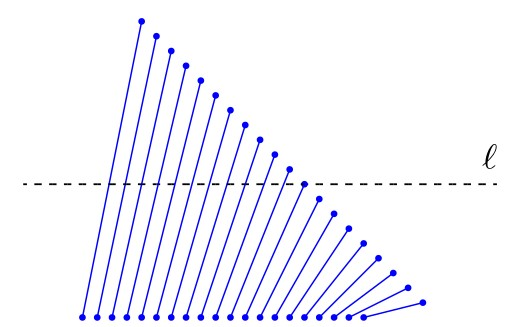

# מפות מישוריות וטכניקת הישר הסורק

## הקדמה

### שכבות מידע במפה

ביחידה זו נתייחס לבעיות הנוגעות לחיתוכי קטעים במישור. דוגמה אחת לבעיה
כזו מופיעה בתחום של מערכות מידע גאוגרפיות (GIS - Graphic Information
Systems), כאשר רוצים להציג ולנתח שכבות מידע ממספר מפות. למשל, בהינתן מפה
של נהרות ומפה של כבישים, נוכל להצליב את המידע משתי המפות על מנת למצוא
היכן ממוקמים גשרים: אלו הן נקודות החיתוך בין כבישים לנהרות. כל מפה
נושאית כזו ניתנת לייצוג גאומטרי על ידי אוסף של קטעים, עקומים, או
פוליגונים. בעזרת טכניקות גאומטריות, נוכל למצוא את נקודות החיתוך ולחשב את
הייצוג המאוחד של שתי מפות (map overlay).

תחילה נראה כיצד ניתן למצוא את כל החיתוכים באוסף קטעים נתון, ולשם כך
נשתמש בטכניקה חשובה שימושית מאוד: טכניקת הישר הסורק (sweep-line). לאחר
מכן נדבר על ייצוג של מפות מישוריות (גרפים מישוריים), ונתאר מבנה נתונים
יעיל לאחסונם - DCEL. לבסוף, נראה כיצד ניתן לאחד שני מבנים כאלה, המייצגים
שתי מפות מישוריות, למפה מישורית אחת המאגדת את כל המידע.

#### קראו את ההקדמה לפרק 2 (עמודים 19--20).

## טכניקת הישר הסורק

### חיתוך קטעים במישור

טכניקת הישר הסורק (sweep-line) היא חשובה ושימושית מאוד בגאומטריה
חישובית. כדי להדגים את השימוש בטכניקה הזו, ולפני שנדבר על מפות מישוריות,
נציג בעיה פשוטה לכאורה שנקראת בעיית חיתוך קטעים במישור (line segment
intersection). בבעיה זו, הקלט הוא אוסף של קטעים במישור, והמטרה היא למצוא
את כל נקודות החיתוך בין קטעים. בסרטון הבא נתאר את רעיון השימוש בישר
הסורק עבור בעיית חיתוך קטעים במישור.

#### צפו בסרטון הבא:

בטכניקת הישר הסורק, הרעיון הוא "לסרוק" את הקטעים בעזרת ישר אופקי $\ell$
הנע מלעלה למטה. ה"**סטטוס**" (status) של הישר הוא אוסף הקטעים הנחתכים עם
הישר במיקומו הנוכחי. את הסטטוס יש לעדכן בזמן שהישר נע מטה, אך הוא אינו
מתעדכן באופן רציף - העדכון מתבצע רק כאשר הישר מגיע לנקודות מסויימות, להן
אנו קוראים "**מאורעות**" (event points). בבעיית חיתוך הקטעים, המאורעות
הם נקודות הקצה של הקטעים, וגם נקודות החיתוך עצמן, שמתגלות במהלך
האלגוריתם. בכל פעם שהישר מגיע למאורע, יש לעדכן את הסטטוס ואת תור
המאורעות, ולבצע בדיקות של חיתוכים בין הקטעים בסטטוס.

#### ענו על השאלה הבאה:

זמן הריצה של האלגוריתם הראשון שמתואר בסרטון ומשתמש בשיטת הישר הסורק, הוא
$O(n^2)$. האם קיים אוסף של קטעים ללא נקודות חיתוך כלל, שעבורו זמן הריצה
של האלגוריתם הזה יהיה $\Theta(n^2)$?

(פתרון)

באוסף הקטעים שבאיור אין נקודות חיתוך, אך בשלב שבו הקטע ה- $i$ נוסף
לסטטוס, כבר מופיעים בסטטוס $i-1$ הקטעים הראשונים, ולכן יהיו $i-1$
בדיקות. סך הכל מספר הבדיקות בכל השלבים יהיה $\Theta(n^2)$.

## מבנה DCEL
