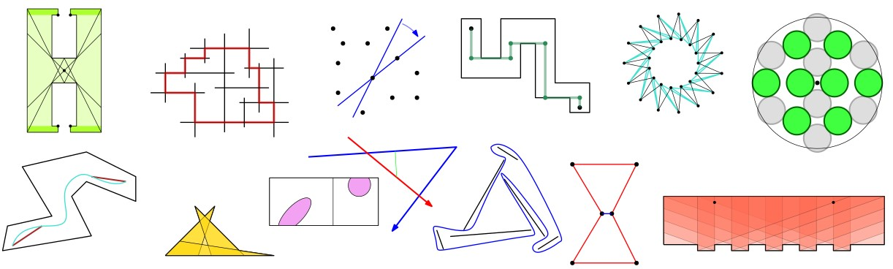

# ברוכים הבאים {.unnumbered #before-we-start}

ספר זה נועד ללוות את הלומדים בקורס גאומטריה חישובית לתואר ראשון, המבוסס על הספר Computational Geometry: Algorithms and Applications מאת 
Mark de Berg, Otfried Cheong, Marc van Kreveld, Mark Overmars.

## לפני שמתחילים {.unnumbered #welcome}

לפני שנתחיל, הנה מספר פרטים שכדאי לדעת:

-   **למי מיועד הקורס?** תלמידים בשלב מתקדם בתואר הראשון, וכן תלמידי תואר שני, במתימטיקה ומדעי המחשב. הקורס מתאים למי שמעוניין להתנסות בתחום מחקר תיאורטי, וגם למי שמחפש בסיס תיאורטי לישומים מעשיים.

-   **למה לי בכלל ללמוד גאומטריה חישובית?** לאלגוריתמים ומבני הנתונים שנלמד יש אינספור יישומים מעשיים חשובים במגוון של תחומים רלוונטיים, כמו גרפיקה וראייה מומחשבת, מערכות מידע גאוגרפיות, ניתוח מידע רב, ועוד. תוכלו לרכוש לעצמכם אוסף של כלים, מודלים, וטכניקות, המוכנים לשליפה ומימוש במגוון של בעיות אלגוריתמיות. נוסף על כך, יש בהם גם יופי מרתק, שנמצא בתכונות הגיאומטריות, בהגדרה הנקיה של הבעיות, ובאופי האסתטי של הפתרונות. בקורס הזה נלמד בעיקר את הטכניקות והאלגוריתמים המהווים בסיס רעיוני למימושים נפוצים, אך גם נושאים הנמצאים בחזית המחקר היום.

#### אופן הלימוד בקורס {.unnumbered}

-   **מבנה הקורס:** בקורס 12 יחידות, כל יחידה תתחיל בהצגה של בעיה חדשה (או אוסף חדש של בעיות), ולאחר מכן יוצגו הכלים (מבני נתונים, אלגוריתמים, מודלים) המתאימים לפתרון.

-   **ספרי הלימוד:** הספר המרכזי של הקורס, אשר ישמש אותנו ביחידות 1-10, הוא \
    [**Computational Geometry: Algorithms and Applications**](http://www.cs.uu.nl/geobook/).\
    שני הפרקים האחרונים בקורס יבוססו על שני פרקים בספר\
    [**Geometric Approximation Algorithms**](https://sarielhp.org/book/).

-   **ידע קודם:** בקורס נדרש ידע בנושאים של סיבוכיות אסימפטוטית, אלגוריתמים ומבני נתונים בסיסיים.

-   **שאלות עזר מנחות:** במהלך כל אחת מיחידות הלימוד יופיעו שאלות הבנה פשוטות (ללא ציון), שיעזרו לכם לוודא שהבנתם באופן בסיסי את ההגדרות והרעיונות של הפרק.

-   **יש נושא ספיציפי שמעניין אתכם? רוצים לראות דוגמאות נוספות?** חומרי עזר לקריאה נוספת והעשרה ינתנו במקומות הרלוונטים. 

-   **מצאתם טעות בחומר הלימוד?** אם מצאתם טעות או בעיה בחומר הלימוד -- בין אם זו שגיאת כתיב, טעות בנוסחה, או חור בהוכחה - אנא כתבו לי.

