# מבוא {#intro}

## הקדמה {#preface-1}

### מה ביחידה? {#-leaning-goals-1}

#### מבוא לגיאומטריה חישובית, והקמור של קבוצת נקודות {.unnumbered}

יחידה זו מקבילה לפרק הראשון בספר הלימוד.

בסיום יחידה זו:

-   תכירו את תחום הגיאומטריה החישובית והמאפיינים שלו.
-   תכירו **מושגי יסוד** בגיאומטריה אוקלידית: המרחב האוקלידי, ישר, קרן, קטע, על-מישור, מעגל, דיסק, עקום, פוליגון, ועוד.
-   תכירו את מושג **הקמור של קבוצת נקודות**, ותדעו איך לחשב אותו ביעילות בעזרת שני אלגוריתמים שונים.
-   תדעו לזהות **מצבים מנוונים** ולדעת מתי נוצרת בעיה ב**עמידות החישוב**.

למידה מהנה!

### מהי גיאומטריה חישובית? {#what-is-cg}

גיאומטריה חישובית היא תחום מחקר במדעי המחשב העוסק בפיתוח של כלים, מודלים, מבני נתונים ואלגוריתמים, המיועדים לפתרון בעיות חישוב גיאומטריות. המחקר התיאורטי בגיאומטריה חישובית מיושם בתחומים רבים ומגוונים. בסרטון הבא נספר איך נולד התחום, ונציג דוגמאות לבעיות שנעסוק בהן במהלך הקורס.

#### צפו בסרטון הבא: {.unnumbered}

<iframe width="560" height="315" src="https://www.youtube.com/embed/BA79rJxiGCs" title="YouTube video player" frameborder="0" allow="accelerometer; autoplay; clipboard-write; encrypted-media; gyroscope; picture-in-picture; web-share" allowfullscreen>

</iframe>

#### מדדים להערכת טיב הפתרון {.unnumbered}

פתרון לבעיה יכול להיות בצורה של אלגוריתם המקבל קלט ומייצר פלט מתאים. במקרה זה טיב הפתרון נמדד ב**זמן הריצה** של האלגוריתם, וב**סיבוכיות הזיכרון** הנדרשת לפעולתו.

כאשר הפתרון הוא בצורה של מבנה נתונים, קיים מדד נוסף, שהוא זמן העיבוד המקדים. לכן בניתוח של מבנה נתונים נתייחס לכל אחד מהמדדים הבאים:

-   **זמן עיבוד מקדים (Preprocessing Time)** - הזמן שלוקח לנו לעבד את הקלט ולבנות את מבנה הנתונים.

-   **סיבוכיות מקום/זיכרון (Storage Space)** - גודל הזיכרון או נפח האחסון שנזדקק לו עבור מבנה הנתונים.

-   **זמן שאילתה (Query Time)** - זמן הריצה של אלגוריתם השאילתה.

#### קראו את ההקדמה לפרק 1 בספר הלימוד (עמודים 1--2). {.unnumbered}

#### להרחבה ולהעשרה: תחומי יישום {.unnumbered}

להרחבה על האפליקציות השונות והתפקיד שמשחקת בהן הגיאומטריה החישובית, מומלץ לקרוא את סעיף 1.3 בספר הלימוד.

### מאפיינים חשובים {#basic-prop}

כמו בכל תחום מדעי, למחקר בגיאומטריה חישובית יש מספר מאפיינים שהתקבעו בעקבות תחומי העניין והמומחיות של החוקרים בתחום. כאן נתאר את העיקריים שבהם.

#### ריגורוזיות {.unnumbered}

לפני שהתפתח המחקר בגיאומטריה חישובית, היו המון היוריסטיקות ופתרונות אד-הוק ליישומים גיאומטריים. פתרונות כאלה נבדקו באמצעות ניסויים, ולכן היו בדרך כלל יעילים רק במצבים מסוימים, ולעיתים אף היו שגויים לחלוטין. לעומת זאת, הגיאומטריה החישובית התפתחה כתחום מתמטי שבו הגישה לפתרון היא ריגורוזית: הבעיות מוגדרות היטב, וכל פתרון כולל הוכחת יעילות ונכונות מתמטית.

#### ממד נמוך {.unnumbered}

היסטורית, הגיאומטריה החישובית התפתחה כתחום מחקר העוסק בבעיות על מרחבים מממד אוקלידי נמוך (לרוב מרחב דו-ממדי, ולעיתים גם תלת-ממדי). לכן לאורך הקורס נתמקד בעיקר במרחב האוקלידי הדו-ממדי, $\mathbb{R}^2$ , שמכונה גם **המישור האוקלידי** (או בקיצור, המישור). רוב האלגוריתמים שנראה יעבדו רק בשניים או בשלושה ממדים. אלגוריתמים שמתאימים גם לממדים גבוהים יותר סובלים במקרים רבים מתופעה שנקראת **קללת הממד הגבוה (curse of high dimensionality)** , כלומר זמן הריצה שלהם כולל פקטורים שגדלים אקספוננציאלית כתלות בממד. עם זאת, לעיתים נדון גם באפשרות להרחבה לממדים גבוהים יותר, או בהבדלים הקיימים במעבר לממד גבוה יותר.

#### קלט בדיד (דיסקרטי) {.unnumbered}

תחום הגיאומטריה החישובית מתמקד בבעיות שבהן האובייקטים הנתונים הם **בדידים** בטבעם, למשל קבוצות סופיות של נקודות, ישרים, או מעגלים. קיימות אפליקציות רבות שבהן האובייקטים הם **רציפים**, כמו למשל, מרחב תלת-ממדי המתאר את טמפרטורת האוויר באזור מסוים. מכיוון שהחישוב בעזרת מחשב הוא **בדיד** בטבעו, במקרים כאלו נדרש תהליך של **דיסקרטיזציה**, המאפשר לקבל קירוב לפתרון הרציף. בקורס זה נדבר על בעיות עם קלט בדיד, ולא נדון בתהליך הדיסקרטיזציה.

#### המודל החישובי {.unnumbered}

לפני שניגשים לניתוח יעילות של אלגוריתם, צריך להחליט באיזה מודל חישובי הוא פועל. המודל החישובי מגדיר את הקשר בין הקלט ופעולות האלגוריתם לבין ייצוגם ואופן חישובם במחשב. בתחום הגיאומטריה החישובית מקובל להשתמש במודל מתמטי הנקרא **מודל RAM הממשי (real RAM)**. זהו מודל המבוסס על המודל המוכר של Random Access Machine, כלומר הגישה לתאי הזיכרון היא באמצעות מצביעים. אלגוריתמים לבעיות גיאומטריות דורשים בדרך כלל חישובים על מספרים ממשיים, וכאשר מתרגמים אלגוריתמים אלו לתוכניות מחשב, המספרים המחושבים הם בעצם מקורבים, כתלות בדיוק המחשב. מודל זה מאפשר להזניח את בעיית שגיאות העיגול בייצוג המקורב של הממשיים: כל מספר ממשי ניתן לאחסון ביחידת זיכרון אחת, והמספרים הם מדויקים ולא מקורבים. כמו כן, המודל מניח שהפעולות האריתמטיות (חיבור, חיסור, כפל, וחילוק) וכן פעולות השוואה, מתבצעות בזמן קבוע על מספרים ממשיים (אך לא כך עבור פעולת מודולו ועיגול למספרים שלמים).

על אף כוחו הבלתי רגיל של מודל RAM הממשי, קיימות מספר שפות תכנות המיועדות למימוש אלגוריתמים גיאומטריים ומאפשרות סימולציה שלו. הרעיון בסימולציה כזו הוא שרמת הדיוק בחישוב וייצוג המספרים משתנים בהתאם לצורכי האלגוריתם, כך שיהיה ניתן לבצע השוואות מדויקות ולהימנע מטעויות עיגול. לדוגמה, [הספרייהCGAL](https://www.cgal.org/) תומכת בחישובים גיאומטריים מדויקים באמצעות מנגנון מסוג זה.

------------------------------------------------------------------------

## מושגי יסוד {#notations}

### אובייקטים גיאומטריים בסיסיים {#basic-objects}

בחלק זה מופיעה רשימה של הגדרות בסיסיות שנעבוד איתן. גם אם אתם כבר מכירים את כולן או את רובן, מומלץ בכל זאת לקרוא את הפרק כדי לוודא שאתם מבינים את הניסוח המתמטי שבו נשתמש בקורס. תוכלו לחזור לחלק זה בכל עת, אם תרצו להיזכר באחת מההגדרות.

#### המרחב האוקלידי (Euclidean Space) {.unnumbered}

**המרחב האוקלידי ה-**$d$- ממדי מסומן $\mathbb{R}^d=\{(x_1,\dots,x_d)\mid x_1,\dots,x_d\in\mathbb{R}\}$.

**נקודה** $p\in \mathbb{R}^d$ מתוארת על ידי הקואורדינטות שלה, כלומר $p=(x_1,\dots,x_d)$.

במישור ($\mathbb{R}^2$) בדרך כלל נסמן את שתי הקואורדינטות של נקודה $p$ ב-$(x,y)$ או $(p_x,p_y)$, ובמרחב התלת-ממדי ($\mathbb{R}^3$) נסמן את שלוש הקואורדינטות של נקודה $p$ ב-$(x,y,z)$ או $(p_x,p_y,p_z)$.

**הנורמה האוקלידית** של $p$ היא $\|p\|=\sqrt{\sum^d_{i=1}x_i^2}$.

**המרחק האוקלידי** בין שתי נקודות $p$ ו-$q$, הוא $\|p-q\|=\sqrt{(p_x-q_x)^2+(p_y-q_y)^2}$.

#### ישר (line) {.unnumbered}

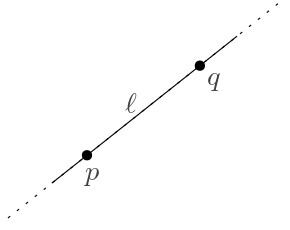 **ישר (line)** $\ell$ הוא תת-מרחב חד-ממדי, וניתן לתאר אותו על ידי זוג נקודות $p$ ו-$q$, בתור אוסף הנקודות שמקיימות את המשוואה $\ell=(1-\lambda)p+\lambda q$ עבור $\lambda\in\mathbb{R}$ כלשהו.

שימו לב שכל שתי נקודות שונות מגדירות ישר יחיד, אך כל ישר יכול להיות מוגדר על ידי כל זוג נקודות שונות שנמצאות עליו.

#### קרן (ray) {.unnumbered}

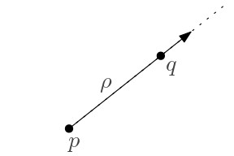 **קרן (ray)** $\rho$ מוגדרת על ידי זוג נקודות $p$ ו-$q$, כאשר $p$ מגדירה את המקור ו-$q$ את הכיוון, וניתן לתאר אותה כאוסף הנקודות שמקיימות את המשוואה $\ell=(1-\lambda)p+\lambda q$ עבור $\lambda\ge 0$ כלשהו.

#### קטע (segment) {.unnumbered}

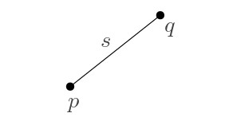 **קטע (segment)** $s$ מוגדר על ידי זוג נקודות $p$ ו-$q$ שהן הקצוות שלו, וניתן לתאר אותו בתור אוסף הנקודות שנמצאות בין $p$ ו-$q$ על הישר שהן מגדירות.

קטע נקרא **סגור** אם הוא מכיל את נקודות הקצה, ו**פתוח** אם אינו מכיל אותן.

במילים אחרות, קטע הוא אוסף הנקודות המקיימות את המשוואה $\ell=(1-\lambda)p+\lambda q$ כאשר $0\le\lambda\le 1$ לקטע סגור, ו $0<\lambda<1$ -לקטע פתוח.

#### על-מישור (hyperplane) {.unnumbered}

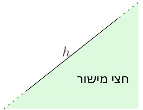 **על-מישור (hyperplane)** $h$ הוא תת-מרחב אוקלידי מממד $(d-1)$ בתוך מרחב אוקלידי מממד $d$. למשל, במרחב הדו-ממדי אלו **ישרים**, ובמרחב התלת-ממדי אלו **מישורים**. על-מישור חוצה את המרחב לשני חצאי מרחבים -- כל חצי מרחב כזה נקרא **חצי מישור (halfplane)**.

פורמלית, עבור סקלרים $a_1,a_2,\dots,a_d$ שלא כולם אפס, על-מישור הוא כל הנקודות המקיימות את המשוואה $a_1 x _1+a_2 x_2 +\dots+ a_d x_d = b$, וחצי מישור הוא כל הנקודות המקיימות את המשוואה $a_1 x _1+a_2 x_2 +\dots+ a_d x_d \ge b$.

#### מעגל, דיסק, ספֵרה וכדור {.unnumbered}

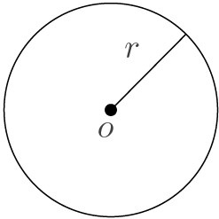 במישור, **מעגל (circle)** מוגדר על ידי **מרכז** (נקודה $o$) ו**רדיוס** (סקלר $r$), והוא המיקום הגיאומטרי של כל הנקודות שהמרחק שלהן מ-$o$ הוא בדיוק $r$. כלומר עבור $o=(a,b)$, אלו כל הנקודות המקיימות את המשוואה $(x-a)^2+(y-b)^2=r^2$.

**דיסק (disk)** או **עיגול** הוא קבוצת הנקודות החסומה בתוך מעגל. הדיסק ה**סגור** מכיל גם את הנקודות שהמרחק שלהן מ-$o$ הוא בדיוק $r$, והדיסק ה**פתוח** אינו מכיל אותן. כלומר הדיסק הסגור אלו כל הנקודות המקיימות את המשוואה $(x-a)^2+(y-b)^2\le r^2$, והדיסק הפתוח אלו כל הנקודות המקיימות את המשוואה $(x-a)^2+(y-b)^2<r^2$.

בהכללה לממדים גבוהים יותר, משתמשים במונחים **ספרה (sphere)** במקום מעגל, ו**כדור (ball)** במקום דיסק.

### עקומים ופוליגונים {#curves-polygons}

עד עכשיו הגדרנו אובייקטים גיאומטריים בעלי גודל תיאור קבוע, כלומר כאלו שניתן לתאר בעזרת מספר קבוע של פרמטרים ונקודות במרחב. כעת נדון באובייקטים מורכבים יותר -- פוליגונים ועקומים.

תלמידי בית הספר היסודי לומדים על מגוון של צורות גיאומטריות מיוחדות: משולש, ריבוע, מלבן, מקבילית, טרפז, משושה, ועוד. כל אלו הם סוגים של **פוליגונים** (מצולעים). אך מהו פוליגון באופן כללי?

#### שאלה למחשבה: מהו פוליגון? {.unnumbered}
הסתכלו בדוגמאות המופיעות באיור הבא. האם כולן דוגמאות לפוליגונים? אם לא, כיצד נוכל להגדיר מהו פוליגון?

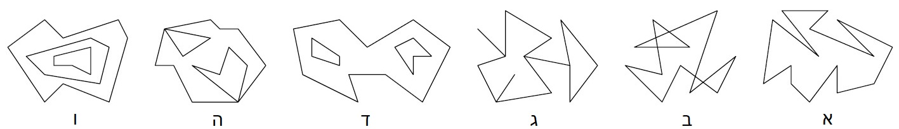

אין תשובה אחת נכונה לשאלה מהו פוליגון, ולמעשה קיימים סוגים שונים של פוליגונים. הסוג הבסיסי ביותר נקרא **פוליגון פשוט**. כדי להגדיר מהו פוליגון, תחילה נדון במושג **עקוֹם**.

#### הגדרה: עקוֹם {.unnumbered}
::: rmdimportant
עקום $C$ באורך $n$ במישור הוא סדרה של $n$ נקודות $p_1, p_2,..., p_n$ הנקראות קודקודים, וסדרת הקטעים $\overline{p_1, p_2}, \overline{p_2, p_3} ,\dots, \overline{p_{n-1},p_n}$ הנקראים צלעות.

עקום הוא **סגור** אם $p_1 = p_n$, ו**פשוט** אם צלעותיו אינן חותכות זו את זו (מלבד בקודקודים המשותפים לשתי צלעות עוקבות).
:::

#### ענו על השאלה הבאה: {.unnumbered}
לפניכם שישה עקומים. אילו מהעקומים סגורים? אילו פשוטים?

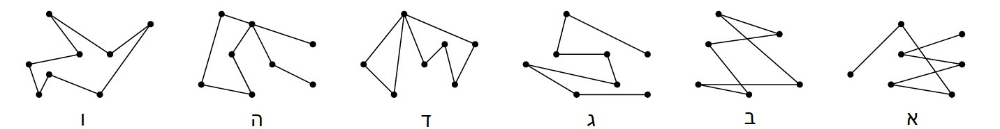{width="100%"}

(פתרון)

ניתן לראות שרק עקומים ב', ד' ו-ו' הם סגורים, שכן הם מתחילים ונגמרים באותה נקודה.

רק עקומים ג' ו-ו' הם פשוטים, מכיוון שכל העקומים האחרים חותכים את עצמם לפחות פעם אחת: אם זה בצלעות (ב), בקודקודים שאינם עוקבים (ד), או בקודקוד וצלע (ה).

#### הגדרה: פוליגון פשוט {.unnumbered}
::: rmdimportant
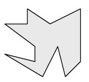 פוליגון פשוט $P$ הוא האזור החסום בתוך עקום סגור ופשוט $C$.

העקום $C$ נקרא ה**שפה** של $P$ (ומסומן גם $\partial P$), ואילו קבוצת הנקודות בפוליגון $P$ שאינן על $C$ נקראת ה**פְּנים** של $P$ (ומסומנת $\text{int}(P)$). באיור, פנים הפוליגון מוצלל באפור.
:::

שימו לב כי מהדוגמאות באיור שהצגנו בהתחלה, רק איור א' הוא פוליגון פשוט.

#### מעניין לדעת: משפט העקום של ז'ורדן {.unnumbered}
באופן כללי, עקום ז'ורדן הוא מסילה סגורה ופשוטה במישור. משפט העקום של ז'ורדן (שניסח לראשונה המתמטיקאי קאמי ז'ורדן ב-1887) קובע כי כל עקום ז'ורדן מחלק את המישור לשני תחומים קשירים: התחום ה"פנימי" החסום במסילה, והמשלים שלו -- התחום ה"חיצוני" שאינו חסום. המשפט נראה מובן מאליו, ואכן הוכחת המשפט עבור עקומי ז'ורדן מצולעים (כלומר עקומים) היא אלמנטרית. לעומת זאת, ההוכחה עבור עקום ז'ורדן כללי אינה פשוטה כלל!

#### ענו על השאלה הבאה: {.unnumbered}
הציעו אלגוריתם המקבל נקודה $q$ ופוליגון פשוט $P$ בעל $n$ קודקודים במישור, ומחליט אם $q$ נמצאת בפנים$\text{int}(P)$ של $P$, על שפתו $\partial P$, או מחוץ ל-$P$. ניתן להניח כי $P$ נתון כאוסף קודקודיו $(v_1,v_2,\dots,v_n)$ המסודרים עם כיוון השעון. מה תהיה סיבוכיות זמן הריצה הטובה ביותר שניתן להשיג?

**רמז**: ציירו קרן כלשהי היוצאת מ-$q$. מה ניתן לומר על מספר החיתוכים שלה עם $\partial P$?

(פתרון)

נתבונן בקרן $\rho$ כלשהי היוצאת מ-$q$, ונדמיין שאנחנו מתחילים ללכת על $\rho$ החל מ-$q$ ועד לאינסוף.

אם $q$ נמצאת מחוץ ל-$P$, אז בכל פעם שניכנס ל-$P$ נצטרך גם לצאת ממנו, כך שמספר החיתוכים עם $\partial P$ הוא בהכרח זוגי.

לעומת זאת, אם $q$ נמצאת בפנים של $P$, אז קודם נפגוש את $\partial P$ כשנצא מ-$P$, ואז אולי נפגוש את $\partial P$ מספר זוגי של פעמים, כמו במקרה הקודם. לכן במקרה הזה, סך כל מספר החיתוכים עם $\partial P$ הוא בהכרח אי-זוגי.

המסקנה היא שכדי לדעת איפה $q$ נמצאת ביחס ל-$P$, מספיק לבדוק את מספר הצלעות שהקרן $\rho$ חותכת (קרן יכולה לחתוך כל צלע פעם אחת בלבד). בדיקה זו מתבצעת בזמן לינארי.

 

ההבחנה בין הפנים לחוץ של פוליגון היא עקרונית להגדרה של פוליגון, ולכן הדרישה ששפת הפוליגון תהיה עקום פשוט היא הכרחית. התבוננו שוב באוסף הדוגמאות שראינו קודם:

{width="100%"}

באיור ב' קיימים אזורים שלא ניתן להחליט אם הם שייכים לפנים הפוליגון או נמצאים מחוצה לו. גם באיור ו' לא ברור לאן שייכים האזורים הפנימיים. עם זאת, קיימות מספר הגדרות כלליות יותר לפוליגונים שמתאימות לשאר הדוגמאות באיור. נדון כאן רק בזו המתאימה לאיור ד'.

#### הגדרה: פוליגון עם חורים {.unnumbered}
::: rmdimportant
פוליגון עם חורים הוא אזור הניתן לתיאור בתור ההפרש $P=F\setminus\cup_{H\in\mathcal H}\text{int}(H)$ כאשר $F$ הוא פוליגון פשוט ו-$\mathcal{H}$ הוא אוסף סופי של פוליגונים פשוטים וזרים (אינם חותכים זה את זה) הנקראים חורים של $P$, כך שאיחודם מוכל בפנים של $F$, כלומר $\cup_{H\in\mathcal H}\text{int}(H)\subset F$.
:::

שימו לב שפוליגון עם חורים הוא הכללה של פוליגון פשוט. כלומר, כל פוליגון פשוט הוא גם פוליגון עם חורים, שכן קבוצת החורים יכולה להיות ריקה.

#### דוגמה:  {.unnumbered}
הפוליגון באיור הבא מורכב מפוליגון פשוט המכיל שלושה חורים המוצללים באפור. שימו לב שהחורים אינם חותכים זה את זה או את שפת הפוליגון.

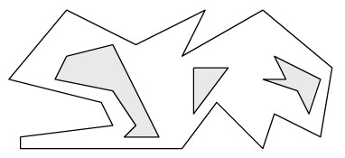{width="70%"}

### פוליגונים מיוחדים {#special-polygons}

באופן כללי, פוליגון יכול להיות צורה מורכבת מאוד, אך קיימים גם סוגים של פוליגונים בעלי מבנה מסוים או תכונות נוספות שהם "מיוחדים" או "פשוטים" יותר. אחת הסיבות לכך שאנו מעוניינים להגדיר פוליגונים מיוחדים כאלה נעוצה בעובדה שפעמים רבות הגדרות אלו מאפשרות אלגוריתמים יעילים ופשוטים יותר, המשמשים כאבני בניין למקרים המורכבים. נראה מספר דוגמאות לכך במהלך הקורס.

כעת נדון בכמה מהדוגמאות הבסיסיות ביותר לפוליגונים "מיוחדים".

#### הגדרה: פוליגון קמור {.unnumbered}
::: rmdimportant
פוליגון פשוט $P$ הוא **קמור** אם [לכל]{.underline} שתי נקודות $p,q\in P$ מתקיים שהקטע $\overline{pq}$ מוכל ב-$P$.
:::

#### הגדרה: פוליגון כוכבי {.unnumbered}
::: rmdimportant
פוליגון פשוט $P$ הוא **כוכבי** אם [קיימת]{.underline} נקודה $p\in P$ כך ש[לכל]{.underline} נקודה $q\in P$ מתקיים שהקטע $\overline{pq}$ מוכל ב-$P$. נקודה $p$ כזו נקראת **מרכז** של הפוליגון $P$.
:::

#### דוגמה: {.unnumbered}
באיור הבא, הפוליגון הימני הוא **קמור**.\
הפוליגון האמצעי אינו קמור, מכיוון שקיימות שתי נקודות שהקטע המוגדר עליהן אינו מוכל בפוליגון.\
הפוליגון משמאל הוא **כוכבי**, מכיוון שהנקודה המסומנת מקיימת את תנאי ההגדרה.

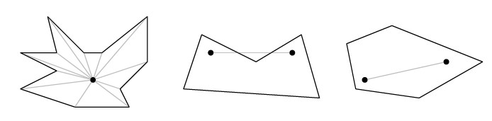{width="100%"}

#### ענו על השאלות הבאות: {.unnumbered}
**שאלה 1:**
נכון או לא נכון? באיור למעלה, הפוליגון האמצעי הוא כוכבי.

(פתרון)

נכון.

 

**שאלה 2:**
ציירו פוליגון פשוט שאינו כוכבי. כמה צלעות יש לפוליגון שציירתם?

(פתרון)

בהמשך נראה שכל פוליגון פשוט בעל 5 קודקודים ומטה הוא כוכבי.

 

**שאלה 3:**
נכון או לא נכון? כל פוליגון קמור הוא כוכבי.

(פתרון)

נכון. למעשה, כל נקודה יכולה להיות "מרכז" הכוכב.

 

**שאלה 4:**
קודקוד \(r\) של פוליגון \(P\) נקרא **קעור** אם הזווית בתוך \(P\) בין הצלעות הסמוכות ל-\(r\) גדולה מ-\(180^\circ\).

 האם כל פוליגון בעל קודקוד קעור יחיד הוא כוכבי?

(פתרון)

הקודקוד הקעור \(r\) הוא מרכז של הפוליגון.

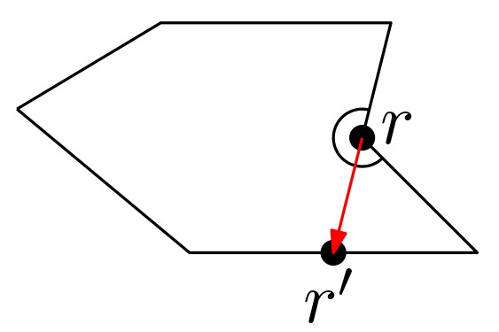

ניתן להוכיח זאת על ידי כך שנסתכל על הקרן שיוצאת מ-\(r\) בכיוון של אחת הצלעות הסמוכות לו, ולכיוון פנים הפוליגון. הקרן הזו חותכת את שפת הפוליגון בנקודה \(r^\prime\), כך שהקטע המחבר בין \(r\) ו-\(r^\prime\) מחלק את הפוליגון \(P\) לשני פוליגונים קמורים, כך ש-\(r\) הוא קודקוד המשותף לשניהם.

 

סיבה נוספת להתעניין בפוליגונים מיוחדים היא שבמציאות (שממנה אנחנו בדרך כלל שואבים השראה לבעיות שאנו מגדירים), לפוליגונים יש מבנה מסוים שהוא מוגבל. למשל, אם פוליגון מתאר רצפה של מבנה מסוים, סביר להניח שהזווית בין שני קירות היא זווית ישרה. לכן נוכל להגדיר פוליגון המתאים למקרה זה (נדון בבעיה כזו בהמשך הקורס).

#### הגדרה: פוליגון אורתוגונלי {.unnumbered}

::: rmdimportant
פוליגון אורתוגונלי הוא פוליגון פשוט שכל צלעותיו מקבילות לצירים.

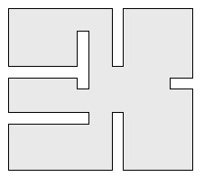
:::

#### ענו על השאלה הבאה: {.unnumbered}
נסו לצייר פוליגון אורתוגונלי שהוא כוכבי אך אינו קמור.\
מה ניתן לומר על סדרת הזוויות בין צלעות עוקבות של פוליגון כזה?\
א. מכילה לכל היותר שתי זוויות ישרות עוקבות.\
ב. מכילה זווית ישרה ואז זווית של 270 מעלות, לסירוגין.\
ג. אינה מכילה שתי זוויות עוקבות של 270 מעלות.\
ד. אינה מכילה שתי זוויות ישרות עוקבות.\
ה. מכילה לכל היותר ארבע זוויות ישרות עוקבות.

(פתרון)

סעיפים ג' ו-ה' נכונים.

## הקמור של קבוצת נקודות במישור {#convex-hull}

### הגדרת הקמור {#convex-hull-def}

הדוגמה הראשונה לבעיה גיאומטרית שנלמד בקורס היא בעיית חישוב הקמור. הקמור של קבוצת נקודות הוא מושג בסיסי וחשוב ביותר, מכיוון שיש לו אינספור שימושים בתחומים שונים ומגוונים. בסרטון הבא נגדיר מהו הקמור של קבוצת נקודות, ונציג דוגמה אחת לשימוש בו -- דווקא בבעיה שבמבט ראשון נראה שאין לה קשר לגיאומטריה, ובהמשך נראה איך בכל זאת הגיאומטריה תעזור לנו בפתרונה.

#### צפו בסרטון הבא: {.unnumbered}

<iframe width="560" height="315" src="https://www.youtube.com/embed/DhGwT-hBErw" title="YouTube video player" frameborder="0" allow="accelerometer; autoplay; clipboard-write; encrypted-media; gyroscope; picture-in-picture; web-share" allowfullscreen>

</iframe>

#### הגדרה: קבוצה קמורה {.unnumbered}
::: rmdimportant
קבוצת נקודות $S$ היא קבוצה קמורה אם לכל זוג נקודות $p,q\in S$ מתקיים שהקטע $pq$ מוכל בקבוצה $S$.
:::

#### הגדרה: הקמור {.unnumbered}
::: rmdimportant
עבור קבוצת נקודות $S$, הקמור (Convex Hull) של S מסומן $CH(S)$.

לקמור של קבוצת נקודות יש מספר הגדרות שקולות:

1.  הקמור של קבוצת נקודות $S$ הוא הקבוצה הקמורה הקטנה ביותר שמכילה את $S$. (כלומר לא קיימת קבוצה קמורה שמכילה את $S$ ומוכלת ממש בקמור של $S$).

2.  הקמור של קבוצת נקודות $S$ הוא הפוליגון הקמור היחיד שקודקודיו הם נקודות מ-$S$ ושמכיל את $S$.

3.  הקמור של קבוצת נקודות $S$ הוא החיתוך של כל חצאי המרחבים הסגורים שמכילים את $S$.
:::

#### ענו על השאלה הבאה: {.unnumbered} 
נתונות 3 נקודות: \(a=(1,1),b=(2,4),c=(6,3)\)

<iframe src="https://www.desmos.com/calculator/innzabga8l?embed" width="500" height="250" style="border: 1px solid #ccc" frameborder="0"></iframe>

א. האם הנקודה \(d=(4,3)\) נמצאת בקמור שלהן?

ב. האם הנקודה \(d=(4,2)\) נמצאת בקמור שלהן?

(פתרון)

א. כן.

ב. לא.

#### ענו על השאלה הבאה: {.unnumbered} 
התבוננו בקבוצת הנקודות הבאה.
אילו מהנקודות יהיו קודקודי הקמור של הקבוצה?
השתמשו ביישומון של GeoGebra כדי לצייר את הקמור.

<iframe src="https://www.geogebra.org/classic/nycxnewa?embed" width="100%" height="500" allowfullscreen="" style="border: 1px solid #e4e4e4;border-radius: 4px;" frameborder="0"></iframe>

(פתרון)

A,C,D,F,G,I

### אלגוריתם נאיבי {#naive-alg}

בחלק הראשון של סעיף 1.1 בספר הלימוד מופיעות הגדרות הקמור שראינו קודם, וכן מתואר האלגוריתם **SlowConvexHull**, שהוא אלגוריתם נאיבי. סיבוכיות זמן הריצה שלו היא $O(n^3)$, והיא רחוקה מלהיות אופטימלית, אך הוא אינטואיטיבי ונכונותו נובעת ישירות מהאבחנות שהצגנו קודם לגבי התכונות הגיאומטריות של הקמור.

באלגוריתם זה עולה הנושא של **מצבים מנוונים** **(degeneracies)**, שהם למעשה מקרי קצה של הקלט שיש להביא בחשבון. נוסף על כך, באלגוריתם עולה גם בעיה של **עמידות החישוב** **(robustness)**, כלומר במצבים מסוימים של טעויות עיגול בחישובים עם נקודה צפה (floating point), ייתכן שהאלגוריתם אפילו לא יחזיר פוליגון. בחלק הרביעי של יחידה זו תוכלו לקרוא עוד על עמידות החישוב ומצבים מנוונים.

#### קראו את חלקו הראשון של סעיף 1.1 בספר הלימוד (עמודים 2--5). {.unnumbered}

### אלגוריתם אינקרמנטלי {#incremental-alg}

בסרטון הבא נתאר את האלגוריתם **ConvexHull** המופיע בחלקו השני של סעיף 1.1 בספר הלימוד. האלגוריתם הזה נקרא גם **האלגוריתם האינקרמנטלי**, או **סריקת גרהם (Graham Scan)**. הוא מתוחכם יותר, וסיבוכיות זמן הריצה שלו היא כמעט לינארית. זהו שיפור משמעותי מאוד לעומת האלגוריתם הנאיבי שראינו בחלק הקודם.

#### צפו בסרטון הבא: {.unnumbered}

<iframe width="560" height="315" src="https://www.youtube.com/embed/gncUiuHZArA" title="YouTube video player" frameborder="0" allow="accelerometer; autoplay; clipboard-write; encrypted-media; gyroscope; picture-in-picture; web-share" allowfullscreen>

</iframe>

#### קראו את חלקו השני של סעיף 1.1 בספר הלימוד (עמודים 6--8). {.unnumbered}

### אלגוריתם רגיש לפלט {#output-sens}

האם ניתן לשפר את זמן הריצה של האלגוריתם האינקרמנטלי שראינו קודם? בסרטון הבא נתאר אלגוריתם נוסף לחישוב הקמור, שנקרא **אלגוריתם עטיפת המתנה (Gift Wrapping)** או **Jarvis's March**. זמן הריצה שלו הוא $O(nh)$, כאשר $h$ הוא מספר קודקודי הקמור. סוג כזה של אלגוריתם נקרא **output sensitive**, כלומר אלגוריתם שזמן הריצה שלו תלוי בגודל הפלט.

#### צפו בסרטון הבא: {.unnumbered}

<iframe width="560" height="315" src="https://www.youtube.com/embed/mDI7sAZWD3k" title="YouTube video player" frameborder="0" allow="accelerometer; autoplay; clipboard-write; encrypted-media; gyroscope; picture-in-picture; web-share" allowfullscreen>

</iframe>

------------------------------------------------------------------------

## מצבים מנוונים ועמידות החישוב {#deg-robust}

כדי לפשט את התיאור של אלגוריתמים גיאומטריים, במקרים רבים משתמשים בהנחה שנקראת **מצב כללי** **(general position)**. משמעות ההנחה היא שהקלט אינו מכיל מצבים **מנוונים (degenerate)**, למשל שתי נקודות עם אותה קואורדינטת $x$, שלוש נקודות על ישר אחד או ארבע נקודות על מעגל. המטרה היא להימנע מסרבול האלגוריתם כאשר יש צורך בטיפול ב**מקרי קצה**. לדוגמה, באלגוריתם האינקרמטלי לחישוב הקמור (סריקת גרהם), יש למיין את הנקודות לפי קואורדינטת ה-$x$ שלהן. אך מה עושים אם לשתי נקודות יש אותה קואורדינטת $x$? נצטרך להחליט מי מהן תופיע ראשונה במיון. אמנם כאן נוכל להוסיף תיאור פשוט יחסית, אך קל יותר להניח שהקלט נמצא במצב כללי, כלומר שאין שתי נקודות בעלות אותה קואורדינטת $x$. הנחות מסוג זה הן מקובלות באלגוריתמים גיאומטריים, ומשתנות בהתאם לצורכי האלגוריתם.

מצבים מנוונים קשורים בנושא **עמידות החישוב** **(robustness)**, מכיוון שלעיתים הטיפול בהם כרוך בבדיקה הגוררת חישוב שתוצאתו היא אפס. לדוגמה, במימוש האלגוריתם האינקרמנטלי, אנו נדרשים לבדוק אם שלוש הנקודות האחרונות יוצרות פנייה ימינה. כלומר, בהינתן שלוש נקודות, $p_1, p_2, p_3$, נרצה לבדוק אם הזווית שהן יוצרות, כלומר הזוית $\alpha = \angle p_1 p_2 p_3$, קטנה מ- $180^\circ$. ניתן לעשות זאת על ידי חישוב של הישר העובר דרך $p_1 p_2$ ובדיקה אם $p_3$ נמצאת מעליו או מתחתיו, או על ידי מכפלה וקטורית, כפי שנראה בפרק הבא. אם שלוש הנקודות נמצאות על ישר אחד, נקבל שוויון, כלומר $\alpha= 180^\circ$. כאשר מבצעים חישוב של מספרים ממשיים במחשב, התוצאה תלויה ברמת הדיוק של המחשב, אשר אינה אינסופית, ולכן בדרך כלל לא נקבל מצב של שוויון מדויק. לכן, אם שלוש הנקודות נמצאות כמעט על אותו ישר, אי-דיוק מזערי בחישוב עלול להביא לתוצאה שגויה, מה שמעלה את השאלה של נכונות האלגוריתם במצבים כגון זה, וזוהי בעצם השאלה של עמידות החישוב.

#### קראו את סעיף 1.2 בספר (עמודים 8--10). {.unnumbered}
