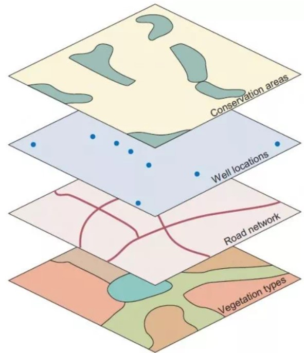
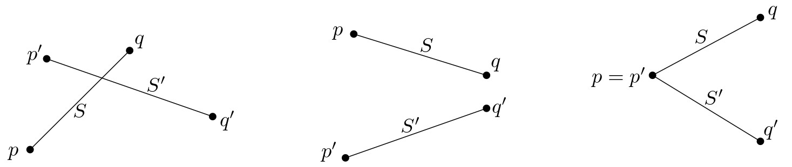
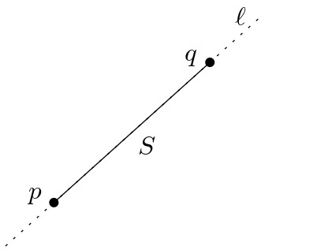
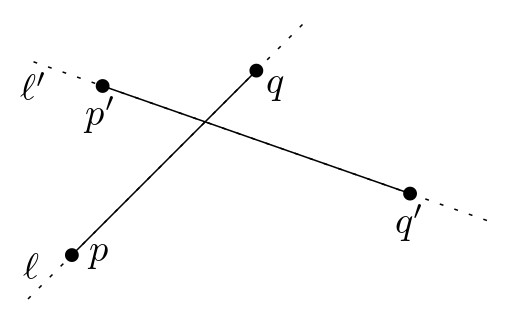
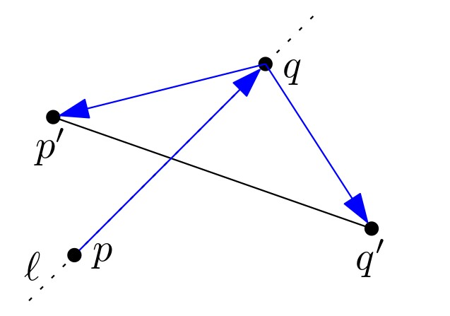
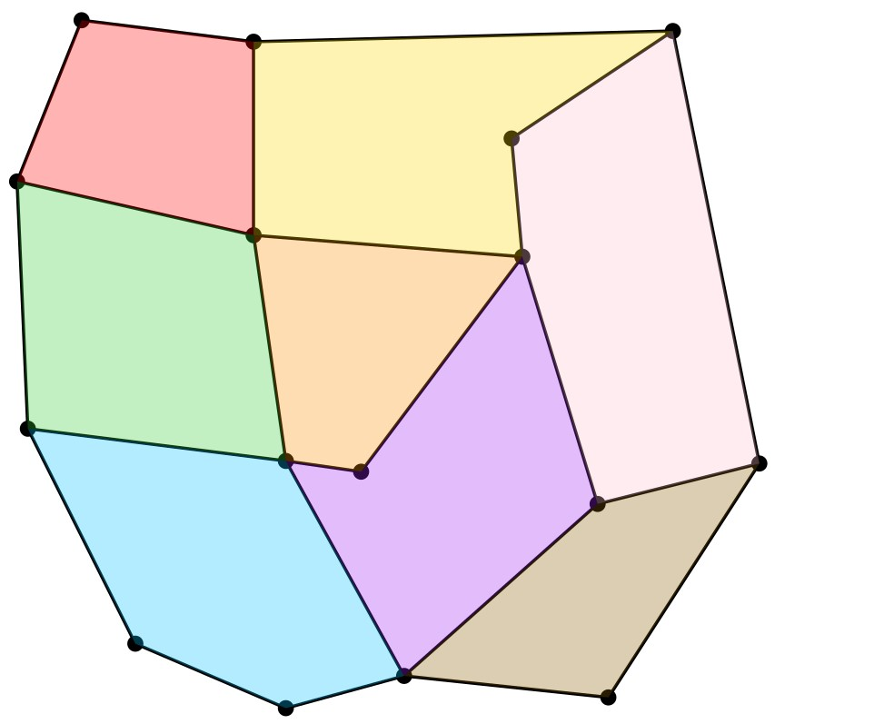
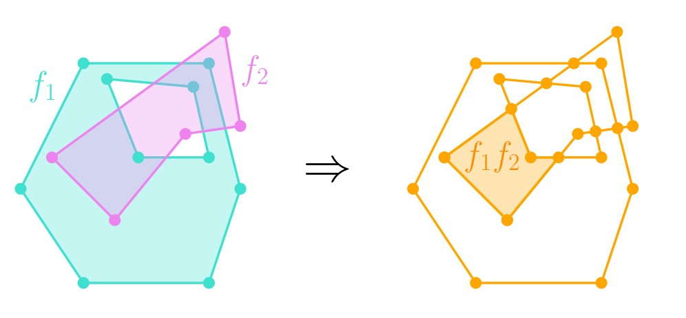

# מפות מישוריות וטכניקת הישר הסורק {#map-overlay}

## הקדמה {#preface-2}

### מה ביחידה? {#contents-2}
יחידה זו מקבילה לפרק השני בספר הלימוד. 

המושגים והרעיונות העיקריים שילמדו ביחידה:

- טכניקת הישר הסורק.
- בעיית חיתוך קטעים במישור.
- מפות מישוריות וייצוגן במבנה DCEL.
- בעיית map overlay - חישוב הייצוג המאוחד של שתי מפות מישוריות.

למידה מהנה!

### שכבות מידע במפה {#them-map}

ביחידה זו נעסוק בבעיות הנוגעות לחיתוכי קטעים במישור. דוגמה אחת לבעיה
כזו מופיעה בתחום של מערכות מידע גאוגרפיות (GIS - Graphic Information
Systems), כאשר רוצים להציג ולנתח שכבות מידע ממספר מפות. למשל, בהינתן מפה של נהרות ומפה של כבישים, נוכל להצליב את המידע משתי המפות כדי למצוא היכן ממוקמים גשרים: בנקודות החיתוך בין כבישים לנהרות. כל מפה
נושאית כזו ניתנת לייצוג גיאומטרי על ידי אוסף של קטעים, עקומים, או
פוליגונים. בעזרת טכניקות גיאומטריות, נוכל למצוא את נקודות החיתוך ולחשב את
הייצוג המאוחד של שתי מפות (map overlay).

תחילה נראה כיצד ניתן למצוא את כל החיתוכים באוסף קטעים נתון, ולשם כך
נשתמש בטכניקה חשובה ושימושית מאוד: טכניקת הישר הסורק (sweep-line). לאחר מכן נדבר על ייצוג של מפות מישוריות (גרפים מישוריים), ונתאר מבנה נתונים יעיל לאחסונם -- DCEL. לבסוף, נראה כיצד ניתן לאחד שני מבנים כאלה, המייצגים שתי מפות מישוריות, למפה מישורית אחת המאגדת את כל המידע.

#### קראו את ההקדמה לפרק 2 בספר הלימוד (עמודים 19־20). {.unnumbered}

------------------------------------------------------------------------

## טכניקת הישר הסורק {#sweep-line}

### חיתוך קטעים במישור {#line-int}

טכניקת הישר הסורק (sweep-line) היא חשובה ושימושית מאוד בגיאומטריה
חישובית. כדי להדגים את השימוש בטכניקה זו, ולפני שנדבר על מפות מישוריות,
נציג בעיה פשוטה לכאורה שנקראת בעיית חיתוך קטעים במישור (line segment
intersection). בבעיה זו, הקלט הוא אוסף של קטעים במישור, והמטרה היא למצוא
את כל נקודות החיתוך בין קטעים. בסרטון הבא נתאר את רעיון השימוש בישר
הסורק עבור בעיית חיתוך קטעים במישור.

#### צפו בסרטון הבא. {.unnumbered}

<iframe width="560" height="315" src="https://www.youtube.com/embed/x1BxalWtFqk" title="YouTube video player" frameborder="0" allow="accelerometer; autoplay; clipboard-write; encrypted-media; gyroscope; picture-in-picture; web-share" allowfullscreen>

</iframe>

בטכניקת הישר הסורק, הרעיון הוא "לסרוק" את הקטעים בעזרת ישר אופקי $\ell$
הנע מלעלה למטה. ה"**סטטוס**" (status) של הישר הוא אוסף הקטעים הנחתכים עם
הישר במיקומו הנוכחי. את הסטטוס יש לעדכן בזמן שהישר נע מטה, אך הוא אינו
מתעדכן באופן רציף -- העדכון מתבצע רק כאשר הישר מגיע לנקודות מסוימות 
שאנו מכנים "**מאורעות**" (event points). בבעיית חיתוך הקטעים, המאורעות
הם נקודות הקצה של הקטעים, וגם נקודות החיתוך עצמן, שמתגלות במהלך
האלגוריתם. בכל פעם שהישר מגיע למאורע, יש לעדכן את הסטטוס ואת תור
המאורעות, ולבצע בדיקות של חיתוכים בין הקטעים בסטטוס.

::: rmdwarning

זמן הריצה של האלגוריתם הראשון שמתואר בסרטון ומשתמש בשיטת הישר הסורק, הוא
$O(n^2)$. האם קיים אוסף של קטעים ללא נקודות חיתוך כלל, שעבורו זמן הריצה
של האלגוריתם הזה יהיה $\Theta(n^2)$? אם לא, הסבירו מדוע. אם כן, ציירו
דוגמה לאוסף כזה.

(פתרון)

באוסף הקטעים שבאיור למטה אין נקודות חיתוך, אך בשלב שבו הקטע ה- $i$ נוסף
לסטטוס, כבר מופיעים בסטטוס $i-1$ הקטעים הראשונים, ולכן יהיו $i-1$
בדיקות. בסך הכול מספר הבדיקות בכל השלבים יהיה \(\Theta(n^2)\).

:::

### טכניקת הישר הסורק -- מימוש {#line-sweep-impl}

בסעיף הקודם ראינו סקיצה של אלגוריתם המשתמש בטכניקת הישר הסורק, והסברנו באופן אינטואיטיבי מדוע גישה כזו תיתן לנו אלגוריתם יעיל שהוא רגיש לפלט, ושאינו בודק חיתוכים בין כל זוג קטעים.

כיצד מממשים אלגוריתם כזה ביעילות? בסעיף 2.1 בספר הלימוד מתואר בפירוט
האלגוריתם **FindIntersections**, מבני הנתונים שנזדקק להם עבור תור
המאורעות והסטטוס, והפרוצדורה **HandleEvenPoint** לטיפול במאורעות. זמן הריצה של האלגוריתם הוא $O((n+k)\log n)$, כאשר $k$ הוא מספר נקודות
החיתוך.

#### קראו בעיון את סעיף 2.1 בספר הלימוד (עמודים 20--29). {.unnumbered}

#### נוסחת אוילר. {#euiler .unnumbered}

בסעיף 2.1 בספר הלימוד, יש שימוש בנוסחת אוילר להשגת חסם על מספר המאורעות.

עבור גרף מישורי עם $n_v$ קודקודים, $n_e$ צלעות, ו-$n_f$ פאות, נוסחת
אוילר מתארת את הקשר ביניהם באופן הבא.

::: rmdimportant

**נוסחת אוילר**: $n_v-n_e+n_f\ge 2$.
:::

זוהי נוסחה חשובה ביותר, ונעשה בה שימוש גם בהמשך הקורס.

::: rmdwarning

נסו לחשוב על אלגוריתם המקבל אוסף של קטעים במישור, ובודק אם קיים זוג
קטעים שחותכים זה את זה. איזה זמן ריצה ניתן להשיג?

(פתרון)

שימו לב שניתן להשתמש באותו אלגוריתם שראינו למציאת כל נקודות החיתוך, אך
לעצור מייד במציאת נקודת החיתוך הראשונה. נקבל זמן ריצה של $O(n\log n)$.

:::

### כיצד נבדוק אם זוג קטעים חותכים זה את זה? {#check-line-int}

במהלך האלגוריתם הסורק שראינו קודם, אנו נדרשים למצוא את נקודת החיתוך בין
שני קטעים נתונים. בהינתן שני קטעים, $S=\overline{pq}$ ו-
$S'=\overline{p'q'}$, כיצד נבדוק אם הם חותכים זה את זה?

#### גישה ראשונה: חישוב הישרים המכילים את הקטעים. {.unnumbered}

1.   נחשב את הישר
    $\ell$ המכיל את הקטע $S$, ואת הישר $\ell'$ המכיל את הקטע $S'$.
2.  נחשב את נקודת החיתוך $t$ בין הישרים $\ell$ ו-$\ell'$.
3.  נבדוק אם $t$ שייכת לשני הקטעים $S$ ו-$S'$.

בשיטה זו אנו מוצאים את נקודת החיתוך, אם היא קיימת.

#### מציאת הישר המכיל קטע. {.unnumbered}

מציבים את שתי נקודות הקצה של הקטע במשוואת הישר $y=m x + c$, ולאחר מכן
פותרים מערכת של שתי משוואות כדי למצוא את $m$.

למשל, עבור הקטע $\overline{pq}$ נסמן $p=(p_x,p_y)$, $q=(q_x,q_y)$, ונקבל
$m=\frac{q_y-p_y}{q_x-p_x}$.

לאחר מכן, מוצאים את $c$ על ידי הצבה של אחת מהנקודות במשוואה.

שימו לב שאם הקטע $\overline{p q}$ הוא אנכי, אז המכנה של $m$ מתאפס.

#### מציאת נקודת החיתוך בין שני ישרים. {.unnumbered}

בהינתן שני ישרים לא אנכיים,$\ell: y= m x + c$ ו-$\ell': y= m'x+ c'$,
נציב את נקודת החיתוך $t=(t_x,t_y)$ בשתי המשוואות. נפתור ונקבל:
$t_x=\frac{c-c'}{m'-m}$, $t_y=\frac{cm'-c'm}{m'-m}$.

גם כאן נשים לב שהמכנה מתאפס אם הישרים אנכיים או מקבילים זה לזה.

#### בדיקה אם נקודת החיתוך שייכת לקטע. {.unnumbered}

נניח שמתקיים $p_x\le q_x$, $p_y\le q_y$. אז נקודת החיתוך $t$ שייכת לקטע
$\overline{p q}$ אם $t_x\in [p_x, q_y]$, $t_y\in[p_y, q_y]$.

::: rmdwarning

בשלב השלישי, האם מספיק לבדוק שנקודת החיתוך שייכת לאחד הקטעים?

(פתרון)

בדוגמה המופיעה כאן, הקטעים אינם חותכים זה את זה, אך נקודת החיתוך בין הישרים המכילים את הקטעים מופיעה על אחד מהם.

{width="50%"}

:::

#### כיצד מטפלים במקרים מיוחדים? {.unnumbered}

שימו לב שבגישה הראשונה התעלמנו ממספר מצבים מיוחדים של הקלט, למשל כאשר הקטעים הם אנכיים. נסו לבדוק בעצמכם מהם מצבי הקלט שאנחנו מתעלמים מהם, וחשבו כיצד ניתן לטפל בהם.

ביחידה הראשונה של הקורס דנו בנושא של **מצבים מנוונים**. ראינו שניתן לטפל במצבים מנוונים על ידי חלוקה למקרים נפרדים, אך חלוקה כזו היא בדרך כלל
מתישה ומועדת לטעויות. דרך נוספת לטיפול במצבים כאלו היא למצוא מערכת
גיאומטרית אחרת שבה המקרים המיוחדים נעלמים, למשל על ידי סיבוב מערכת
הצירים, אך פעולה זו לא תמיד אפשרית. אפשרות אחרת היא להשתמש ב**הנחת מצב כללי**: מניחים שהקלט אינו מכיל מצבים מנוונים.

במקרה של חיתוך ישרים, ניתן למצוא פתרון אחר שבו המקרים המיוחדים אינם
דורשים טיפול נפרד, כמו בגישה הבאה.

#### גישה שנייה: חישוב דטרמיננטה. {.unnumbered}

 **אבחנה**:
הקטעים $S$ ו-$S'$ חותכים זה את זה אם ורק אם הישר $\ell$ שמכיל את $S$
"מפריד" בין הנקודות $p'$ ו-$q'$ , והישר $\ell'$ שמכיל את $S'$ "מפריד"
בין הנקודות $p$ ו-$q$.

**כיצד נבדוק אם ישר מפריד בין שתי נקודות?** נוכל להמיר את הבעיה הזו
לבעיה הבאה: בהינתן שלוש נקודות, $a,b,c$, נרצה לדעת אם כאשר נעים מ-$a$
ל-$b$ ואחר כך ל-$c$, מבצעים פנייה ימינה, שמאלה, או שממשיכים באותו הכיוון.

לשם כך נחשב את הדטרמיננטה הבאה:
$det\begin{bmatrix}a_x&a_y&1\\b_x&b_y&1\\c_x&c_y&1\end{bmatrix}=a_xb_y+a_yc_x+b_xc_y-a_yb_x-a_xc_y-b_yc_x$

הערך המוחלט של הדטרמיננטה הזו שווה בדיוק לפעמיים שטח המשולש
$\triangle a b c$.

ערכה חיובי אם פונים שמאלה ב-$b$, שלילי אם פונים ימינה ב-$b$, ו-0 אם
ממשיכים באותו הכיוון.

 לכן, בשיטה זו
נוכל לבדוק אם הנקודות $p'$ ו-$q'$ נמצאות בשני צדדים שונים של הישר
$\ell$ המכיל את $\overline{pq}$, על ידי חישוב של שתי הדטרמיננטות
המתאימות. לאחר מכן נוכל לבדוק אם הנקודות $p$ ו-$q$ נמצאות בשני צדדים
שונים של הישר $\ell'$ המכיל את $\overline{p'q'}$.

------------------------------------------------------------------------

## מבנה DCEL {#dcel}

### יצוג של מפה מישורית {#plan-map}

 בחלק
הקודם פתרנו למעשה את בעיית map overlay עבור המקרה הפשוט ביותר, שבו שתי
המפות מיוצגות כאוסף של קטעים. בחלק הזה נדבר על מפות מורכבות יותר, כאלו
שמחלקות את המישור לאזורים (למשל, מפה המייצגת גידולים חקלאיים שונים). אך
לפני שנוכל לפתור את בעיית map overlay עבור מפות כאלו, נרצה להבין קודם
כיצד בכלל ניתן לייצג ולאחסן מפה כזאת באופן יעיל ונוח לשימוש. זהו בעצם
מבנה הנתונים הגיאומטרי הראשון שנראה במהלך הקורס, והוא נקרא DCEL
(Doubly-Connected Edge List).

#### צפו בסרטון הבא. {.unnumbered}

<iframe width="560" height="315" src="https://www.youtube.com/embed/HuT0R9LRR9M" title="YouTube video player" frameborder="0" allow="accelerometer; autoplay; clipboard-write; encrypted-media; gyroscope; picture-in-picture; web-share" allowfullscreen>

</iframe>

#### קראו את סעיף 2.2 בספר (עמודים 29--33). {.unnumbered}

### בעיית map overlay {#problem-def}

לאחר שראינו כיצד ניתן לייצג מפה מישורית, בחלק זה נראה כיצד ניתן לחשב את
ה-overlay של שתי מפות מישוריות. ה-overlay הוא הייצוג המאוחד של שתי שכבות
מפה כאשר הן מונחות זו על גבי זו.

בהינתן שתי מפות $\mathcal{S_1}$ ו-$\mathcal{S_2}$ המיוצגות על ידי מבני
DCEL, נרצה לחשב מבנה DCEL עבור ה-overlay של $\mathcal{S_1}$ ו-
$\mathcal{S_1}$, שמסומן $\mathcal{O}=(\mathcal{S_1},\mathcal{S_2})$.
ה-overlay הוא מפה מישורית, שבה לכל זוג פאות $f_1$ מ-$\mathcal{S_1}$
ו-$f_2$ מ-$\mathcal{S_2}$ שהחיתוך שלהן לא ריק, קיימת פאה $f$ שהיא בדיוק
אחד מרכיבי הקשירות של $f_1\cap f_2$. (שימו לב ש-$f_1$ או $f_2$ יכולות
להיות הפאה החיצונית שאינה חסומה). נוסף על כך, נרצה לסמן את הפאה $f$ בסימונים
של הפאות $f_1$ ו-$f_2$. למשל, נוכל לסמן $f=f_1f_2$, כמו בדוגמה הבאה:

{width="80%"}

בפרק 2.3 בספר הלימוד מתואר אלגוריתם MapOverlay, המחשב את
$\mathcal{O}=(\mathcal{S_1},\mathcal{S_2})$ בשיטת הישר הסורק שראינו
קודם.

#### קראו את סעיף 2.3 בספר (עמודים 33--39). {.unnumbered}

### פעולות בוליאניות {#bool-op}

אלגוריתם MapOverlay הוא כלי חזק ושימושי במגוון של בעיות. בסעיף 2.4 בספר הלימוד
מופיעה דוגמה אחת לכך: חישוב של פעולות בוליאניות על שני
פוליגונים. בהינתן שני פוליגונים $P_1,P_2$, האלגוריתם מאפשר לנו לחשב את
האיחוד והחיתוך שלהם, ואת ההפרש ביניהם. הרעיון הוא שלאחר חישוב ה-overlay, לכל פאה
בייצוג המאוחד יש תווית שקובעת אם פאה זו שייכת ל-$P_1$, ל-$P_2$, או
לשניהם. לכן בעזרת התוויות נוכל להחליט עבור כל פאה אם היא נמצאת באיחוד,
בחיתוך, או בהפרש.

#### קראו את סעיף 2.4 בספר הלימוד (עמודים 39--40). {.unnumbered}
