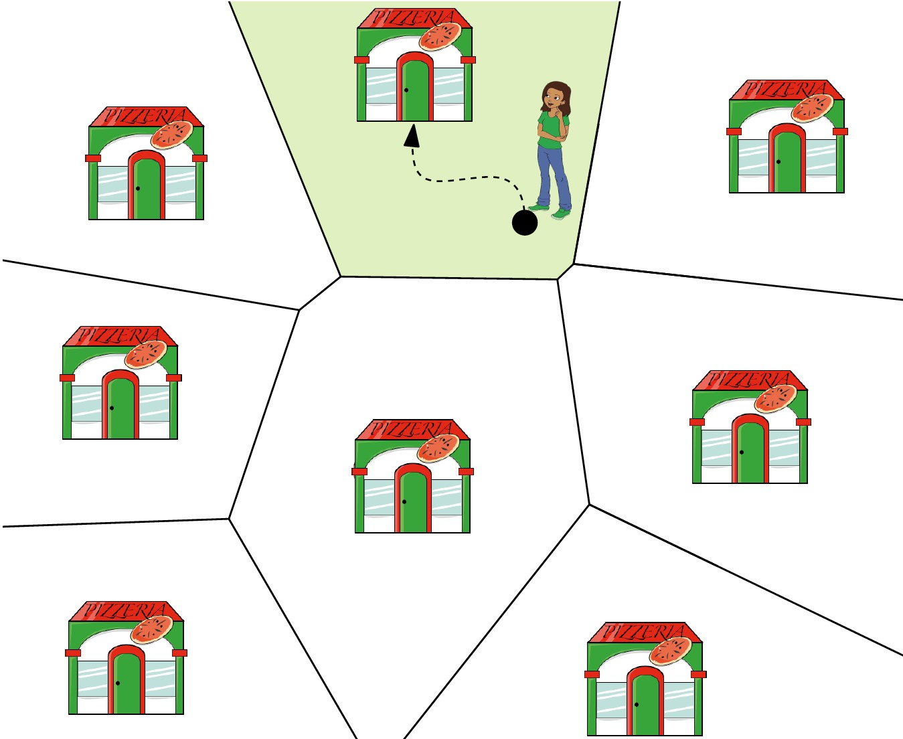
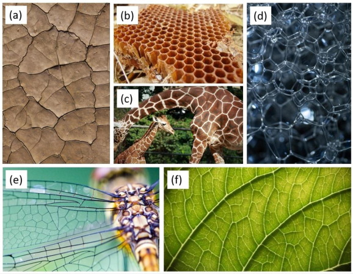
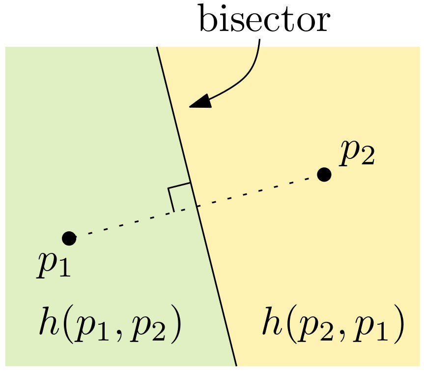
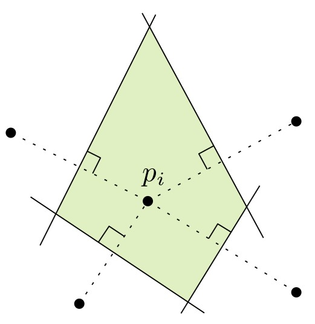
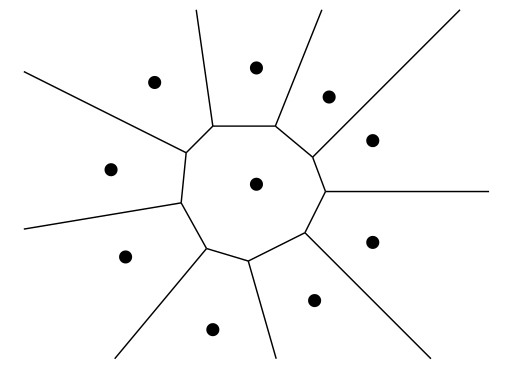
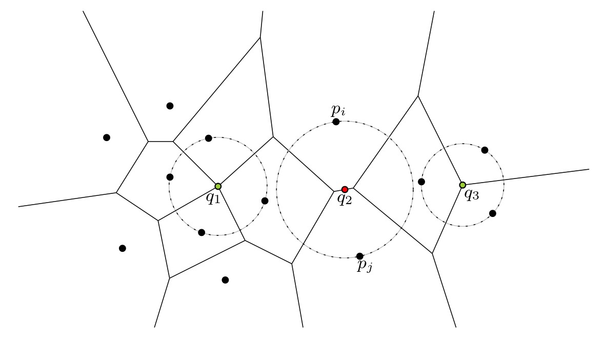
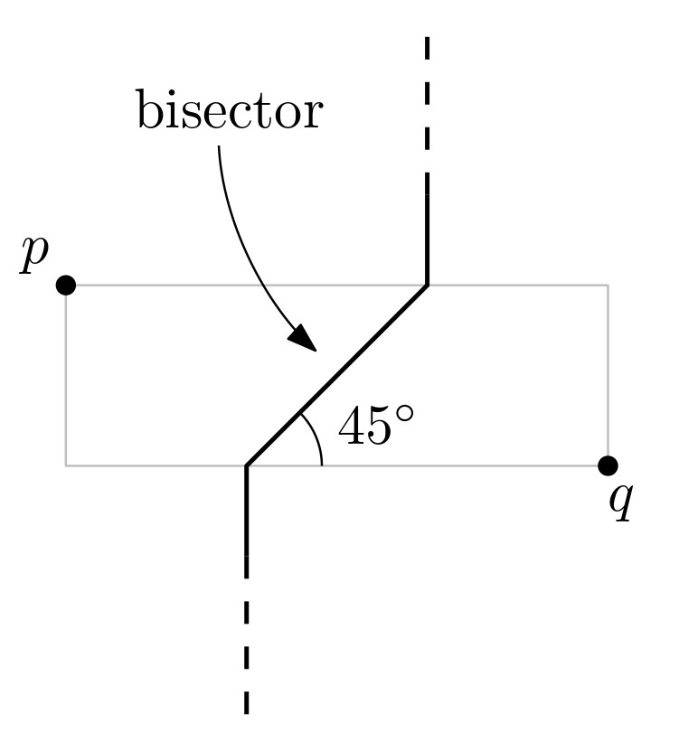
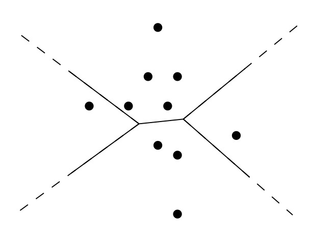
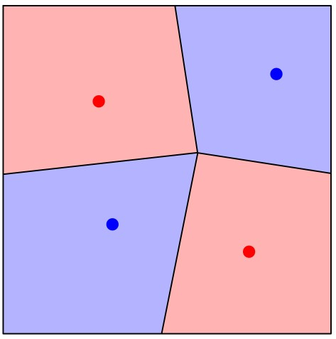

# דיאגרמת וורונוי {#voronoi}

## הקדמה {#preface-7}

### מה ביחידה? {#contents-7}

יחידה זו מקבילה לפרק השביעי בספר הלימוד.

בסיום יחידה זו, תכירו את המושגים ותרכשו את הטכניקות והכלים הבאים:

-   בעיית השכן הקרוב ביותר.
-   דיאגרמת וורונוי ותכונותיה.
-   חישוב דיאגרמת וורונוי בעזרת אלגוריתם סורק.
-   הכללות והרחבות של דיאגרמת וורונוי.

למידה מהנה!

### בעיית השכן הקרוב ביותר (או: בעיית מיקום הסניפים) {#nns}

נתון אוסף של מיקומי סניפים (נקודות במישור), ונניח שלקוחות בוחרים להגיע לסניף הקרוב ביותר אליהם (לפי מרחק אוקלידי). לאיזה סניף יגיע כל לקוח? מהו הסניף הרווחי ביותר? היכן כדאי לנו למקם סניף נוסף כך שיהיה רווחי? דיאגרמת וורונוי (Voronoi diagram) היא מבנה גיאומטרי בסיסי וחשוב ביותר, שבעזרתו נוכל לענות על שאלות אלו, ועוד. זוהי בעצם חלוקה של המישור לתאים, תא אחד לכל סניף, כך שכל תא מכיל בדיוק את אוסף הנקודות במישור הקרובות לסניף שלו יותר מאשר לכל אחד מהסניפים האחרים.

#### קראו את ההקדמה לפרק 7 בספר הלימוד (עמודים 147--148). {.unnumbered}

## הגדרה ותכונות בסיסיות {#basic-prop}

### מהי דיאגרמת וורונוי? {#Voronoi-vid}

בסרטון הבא נגדיר את דיאגרמת וורונוי באופן פורמלי ונתאר מספר תכונות שלה.

#### צפו בסרטון הבא: {.unnumbered}

<iframe width="560" height="315" src="https://www.youtube.com/embed/Ofp5zWt8nTc?si=F0XW4UQFPIZZn5Os" title="YouTube video player" frameborder="0" allow="accelerometer; autoplay; clipboard-write; encrypted-media; gyroscope; picture-in-picture; web-share" allowfullscreen>

</iframe>

#### הגדרה: דיאגרמת וורונוי {.unnumbered}

::: rmdimportant

תהי $P=(p_1,\dots,p_n)$ קבוצה של $n$ נקודות במישור. דיאגרמת וורונוי של הקבוצה $P$ היא חלוקה של המישור ל-$n$ תאים, אחד לכל נקודה של $P$, כך שנקודה $q$ שייכת לתא שמתאים לנקודה $p_i$ אם ורק אם $\|p_i-q\|<\|p_j-q\|$ לכל $p_j\in P$, $j\neq i$. נסמן ב-$\text{Vor(P)}$ את דיאגרמת וורונוי של הקבוצה $P$, ועבור נקודה $p_i\in P$ נסמן ב-$\mathcal{V}(p_i)$ את התא בדיאגרמה המתאים ל-$p_i$.
:::

#### נסו בעצמכם! {.unnumbered}

היישומון הבא מאפשר לבחור נקודות במישור, ובונה את דיאגרמת וורנוי שלהן באופן אינטראקטיבי. תוכלו לפתוח אותו בלשונית נפרדת <a href="https://alexbeutel.com/webgl/voronoi.html">בקישור הזה</a>.

<embed type="text/html" src="https://alexbeutel.com/webgl/voronoi.html" width="100%" height="500">

#### מעניין לדעת: שימושים לדיאגרמת וורונוי {.unnumbered}
לדיאגרמת וורונוי יש שימושים רבים ומגוונים, ופרט לתחום החברתי-כלכלי (שהוזכר בהקדמה) היא משמשת גם בתחומים, כמו גרפיקה ממוחשבת, רובוטיקה, פיזיקה וביולוגיה, ומופיעה במגוון צורות בטבע, כפי שניתן לראות למשל בתמונות הבאות (מתוך המאמר <a href="https://www.sciencedirect.com/science/article/abs/pii/S0167732221012770">הזה</a>).

{width="80%"}

#### נסו בעצמכם! אמנות חזותית באמצעות דיאגרמת וורונוי {.unnumbered}

היישומון הבא מאפשר ליצור יצירות אומנות בעזרת דיאגרמת וורונוי! תוכלו לפתוח אותו בלשונית נפרדת <a href="https://omrit.filtser.com/voronoi-applet.html">בקישור הזה</a>. (על טריאנגולצית דלוני נלמד בהמשך הקורס.)

<embed type="text/html" src="https://omrit.filtser.com/voronoi-applet.html" width="100%" height="700">

 

בשני העמודים הבאים מופיעות ההגדרות, האבחנות והתכונות של דיאגרמת וורונוי עליהן דנו בסרטון, כדי שיהיה לכם נוח לחזור אליהן בעתיד. נוסף על כך, מופיעות בהם הערות ודוגמאות נוספות וכן תרגילים לחזרה, כך שמומלץ לעבור על כל אלו בעיון לפני שממשיכים לחלק הבא.

### מבנה הדיאגרמה {#structure}

#### כיצד נראית הדיאגרמה של שני אתרים בלבד? {.unnumbered}

נניח שנתונות לנו שתי נקודות בלבד, $p_1,p_2$. כיצד תיראה הדיאגרמה במקרה זה?

#### הגדרה: bisector  {.unnumbered}

::: rmdimportant
עבור שתי נקודות $p_1$ ו-$p_2$, האנך האמצעי לקטע $\overline{p_1p_2}$ נקרא ה-bisector של $p_1$ ו-$p_2$.
:::

 שימו לב שכל נקודה שנמצאת על ה-bisector היא במרחק שווה מ-$p_1$ ו-$p_2$ (חשבו מדוע).

ה-bisector של $p_1$ ו-$p_2$ מחלק את המישור לשני חצאי מישור. נסמן ב-$h(p_1,p_2)$ את חצי המישור הפתוח שמכיל את $p_1$. כל נקודה הנמצאת ב-$h(p_1,p_2)$, קרובה יותר ל-$p_1$ מאשר ל-$p_2$.

#### ענו על השאלה הבאה: {.unnumbered}

בשאלה זו נחשב את משוואת הישר שהוא ה-bisector של הנקודות p=(2,1) ו-q=(10,5).
 
1. מהו השיפוע של הישר העובר דרך p=(2,1)ו-q=(10,5)?
2. מהו השיפוע של ה-bisector של p=(2,1) ו-q=(10,5)?
3. מהי הנקודה האמצעית על הקטע pq?
4. מהי משוואת ה-bisector של p=(2,1) ו-q=(10,5)?

(פתרון)

הנוסחאות לחישוב התשובות מופיעות ביישומון Desmos [בקישור הזה](https://www.desmos.com/calculator/c8rgzzejug).

#### כיצד נראה תא וורונוי? {.unnumbered}

האבחנות שראינו קודם מובילות אותנו לאבחנה הבאה בנוגע למבנה של תא בדיאגרמת וורונוי:

::: rmdimportant
**אבחנה (7.1 בספר הלימוד)**: תא וורונוי $\mathcal{V}(p_i)$ מתקבל על ידי חיתוך של $n-1$ חצאי מישורים, ולכן הוא פוליגון קמור (ייתכן שאינו חסום) בעל לכל היותר $n-1$ קודקודים ו-$n-1$ צלעות.
:::

{width="30%"}

#### כיצד נראית הדיאגרמה כולה? {.unnumbered}

מכיוון שכל תא בדיאגרמה הוא חיתוך של חצאי מישורים, דיאגרמת וורונוי תהיה חלוקה של המישור שהצלעות שלה הן ישרים, חצאי ישרים או קטעים. צלעות שהן ישרים (כלומר כאלו שאינן חסומות משני הצדדים) יתקבלו רק במקרה שבו כל הנקודות נמצאות על ישר אחד. בספר הלימוד מופיעה ההוכחה המלאה למשפט הבא:

::: rmdimportant
**משפט (7.2 בספר הלימוד)**: אם כל נקודות $P$ נמצאות על ישר אחד, אז $\text{Vor(P)}$ מורכבת מ-$n-1$ ישרים מקבילים. אחרת, $\text{Vor(P)}$ קשירה, והצלעות שלה הן קטעים או חצאי ישרים (קרניים).
:::

{width="100%"}

#### נסו בעצמכם! {.unnumbered}
ציירו את דיאגרמת וורנוי של קבוצת הנקודות הנתונה. ניתן להשתמש ב-Geogebra.

<iframe src="https://www.geogebra.org/classic/ypda7sap?embed" width="100%" height="500" allowfullscreen style="border: 1px solid #e4e4e4;border-radius: 4px;" frameborder="0">

</iframe>

(פתרון)

<iframe src="https://www.geogebra.org/classic/rqpdwhvx?embed" width="100%" height="500" allowfullscreen style="border: 1px solid #e4e4e4;border-radius: 4px;" frameborder="0">

</iframe>

#### שאלה למחשבה: בניית  דיאגרמת וורונוי {.unnumbered}
נסו לחשוב בעצמכם על אלגוריתם פשוט לבניית דיאגרמת וורונוי.

רמז: ניתן להשתמש באבחנה בנוגע למבנה של תא וורונוי. 

(התשובה מופיעה בתחילת סעיף 7.2 בספר הלימוד.)

### סיבוכיות הדיאגרמה ותכונת המעגל הריק {#complexity}

#### סיבוכיות הדיאגרמה {.unnumbered}

שימו לב שהסיבוכיות של תא בודד בדיאגרמה עשויה להיות $\Theta(n)$, כמו למשל באיור הבא.

{width="30%"}

מה הסיבוכיות של כל הדיאגרמה? על ידי שימוש ב[נוסחת אוילר](#euiler), והעובדה שהדרגה המינימלית של קודקוד בדיאגרמה היא 3, ניתן להוכיח שהסיבוכיות של $\text{Vor}(P)$ היא $O(n)$ (ההוכחה המלאה מופיעה בספר הלימוד).

::: rmdimportant
**משפט (7.3 בספר הלימוד)**: 
עבור n≥3, מספר הקודקודים ב-Vor(P) הוא לכל היותר 2n−5, ומספר הצלעות ב-Vor(P) הוא לכל היותר 3n−6.
:::

#### תכונת המעגל הריק {.unnumbered}

תכונת המעגל הריק מאפשרת לנו להבין טוב יותר מיהם האנכים האמצעיים שנקודת החיתוך ביניהם היא קודקוד של הדיאגרמה. עבור נקודה $q$, נגדיר את $C_P(q)$ להיות המעגל הגדול ביותר שמרכזו ב-$q$ והוא ריק (בפנימו) מנקודות $P$. המשפט הבא הוא אפיון חשוב של דיאגרמת וורונוי, שיאפשר לנו בהמשך לבנות אותה ביעילות. ההוכחה המלאה מופיעה כמובן בספר הלימוד.

::: rmdimportant
**משפט (7.4 בספר הלימוד)**:

1.  נקודה $q$ היא **קודקוד** של $\text{Vor(P)}$ אם ורק אם $C_P(q)$ מכיל לפחות שלוש נקודות של $P$ על שפתו.
2.  ה-bisector של $p_i$ ו-$p_j$ מגדיר **צלע** של $\text{Vor(P)}$ אם ורק אם קיימת נקודה $q$ על ה-bisector כך ש-$C_P(q)$ מכיל את $p_i$ ו-$p_j$ על שפתו, ואינו מכיל אף נקודה אחרת של $P$ על שפתו.
:::

#### דוגמה: {.unnumbered}
באיור הבא, הנקודות הירוקות $q_1$ ו-$q_3$ הן קודקודים של הדיאגרמה $\text{Vor(P)}$: המעגל $C_P(q_1)$ מכיל ארבע נקודות של $P$ על שפתו, והמעגל $C_p(q_3)$ מכיל שלוש נקודות של $P$ על שפתו. הנקודה האדומה $q_2$ נמצאת על ה-bisector של $p_i$ ו-$p_j$, והמעגל $C_P(q_2)$ מכיל את $p_i$ ו-$p_j$ על שפתו ואינו מכיל אף נקודה אחרת של $P$ על שפתו. לכן ה-bisector של $p_i$ ו-$p_j$ מגדיר צלע של $\text{Vor(P)}$.

{width="100%"}

#### ענו על השאלה הבאה: {.unnumbered}
k אנשים מחלקים ביניהם עוגה עגולה, באופן הבא. כל אחד מהם בתורו בוחר נקודה על ההיקף של העוגה, ואז בונים את דיאגרמת וורונוי של k הנקודות וחותכים את העוגה לפרוסות לפי צלעות הדיאגרמה.

1.  עבור k=2, מי מהאנשים יקבל פרוסה גדולה יותר?

2.  עבור k=3, איזה חלק של העוגה יכול האדם השלישי להבטיח שיקבל?

3.  איזה חלק של העוגה יקבל האדם ה-k, עבור $k\ge 3$?

(פתרון)

עבור k=2, דיאגרמת וורונוי היא בדיוק ה-bisector של שתי הנקודות שנבחרו, ולכן לא משנה איזה נקודות יבחרו -- העוגה תמיד תתחלק לשני חלקים שווים. שימו לב שה-bisector תמיד עובר במרכז המעגל. מתכונת המעגל הריק, עבור $k\ge 3$ לדיגארמה תמיד יהיה קודקוד יחיד שנמצא בדיוק במרכז העוגה. נניח לשם פשטות שהעוגה היא מעגל עם היקף באורך 1, ו-k-1 האנשים הראשונים בוחרים נקודות על המעגל הזה, שמחלקות את המעגל ל-k-1 קשתות. כשיגיע תורו של האדם ה-k, הוא תמיד יוכל למצוא קשת של המעגל בין שתי נקודות שכבר נבחרו, שהיא באורך לפחות $\frac{1}{k-1}$. זה מכיוון שאם כל k-1 הקשתות הקיימות הן באורך קטן ממש מ-$\frac{1}{k-1}$, אז סכומן יהיה קטן מ-1. אם האדם ה-k יבחר נקודה על הקשת הזו, הוא יקבל פרוסה בגודל $\frac{1}{2(k-1)}$ מהעוגה.

#### קראו את סעיף 7.1 בספר הלימוד (עמודים 148--151). {.unnumbered}

#### ענו על השאלה הבאה: {.unnumbered}
נתונה קבוצה P של 10 נקודות במישור.

1. מהו המספר הגדול ביותר האפשרי של צלעות ב-Vor(P)?
2. מהו המספר הקטן ביותר האפשרי של צלעות ב-Vor(P)?
3. מהו המספר הגדול ביותר האפשרי של קודקודים  ב-Vor(P)?
4. מהו המספר הקטן ביותר האפשרי שלהקודקודים  ב-Vor(P)?
5. מהי הדרגה הגדולה ביותר האפשרית לקודקוד ב-Vor(P)?
6. מהו מספר השכנים הגדול ביותר האפשרי לתא ב-Vor(P)?

(פתרון)

1. לפי משפט 7.3 בספר הלימוד.
2. לפי משפט 7.2 בספר הלימוד.
3. לפי משפט 7.3 בספר הלימוד.
4. לפי משפט 7.2 בספר הלימוד.
5. לפי תכונת המעגל הריק (משפט 7.4 בספר הלימוד).
6. ראו דוגמה בתחילת העמוד הזה, ובעמוד 150 בספר הלימוד.

## חישוב הדיאגרמה {#computing-VD}

### סריקת קו החוף {#beach-line}

 האבחנה שראינו בחלק הקודם בנוגע למבנה של תא וורונוי מובילה לאלגוריתם פשוט למדי לחישוב הדיאגרמה. נוכל לחשב לכל אתר $p_i$ את החיתוך של חצאי המישורים $h(p_i,p_j)$ לכל $j\neq i$ בעזרת האלגוריתם שראינו ביחידה 4, וכך נקבל את התא המתאים ל-$p_i$. כך החישוב של כל תא יהיה בזמן $O(n\log n)$, וסך כל זמן הריצה יהיה $O(n^2 \log n)$. האם ניתן להשיג זמן טוב יותר? אחרי הכול, הסיבוכיות של דיאגרמת וורונוי היא לינארית. בסרטון הבא נתאר רעיון לחישוב דיאגרמת וורונוי בעזרת אלגוריתם סורק.

#### צפו בסרטון הבא: {.unnumbered}

<iframe width="560" height="315" src="https://www.youtube.com/embed/T4QqrteIy7s?si=CclpxQG3dWJzMQ55" title="YouTube video player" frameborder="0" allow="accelerometer; autoplay; clipboard-write; encrypted-media; gyroscope; picture-in-picture; web-share" allowfullscreen>

</iframe>

#### נסו בעצמכם! {.unnumbered}

ביישומון הבא, מאת [Philipp Kindermann](https://www.youtube.com/@PhilippKindermann), תוכלו לראות בעצמכם כיצד נראה קו החוף ביחס לדיאגרמה. הזיזו את קו החוף מעלה ומטה. שימו לב מתי נוספות קשתות חדשות, וכיצד נקודות החיבור בין הקשתות של קו החוף "משרטטות" את צלעות הדיאגרמה כאשר הישר הסורק מתקדם מטה.

<iframe src="https://www.desmos.com/calculator/dcdpn6w8ua?embed" width="100%" height="500" style="border: 1px solid #ccc" frameborder="0">

</iframe>

### האלגוריתם הסורק של Fortune {#Fortune-alg}

בסעיף 7.2 בספר הלימוד מתואר בפירוט האלגוריתם הסורק של Fortune לבניית דיאגרמת וורונוי. זהו אלגוריתם בסיסי וחשוב ביותר בתחום הגיאומטריה החישובית. זמן הריצה שלו הוא $O(n\log(n))$ בלבד, והוא אופטימלי. בקורס זה נדלג על הפרטים ועל מימוש האלגוריתם, ונסתפק בתיאור הרעיון הכללי שראינו בסעיף הקודם, ובציטוט המשפט הבא:

::: rmdimportant
**משפט (7.10 בספר הלימוד)**: ניתן לחשב את דיאגרמת וורונוי של קבוצת נקודות בגודל $n$ בזמן $O(n\log(n))$.
:::

#### הדגמה. {.unnumbered}

הסרטון הבא (מאת Kevin Schaal) מציג אנימציה נהדרת הממחישה את אופן פעולת האלגוריתם:

<iframe width="560" height="315" src="https://www.youtube.com/embed/k2P9yWSMaXE" title="YouTube video player" frameborder="0" allow="accelerometer; autoplay; clipboard-write; encrypted-media; gyroscope; picture-in-picture; web-share" allowfullscreen>

</iframe>

#### להרחבה ולהעשרה: ניתוח ומימוש האלגוריתם {.unnumbered}
למתעניינים בפרטי האלגוריתם, בניתוחו ובאופן המימוש שלו: קראו את סעיף 7.2 בספר הלימוד (עמודים 151–159).

## הכללות והרחבות {#extensions}

### מֵעֵבֶר למישור האוקלידי {#beyond-Euclid}

בחלקים הקודמים הגדרנו את דיאגרמת וורונוי עבור אוסף של נקודות במישור תחת מטריקת $L_2$, כלומר המרחק האוקלידי. זהו בעצם מקרה פשוט של רעיון כללי ומופשט הרבה יותר; באופן כללי, דיאגרמת וורונוי מתארת חלוקה של המרחב לתאים, לפי המרחק לאובייקטים מאוסף נתון. ראו למשל את <a href="https://en.wikipedia.org/wiki/Voronoi_diagram#Formal_definition">ההגדרה הפורמלית של דיאגרמת וורונוי המופיעה בוויקיפדיה</a> (עבור מרחבים מטריים).

#### ממד גבוה {.unnumbered}

הכללה אחת שניתן לעשות נוגעת ל**מרחב** שבו נמצאים האתרים. הדוגמה הפשוטה ביותר להכללה כזו היא עבור נקודות בממדים גבוהים מ-2. עבור נקודות מממד $d$, הסיבוכיות של הדיאגרמה יכולה להגיע ל-$\Theta(n^{\lceil d/2\rceil})$, וניתן לחשב אותה בזמן $O(n\log n+n^{\lceil d/2\rceil})$.

#### פונקציית המרחק {.unnumbered}
 הכללה אחרת נוגעת לפונקציית ה**מרחק**: במקום מרחק אוקלידי, נוכל להשתמש בפונקציית מרחק אחרת בין הנקודות. למשל, מרחק $L_1$ (שנקרא גם "מרחק מנהטן") בין שתי נקודות $p$ ו-$q$ מוגדר להיות $$\|p-q\|_1:=|p_x-q_x|+|p_y-q_y\|.$$ במקרה זה כל צלעות הדיאגרמה יהיו אופקיות, אנכיות או בזווית של $45^\circ$ בלבד.

#### אתרים לא נקודתיים {.unnumbered}
הכללה נוספת של הדיאגרמה נוגעת לאתרים עצמם: במקום אוסף של נקודות, נוכל להגדיר את קבוצת האתרים להיות **אוסף של אובייקטים**, כלומר אוסף של תת-קבוצות של נקודות מהמרחב. דוגמה אחת שמופיעה בספר הלימוד לשימוש בהכללה הזו היא כאשר האובייקטים האלו הם קטעים. המרחק בין נקודה $q$ לקטע $s$ מוגדר להיות המרחק (האוקלידי) בין $q$ לנקודה על $s$ שקרובה אליה ביותר. תוכלו לקרוא על כך בסעיף 7.3 בספר הלימוד.

### הרחבות נוספות {#other-defs}

דיאגרמת וורונוי מוגדרת לפי המרחק לאתר הקרוב ביותר. ניתן להכליל את ההגדרה הזו במספר דרכים שונות, וגם כאן נזכיר בקצרה שתיים מהן.

#### דיאגרמת וורונוי ממושקלת {.unnumbered}

כאן, נוסף על אוסף האתרים $P=(p_1,\dots,p_n)$, נתון לנו גם אוסף של משקלים $W=(w_1,\dots,w_n)$, כך שמשקל המתאים ל-$p_i$ הוא $w_i$. השינוי בהגדרה של הדיאגרמה הוא בפונקציית המרחק: נקודה $q$ שייכת לתא שמתאים לנקודה $p_i$ אם ורק אם $\|p_i-q\|+w_i<\|p_j-q\|+w_j$ לכל $p_j\in P$, $j\neq i$. שימו לב שאם כל המשקלים הם 0, אז מדובר בבעיה המקורית.

ניתן לחשוב על סיטואציות שונות מהעולם האמיתי שבהן יש צורך בהוספת משקלים, למשל כאשר כל אתר מסמל מרכז קניות שלם, וכל מרכז קניות הוא אטרקטיבי במידה שונה.

#### דיאגרמת וורונוי מסדר k {.unnumbered}

עבור קבוצת אתרים $P=(p_1,\dots,p_n)$ ומספר $1\le k\le n-1$, דיאגרמת וורונוי מסדר $k$ היא חלוקה של המישור לתאים, כך שכל תא מזוהה עם תת-קבוצה בגודל $k$ של אתרים מ-$P$, ונקודה שייכת לתא המזוהה עם קבוצה $\{p_{i_1},\dots,p_{i_k}\}$ אם ורק אם אלו הם $k$ האתרים הקרובים אליה ביותר מבין כל האתרים ב-$P$. למשל, עבור $k=2$ כל תא מזוהה עם זוג נקודות, ונקודה $q$ שייכת לתא של $p_i,p_j$ אם לא קיים אתר אחר ב-$P$ שקרוב אליה יותר מ-$p_i$ או $p_j$.

מקרה מעניין במיוחד הוא עבור $k=n-1$: במקרה זה כל תא מזוהה עם $n-1$ נקודות, ובאופן שקול, כל תא מזוהה עם נקודה אחת (היחידה שאינה בקבוצה), ונקודה $q$ שייכת לתא של $p_i$ אם $p_i$ היא הנקודה הרחוקה ביותר ממנה מבין נקודות $P$. לפיכך מקרה זה נקרא Farthest-Point Voronoi Diagram, או בקיצור דיאגרמת FPV. באיור למטה, ניתן לראות דוגמה לדיאגרמת FPV של קבוצת נקודות. האם תצליחו לזהות איזה תא מתאים לאיזו נקודה?

{width="35%"}

להעשרה, קראו עוד על דיאגרמת FPV בסעיף 7.4 בספר הלימוד.

------------------------------------------------------------------------

## בונוס: משחק וורונוי {#voronoi-game}

### משחק וורונוי על ריבוע

(חלק זה הוא להעשרה בלבד ואינו נכלל בחומר הקורס.)

 במשחק וורונוי יש שני שחקנים, כחול ואדום, והלוח הוא ריבוע במישור. השחקנים משחקים בתורות במשך $n$ סבבים, כאשר האדום משחק ראשון והכחול שני. כל שחקן בתורו בוחר נקודה על הלוח, ואז בונים את דיאגרמת וורונוי של כל הנקודות שנבחרו ומחשבים את סכום השטחים של תאי וורונוי האדומים ושל תאי וורונוי הכחולים. המנצח הוא זה שבסוף המשחק הצליח להשיג שטח גדול יותר.

שאלה מעניינת למחקר היא: למי מהשחקנים יש אסטרטגיה מנצחת, ומהי? שאלה נוספת: בהינתן מצב של הלוח, באיזו נקודה כדאי לבחור כדי למקסם את השטח? ואיך ניתן לחשב זאת בזמן יעיל? ניתן לחשוב גם מה קורה כשלוח המשחק הוא לאו דווקא ריבוע; למשל, מה קורה כאשר לוח המשחק הוא פוליגון? או גרף?

ניתן לשחק במשחק וורונוי <a href="https://cfbrasz.github.io/VoronoiColoring.html">בסימולציה הזו</a> מאת Frederik Brasz.
