# שילושי דלוני {#Delaunay-triangulation}

## הקדמה {#preface-9}

### מה ביחידה? {#contents-9}

#### שילושי דלוני {.unnumbered}

יחידה זו מקבילה לפרק התשיעי בספר הלימוד. 

בסיום יחידה זו, תכירו את המושגים ותרכשו את הטכניקות והכלים הבאים:

- מפה מישורית מקסימלית.
- שילוש של קבוצת נקודות במישור.
- שילוש חוקי ושילוש אופטימלי בזוויות.
- גרף דלוני ושילוש דלוני.
- אלגוריתמים לחישוב השילוש (אלגוריתם היפוך צלעות, אלגוריתם סורק, אלגוריתם אינקרמנטלי-רנדומי).

למידה מהנה!

### אינטרפולציה של גבהים {#terrains}

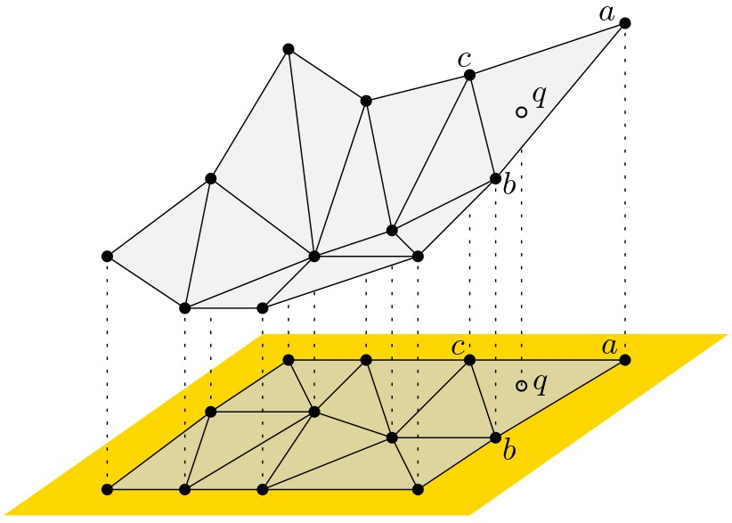
ייצוג תלת-ממדי של פני שטח (terrain) נעשה בדרך כלל על ידי לקיחה דגימות של גובה בנקודות מסוימות, וקביעת גובה הנקודות שלא נמדדו על ידי אינטרפולציה כלשהי של נקודות הדגימה. הדרך המקובלת לעשות זאת היא בעזרת שילוש של קבוצת הנקודות, כלומר חלוקה של המישור שכל הפאות החסומות שלה  הן משולשים שקודקודיהם הם נקודות הדגימה. הגובה של נקודה $q$ שלא נמדדה יתקבל כך: נמצא את המשולש $\triangle abc$ שהנקודה $q$ נמצאת בתוכו. הנקודות $a,b,c$ עם מדידות הגובה שלהן הן נקודות תלת-ממדיות, ולכן מגדירות מישור בתלת-ממד. נטיל את $q$ על המישור הזה, וקואורדינטת ה-$z$ שתתקבל תהיה הגובה של $q$.

לא כל השילושים ייראו לנו "טובים" או "טבעיים" באותה המידה. התבוננו למשל בשני השילושים באיור למטה. אלו שני שילושים שונים של אותה קבוצת נקודות, יחד עם הגבהים המתאימים להן. בכל אחד מהם, הנקודה המסומנת $q$ תהיה בגובה שונה. איזה מהשילושים סביר שיתאר את המציאות באופן מהימן יותר?

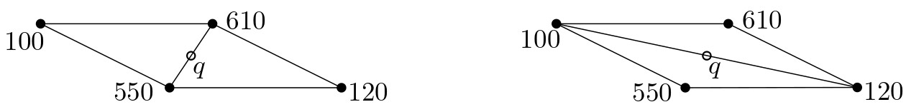{width="80%"}

#### ענו על השאלה הבאה: {.unnumbered}
מה (בערך) יהיה הגובה של הנקודה $q$ בכל אחד מהשילושים באיור למעלה?

(פתרון)

בשילוש מימין, הגובה של $q$ יהיה בין 100 ל-120. בשילוש משמאל, הגובה יהיה בין 550 ל-610.

 

השילוש משמאל נראה טבעי יותר מהימני, מכיוון שבאופן אינטואיטיבי סביר יותר שהגובה של הנקודה $q$ יהיה דומה לגובה של הנקודות שנמצאות בסביבתה הקרובה.

ביחידה זו ננסה להבין כיצד להגדיר שילוש שמשקף את התפיסה האינטואיטיבית שלנו לגבי מהו שילוש "טוב", וכן נלמד כיצד ניתן לחשב שילוש כזה.

#### קראו את ההקדמה לפרק 9 בספר הלימוד (עמודים 191–193). {.unnumbered}

## שילוש של קבוצת נקודות במישור {#point-set-triangulation}

### מפה מישורית מקסימלית

ביחידה 3 בקורס דיברנו על שילוש של פוליגונים – חלוקה של פוליגון למשולשים על ידי מספר מקסימלי של אלכסונים שאינם חותכים זה את זה. ביחידה זו, נעסוק בשילושים של קבוצות של נקודות במישור. כדי להגדיר באופן פורמלי מהו שילוש של קבוצת נקודות, נסביר קודם מהי מפה מישורית **מקסימלית** (שימו לב שביחידה 2 עסקנו במפות מישוריות שאינן בהכרח מקסימליות).

#### הגדרה: מפה מישורית מקסימלית {.unnumbered}
::: rmdimportant
**מפה מישורית מקסימלית** היא מפה מישורית שלא ניתן להוסיף לה צלעות, כלומר כל צלע שנוסיף בין שני קודקודים תחתוך צלע אחרת.
:::

#### ענו על השאלה הבאה: {.unnumbered}
מי מהמפות המישוריות הבאות היא מקסימלית?

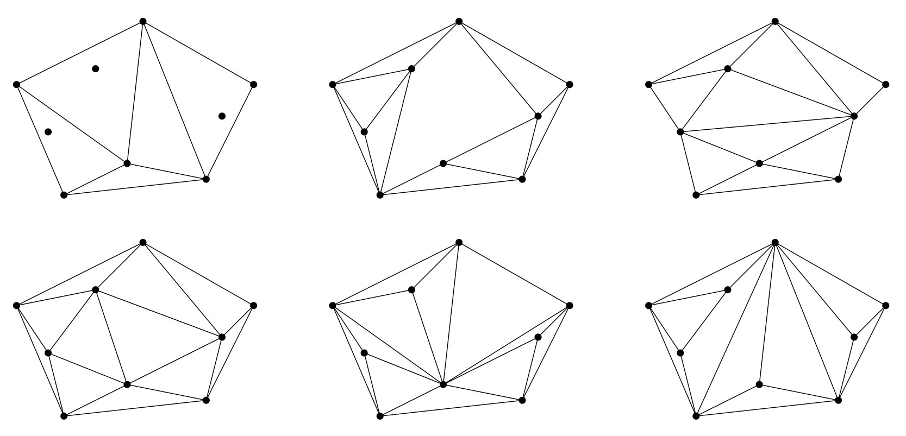{width="100%"}

(פתרון)

שלוש המפות התחתונות בלבד.

#### תכונות של מפה מישורית מקסימלית {.unnumbered}

כאשר פתרתם את התרגיל הקודם, ודאי הבחנתם בשתי התכונות הבאות:

-   **הפאות (החסומות) הן משולשים**: אם יש פאה חסומה שהיא לא משולש, ניתן לשלש אותה על ידי הוספת אלכסונים, כפי שראינו ביחידה 3 (שילוש של פוליגונים).

-   **כל צלעות הקמור של קבוצת הקודקודים שייכות למפה** (והן הצלעות של הפאה הלא חסומה): לא תיתכן צלע שיוצאת החוצה מהקמור, ולכן הצלעות של הקמור לא יחתכו שום צלע אחרת, ויהיה ניתן להוסיף אותן למפה.

### שילוש של נקודות במישור {#triang-def}

התכונה הראשונה שראינו מובילה אותנו להגדרת שילוש של קבוצת נקודות $P$ במישור באופן הבא:

#### הגדרה: שילוש של קבוצת נקודות במישור {.unnumbered}

::: rmdimportant

בהינתן קבוצה $P$ של $n$ נקודות במישור, שילוש של $P$ הוא מפה מישורית מקסימלית שהקודקודים שלה הם נקודות $P$.
:::

שימו לב, ייתכן שקיים יותר משילוש אחד לקבוצה נתונה של נקודות!

#### ענו על השאלה הבאה: {.unnumbered}
כמה שילושים שונים תוכלו למצוא עבור קבוצת הנקודות הבאה? כמה משולשים יש בכל אחד מהשילושים?

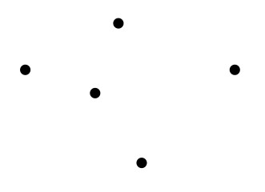{width="20%"}

(פתרון)

זכרו שצלעות הקמור חייבות להיות בשילוש. יש שלושה שילושים אפשריים, בכל אחד מהם ארבעה משולשים. מייד נראה שזה לא מקרי – כל השילושים האפשריים של קבוצת נקודות נתונה הם בדיוק באותו הגודל!

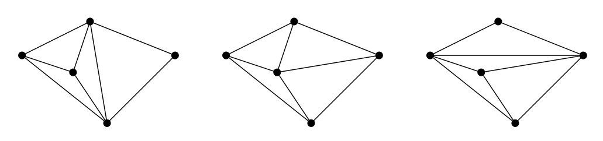{width="80%"}

#### גודל השילוש {.unnumbered}

באופן מעניין למדי, כל השילושים האפשריים של קבוצה $P$ של $n$ נקודות הם בדיוק באותו הגודל, כלומר יש להם מספר זהה של משולשים וצלעות. גודל השילוש תלוי במספר הנקודות שמופיעות על השפה של $CH(P)$ (שפת הקמור של $P$).

::: rmdimportant
**משפט (9.1 בספר הלימוד)**: תהי $P$ קבוצה של $n$ נקודות במישור, שלא כולן על ישר אחד. נסמן ב-$k$ את מספר הנקודות על השפה של $CH(P)$. לפיכך בכל שילוש של $P$ יש $2n-2-k$ משולשים ו-$3n-3-k$ צלעות.
:::

ההוכחה למשפט מופיעה בסעיף 9.1 בספר הלימוד, ונעשה בה שימוש בנוסחת אוילר, שכבר ראינו כמה פעמים בעבר.

#### תרגיל {.unnumbered}
 לפני שתקראו את ההוכחה המופיעה בספר, נסו להוכיח בעצמכם את המשפט לגבי גודל השילוש.
 

#### קראו את חלקו הראשון של סעיף 9.1 בספר הלימוד (עמודים 193–194). {.unnumbered}

קראו עד לסוף ההוכחה של משפט 9.1.

### שילוש חוקי ושילוש אופטימלי בזוויות {#opt_triang}

בהקדמה ליחידה זו, ראינו ששילושים שלא מכילים משולשים "צרים" (כלומר כאלו שיש להם זוויות חדות מאוד), בסבירות גבוהה משקפים טוב יותר את המצב במציאות. לכן נעדיף שילושים שבהם הזוויות הן כמה שיותר גדולות. בסרטון הבא נראה כיצד ניתן להגדיר שילוש אופטימלי כזה באופן מדויק.

#### צפו בסרטון הבא: {.unnumbered}

<iframe width="560" height="315" src="https://www.youtube.com/embed/OZvbdwovqxU?si=WnAhmzRwX2l4W_Co" title="YouTube video player" frameborder="0" allow="accelerometer; autoplay; clipboard-write; encrypted-media; gyroscope; picture-in-picture; web-share" allowfullscreen></iframe>

#### קראו את חלקו השני של סעיף 9.1 בספר הלימוד (עמודים 194–195). {.unnumbered}
שימו לב שבחלק האחרון של הסעיף מוצג אלגוריתם נאיבי לחישוב של שילוש אופטימלי בזוויות, אך אלגוריתם זה אינו יעיל במיוחד. בהמשך נראה אלגוריתמים יעילים יותר לחישוב של שילוש כזה.

### חזרה: הגדרות ותרגילים {#reminder}
למטה מופיעות ההגדרות, האבחנות והטענות המרכזיות שדנו בהן בחלק זה, כדי שיהיה לכם נוח לחזור אליהן בעתיד. נוסף על כך, מופיעות כאן הערות ודוגמאות נוספות וכן תרגילים לחזרה, כך שמומלץ לעבור על כל אלו לפני שממשיכים לסעיף הבא.

#### הגדרה: וקטור הזוויות {.unnumbered}
::: rmdimportant
בהינתן שילוש $\mathcal{T}$ בעל $m$ משולשים, נסמן את $3m$ זוויות המשולשים שלו $\alpha_1,\alpha_2,\dots,\alpha_{3m}$ כך ש-$\alpha_i\le\alpha_j$ לכל $i<j$. הווקטור $A(\mathcal{T}):=(\alpha_1,\alpha_2,\dots,\alpha_{3m})$ נקרא **וקטור הזוויות** של $\mathcal{T}$.
:::

#### ענו על השאלה הבאה: {.unnumbered}
מהו וקטור הזוויות של השילוש $\mathcal{T}$ הבא?

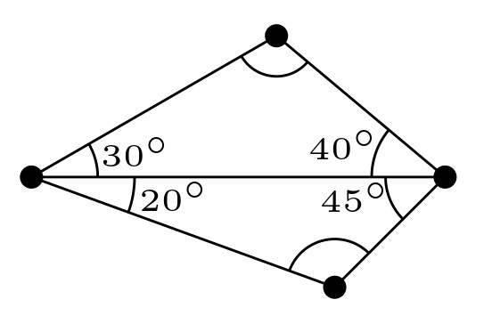{width="40%"}

(פתרון)

$A(\mathcal{T})=(20^\circ,30^\circ,40^\circ,45^\circ,110^\circ,115^\circ)$

#### הגדרה: שילוש אופטימלי בזוויות {.unnumbered}

עבור שני שילושים שונים $\mathcal{T}$ ו-$\mathcal{T}'$ של אותה קבוצת נקודות, נגדיר שווקטור הזוויות $A(\mathcal{T}):=(\alpha_1,\alpha_2,\dots,\alpha_{3m})$ גדול מווקטור הזוויות $A(\mathcal{T}'):=(\alpha'_1,\alpha'_2,\dots,\alpha'_{3m})$ אם הוא גדול ממנו ב**סדר לקסיקוגרפי**. כלומר $A(\mathcal{T})>A(\mathcal{T}')$ אם קיים $1\le i\le 3m$ כך ש־:

-   $\alpha_j=\alpha'_j$ לכל $j<i$, וגם
-   $\alpha_i>\alpha'_i$.

::: rmdimportant
שילוש $\mathcal{T}$ הוא **שילוש אופטימלי בזוויות** אם לכל שילוש אחר $\mathcal{T}'$ של אותה קבוצת נקודות מתקיים $A(\mathcal{T})\ge A(\mathcal{T}')$.
:::

#### ענו על השאלה הבאה: {.unnumbered}
איזה מהווקטורים הבאים גדול יותר בסדר לקסיקוגרפי?

$A_1=(20^\circ,30^\circ,30^\circ,50^\circ, 120^\circ, 130^\circ)$

או

$A_2=(20^\circ,30^\circ,35^\circ,40^\circ, 90^\circ, 110^\circ)$

(שימו לב שווקטורים אלו לא בהכרח מייצגים שילוש כלשהו.)

(פתרון)

$A_2$

#### משפט תאלס (מורחב) - נסו בעצמכם! {.unnumbered}

::: rmdimportant
**משפט (9.2 בספר הלימוד)**:

יהי $C$ מעגל, ו-$\ell$ ישר שחותך את המעגל בנקודות $a,b$. יהיו $p,q,s,r$ נקודות שכולן מאותו צד של $\ell$, כך ש-$p,q$ נמצאות על שפת המעגל, $r$ בתוכו ו-$s$ מחוץ למעגל. אז מתקיים: $$\measuredangle asb < \measuredangle apb = \measuredangle aqb < \measuredangle arb.$$ 
:::

ביישומון הבא, תוכלו להזיז את הנקודה הירוקה לתוך המעגל כדי לראות כיצד הזווית משתנה, ואת הנקודה הסגולה על שפת המעגל כדי לראות כיצד הזווית אינה משתנה. נוסף על כך, ניתן להזיז את הישר (הכחול) כדי להגדיל או להקטין את הקשת. 

<iframe src="https://www.desmos.com/calculator/lz9baqbqiw?embed" width="80%" height="300" style="border: 1px solid #ccc" frameborder=0></iframe>

#### הערה לגבי המשפט(ים) של תאלס {.unnumbered}
קיימים כמה משפטים בגיאומטריה של המישור שנקראים באותו השם – "משפט תאלס". אם למדתם גיאומטריה בתיכון בישראל, כנראה שאתם מכירים גרסה אחרת של המשפט. בוויקיפדיה גרסה זו נקראת [המשפט השני](https://he.wikipedia.org/wiki/%D7%9E%D7%A9%D7%A4%D7%98_%D7%AA%D7%90%D7%9C%D7%A1#%D7%94%D7%9E%D7%A9%D7%A4%D7%98_%D7%94%D7%A9%D7%A0%D7%99).

#### פעולת היפוך צלע {.unnumbered}

יהי $\mathcal{T}$ שילוש, ו-$e=\overline{p_ip_j}$ צלע בשילוש שמשותפת לשני משולשים $\triangle p_ip_jp_k$ ו- $\triangle p_ip_jp_l$. אם המרובע $p_ip_kp_jp_l$ הוא קמור אז ניתן לקבל מ-$\mathcal{T}$ שילוש אחר, $\mathcal{T}'$, על ידי החלפת הצלע $e$ בצלע $\overline{p_kp_l}$. פעולה זו נקראת היפוך של $e$, או $flip(e)$.

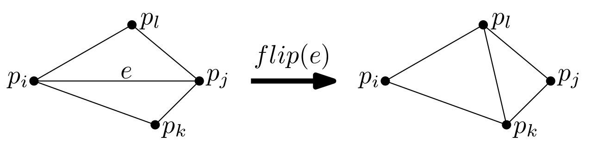{width="80%"}

#### צלעות לא חוקיות {.unnumbered}

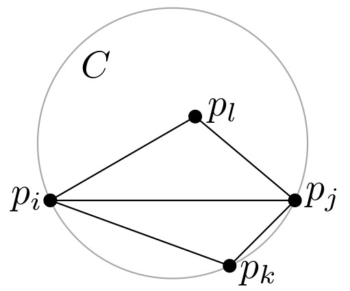 
צלע $\overline{p_ip_j}$ בשילוש $\mathcal{T}$ שמשותפת לשני משולשים $\triangle p_ip_jp_k$ ו- $\triangle p_ip_jp_l$ היא **לא חוקית** אם ורק אם המעגל $C$ שעובר דרך $p_i,p_j,p_k$ מכיל את $p_l$ בפנימו.

**תמיד ניתן לבצע היפוך של צלע לא חוקית**: אם $\overline{p_ip_j}$ לא חוקית, אז המרובע $p_ip_kp_jp_l$ חייב להיות קמור.

::: rmdimportant
**טענה (9.4 בספר הלימוד)**: 
אם המרובע $p_ip_kp_jp_l$ הוא קמור, ואין מעגל שעובר דרך ארבע הפינות שלו, אז בדיוק אחד משני האלכסונים של המרובע הוא חוקי. אם קיים מעגל שעובר דרך ארבע הפינות שלו, אז שני האלכסונים חוקיים.
:::

#### ענו על השאלה הבאה: {.unnumbered}
איזה מהאלכסונים של המרובע $p_ip_kp_jp_l$ אינו חוקי?

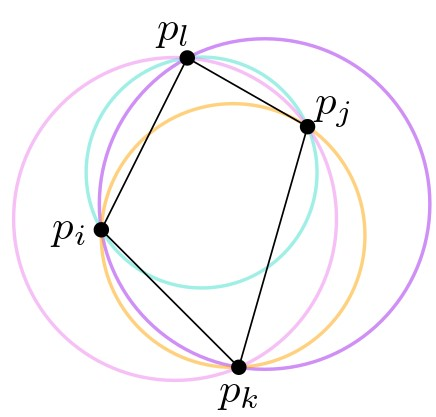{width="40%"}

(פתרון)

האלכסון $p_lp_k$ אינו חוקי מכיוון שהמעגל הסגול שעובר בנקודות $p_l,p_i,p_k$ מכיל את $p_j$.

#### הגדרה: שילוש חוקי {.unnumbered}

::: rmdimportant
**שילוש חוקי** הוא שילוש שאינו מכיל צלעות לא חוקיות.
:::

#### ענו על השאלות הבאות: {.unnumbered}
**שאלה 1**:
התבוננו בשילוש הבא. 

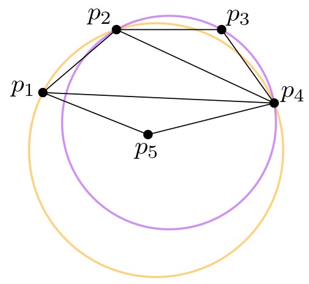{width="40%"}

1. האם הצלע $p_2p_4$ חוקית?
2. האם הצלע $p_1p_4$ חוקית?
3. האם יתקבל שילוש חוקי לאחר שנבצע $flip(p_1p_4)$?

(פתרון)

1. כן.
2. לא.
3. לא, מכיוון שאז הצלע $p_2p_4$ תהפוך ללא חוקית.

 

**שאלה 2**: 
נכון או לא נכון?

1.  כל שילוש אופטימלי בזוויות הוא חוקי.
2.  כל שילוש חוקי הוא אופטימלי בזוויות.

(פתרון)

1.  נכון. תמיד ניתן "לשפר" שילוש לא חוקי על ידי פעולת היפוך צלע. שילוש אופטימלי לא ניתן לשיפור, ולכן הוא חוקי.
2.  במצב לא כללי, כלומר כאשר יש ארבע נקודות על מעגל אחד, ייתכן שילוש חוקי שאינו אופטימלי בזוויות. שימו לב שבשילוש חוקי רק הזווית המינימלית היא חשובה, ולעומת זאת בשילוש אופטימלי בזוויות מתחשבים בכל וקטור הזוויות. בדוגמה הבאה מימין מופיע שילוש חוקי שאינו אופטימלי בזוויות, ומשמאל שילוש אופטימלי. שימו לב שווקטור הזוויות של שני השילושים כמעט זהה, פרט לכך שבשילוש מימין יש שתי זוויות שנשענות על האלכסון $p_kp_l$, ובשילוש משמאל יש שתי זוויות שנשענות על האלכסון $p_ipj$ שהוא ארוך יותר, ולכן זוויות אלו גדולות יותר.

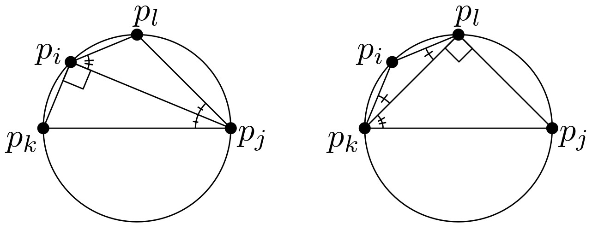{width="80%"}

בהמשך נראה שאם הנקודות במצב כללי (כלומר אין ארבע נקודות על מעגל אחד), אז כל שילוש חוקי הוא אופטימלי בזוויות.

## שילוש דלוני

### גרף דלוני ושילוש דלוני
לפני שנמשיך לדבר על שילושים, נציג את גרף דלוני, שהוא הגרף הדואלי לדיאגרמת וורונוי של קבוצת נקודות. מהן תכונות הגרף? וכיצד הוא קשור לשילוש? על כך בסרטון הבא.

#### צפו בסרטון הבא: {.unnumbered}

<iframe width="560" height="315" src="https://www.youtube.com/embed/TBkHTe1iUYg?si=Ro6an4spaBk6PODC" title="YouTube video player" frameborder="0" allow="accelerometer; autoplay; clipboard-write; encrypted-media; gyroscope; picture-in-picture; web-share" allowfullscreen></iframe>

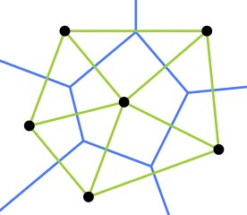
בסרטון הגדרנו את גרף דלוני $\mathcal{DG}(P)$ של קבוצת נקודות $P$ במישור, בעזרת דיאגרמת וורונוי של $P$: זהו שיכון של הגרף הדואלי ל-$Vor(P)$, שהקודקודים שלו הם נקודות $P$, והצלעות הן הקטעים הישרים המחברים בין אתרים שלפאות שלהם בדיאגרמה יש צלע משותפת. הוכחנו שגרף דלוני הוא מישורי, ודיברנו על התכונות המאפיינות אותו.

#### ענו על השאלות הבאות: {.unnumbered}
**שאלה 1**:
האם כל צלע של גרף דלוני חותכת את הצלע המשותפת לפאות של שני האתרים המתאימים לה בדיאגרמת וורונוי?
אם כן, הסבירו. אם לא, ציירו דוגמה לכך.

(פתרון)

לא, דוגמה:

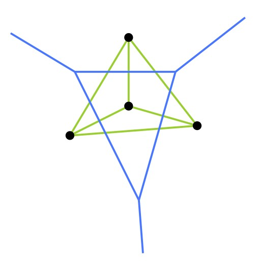{width="30%"}

 

**שאלה 2**:
כמה תאים של דיאגרמת וורונוי יכולים להיחתך עם אותה צלע של גרף דלוני במקרה הגרוע ביותר?

(פתרון)

במקרה הגרוע ביותר, צלע אחת של גרף דלוני יכולה להיחתך עם כל התאים. דוגמה:

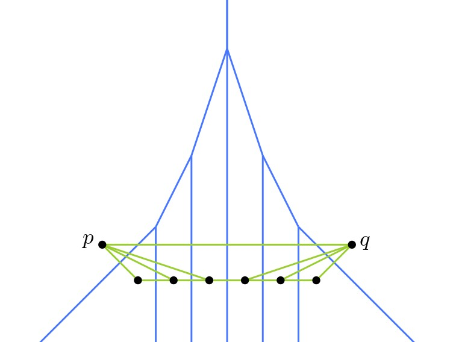{width="50%"}

 

#### תכונות של גרף דלוני {.unnumbered}
המשפט הבא מקביל לתכונות שראינו עבור דיאגרמת וורונוי:

::: rmdimportant
**משפט (9.6 בספר הלימוד)**: 
תהי $P$ קבוצה של נקודות במישור.

1. שלוש נקודות $p_i,p_j,p_k\in P$ הן קודקודים של אותה פאה חסומה ב-$\mathcal{DG}(P)$ אם ורק אם המעגל דרך $p_i,p_j,p_k$ לא מכיל נקודות של $P$ בפנימו.
2. זוג נקודות $p_i,p_j\in P$ יוצרות צלע של $\mathcal{DG}(P)$ אם ורק אם קיים דיסק סגור $C$ שמכיל את $p_i,p_j$ על שפתו, ואינו מכיל עוד אף נקודה אחרת של $P$. 
:::

#### ענו על השאלות הבאות: {.unnumbered}
**שאלה 1**:
נתונה קבוצה $P=\{p_1,p_2,p_3,p_4\}$ כך שכל ארבע הנקודות נמצאות על מעגל אחד. כיצד ייראה גרף דלוני של $P$?

(פתרון)

לפי התכונה הראשונה, כל הנקודות של $P$ שייכות לאותה פאה חסומה, ונקבל גרף (ירוק באיור) עם פאה חסומה אחת שהיא מרובע שקודקודיו הם $\{p_1,p_2,p_3,p_4\}$.

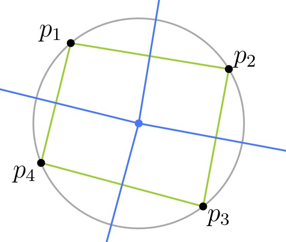{width="35%"}

ניתן גם לראות זאת לפי דיאגרמת וורונוי: מרכז המעגל הוא קודקוד בדיאגרמת וורונוי, והוא משותף לכל הפאות, אך אין צלע משותפת לקודקודים "נגדיים", כלומר כאלו המתאימים לאלכסונים של המרובע.

 

**שאלה 2**:
האם פאה של גרף דלוני חייבת להיות קמורה? אם לא, ציירו דוגמה. אם כן, הסבירו.

(פתרון)

כן. לפי התכונה הראשונה, כל הקודקודים של פאה בגרף דלוני נמצאים על מעגל אחד, ומחוברים בצלעות לפי הסדר שלהם על המעגל. לכן כל הפאות בגרף דלוני הן קמורות.

 

#### שילוש דלוני {.unnumbered}
ראינו שגרף דלוני של קבוצת נקודות $P$ אינו בהכרח שילוש: אם קיימות ארבע נקודות ב-$P$ על מעגל אחד, נקבל פאה שאינה משולש. לעומת זאת, אם לא קיימות ארבע נקודות ב-$P$ על מעגל אחד, אז כל הקודקודים של דיאגרמת וורונוי יהיו מדרגה 3, ולכן גרף דלוני יהיה שילוש. לכן בשלב זה נאמר שקבוצת נקודות $P$ היא ב**מצב כללי** אם אין בה ארבע נקודות על מעגל אחד.

בכל זאת, לא נניח שהנקודות הן במצב כללי, ונגדיר את **שילוש דלוני** של קבוצת נקודות $P$ להיות [כל שילוש]{.underline} המתקבל על ידי הוספת צלעות ל-$\mathcal{DG}(P)$. 

#### תכונת המעגל הריק {.unnumbered}
התכונות של גרף דלוני שראינו קודם מובילות לאפיון הבא של שילוש דלוני:

::: rmdimportant
**משפט (9.7 בספר הלימוד)**:
שילוש $\mathcal{T}$ של קבוצת נקודות $P$ במישור הוא שילוש דלוני אם ורק אם המעגל החוסם של כל משולש ב-$\mathcal{T}$ אינו מכיל נקודות של $P$ בפנימו.
:::

### וקטור הזוויות של שילוש דלוני
בסעיף 9.2 בספר הלימוד מוכיחים את המשפט הבא:

::: rmdimportant
**משפט (9.8 בספר הלימוד)**: 
שילוש $\mathcal{T}$ של קבוצת נקודות $P$ במישור הוא חוקי, אם ורק אם $\mathcal{T}$ הוא שילוש דלוני של $P$.
:::

כיוון אחד של ההוכחה נובע מיידית מההגדרה ומהתכונות של שילוש דלוני: כל שילוש דלוני הוא חוקי, מכיוון שהמעגל החוסם של כל משולש ב-$\mathcal{T}$ אינו מכיל נקודות של $P$ בפנימו.
הוכחת הכיוון השני היא מורכבת יותר, ומופיעה בספר הלימוד.

#### מתי שילוש דלוני הוא אופטימלי בזוויות? {.unnumbered}
כל שילוש אופטימלי הוא חוקי, ולכן הוא בהכרח שילוש דלוני! מתי שילוש דלוני הוא אופטימלי בזוויות?

- אם הנקודות **במצב כללי**, אז שילוש דלוני הוא יחיד! לכן יש רק שילוש חוקי אחד, והוא **השילוש האופטימלי היחיד**.

- אם הנקודות **לא במצב כללי**, אז שילוש דלוני לא בהכרח אופטימלי בזוויות. עם זאת, אפשר להראות (בעזרת משפט תאלס המורחב) שלכל שילוש דלוני יש בדיוק אותה **זווית מינימלית** (ההוכחה בסעיף 9.2 בספר הלימוד). לכן לכל השילושים החוקיים יש אותה זווית מינימלית, ובפרט זוהי גם הזווית המינימלית בשילוש אופטימלי. לכן הזווית המינימלית בשילוש דלוני היא המקסימלית האפשרית על פני כל השילושים של $P$.

הדיאגרמה הבאה נועדה לעשות סדר בהגדרות השונות לסוגי שילושים שראינו עד כה. הקבוצה $T_1$ מכילה את כל השילושים, $T_2$ מכילה את כל השילושים שבהם הזווית המינימלית היא מקסימלית, $T_3$ מכילה את כל השילושים החוקיים (שהם למעשה כל שילושי דלוני), $T_4$ מכילה שילושים אופטימליים בזוויות.

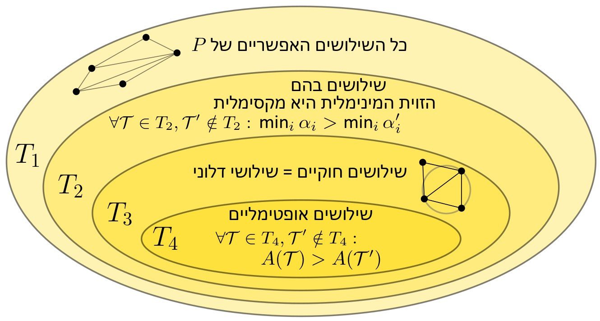{width="100%"}
 

#### קראו את סעיף 9.2 בספר הלימוד (עמודים 196–199). {.unnumbered}

## חישוב השילוש {#triangulation-algorithms}

### אלגוריתם שילוש נאיבי {#naive-tring-alg}
מכיוון ששילוש דלוני שימושי מאוד ביישומים רבים ומגוונים, קיימים כמה אלגוריתמים שונים לחישובו. 
האלגוריתם הפשוט ביותר הוא זה שפגשתם בחלק האחרון של סעיף 9.1 בספר הלימוד. הוא מתחיל משילוש $\mathcal{T}$ כלשהו, ואז, כל עוד קיימת צלע לא חוקית, הוא מבצע פעולת היפוך. מכיוון שבכל פעולת היפוך וקטור הזוויות של השילוש גדל (בסדר הלקסיקוגרפי), התהליך הוא סופי, ובסופו יתקבל שילוש אופטימלי בזוויות.

#### ענו על השאלה הבאה: {.unnumbered}
הפעילו את האלגוריתם הנאיבי על השילוש הבא, וציירו את השילוש האופטימלי שהתקבל. כמה פעולות היפוך צלע ביצע האלגוריתם?

{width="35%"}

(פתרון)

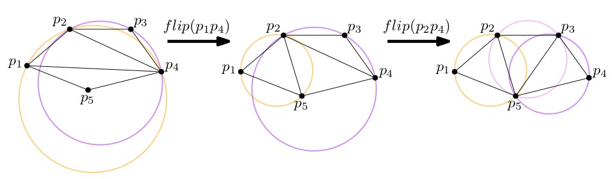{width="100%"}

 

מייד נפגוש שני אלגוריתמים נוספים, לשניהם זמן ריצה $O(n\log n)$ (לראשון במקרה הגרוע, לשני בתוחלת), אך הם שונים זה מזה בפשטות המימוש או ביעילות שלהם בפועל במצבים מסוימים (ראו למשל את [המאמר הזה](https://www.sciencedirect.com/science/article/pii/S0925772196000259), המשווה בין הביצועים של האלגוריתמים השונים על אוספים של נקודות שנדגמו מהתפלגויות שונות).

### אלגוריתם שילוש סורק (שימוש בדיאגרמת וורונוי){#triang-sweep-alg}

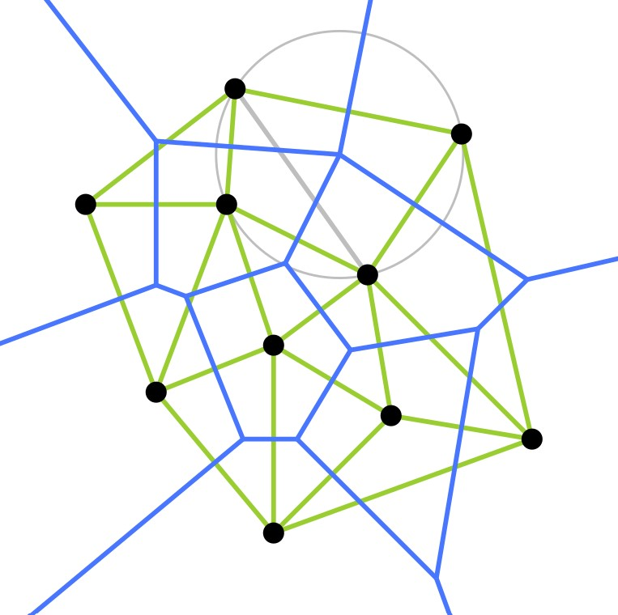 
מכיוון שגרף דלוני הוא הדואלי לדיאגרמת וורונוי, ניתן לחשב את שילוש דלוני של קבוצת נקודות $P$ במישור בעזרת דיאגרמת וורונוי של $P$:

1.  נחשב את $Vor(P)$ בעזרת האלגוריתם הסורק שראינו ביחידה 7 (הדיאגרמה מופיעה בכחול באיור משמאל).
2.  נבנה את הגרף הדואלי לדיאגרמה, כלומר גרף דלוני (מופיע בירוק באיור).
3.  לבסוף, אם יש פאה בגרף שהיא לא משולש, נשלש אותה. נוכל לעשות זאת למשל בעזרת האלגוריתם לשילוש של פוליגון שראינו ביחידה 3. (באיור משמאל יש פאה אחת בגרף דלוני שהיא לא משולשת, ולכן נוסיף את הצלע האפורה).

זמן הריצה הכולל יהיה $O(n\log n)$ (במקרה הגרוע).

### אלגוריתם שילוש אינקרמנטלי-רנדומי {#triang-inc-rand-alg}

דרך אחרת לחישוב שילוש דלוני היא בעזרת האלגוריתם האינקרמנטלי-רנדומי **DelaunayTriangulation** המתואר בסעיף 9.3 בספר הלימוד.

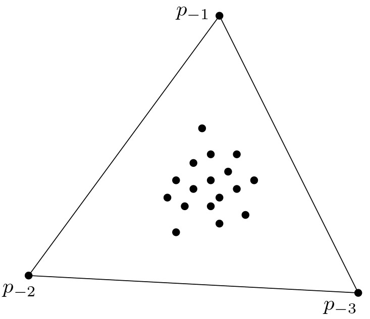 הרעיון המרכזי באלגוריתם הוא לבנות משולש כלשהו, גדול מספיק, שמכיל את כל הנקודות של הקבוצה $P$ בפנימו, ואז להוסיף את נקודות $P$ בזו אחר זו, בסדר אקראי, ובכל פעם לעדכן את השילוש.

נסמן את נקודות $P$ לפי הסדר האקראי ב-$p_1,p_2,\dots,p_n$, ואת קודקודי המשולש ההתחלתי ב-$p_{-1},p_{-2},p_{-3}$. נניח שחישבנו את שילוש דלוני של $p_{-1},p_{-2},p_{-3},p_1,p_2,\dots,p_{r-1}$, ועכשיו אנחנו רוצים להוסיף את $p_r$. יש שני מקרים:

1.  אם הנקודה $p_r$ נמצאת בפנים של משולש $\triangle p_ip_jp_k$: נוסיף צלעות מ-$p_r$ לכל אחד מקודקודי המשולש.
2.  אם הנקודה $p_r$ נמצאת על צלע $\overline{p_ip_j}$ שמשותפת לשני משולשים, $\triangle p_ip_jp_k$ ו-$\triangle p_ip_jp_l$: נוסיף צלעות מ-$p_r$ לקודקודים $p_k$ ו-$p_l$.

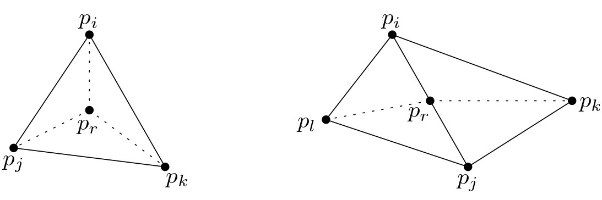{width="80%"}

בשני המקרים קיבלנו שילוש, שהוא לא בהכרח שילוש דלוני. כדי לתקן את השילוש במקרה הצורך, האלגוריתם קורא לפרוצדורה נוספת בשם **LegalizeEdge**, שמקבלת שילוש, את הקודקוד $p_r$, וצלע במשולש שייתכן שיש צורך לבצע פעולת היפוך עבורה. במקרה הראשון למשל, האלגוריתם יקרא לפרוצדורה הזאת עבור כל אחת מצלעות המשולש $\triangle p_ip_jp_k$. אם הצלע אינה חוקית, הפרוצדורה תבצע היפוך שלה, ואז תמשיך לבדוק באופן רקורסיבי את צלעות המשולשים החדשים שנוצרו.

#### ענו על השאלה הבאה: {.unnumbered}
התבוננו באיור הבא, המתאר את השלב באלגוריתם שבו הנקודה $p_r$ נוספה לשילוש, יחד עם צלעות לקודקודים $p_1$, $p_4$, ו-$p_5$, ולפני הפעלת הפרוצדורה LegalizeEdge. כיצד ייראה השילוש לאחר הפעלת LegalizeEdge על כל אחת מצלעות המשולש $\triangle p_1p_4p_5$?

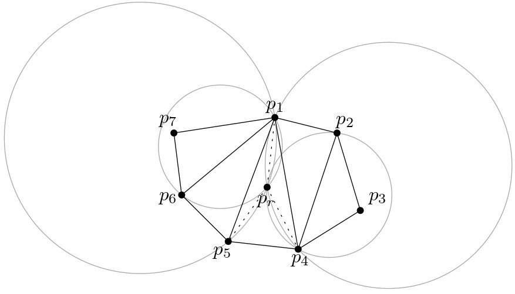{width="90%"}

(פתרון)

פעולות ההיפוך שיתבצעו הן:

(1) היפוך של $p_1p_5$.

(2) היפוך של $p_1p_6$.

(3) היפוך של $p_1p_4$.

(4) היפוך של $p_2p_4$.

בסוף התהליך, יהיו צלעות מ-$p_r$ לכל אחד מהקודקודים האחרים.

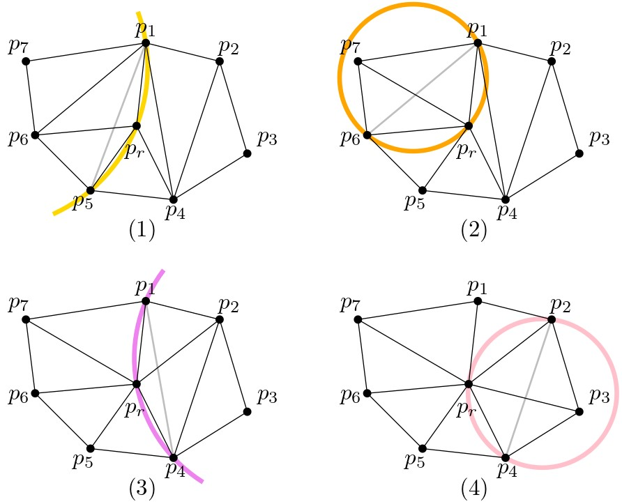{width="80%"}

 

#### קראו את סעיף 9.3 בספר הלימוד (עמודים 199–204). {.unnumbered}

קראו עד סוף הפסקה הראשונה בעמוד 204.

#### תרגיל {.unnumbered}

ענו על השאלות הבאות (כל התשובות מופיעות בסעיף 9.3 בספר):

1.  מדוע התהליך הרקורסיבי בפרוצדורה LegalizeEdge הוא סופי?
2.  מדוע הצלעות שמוסיפים מ-$p_r$ לקודקודי המשולש שהוא נמצא בו הן בהכרח צלעות של שילוש דלוני?
3.  כיצד מוצא האלגוריתם את המשולש שמכיל את $p_r$?

### ניתוח האלגוריתם האינקרמנטלי-רנדומי {#inc-rand-analisys}

ניתוח זמן הריצה של האלגוריתם משתמש בטכניקה שכבר ראינו ביחידות 4 ו-6: **אנליזה לאחור**. ביחידה זו לא נתעמק בפרטי ההוכחה ונסתפק בציטוט המשפט הבא:

::: rmdimportant
**משפט (9.12 בספר הלימוד)**: האלגוריתם האינקרמנטלי-רנדומי מחשב שילוש דלוני של קבוצה $P$ של $n$ נקודות במישור בזמן $O(n \log n)$ בתוחלת, ועם תוחלת זיכרון $O(n)$.
:::

### להרחבה ולהעשרה: ניתוח האלגוריתם {.unnumbered}
למעוניינים בהעשרה ובהרחבה, ניתן לקרוא את סעיף 9.4 בספר הלימוד, המנתח בפירוט את זמן הריצה וסיבוכיות המקום של האלגוריתם DelaunayTriangulation.

## תרגילים נוספים

#### תרגיל: MST {.unnumbered}

#### תרגיל: Gabriel Graph {.unnumbered}

#### תרגיל: RNG {.unnumbered}

#### תרגיל: חסם תחתון {.unnumbered}
