# תכנון תנועה {#motion-planning}

## הקדמה {#motion-planning-preface}

### מה ביחידה? {#contents-10}

#### תכנון תנועה {.unnumbered}

יחידה זו מקבילה לפרקים 13 ו-15 בספר הלימוד.

בסיום יחידה זו, תכירו את המושגים ותרכשו את הטכניקות והכלים הבאים:

-   מודל גיאומטרי לתכנון תנועת רובוט: מרחב העבודה, נקודות ייחוס, דרגות
    חופש, מרחבי קונפיגורציות.
-   מציאת מסלול לרובוט נקודתי ולרובוט פוליגונלי.
-   סכומי מינקובסקי.
-   גרף הנִרְאוּת (visibility) ומסלולים קצרים ביותר.

למידה מהנה!

### תכנון תנועת רובוט {#robot-motion-planning}

תכנון תנועה לרובוט הוא תחום רחב ביותר, שהולך ומתפתח עם השיפור בטכנולוגיה הזמינה. פרק זה מספק הצצה לתחום מנקודת מבט גיאומטרית.

באופן כללי, בעיות תכנון תנועה עשויות להיות מורכבות ומסובכות מאוד, אך ביחידה זו נעסוק במקרה הבסיסי ביותר: הרובוט הוא פוליגון $\mathcal{R}$, שנע במישור עם מכשולים פוליגונליים קבועים וידועים מראש. הרובוט נע בתנועת הזזה (translation) בלבד ואינו יכול לבצע סיבוב (rotation).

בסרטון הבא ניתן לראות דוגמה לרובוט כזה, המסוגל לנוע בהזזה לכל כיוון אפשרי (omnidirectional). הרובוט בסרטון נע לאורך מסלול ידוע מראש, מנקודה התחלתית לנקודת יעד. אנחנו לא נעסוק במכניקה המאפשרת לרובוט לעשות זאת, אלא במציאת מסלול ללא התנגשויות בסביבה עם מכשולים, בהינתן נקודת התחלה ונקודת יעד.

<center>

<iframe width="560" height="315" src="https://www.youtube.com/embed/jy6OjeZPPBY?si=8BHC--26ea1jvoei" title="YouTube video player" frameborder="0" allow="accelerometer; autoplay; clipboard-write; encrypted-media; gyroscope; picture-in-picture; web-share" allowfullscreen>

</iframe>

</center>

```{=html}
<!--
בעוד שרובוטים הנעים באופן אוטונומי במרחב הם עדיין נדירים יחסית, רובוט מסוג "יד רובוטית" נמצא כבר שנים רבות בשימוש נרחב בתעשייה. רובוטים אלו הם פשוטים יחסית ועם טווח מוגבל של תנועות אפשריות, ונדרשים לבצע משימות בדיוק רב. הסרטון הבא מציג דוגמאות לרובוטים מסוגים שונים.
-->
```
#### קראו את ההקדמה לפרק 13 בספר הלימוד (עמודים 283–284). {.unnumbered}

### המודל הגיאומטרי {#geometric-model}

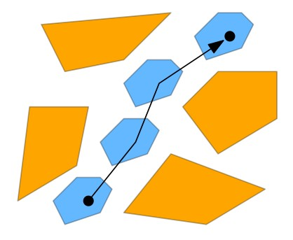
כדי שנוכל לנתח ולאפיין את הבעיה בצורה מדויקת מבחינה מתמטית, תחילה נגדיר מודל גיאומטרי שיאפשר לנו לתאר את מיקום הרובוט ואת הסביבה שבה הוא יכול לנוע. בסעיף 13.1 בספר הלימוד מופיעים מושגים בסיסיים המשמשים בהגדרת המודל הגיאומטרי לבעיות תכנון תנועה באופן כללי.

#### קראו את סעיף 13.1 בספר הלימוד (עמודים 284–286). {.unnumbered}

### מושגים בסיסיים בתכנון תנועה {#basic-defs-motion-planning}
בעמוד זה מופיעות הגדרות של המושגים הבסיסיים מסעיף 13.1 בספר הלימוד, יחד עם דוגמאות ותרגילים לחזרה.

#### מרחב העבודה (work space) {.unnumbered}

מרחב העבודה הוא **הסביבה** שבה נע הרובוט $\mathcal{R}$, והיא מורכבת מאוסף של **מכשולים**. ביחידה זו נניח שהסביבה היא דו-ממדית, שהרובוט הוא פוליגון $\mathcal{R}$, ושהמכשולים הם פוליגונים $S=\{\mathcal{P}_1,\dots,\mathcal{P}_t\}$.

מרחב העבודה יכול להיות לא קשיר וגם לא חסום. בהמשך נחסום אותו במלבן גדול מספיק, כדי לפשט את החישובים.

#### הזזה (translation) {.unnumbered}

הזזה של רובוט (פוליגון) $\mathcal{R}$ בווקטור $(x,y)$ מסומנת $\mathcal{R}(x,y)$ והיא הפוליגון המתקבל על ידי הוספה של הווקטור $(x,y)$
לכל נקודה ב-$\mathcal{R}$, כלומר
$\mathcal{R}(x,y)=\{p+(x,y)\mid p\in \mathcal{R}\}$.

<center>{width="80%"}</center>

#### ענו על השאלה הבאה: {.unnumbered}
מה יהיו קודקודיו של הפוליגון באיור אם נזיז אותו בווקטור $(12,-2)$?

<center>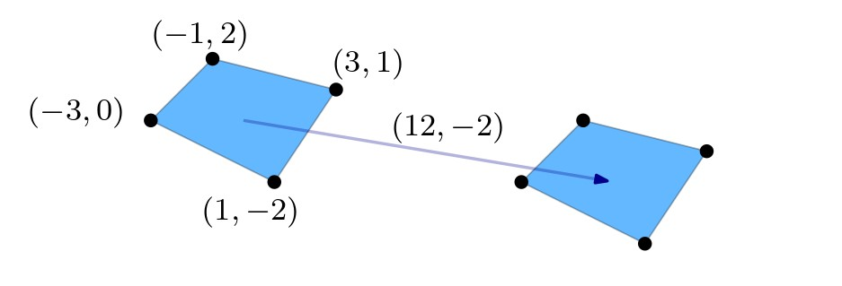{width="75%"}</center>

<details>

<summary>(פתרון)</summary>

<center>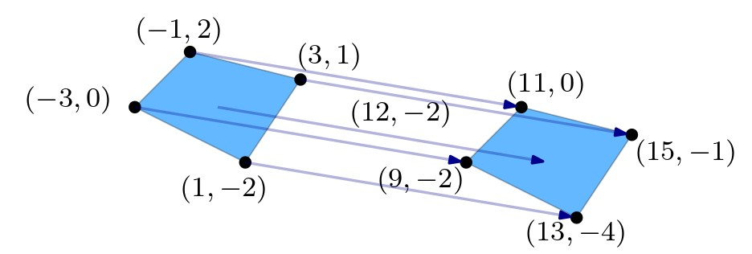{width="75%"}</center>

</details>
<br/>

#### נקודת ייחוס (reference point) {.unnumbered}

נקודת הייחוס מאפשרת לנו לתאר את מקום הימצאו של הרובוט במרחב העבודה.
נניח שהפוליגון $\mathcal{R}$ מכיל את הנקודה $(0,0)$, ונגדיר שנקודה זו
היא **נקודת הייחוס** של הרובוט. מכאן שמשמעות הסימון $\mathcal{R}(x,y)$ היא שהרובוט ממוקם במרחב העבודה כך שנקודת הייחוס שלו נמצאת על הנקודה $(x,y)$.
<center>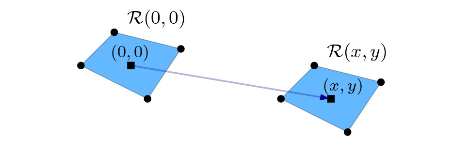{width="75%"}</center>

#### דרגות חופש (degrees of freedom) {.unnumbered}

מספר **דרגות החופש** של רובוט הוא מספר הפרמטרים הנדרשים לתיאור המיקום שלו.

#### ענו על השאלה הבאה: {.unnumbered}
מה מספר דרגות החופש של רובוט דו-ממדי,

1.  עם הזזה בלבד?
2.  עם סיבוב בלבד?
3.  עם הזזה וסיבוב?

כיצד תשתנה התשובה בכל אחד מהסעיפים למעלה עבור רובוט תלת-ממדי?

<details>

<summary>(פתרון)</summary>

עבור רובוט דו-ממדי:

1.  הזזה בלבד: ניתן להזיז בציר ה-$x$ ובציר ה-$y$, לכן יש שתי דרגות חופש.
2.  סיבוב בלבד: דרגת חופש אחת (זווית הסיבוב של המישור סביב נקודת הייחוס).
3.  הזזה וסיבוב: בסך הכול שלוש דרגות חופש.

עבור רובוט תלת-ממדי:

1.  הזזה בלבד: ניתן להזיז בשלושת הצירים, לכן יש שלוש דרגות חופש.
2.  סיבוב בלבד: ניתן לסובב סביב כל אחד משלושת הצירים, לכן יש שלוש דרגות חופש.
3.  הזזה וסיבוב: בסך הכול שש דרגות חופש.

הסרטון הבא ממחיש את פעולת הסיבוב בשלושה ממדים.

<center>

<iframe width="560" height="315" src="https://www.youtube.com/embed/rO-ozmROWTA?si=pdwXb_zZh9u_TOlA" title="YouTube video player" frameborder="0" allow="accelerometer; autoplay; clipboard-write; encrypted-media; gyroscope; picture-in-picture; web-share" allowfullscreen>

</iframe>

</center>

</details>
<br/>

#### מרחב הקונפיגורציות (configuration space) {.unnumbered}

מרחב הקונפיגורציות עבור רובוט $\mathcal{R}$ הוא מרחב הפרמטרים המתארים את מיקומו, והוא מסומן $\mathcal{C}(\mathcal{R})$. ממד המרחב הוא מספר דרגות החופש.

לדוגמה: עבור רובוט פוליגוני הנע במישור בתנועת הזזה בלבד, קונפיגורציה של הרובוט (כלומר מיקום הרובוט) מורכבת משני פרמטרים. לכן במקרה זה מרחב הקונפיגורציות הוא המישור. אם נוסיף לרובוט תנועת סיבוב, מרחב הקונפיגורציות יהיה
$\mathbb{R}^2\times [0:360)$.
זהו מרחב תלת-ממדי, והמשמעות של נקודה $(x,y,\phi)$ במרחב הזה היא שנקודת הייחוס של הרובוט נמצאת בנקודה $(x,y)$, ושהוא מסובב בזווית $\phi$.

#### המרחב החופשי, המרחב האסור (free space, forbidden space) {.unnumbered}

קונפיגורציה $p$ שעבורה $\mathcal{R}(p)$ נחתך
עם מכשול מהקבוצה $\mathcal{S}$ נקראת **קונפיגורציה אסורה**. אם $\mathcal{R}(p)$ אינו נחתך עם מכשול, אז $p$ נקראת **קונפיגורציה
חופשית**. 

מרחב הקונפיגורציות האסורות, או בקיצור **המרחב האסור**
 מסומן $\mathcal{C}_{forb}(\mathcal{R},\mathcal{S})$.
מרחב הקונפיגורציות החופשיות, או בקיצור **המרחב החופשי**  
מסומן $\mathcal{C}_{free}(\mathcal{R},\mathcal{S})$.

המיפוי של מכשול $\mathcal{P}$ במרחב העבודה אל מרחב הקונפיגורציות נקרא **מכשול במרחב הקונפיגורציות** (configuration-space obstacle), ומסומן $\mathcal{CP}$ . אלו הן כל הקונפיגורציות $(x,y)$ שעבורן $\mathcal{R(x,y)}$ נחתך עם $\mathcal{P}$.


#### ענו על השאלות הבאות: {.unnumbered}
**שאלה 1**:
הרובוט באיור הוא בצורת מעגל, ומרכז המעגל הוא נקודת הייחוס. אילו מהקונפיגורציות $p_1,p_2,p_3,p_4,p_5$ חופשיות ואילו אסורות?

האם הרובוט יוכל להגיע מהנקודה $p_1$ לנקודה $p_2$? ולנקודה $p_5$?

<center>{width="75%"}</center>

<details>

<summary>(פתרון)</summary>

הקונפיגורציות $p_1,p_2,p_5$ הן חופשיות והשאר אסורות. 

הרובוט יוכל להגיע מהנקודה $p_1$ לנקודה $p_2$, אך לא יוכל להגיע לנקודה $p_5$ מכיוון שהוא חסום על ידי המכשולים שסביבו. המשמעות של קונפיגורציה חופשית היא נקודה שבה הרובוט אינו מתנגש במכשולים, ובמקרה זה הוא לא בהכרח יכול להגיע לכל קונפיגורציה שהיא חופשית.

<center>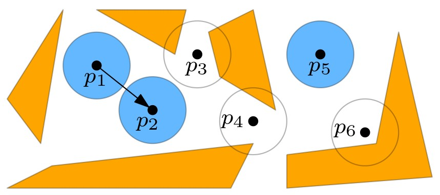{width="75%"}</center>

</details>
<br/>

**שאלה 2**:
נתון רובוט בצורת דיסק, ומרכז הדיסק הוא נקודת הייחוס. המשולש הכתום $\mathcal{P}$ הוא מכשול במרחב העבודה. איזה מהאיורים הבאים מתאר את $\mathcal{CP}$?

<center>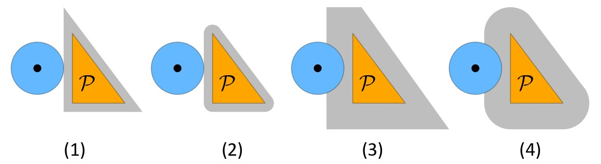{width="75%"}</center>

<details>

<summary>(פתרון)</summary>

התשובה היא (4). זכרו ש-$\mathcal{CP}$ הוא כל הקונפיגורציות $(x,y)$ שעבורן $\mathcal{R(x,y)}$ נחתך עם $\mathcal{P}$.

</details>
<br/>


## מציאת מסלול ללא התנגשויות {#collision-free-path}

### מציאת מסלול לרובוט נקודתי {#point-robot}

בחלק זה נתמקד בבעיה הבאה: בהינתן רובוט, מרחב עבודה,
נקודת התחלה $p_{\text{start}}$ ונקודת יעד $p_{\text{goal}}$, יש למצוא מסלול עבור הרובוט מנקודת ההתחלה לנקודת היעד, ללא התנגשויות במכשולים. במילים אחרות, יש למצוא **מסלול במרחב החופשי**, מהנקודה $p_{\text{start}}$ לנקודה $p_{\text{goal}}$.

כדי לפשט את הבעיה, נתחיל מהמקרה של רובוט נקודתי. במקרה זה מרחב העבודה שווה בדיוק למרחב החופשי.

#### חישוב המרחב החופשי {.unnumbered}

בסעיף 13.2 בספר הלימוד מתואר האלגוריתם **ComputeFreeSpace** שמחשב ייצוג של המרחב החופשי לרובוט נקודתי, בהינתן אוסף $\mathcal{S}$ של מכשולים. הייצוג של המרחב החופשי הוא באמצעות מפה טרפזית (למדנו עליה ביחידה 6).

#### בניית מפת דרכים {.unnumbered}

בהינתן מפת הטרפזים של המרחב החופשי, בונים על גביה מעין מפת דרכים שתשמש למציאת מסלול ללא התנגשויות לרובוט. מפת הדרכים היא בעצם גרף שבו יש קודקוד לכל טרפז במפה, וקודקוד לכל קטע אנכי בין שני טרפזים. כל קודקוד של טרפז יהיה מחובר בצלע לכל הקודקודים על הצלעות האנכיות שלו. האלגוריתם **ComputePath** מחשב מסלול מהנקודה $p_{\text{start}}$ לנקודה $p_{\text{goal}}$ במרחב החופשי, באמצעות הרצת אלגוריתם BFS על גבי מפת הדרכים.

בסעיף זה מוכיחים את המשפט הבא: 

::: rmdimportant 
**משפט (13.2 בספר הלימוד)**: בהינתן רובוט נקודתי $\mathcal{R}$ ואוסף $S$ של מכשולים פוליגונליים עם $n$ צלעות בסך הכול, ניתן לבנות מבנה נתונים בגודל $O(n)$, ובזמן עיבוד מקדים $O(n\log n)$ בתוחלת, כך שבהינתן נקודת התחלה ונקודת יעד, מוצא בזמן $O(n)$ מסלול ללא התנגשויות לרובוט, אם קיים כזה.
:::

מבנה הנתונים המתואר בסעיף זה ישמש אותנו גם בהמשך, כאשר נדבר על מציאת מסלול לרובוט פוליגונלי.

#### קראו את סעיף 13.2 בספר הלימוד (עמודים 286–290). {.unnumbered}

### סכומי מינקובסקי {#minkowski-sums}
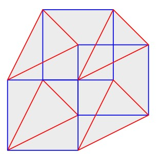
ראינו שעבור רובוט נקודתי, מרחב העבודה שווה בדיוק למרחב החופשי. זהו לא המצב עבור רובוט שאינו נקודתי, ולכן כדי שנוכל לחשב ולייצג את המרחב החופשי, נצטרך תחילה להבין כיצד נראים המכשולים במרחב הקונפיגורציות עבור רובוט פוליגונלי. בסרטון הבא נדבר על סכומי מינקובסקי, ונראה כיצד הם יעזרו לנו בתיאור ובבניית מרחב הקונפיגורציות לרובוט פוליגונלי.

#### צפו בסרטון הבא: {.unnumbered}

<iframe width="560" height="315" src="https://www.youtube.com/embed/oKMx8DqELrQ?si=jNtJ7IDoJv2KHOdt" title="YouTube video player" frameborder="0" allow="accelerometer; autoplay; clipboard-write; encrypted-media; gyroscope; picture-in-picture; web-share" allowfullscreen></iframe>

#### הגדרה: סכום מינקובסקי {.unnumbered}
::: rmdimportant
עבור שתי קבוצות של נקודות במישור $S_1,S_2\subset\mathbb{R}^2$, סכום מינקובסקי הוא
$$S_1\oplus S_2=\{p+q\mid p\in S_1, q\in S_2\}$$
כאשר $p+q=(p_x+q_x,p_y+q_y)$.
:::

#### ענו על השאלות הבאות: {.unnumbered}
**שאלה 1**:
מה יהיו הקודקודים של הפוליגון הקמור שהוא סכום מינקובסקי של הפוליגונים באיור?

<center>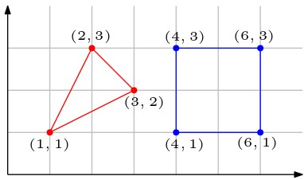{width="55%"}</center>

<details>

<summary>(פתרון)</summary>

<center>{width="45%"}</center>

</details>
<br/>

**שאלה 2**:
מה יהיו הקודקודים של הפוליגון הקמור שהוא סכום מינקובסקי של הפוליגונים באיור?

<center>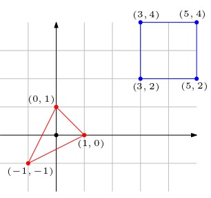{width="55%"}</center>

<details>

<summary>(פתרון)</summary>

שימו לב שהפוליגון שהתקבל זהה לפוליגון מהשאלה הקודמת, אבל עם הזזה. נוסף על כך, שימו לב שבמקרה שבו אחד הפוליגונים מכיל את ראשית הצירים (כאן זה המשולש האדום), ניתן לחשוב על סכום מינקובסקי בתור הפוליגון שיתקבל אם נשים את נקודת הייחוס של המשולש (שהיא הראשית) על השפה של הריבוע, ו"נחליק" את המשולש לאורך השפה.

<center>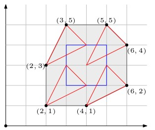{width="55%"}</center>

</details>
<br/>


#### תכונות של סכום מינקובסקי {.unnumbered}
::: rmdimportant 

**אבחנה (13.4 בספר הלימוד)**:
יהיו $\mathcal{P},\mathcal{R}$ שני פוליגונים. נקודת קיצון של $\mathcal{P}\oplus\mathcal{R}$ בכיוון $\overrightarrow{d}$ היא סכום של נקודות קיצון של $\mathcal{P}$ ו-$\mathcal{R}$ בכיוון $\overrightarrow{d}$.
:::

<center>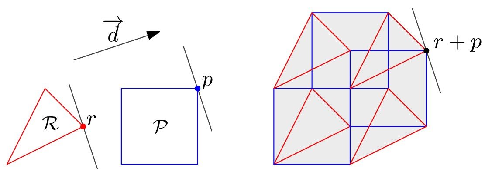{width="80%"}</center>

::: rmdimportant 
**משפט (13.5 בספר הלימוד)**: סכום מינקובסקי של שני פוליגונים **קמורים** בעלי $n$ ו-$m$ צלעות הוא פוליגון קמור בעל לכל היותר $m+n$ צלעות.

:::

#### מכשולים במרחב הקונפיגורציות {.unnumbered}
עבור קבוצה $S$ של נקודות במישור, נסמן $-S=\{(-p_x,-p_y)\mid p\in S\}$, כלומר $-S$ מתקבלת על ידי סיבוב של $S$ ב-$180^\circ$ סביב ראשית הצירים.
<center>{width="25%"}</center>

::: rmdimportant 
**משפט (13.3 בספר הלימוד)**: בהינתן רובוט פוליגונלי $\mathcal{R}$ ומכשול $\mathcal{P}$, המיפוי של $\mathcal{P}$  למרחב הקונפיגורציות 
(ה-obstacle-$\mathcal{C}$) הוא בדיוק הסכום $\mathcal{P}\oplus -\mathcal{R}(0,0)$.
:::

<center>{width="65%"}</center>

#### קראו את חלקו הראשון של סעיף 13.3 בספר הלימוד (עמודים 290–292). {.unnumbered}
קראו עד לסוף ההוכחה של משפט 13.5.


### פסאודו-דיסקים {#pseudo-disks}
כדי להראות שניתן לחשב ביעילות את האיחוד של המכשולים במרחב הקונפיגורציות (שהוא בעצם האזור האסור), נצטרך להראות שאוסף הפוליגונים הזה "מתנהג יפה" באיזשהו אופן. לשם כך נשתמש בהגדרה הבאה.

#### הגדרה: פסאודו-דיסקים {.unnumbered}

::: rmdimportant
יהיו $o_1,o_2$ שני אובייקטים במישור, שכל אחד מהם חסום על ידי עקום פשוט וסגור. האובייקטים $o_1,o_2$  נקראים **פסאודו-דיסקים** אם $\partial o_1\cap \text{int}(o_2)$ קשיר, וגם  $\partial o_1\cap \text{int}(o_2)$ קשיר. 
:::

<center>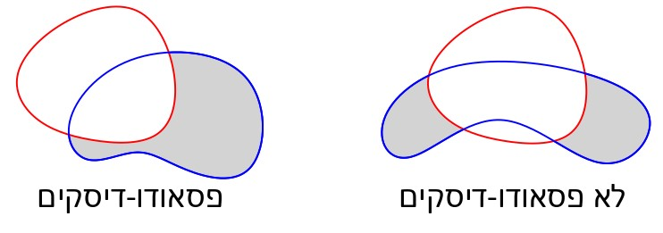{width="65%"}</center>

אוסף של אובייקטים במישור, שכל אחד מהם חסום על ידי עקום פשוט וסגור, נקרא **אוסף של פסאודו-דיסקים**, אם כל זוג אובייקטים מהאוסף הם פסאודו-דיסקים.


#### ענו על השאלה הבאה: {.unnumbered}
אילו מהבאים הם אוספים של פסאודו-דיסקים?

1. אוסף כל הפוליגונים הקמורים במישור.
2. אוסף כל המרובעים במישור.
3. אוסף כל המלבנים במישור.
4. אוסף כל הריבועים במישור, שכולם מאותו הגודל.
5. אוסף כל המלבנים במישור, שצלעותיהם מקבילות לצירים.
6. אוסף כל הריבועים במישור, שצלעותיהם מקבילות לצירים.

<details>

<summary>(פתרון)</summary>

רק 5 הוא אוסף של פסאודו-דיסקים.
בהינתן שני ריבועים $s_1,s_2$ שצלעותיהם מקבילות לצירים, נניח ש-$s_1$ גדול מ-$s_2$, ונניח שהקודקוד השמאלי התחתון של $s_1$ נמצא בראשית הצירים, וש-$s_2$ נמצא כולו ברביע הראשון. יש שלושה מקרים, כמו באיור מטה, המתייחסים למיקום של הקודקוד השמאלי התחתון של $s_2$ ביחס לאורכי הצלעות. בכל אחד מהמקרים, נקבל שהחיתוך בין הריבועים הוא קשיר.

<center>{width="60%"}</center>

עבור כל אחד מהאוספים האחרים ניתן למצוא דוגמה לשני אובייקטים שאינם פסאודו-דיסקים. שתי הדוגמאות הבאות מספיקות עבור כל אחד מהסעיפים 1–5.
<center>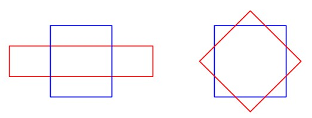{width="60%"}</center>

</details>
<br/>

#### מכשולים הם אוסף של פסאודו-דיסקים {.unnumbered}
בסעיף 13.3 בספר הלימוד מוכיחים את המשפטים הבאים.

::: rmdimportant 
**משפט (13.8 בספר הלימוד)**: יהיו $\mathcal{P}_1,\mathcal{P}_2$ שני פוליגונים **קמורים** ו**זרים זה לזה** בפנים שלהם, ויהי $\mathcal{R}$ פוליגון קמור. אז $\mathcal{P}_1\oplus \mathcal{R}$ ו-$\mathcal{P}_2\oplus \mathcal{R}$ הם פסאודו-דיסקים.
:::

<center>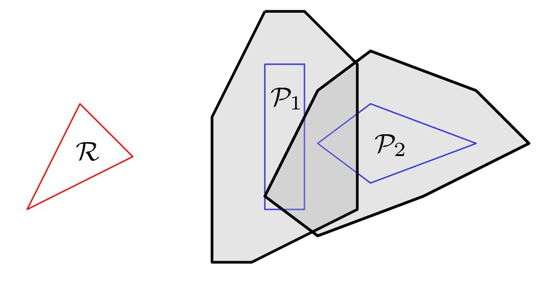{width="60%"}</center>

::: rmdimportant
**משפט (13.9 בספר הלימוד)**: יהי $S$ אוסף של פסאודו-דיסקים, שכולם פוליגונים קמורים, ויש להם $n$ צלעות בסך הכול. סיבוכיות האיחוד שלהם תהיה לכל היותר $2n$.
:::

המשמעות של המשפט הראשון היא שמכשולים (קמורים) במרחב הקונפיגורציות הם פסאודו-דיסקים. זוהי תכונה שימושית מאוד, מכיוון שהמשפט השני מראה שסיבוכיות האיחוד של אוסף של פסאודו-דיסקים שכולם פוליגונים קמורים היא לינארית. עובדה זו מאפשרת לנו לחסום את הסיבוכיות של איחוד המכשולים במרחב הקונפיגורציות (שהוא התחום האסור).

#### המשיכו לקרוא את סעיף 13.3 בספר הלימוד (עמודים 292–293). {.unnumbered}

קראו את החלק המדבר על פסאודו-דיסקים, עד אבחנה 13.6. שימו לב, בקורס זה לא נתעמק בהוכחות של משפטים 13.7, 13.8 ו-13.9 (המראים שסכומי מינקובסקי הם פסאודו-דיסקים), ונסתפק בהבנת ההגדרה ובהכרת המשפטים. לכן דלגו על הטקסט המופיע אחרי אבחנה 13.6 ועד סוף ההוכחה של משפט 13.9.

### חישוב סכום מינקובסקי {#computing-minkowski-sums}

#### פוליגונים קמורים {.unnumbered}
אלגוריתם נאיבי לחישוב סכום מינקובסקי של שני פוליגונים קמורים $\mathcal{P}$ ו-$\mathcal{R}$ הוא פשוט חישוב הקמור של קבוצת הנקודות הבאה:
$$B=\{v+w\mid v \text{ is a vertex of } \mathcal{P}, w \text{ is a vertex of } \mathcal{R} \}.$$
זהו לא אלגוריתם יעיל, מכיוון שהוא מחשב את הסכום של כל זוג קודקודים. בסעיף 13.3 בספר הלימוד מתואר אלגוריתם יעיל הרבה יותר, המשתמש באבחנה 13.4 כדי לחשב את הקמור של הקבוצה$B$, בלי לחשב את כל איברי הקבוצה.

::: rmdimportant 
**משפט (13.10 בספר הלימוד)**: ניתן לחשב את סכום מינקובסקי של שני פוליגונים קמורים בעלי $m$ ו-$n$ קודקודים בזמן $O(m+n)$.
:::

#### פוליגונים שאינם קמורים {.unnumbered}
כדי לחשב את סכום מינקובסקי עבור פוליגונים $\mathcal{P}$ ו-$\mathcal{R}$ שאינם קמורים, ניתן לשלש כל אחד מהם ולחשב את האיחוד של סכומי מינקובסקי של כל זוגות המשולשים. בסוף סעיף 13.3 בספר הלימוד מתארים כיצד ניתן לבצע את החישוב, ומה תהיה הסיבוכיות (במקרה הגרוע ביותר) של סכום מינקובסקי כאשר שני הפוליגונים אינם קמורים.

#### קראו את החלק האחרון של סעיף 13.3 בספר הלימוד (עמודים 295–297). {.unnumbered}

#### ענו על השאלה הבאה: {.unnumbered}
נתונים שני פוליגונים $\mathcal{P}$ ו-$\mathcal{R}$ בעלי $m$ ו-$n$ קודקודים, בהתאמה. מהי הסיבוכיות (במקרה הגרוע) של הסכום $\mathcal{P}\oplus\mathcal{R}$ כאשר:

1. $\mathcal{P}$ ו-$\mathcal{R}$ שניהם קמורים.
2. $\mathcal{P}$ קמור ו-$\mathcal{R}$ לא קמור.
3. $\mathcal{P}$ ו-$\mathcal{R}$ שניהם לא קמורים.

<details>

<summary>(פתרון)</summary>

1. $O(m+n)$
2. $O(mn)$
3. $O(m^2n^2)$

</details>
<br/>

### רובוט פוליגונלי {#polygonal-robot}
סעיף 13.4 בספר הלימוד חוזר לבעיית תכנון התנועה עבור רובוט פוליגונלי. כדי שנוכל להשתמש באלגוריתם שראינו לרובוט נקודתי, נצטרך לחשב תחילה את המכשולים במרחב הקונפיגורציות של הרובוט הפוליגונלי. כפי שראינו בסעיף הקודם, כל מכשול כזה הוא סכום מינקובסקי. האיחוד של כל המכשולים במרחב הקונפיגורציות הוא המרחב האסור, וראינו שהסיבוכיות שלו לינארית. האלגוריתם **ForbiddenSpace** המתואר בסעיף 13.4 בספר הלימוד מחשב אותו בזמן $O(n\log^2 n)$. יחד עם האלגוריתם לרובוט נקודתי שראינו בסעיף 13.3, נקבל את המשפט הבא: 

::: rmdimportant 
**משפט (13.14 בספר הלימוד)**: בהינתן רובוט פוליגונלי קמור $\mathcal{R}$ בגודל קבוע, ואוסף $S$ של מכשולים פוליגונליים עם $n$ צלעות בסך הכול, ניתן לבנות מבנה נתונים בגודל $O(n)$, ועם זמן עיבוד מקדים $O(n\log^2 n)$ בתוחלת, כך שבהינתן נקודת התחלה ונקודת יעד, מוצא בזמן $O(n)$ מסלול ללא התנגשויות לרובוט, אם קיים כזה.

:::

#### קראו את סעיף 13.4 בספר הלימוד (עמודים 297–299). {.unnumbered}

## מסלולים קצרים ביותר {#shortest-paths}

### מסלול קצר ביותר וגרף הנִרְאוּת {#visibility-graph}
עד כה ראינו כיצד ניתן למצוא לרובוט מסלול **כלשהו** ללא התנגשויות, מנקודת ההתחלה לנקודת היעד, ולא דנו כלל בטיב המסלול שנבחר. אם רוצים לחסוך באנרגיה ובזמן, כדאי לבחור למשל במסלול הקצר ביותר האפשרי. בחלק זה נדבר על חישוב מסלול קצר ביותר לרובוט, וזאת באמצעות בניית מפת דרכים אחרת, שנקראת גרף הנִרְאוּת.

#### צפו בסרטון הבא: {.unnumbered}

<iframe width="560" height="315" src="https://www.youtube.com/embed/K3pqlZLJHBw?si=cJ_DrRbDgpTAyY2Y" title="YouTube video player" frameborder="0" allow="accelerometer; autoplay; clipboard-write; encrypted-media; gyroscope; picture-in-picture; web-share" allowfullscreen></iframe>


#### מסלול קצר בסביבה עם מכשולים {.unnumbered}
::: rmdimportant 
**למה (15.1 בספר הלימוד)**: כל מסלול קצר ביותר בין נקודה $p_\text{start}$ לנקודה $p_\text{goal}$ ללא התנגשויות במכשולים פוליגונליים מ-$S$, הוא מסלול פוליגונלי שהקודקודים הפנימיים שלו הם קודקודים של פוליגונים מ-$S$.
:::

#### ענו על השאלה הבאה: {.unnumbered}
האם מסלול קצר ביותר ללא התנגשויות בין נקודה $p_\text{start}$ לנקודה $p_\text{goal}$ חייב להכיל קודקודים של מכשולים מ-$S$ שנחתכים עם הקטע $\overline{p_\text{start}p_\text{goal}}$?

<details>

<summary>(פתרון)</summary>

לא. למשל באיור הבא, המסלול הכחול הוא הקצר ביותר, אך אינו מכיל אף קודקוד של המכשול שחותך את הקטע המחבר בין נקודת ההתחלה לנקודת היעד. ניתן לראות שהמסלול האדום ארוך ממנו, מתכונת אי-שוויון המשולש (סכום האורכים של זוג צלעות במשולש גדול מאורך הצלע השלישית).
<center>{width="60%"}</center>

</details>
<br/>

#### גרף הנִרְאוּת (visibility graph) {.unnumbered}
בהינתן אוסף $S$ של מכשולים פוליגונליים בעלי $n$ קודקודים בסך הכל, גרף הנראות מסומן $\mathcal{G}_{\text{vis}}(S)$. הקודקודים של $\mathcal{G}_{\text{vis}}(S)$ הם הקודקודים של פוליגונים מהקבוצה $S$, ויש צלע בין שני קודקודים $v,w$ אם הם **רואים** זה את זה, כלומר הקטע $\overline{vw}$ אינו נחתך עם הפְּנים של אף פוליגון מהקבוצה $S$.

בסרטון ראינו שמסלול קצר ביותר לרובוט בין נקודה $p_\text{start}$ לנקודה $p_\text{goal}$ הוא מסלול בגרף 
$\mathcal{G}_{\text{vis}}(S\cup\{p_\text{start},p_\text{goal}\})$, וניתן למצוא אותו בעזרת האלגוריתם של דייקסטרה בזמן $O(n^2\log n)$.


#### קראו את סעיף 15.1 בספר הלימוד (עמודים 324–326). {.unnumbered}

### חישוב גרף הנִרְאוּת {#computing-visibility-graph}
עבור אוסף $S$ של מכשולים פוליגונליים עם $n$ צלעות בסך הכול, ניתן לחשב את גרף הנראות בעזרת האלגוריתם הנאיבי הבא: לכל זוג קודקודים $v,w$, נבדוק בזמן $O(n)$ אם הקטע $\overline{vw}$ חותך צלע של פוליגון מהקבוצה $S$. אם לא, נוסיף את הצלע $\{v,w\}$ לגרף. מכיוון שיש $O(n^2)$ זוגות קודקודים, זמן הריצה יהיה $O(n^3)$. אלגוריתם זה אינו יעיל במיוחד, ובסעיף 15.2 בספר הלימוד מתואר **אלגוריתם סורק** המחשב את גרף הנראות בזמן $O(n^2\log n)$. שימו לב שהסריקה כאן אינה מתבצעת על ידי ישר אופקי או אנכי, אלא בסיבוב, כמו מחוג של שעון.


#### קראו את סעיף 15.2 בספר הלימוד (עמודים 326–330). {.unnumbered}

### מסלול קצר ביותר לרובוט פוליגונלי {#shortest-path-polygonal-robot}

בסעיף 15.3 בספר הלימוד מתואר האלגוריתם לחישוב מסלול קצר ביותר לרובוט פוליגונלי, המבוסס על סכומי מינקובסקי (בדומה לאלגוריתם המתואר בסעיף 13.4). המסקנה המתקבלת היא במשפט הבא:

::: rmdimportant 
**משפט (15.5 בספר הלימוד)**: בהינתן רובוט פוליגונלי קמור $\mathcal{R}$ בגודל קבוע, ואוסף $S$ של מכשולים פוליגונליים עם $n$ צלעות בסך הכול, ניתן למצוא מסלול קצר ביותר ללא התנגשויות, מנקודת התחלה נתונה לנקודת יעד נתונה בזמן $O(n^2\log n)$, אם קיים כזה.

:::

#### קראו את סעיף 15.3 בספר הלימוד (עמודים 330–331). {.unnumbered}

