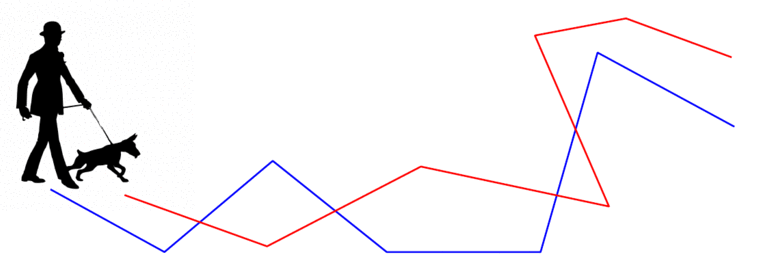

# דמיון בין עקומים {#curve-similarity}

## חלק 1: הקדמה {#preface-12}

### מה ביחידה? {#contents-12}

#### דמיון בין עקומים {.unnumbered}
ביחידה זו נלמד חלקים מפרק 30 בספר Geometric Approximation Algorithms, מאת פרופ' שריאל הר-פלד. ניתן לצפות גם ב[סדרת ההרצאות הקצרה שלThomas van Dijk](https://www.youtube.com/playlist?list=PLu39BqGd2oyOqo2Fe7OM1GVB0jWyoKOwd). ההרצאות קצרות ותמציתיות ומעבירות את רוב החומר של היחידה בצורה מרתקת.
 

בסיום יחידה זו, תכירו את המושגים ותרכשו את הטכניקות והכלים הבאים:

- מרחק האוּסדורף
- מרחק פְרֶשֶׁה (Fréchet), הרציף והדיסקרטי
- דיאגרמת המרחב החופשי (free space diagram)

למידה מהנה!

### כיצד מודדים דמיון בין עקומים? {#measuring-similarity}
עקומים פוליגונליים משמשים לייצוג נתונים ומידע במגוון רחב של יישומים. כאשר מדובר בכמויות עצומות של מידע, עולה הצורך בשיטות מדעיות לניתוח ולהפקת תובנות מנתונים – תחום זה נקרא מדעי הנתונים. במקרים רבים השיטות לניתוח נתונים מבוססות על מדד כלשהו להשוואה בין שני אובייקטים (פיסות מידע), אך לא תמיד ברור כיצד ניתן להגדיר מדד כזה, שישקף את התפיסה האינטואיטיבית שלנו בנוגע לשאלה מתי (או עד כמה) שני אובייקטים דומים זה לזה. בסרטון הבא נדון בשאלה הזו בהקשר של עקומים פוליגונליים: כיצד ניתן לקבוע עד כמה שני עקומים נתונים דומים זה לזה?

{width="80%"}

#### צפו בסרטון הבא: {.unnumbered}

<iframe width="560" height="315" src="https://www.youtube.com/embed/0A8OXcnR5Hw" title="YouTube video player" frameborder="0" allow="accelerometer; autoplay; clipboard-write; encrypted-media; gyroscope; picture-in-picture; web-share" referrerpolicy="strict-origin-when-cross-origin" allowfullscreen></iframe>

#### תרגיל: מרחק האוּסדורף (Hausdorff) {.unnumbered}

בסרטון הגדרנו את מרחק האוסדורף, והסקנו שהוא מתאים יותר למדידת מרחק בין שתי קבוצות של נקודות. פורמלית, מרחק האוסדורף בין שתי קבוצות של נקודות מוגדר כך:
בהינתן קבוצה \(P\) של \(n\) נקודות וקבוצה \(Q\) של \(m\) נקודות, **מרחק האוסדורף המכוון** הוא
\[\overrightarrow{d_H}(P,Q)=\max_{p\in P}\min_{q\in Q}\|p-q\|\]
ו**מרחק האוסדורף** הוא
\[d_H(P,Q)=\max(\overrightarrow{d_H}(P,Q),\overrightarrow{d_H}(Q,P))\].
הציעו אלגוריתם יעיל ככל האפשר לחישוב מרחק האוסדורף עבור שתי קבוצות של נקודות במישור.

#### קראו בספר הלימוד מההקדמה לפרק 30 ועד סוף סעיף 30.1.1 (עמודים 383–384).{.unnumbered}

## חלק 2: מרחק פְרֶשֶׁה (Fréchet) {#frechet-definition}

### מרחק פְרֶשֶׁה הדיסקרטי (discrete Fréchet distance)  {#discrete-frechet}
לפני שנגדיר באופן פורמלי את מרחק פרשה, נדון בגרסה פשוטה יותר שלו: הגרסה הדיסקרטית. בסרטון הבא נגדיר את מרחק פְרֶשֶׁה הדיסקרטי ונראה איך ניתן לחשב אותו.

#### צפו בסרטון הבא: {.unnumbered}

<iframe width="560" height="315" src="https://www.youtube.com/embed/So2Q7FTZsKk" title="YouTube video player" frameborder="0" allow="accelerometer; autoplay; clipboard-write; encrypted-media; gyroscope; picture-in-picture; web-share" referrerpolicy="strict-origin-when-cross-origin" allowfullscreen></iframe>

#### הגדרה: מרחק פְרֶשֶׁה הדיסקרטי {.unnumbered}
יהיו \(P=(p_,\dots,p_n)\) ו-\(Q=(q_1,\dots,q_m)\) שני עקומים פוליגונליים בעלי \(n\) ו-\(m\) קודקודים, בהתאמה. 

נסמן ב-\(\Pi(n,m)\) את קבוצת כל המסלולים המונוטוניים האפשריים מ-\((1,1)\) ל-\((n,m)\) על הגריד \([n]\times[m]\). כל מסלול מונוטוני כזה נקרא **טיול (walk)**.
באופן פורמלי יותר, טיול הוא סדרה של זוגות אינדקסים (קונפיגורציות)
\[\pi=((i_1,j_1),(i_2,j_2),\dots,(i_k,j_k))\]
כך שמתקיים:

- \((i_1,j_1)=(1,1)\),
- \((i_k,j_k)=(m,n)\),
- וגם לכל \(1\le t< k\) הזוג \((i_{t+1},j_{t+1})\) הוא אחת משלוש האפשרויות הבאות: \((i_t+1,j_t)\), \((i_t,j_t+1)\), או \((i_t+1,j_t+1)\).

**מרחק פרשה הדיסקרטי** בין \(P\) ו-\(Q\) הוא 
\[d_{dF}(P,Q)=\min_{\pi \in \Pi(n,m)}\max_{1\le t\le|\pi|}\|p_{i_t}-q_{i_t}\|.\]

::: rmdimportant
[**משפט (למה 30.1.3 בספר הלימוד)**:]{.underline} ניתן לחשב את \(d_{dF}(P,Q)\) בזמן \(O(mn)\).
:::

{width="80%"}

#### קראו את סעיף 30.1.2 בספר הלימוד (עמודים 384–386). {.unnumbered}
שימו לב שהגדרת המרחק בספר שונה מעט, ואינה מאפשרת צעד "באלכסון" על הגריד (קפיצה סימולטנית), אך הדבר אינו עקרוני עבור הנלמד ביחידה זו.

### מרחק פְרֶשֶׁה הדיסקרטי החלש {#weak-frechet}

#### הגדרה: מרחק פְרֶשֶׁה הדיסקרטי החלש {.unnumbered}
יהיו \(P=(p_,\dots,p_n)\) ו-\(Q=(q_1,\dots,q_m)\) שני עקומים פוליגונליים בעלי \(n\) ו-\(m\) נקודות, בהתאמה. 

נסמן ב-\(\Pi^w(n,m)\) את קבוצת כל המסלולים האפשריים מ-\((1,1)\) ל-\((n,m)\) על הגריד \([n]\times[m]\) (שהם לא בהכרח מונוטוניים).

**מרחק פרשה הדיסקרטי החלש** בין \(P\) ו-\(Q\) הוא 
\[d^w_{dF}(P,Q)=\min_{\pi \in \Pi^w(n,m)}\max_{1\le t\le|\pi|}\|p_{i_t}-q_{i_t}\|.\]

::: rmdimportant
[**משפט (מסקנה מטענה 30.1.5 בספר הלימוד)**:]{.underline} ניתן לחשב את \(d^w_{dF}(P,Q)\) בזמן \(O(mn)\).
:::

#### ענו על השאלה הבאה:{.unnumbered}
התבוננו בשני העקומים הבאים, ובהתאמה ביניהם. מי מהאיורים מתאר את מרחק פרשה הדיסקרטי החזק? ומי את החלש?

א. {width="70%"}

ב. {width="70%"}

מהו מרחק פרשה הדיסקרטי בין שני העקומים עבור המרחקים המצוינים באיור שלמטה? ומהו מרחק פרשה הדיסקרטי החלש ביניהם?

{width="70%"}

(פתרון)

איור א מתאר את מרחק פרשה הדיסקרטי החזק, ו-ב מתאר את המרחק החלש.
המרחק החזק הוא \(\sqrt{2}\), והחלש הוא 1.

#### ענו על השאלה הבאה: {.unnumbered}
אילו מההיגדים הבאים נכונים לכל שני עקומים \(P\) ו-\(Q\)?
1. \(d_H(P,Q)\le d_{dF}(P,Q)\)
2. \(d_{dF}^w(P,Q)\le d_{dF}(P,Q)\)
3. \(d_H(P,Q)\le d_{dF}^w(P,Q)\)

(פתרון)

כל ההיגדים נכונים.
<!--
TODO להוסיף היגדים לא נכונים, או לשנות את פורמט השאלה כך שיצטרכו לבחור את האופרטור המתאים
-->

#### תרגיל: מרחק פְרֶשֶׁה הדיסקרטי עם קיצורי דרך {.unnumbered}
גרסה מעניינת נוספת של מרחק פרשה הדיסקרטי נקראת "מרחק פרשה הדיסקרטי עם קיצורי דרך". אם נחזור לאנלוגיה של זוג הצפרדעים, אז בגרסה זו מותר לצפרדע הכחולה לקפץ מעל נקודות בעקום שלה. הצפרדעים עדיין מתחילות את הטיול כאשר כל אחת מהן נמצאת על הנקודה הראשונה במסלול שלה, והן חייבות לסיים אותו כאשר כל אחת מהן נמצאת על הנקודה האחרונה במסלול שלה, אבל הצפרדע האדומה צריכה לקפץ דרך כל הנקודות שלה, ולצפרדע הכחולה מותר לדלג על נקודות (כמה שהיא רוצה, וכמה פעמים שהיא רוצה) לאורך המסלול. 

{width="80%"}

1. הגדירו את "מרחק פרשה הדיסקרטי עם קיצורי דרך" באופן פורמלי (הגדירו walk בדומה להגדרה 30.1.1 בספר, ואז את המרחק בדומה להגדרה 30.1.2). שימו לב שהמרחק הזה אינו סימטרי.
2. הציעו אלגוריתם שמקבל שני מסלולים, \(P\) באורך \(n\) ו-\(Q\) באורך \(m\), ופרמטר \(\delta\), ובודק אם מרחק פרשה הדיסקרטי עם קיצורי דרך מ-\(P\) ל-\(Q\) הוא לכל היותר \(\delta\). רמז: הסתכלו על גריד הקונפיגורציות וחִשבו על אלגוריתם חמדן.
3. חִשבו באילו מקרים מציאותיים גרסה זו של המרחק יכולה להחזיר תוצאות המשקפות טוב יותר את המציאות (לעומת מרחק פרשה הדיסקרטי ללא קיצורי דרך).

### מרחק פְרֶשֶׁה הרציף {#continuous-frechet}
עד כה ראינו תיאור רעיוני של מרחק פרשה, ולא הגדרנו ביטוי מתמטי שמתאר את המרחק בין שני עקומים. כיצד מגדירים את מרחק פְרֶשֶׁה הרציף באופן פורמלי?

{width="80%"}

בסעיף 30.1.3 מופיעה הגדרה מתמטית מדויקת של המרחק, שמתאימה גם לעקומים שאינם פוליגונליים. הרעיון הוא להגדיר עקום \(P\) בתור פונקציה מהתחום \([0,1]\) ל-\(\mathbb{R}^d\), ואת **"קצב ההליכה"** של האדם והכלב על העקום בתור פונקציה מ-\([0,1]\) ל-\([0,1]\). כלומר אם העקום שלנו הוא למשל
\(\pi:[0,1]\rightarrow\mathbb{R}^d\)
ופונקציית קצב ההליכה היא
\(f:[0,1]\rightarrow[0,1]\),
אז בזמן נתון \(t\in[0,1]\) האדם נמצא בנקודה
\(\pi(f(t))\).

#### נסו בעצמכם! {.unnumbered}
הזיזו את הסליידר של המשתנה \(t\) כדי לראות כיצד נראית ההליכה על העקום \(P\) (הצבוע בשחור) תחת כל אחת מפונקציות הקצב השונות: האדומה, הכחולה והירוקה.

<iframe src="https://www.geogebra.org/classic/hzetb8mv?embed" width="100%" height="700" allowfullscreen style="border: 1px solid #e4e4e4;border-radius: 4px;" frameborder="0"></iframe>

#### ענו על השאלה הבאה: {.unnumbered}
איזו פונקציה מהסימולציה שלעיל מתאימה לאיזו נקודה?

(פתרון)

האדומה היא \(h\), הכחולה היא \(f\) והירוקה היא \(g\).

#### קראו את סעיף 30.1.3 בספר הלימוד (עמודים 386–387). {.unnumbered}
שימו לב לטעות בטקסט: בהגדרה 30.1.6 צריך להחליף את המילה width ב-\(\omega\).

#### הגדרה: מרחק פְרֶשֶׁה הרציף {.unnumbered}
יהיו \(\pi:[0,1]\rightarrow\mathbb{R}^d\) ו-\(\sigma:[0,1]\rightarrow\mathbb{R}^d\) שני עקומים.

**רֵפָּרָמֵטֶריזציה (reparameterization)** היא פונקציה \(f:[0,1]\rightarrow[0,1]\) חד-חד-ערכית ועל, כך ש-\(f(0)=0\) ו-\(f(1)=1\).

**מרחק פרשה הרציף** בין \(\pi\) ו-\(\sigma\) הוא 
\[d_{F}(\pi,\sigma)=\inf_{f,g}\max_{t\in [0,1]}\|\pi(f(t))-\sigma(g(t))\|\]
כאשר \(f,g\) הן רפרמטריזציות.

## חלק 3: חישוב מרחק פְרֶשֶׁה הרציף {#computing-frechet}

### דיאגרמת המרחב החופשי (free space diagram) {#free-space-diagram}
כאשר רצינו לחשב את מרחק פרשה הדיסקרטי, נעזרנו במרחב הקונפיגורציות, וראינו שניתן לתאר אותו בתור גרף גריד או מטריצה דו-ממדית. בסרטון הבא נראה כיצד ניתן לתאר את מרחב הקונפיגורציות עבור מרחק פרשה הרציף.

{width="100%"}

#### צפו בסרטון הבא: {.unnumbered}

<iframe width="560" height="315" src="https://www.youtube.com/embed/LkbDFcyt2aU" title="YouTube video player" frameborder="0" allow="accelerometer; autoplay; clipboard-write; encrypted-media; gyroscope; picture-in-picture; web-share" referrerpolicy="strict-origin-when-cross-origin" allowfullscreen></iframe>

#### נסו בעצמכם! הדיאגרמה של שני קטעים {.unnumbered}

היישומון הבא מציג את הדיאגרמה של שני קטעים, \(P\) ו-\(Q\). תוכלו להזיז את הנקודה \(s\) כדי לראות את המיקומים המתאימים על גבי הקטעים. תוכלו גם לשנות את הרדיוס של המעגלים. מהן שתי הנקודות שמגדירות את מרחק פרשה בין שני הקטעים?

<iframe src="https://www.geogebra.org/classic/p5ub2xym?embed" width="100%" height="400" allowfullscreen style="border: 1px solid #e4e4e4;border-radius: 4px;" frameborder="0"></iframe>

ביישומון [הזה](https://www1.pub.informatik.uni-wuerzburg.de/pub/dijk/frechet/) מאת [Thomas van Dijk](https://github.com/tcvdijk) תוכלו לראות את הדיאגרמה של שני עקומים עם יותר מקטע אחד. כאשר תזיזו את העכבר על גבי הדיאגרמה, יסומנו על העקומים הנקודות המתאימות לקונפיגורציה.

#### קראו את סעיף 30.2.2 בספר הלימוד (עמודים 390–392). {.unnumbered}
שימו לב! למעוניינים בהרחבה והעשרה, ניתן לקרוא קודם את סעיף 30.2.1 בספר הלימוד, המתאר את מרחק פרשה בין שני קטעים, והמוכחים בו כמה מהמשפטים שהוזכרו בסרטון.

#### ענו על השאלה הבאה: {.unnumbered}
באיור מטה מופיעה דיאגרמת המרחב החופשי של שני עקומים. התאימו לכל נקודה המסומנת על הדיאגרמה את זוג הנקודות המתאים לה על גבי העקומים.

{width="100%"}

(פתרון)

TODO

### אלגוריתם לבעיית ההחלטה {#frechet-decision}

האלגוריתם עבור בעיית ההחלטה מבצע סריקת BFS על דיאגרמת המרחב החופשי של שני העקומים עם פרמטר \(\delta\), וכך בעצם מחשב את **המרחב הנגיש** (reachable space) של הדיאגרמה. המרחב הנגיש הוא אוסף כל הנקודות בדיאגרמת המרחב החופשי שניתן להגיע אליהן מהנקודה \((0,0)\) באמצעות מסלול בדיאגרמה שהוא \((x,y)\) מונוטוני.

במהלך הסריקה, האלגוריתם מחשב את האינטרוולים הנגישים של כל תא שהוא פוגש, וממשיך בסריקה כל עוד יש לתא אינטרוול נגיש שאינו ריק. אם הוא מגיע לתא שמתאים לשני הקטעים האחרונים של העקומים, והנקודה \((m,n)\) היא נגישה, זה אומר שקיים מסלול בדיאגרמת המרחב החופשי מהנקודה \((0,0)\) לנקודה \((m,n)\), ולכן המרחק בין העקומים קטן מ-\(\delta\).

#### קראו את סעיף 30.2.3 בספר הלימוד (עמודים 392–393). {.unnumbered}

#### ענו על השאלה הבאה: {.unnumbered}
התבוננו שוב באיור מהשאלה בסעיף הקודם. אילו מהנקודות המסומנות על גבי הדיאגרמה שייכות למרחב הנגיש?

{width="100%"}

(פתרון)

הנקודות \(a,b\) בלבד.

### הערכים הקריטיים {#frechet-critical-events}
בסעיף הקודם ראינו אלגוריתם לבעיית ההחלטה: בהינתן שני עקומים \(P\) ו-\(Q\) באורך \(n\) כל אחד, ופרמטר \(\delta\), אנחנו יודעים להחליט בזמן \(O(n^2)\) אם \(d_F(P,Q)\le \delta\). אבל כיצד נוכל למצוא את ה-\(\delta\) הקטן ביותר?

בדרך כלל, ניתן למצוא אוסף סופי (וקטן יחסית) של ערכים שאחד מהם הוא ערך הפתרון האופטימלי, ואז ניתן לבצע עליהם חיפוש בינארי, כאשר משתמשים בפרוצדורת ההחלטה כדי להחליט אם להגדיל את ערך החיפוש או להקטינו. האם זהו המצב במקרה של מרחק פרשה הרציף? האם מספיק לבדוק למשל רק את המרחקים בין כל זוג קודקודים? התבוננו למשל בשני העקומים הבאים. מה מגדיר את מרחק פרשה ביניהם?

{width="70%"}

בעצם הערכים שבהם אנחנו מעוניינים הם הערכים שעבורם יש שינוי במספר רכיבי הקשירות של דיאגרמת המרחב החופשי. בפרט, ערך \(\delta\) הוא ערך קריטי אם קיימת נקודה כלשהי שהיא נגישה במרחב החופשי של \(\delta\), ולא נגישה במרחב החופשי של כל \(\delta'<\delta\). אפשר לחשוב על זה גם כך: נסתכל על "דיאגרמת פני השטח" שמוגדרת על שני העקומים. דמיינו שהיא מתמלאת במים בהדרגה. ככל שמפלס המים עולה, כך מעברים מסוימים נסגרים. הערכים שעבורם קיים מעבר שנסגר הם הערכים הקריטיים.

בסעיף 30.2.4 בספר הלימוד מתוארים סוגי הערכים הקריטיים הרלוונטיים לחישוב מרחק פרשה.

#### קראו את סעיף 30.2.4 בספר הלימוד (עמודים 393–395). {.unnumbered}
התעלמו מאבחנה 30.2.9.

#### שני סוגים של ערכים קריטיים {.unnumbered}
הערכים הקריטיים הרלוונטיים לחישוב מרחק פרשה נקבעים על ידי:

1. צלע של עקום אחד וקודקוד של השני (vertex-edge event).
2. שני קודקודים של עקום אחד וצלע של השני (monotonicity event).

#### ענו על השאלה הבאה: {.unnumbered}
איזה מהאיורים הבאים מתאר motonicity event?

{width="100%"}

#### ענו על השאלה הבאה: {.unnumbered}
כמה ערכים קריטיים יש עבור שני עקומים \(P\) ו-\(Q\) באורך \(n\) כל אחד? בכמה זמן ניתן למצוא אותם?

(פתרון)

יש \(O(n^3)\) ערכים כאלה, וניתן למצוא אותם בזמן \(O(n^3)\). 

### חישוב מרחק פרשה {#frechet-optimal}
כפי שראיתם בסעיף הקודם, יש \(O(n^3)\) ערכים קריטיים, וניתן למצוא אותם בזמן \(O(n^3)\). אם נעשה זאת ואז נבצע חיפוש בינארי בעזרת פרוצדורת ההחלטה, זמן הריצה של האלגוריתם יהיה \(O(n^3)\) (הזמן למציאת הערכים הקריטיים). בעזרת טכניקה מתקדמת יותר ([חיפוש פרמטרי](https://en.wikipedia.org/wiki/Parametric_search), שלא נלמד בקורס זה) ניתן לעשות זאת בזמן \(O(n^2\log n)\).

::: rmdimportant
[**משפט**:]{.underline} בהינתן שני עקומים בעלי n קודקודים בסך הכול, ניתן לחשב את מרחק פרשה ביניהם בזמן \(O(n^2\log n)\).
:::

אמנם טכניקת החיפוש הפרמטרי מספקת אלגוריתם בעל זמן ריצה \(O(n^2\log n)\), אך היא נחשבת קשה למימוש ולא מעשית. בסעיף 30.2.5 בספר הלימוד מתואר אלגוריתם רנדומי פשוט יותר לחישוב מרחק פרשה, אך הוא אינו נכלל בחומר של קורס זה.

#### להרחבה והעשרה: קראו את סעיף 30.2.5 בספר הלימוד (עמודים 395–398). {.unnumbered}

--------- עריכה לשונית: לא להתייחס למה שכתוב מתחת ---------------

## תרגילים נוספים

#### תרגיל: מרחק פרשה תחת הזזה  {.unnumbered}
יתכן ששמתם לב שמרחק פרשה אינו מושלם ויש לו מספר בעיות. אחת מהן היא שניתן להתשמש בו רק עבור עקומים שהם מיושרים זה כלפי זה...

הוכיחו שניתן לחשב קירוב 2 למרחק פרשה תחת הזזה בזמן $O(n^2)$.
(רמז: הראה שאם מזיזים עקום אחד כך שנקודות ההתחלה מתלכדות אז המרחק בין העקומים הוא קירוב 2 למרחק תחת הזזה.)

#### תרגיל: מרחק פרשה הוא פסאודו מטריקה  {.unnumbered}
הוכיחו שמרחק פרשה הדיסקרטי מקיים את אי-שיוויון המשולש.
הראו שמרחק פרשה הדיסקרטי הוא פסאודו-מטריקה. (TODO להגדיר)
